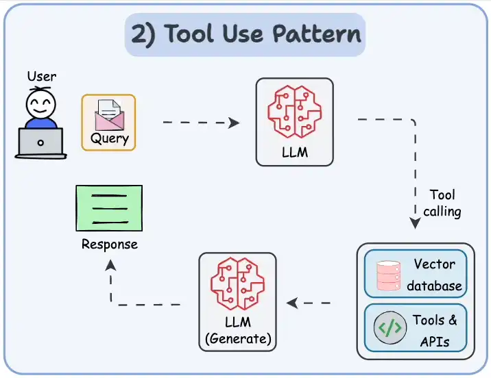
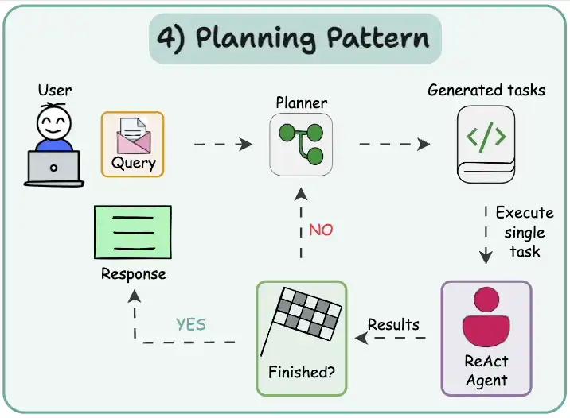
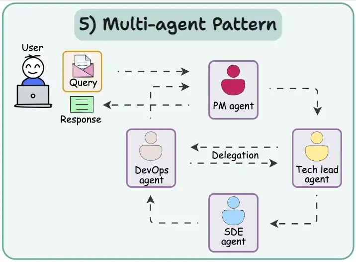

# 目录

- [1.什么是AI Agent（智能体）？](#1.什么是AI-Agent（智能体）？)
- [2.AI Agent的主流设计模式有哪些？](#2.AI-Agent的主流设计模式有哪些？)

<h2 id="1.什么是AI-Agent（智能体）？">1.什么是AI Agent（智能体）？</h2>

**在AIGC时代，Rocky认为AI Agent是一个非常重要的方向，也是AIGC技术发展的大势所趋。**

那么，AI Agent到底是什么呢？

Rocky首先给大家讲解一下非AI Agent（Non-Agent），即常规AIGC大模型的运行逻辑，然后我们就能从两者的对比中恍然大悟。

我们以经典的文本内容创作为例子🌰，**非智能体、智能体以及人类创作者的工作流呈现显著差异：**

| **主体类型**   | **执行特征**                                                                 | **流程剖析**                                                                 |
|----------------|-----------------------------------------------------------------------------|-----------------------------------------------------------------------------|
| **Non-Agent（非智能体）**   | 线性单次输出                                                                | 用户输入提示词→大模型直接生成终稿（无迭代过程）                                |
| **AI Agent（智能体）**     | 多阶段认知闭环                                                              | 规划大纲→检索资料→生成初稿→自检修订→循环优化→输出终稿（模拟人类创作思维）         |
| **人类创作者** | 认知驱动型工作流                                                            | 构思框架→信息搜集→内容填充→交叉审核→反复润色（与智能体流程高度同构）              |

**我们可以发现：AI Agent的核心是通过任务解构-执行-反思的认知闭环，实现对人类工作范式的数字孪生。**

**AI行业大牛吴恩达认为，AI Agent的终极演进方向是构建具备完整认知能力的数字主体**，其技术架构可解构为四大核心能力：

1. **反思（Reflection）**：AI Agent模拟人类自我修正行为，如同学生完成作业后的自主检查过程。突破单次推理局限，建立错误检测-反馈-修正的增强回路。在代码生成、法律文书等高精度需求场景实现质量跃升。
2. **工具调用（Tool use）**：AI Agent判定自身能力边界，选择合适的AI工具（AI服务/搜索引擎/专业数据库等）来提升大模型的能力边界。
3. **规划（Planning）**：AI Agent在解决复杂问题时，为到达目标制定合理的行动计划的能力，从而对任务进行拆解。
4. **多智能体协作（Multi-agent collaboration）**：多个AI Agent的组合应用，我们可以畅想当每个用户可配置专属AI团队（产品经理Agent+工程师Agent+测试Agent+商务市场Agent等），传统生产模式将被重构。

我们都知道自动驾驶领域对技术级别有L1-L5之分，级别越高代表越向无人驾驶靠近。**在AIGC时代，我们可以对AIGC技术的能力演进路径进行级别划分，同样可构建五个级别：**

| **层级** | **能力定位**       | **人机协作范式**                                                                 | **演进状态**          |  
|----------|--------------------|---------------------------------------------------------------------------------|---------------------|  
| **L1**   | 基础工具（Tool）        | 用户独立完成全流程，系统无显性AI能力                                            | 技术替代进程中      |  
| **L2**   | 对话辅助（Chatbot）         | 用户主导执行，AI提供信息参考（如知识检索、建议生成）                                | 基础应用形态        |  
| **L3**   | 协同创作（Copilot）        | 人机任务共担：用户设定目标→AI生成初稿→用户修正确认                                | 当前核心价值区      |  
| **L4**   | 智能体（AI Agent）      | 用户定义目标与资源，AI自主实现任务拆解、工具调度、过程管控的全闭环                  | 近通用AGI临界点     |  
| **L5**   | 通用智能（Intelligence）         | 系统自驱完成目标定义、资源获取、工具调用及结果交付                                | 理论发展阶段        |  

当前AI Agent的核心还是基于LLM大模型+深度的Prompts工程，**Rocky认为未来AI Agent会有更多内涵，比如：**
1. AI Agent中的核心大模型可能是基于AIGC多模态大模型构建的。
2. AI Agent中会包含更多的模态能力，比如图像、视频、音频、数字人等。
3. 会有基于AI Agent为核心的爆款AIGC产品问世。
4. 基于AI Agent的AI算法解决方案会在各行各业落地，重构各行各业的业务形态。

<h2 id="2.AI-Agent的主流设计模式有哪些？">2.AI Agent的主流设计模式有哪些？</h2>

**当前主流的AI Agent（Manus、Deep Research等）都是基于LLM大模型 + 一整套AIGC算法解决方案(Prompts工程、Function Call、MCP、AI工程策略、AI功能服务等)构建而成**，同时未来还会持续扩展延伸其内涵。

基于上面的框架，接着再形成了5种主流的AI Agent设计模式：

1. **反射模式（Reflection pattern）**：这个模式的**核心运作机制是构建自检-纠错迭代环**，AI Agent会审查其工作以发现错误并迭代，直到生成最终输出结果。

2. **工具使用模式（Tool use pattern）**：AI Agent允许LLM大模型通过使用外部工具获得更多信息，包括调用API、使用AI服务、查询矢量数据库、执行Python脚本等。**这使得LLM大模型不仅仅依赖于其内部知识，还可以获得互联网世界的庞大实时数据流来扩展知识边界**。

3. **ReAct模式（Reason and Act）**：**ReAct模式结合了反射模式和工具使用模式**，这使其成为当前AI Agent使用的最强大的模式之一。AI Agent既可以自我思考，自我纠错，还可以使用工具与世界交互。

4. **规划模式（Planning pattern）**：在这种模式下，**AI Agent根据任务的复杂程度，设计任务计划流程，对任务进行细分，再对细分子任务动用ReAct 模式进行处理**。可以说这种模式是一种战略思维，可以更有效地解决战略级复杂任务。

5. **多智能体模式（Multi-agent pattern）**：在这个模式中，**AI Agent系统中包含多个子Agent，每个子Agent都分配有一个专用的角色和任务，同时每个子Agent还可以访问外部工具进行综合工作**。最后，所有子Agent协同工作以提供最终结果，同时根据需要将细分任务委派给其他子Agent，形成一个复杂的“AI Agent协同社区”。

