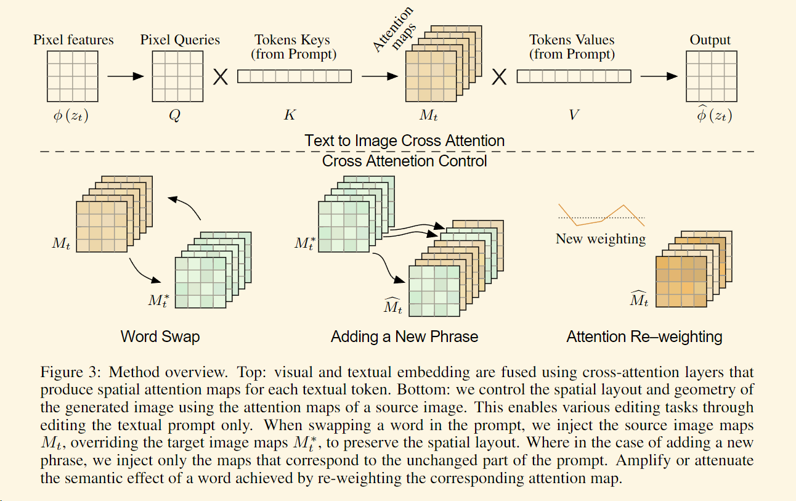
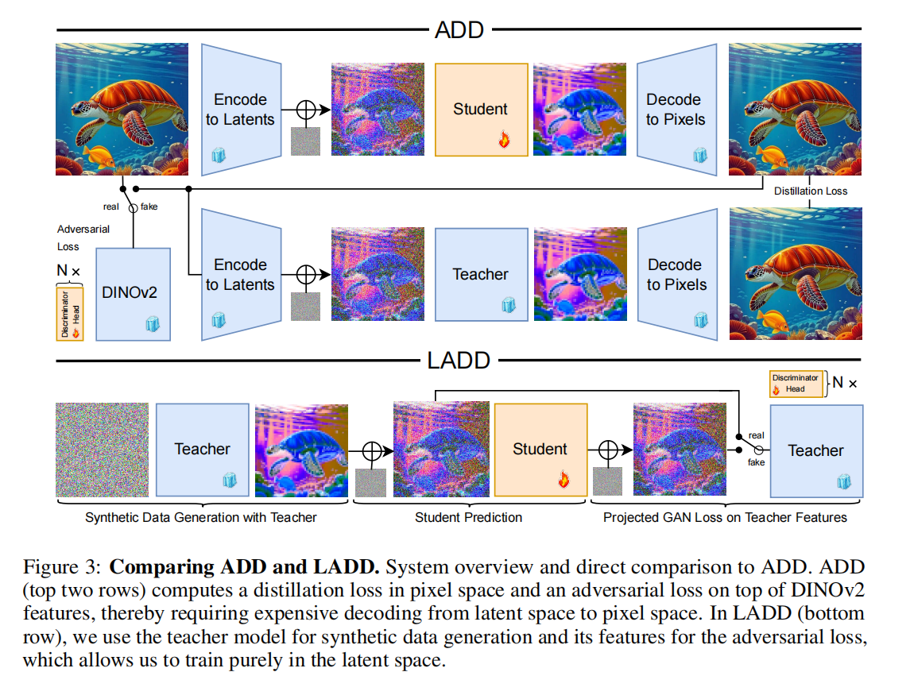
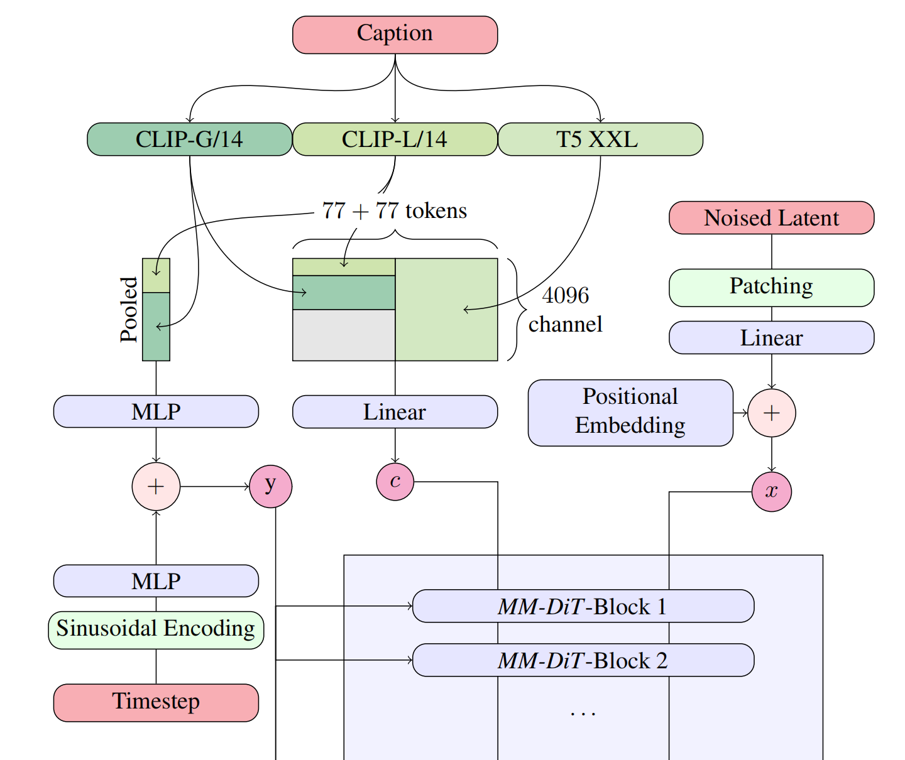

# 目录

## 第一章 Stable Diffusion系列核心高频考点

- [1.目前主流的AI绘画大模型有哪些？](#1.目前主流的AI绘画大模型有哪些？)
- [2.SD模型训练时需要设置timesteps=1000，在推理时却只用几十步就可以生成图片？](#2.SD模型训练时需要设置timesteps=1000，在推理时却只用几十步就可以生成图片？)
- [3.SD模型中的CFGClassifier-Free-Guidance的原理？](#3.SD模型中的CFG(Classifier-Free-Guidance)的原理？)
- [4.SD模型中的（negative-prompt）反向提示词如何加入的？](#4.SD模型中的(negative-prompt)反向提示词如何加入的？)
- [5.SD中潜在一致性模型LCM、LCM-lora加速原理](#5.SD中潜在一致性模型LCM、LCM-lora加速原理)
- [6.正则化技术在AI绘画模型中的作用？](#6.正则化技术在AI绘画模型中的作用？)
- [7.AI生成图像的常用评价指标](#7.AI生成图像的常用评价指标)
- [8.SDXL相比SD有那些改进](#8.SDXL相比SD有那些改进)
- [9.Stable_Diffusion文本信息是如何控制图像生成的](#9.Stable_Diffusion文本信息是如何控制图像生成的)
- [10.简述Stable_Diffusion核心网络结构](#10.简述Stable_Diffusion核心网络结构)
- [11.介绍一下Stable_Diffusion中的Unet模型](#11.介绍一下Stable_Diffusion中的Unet模型)
- [12.cfg参数的介绍](#12.cfg参数的介绍)
- [13.文生图和图生图的区别是什么?](#13.文生图和图生图的区别是什么?)
- [14.为什么StableDiffusion3使用三个文本编码器?](#14.为什么StableDiffusion3使用三个文本编码器?)
- [15.Stable-Diffusion-3有哪些改进点？](#15.Stable-Diffusion-3有哪些改进点？)
- [16.Cross-Attention在SD系列模型中起什么作用？](#16.Cross-Attention在SD系列模型中起什么作用？)
- [17.扩散模型中的引导技术：CG与CFG](#17.扩散模型中的引导技术：CG与CFG)
- [18.什么是DDIM?](#18.什么是DDIM?)
- [19.Stable Diffusion 3中数据标签工程的具体流程是什么样的？](#19.Stable-Diffusion-3中数据标签工程的具体流程是什么样的？)
- [20.FLUX.1系列模型有哪些创新点？](#20.FLUX.1系列模型有哪些创新点？)
- [21.介绍一下DiT模型的基本概念](#21.介绍一下DiT模型的基本概念)
- [22.DiT输入图像的Patch化过程是什么样的？](#22.DiT输入图像的Patch化过程是什么样的？)
- [23.AI绘画大模型的数据预处理都包含哪些步骤？](#23.AI绘画大模型的数据预处理都包含哪些步骤？)
- [24.AI绘画大模型的训练流程都包含哪些步骤？](#24.AI绘画大模型的训练流程都包含哪些步骤？)
- [25.Scaling Law在AI绘画领域成立吗？](#25.Scaling_Law在AI绘画领域成立吗？)
- [26.Prompt-to-Prompt是什么方法？](#26.Prompt-to-Prompt是什么方法？)
- [27.InstructPix2Pix的训练和推理流程是什么样的？](#27.InstructPix2Pix的训练和推理流程是什么样的？)
- [28.SDXL-Turbo用的蒸馏方法是什么？](#28.SDXL-Turbo用的蒸馏方法是什么？)
- [29.SD3-Turbo用的蒸馏方法是什么？](#29.SD3-Turbo用的蒸馏方法是什么？)
- [30.介绍一下Stable Diffusion 3中的VAE模型](#30.介绍一下Stable-Diffusion-3中的VAE模型)
- [31.介绍一下FLUX.1系列中的VAE模型](#31.介绍一下FLUX.1系列中的VAE模型)
- [32.AIGC面试中必考的Stable Diffusion系列模型版本有哪些？](#32.AIGC面试中必考的Stable-Diffusion系列模型版本有哪些？)
- [33.AIGC面试中必考的AI绘画技术框架脉络是什么样的？](#33.AIGC面试中必考的AI绘画技术框架脉络是什么样的？)
- [34.Stable Diffusion 3的Text Encoder有哪些改进？](#34.Stable-Diffusion-3的Text-Encoder有哪些改进？)
- [35.Stable Diffusion 3的图像特征和文本特征在训练前缓存策略有哪些优缺点？](#35.Stable-Diffusion-3的图像特征和文本特征在训练前缓存策略有哪些优缺点？)

## 第二章 Midjourney高频考点

- [1.Midjourney是什么？](#1.Midjourney是什么？)
- [2.Midjourney的应用领域是什么？](#2.Midjourney的应用领域是什么？)
- [3.Midjourney提示词规则有哪些？](#3.Midjourney提示词规则有哪些？)
- [4.Midjourney的界面有哪些？](#4.Midjourney的界面有哪些？)
- [5.Midjourney如何优化三视图效果？](#5.Midjourney如何优化三视图效果？)
- [6.Midjourney迭代至今有哪些优秀的特点？](#6.Midjourney迭代至今有哪些优秀的特点？)
- [7.Midjourney有哪些关键的参数？](#7.Midjourney有哪些关键的参数？)

## 第三章 AI绘画大模型优化技术高频考点

- [1.什么是DreamBooth技术？](#1.什么是DreamBooth技术？)
- [2.长宽比分桶训练策略（Aspect Ratio Bucketing）有什么作用?](#2.长宽比分桶训练策略（AspectRatioBucketing）有什么作用?)
- [3.介绍一下长宽比分桶训练策略（Aspect Ratio Bucketing）的具体流程](#3.介绍一下长宽比分桶训练策略（AspectRatioBucketing）的具体流程)
- [4.介绍一下OFT(Orthogonal Finetuning)微调技术](#4.介绍一下OFT(Orthogonal-Finetuning)微调技术)

## 第四章 其他主流AI绘画大模型高频考点

- [1.Playground V2模型有哪些特点？](#1.Playground-V2模型有哪些特点？)
- [2.Imagen模型有什么特点?](#2.Imagen模型有什么特点?)

---

## 第一章 Stable Diffusion系列核心高频考点正文

<h2 id="1.目前主流的AI绘画大模型有哪些？">1.目前主流的AI绘画大模型有哪些？</h2>

目前，几个主流的文生图大模型包括：

1. FLUX.1系列模型（pro、dev、schnell）
2. Stable Diffusion系列（1.x、2.x、XL、3、3.5）
3. Midjourney系列（V5-V6）
4. Ideogram系列
5. DaLL·E系列（2-3）
6. PixArt系列（α、Σ）
7. Playground系列（v2.5-v3）
8. Imagen系列（1、2、3）


<h2 id="2.SD模型训练时需要设置timesteps=1000，在推理时却只用几十步就可以生成图片？">2.SD模型训练时需要设置timesteps=1000，在推理时却只用几十步就可以生成图片？</h2>

目前扩散模型训练一般使用DDPM（Denoising Diffusion Probabilistic Models）采样方法，但推理时可以使用DDIM（Denoising Diffusion Implicit Models）采样方法，DDIM通过去马尔可夫化，大大减少了扩散模型在推理时的步数。


<h2 id="3.SD模型中的CFG(Classifier-Free-Guidance)的原理？">3.SD模型中的CFG(Classifier-Free-Guidance)的原理？ </h2>

### 1. Classifier Guidance：
条件生成只需额外添加一个classifier的梯度来引导。Classifier Guidance 需要训练噪声数据版本的classifier网络，推理时每一步都需要额外计算classifier的梯度。

Classifier Guidance 使用显式的分类器引导条件生成有几个问题：①是需要额外训练一个噪声版本的图像分类器。②是该分类器的质量会影响按类别生成的效果。③是通过梯度更新图像会导致对抗攻击效应，生成图像可能会通过人眼不可察觉的细节欺骗分类器，实际上并没有按条件生成。

### 2. Classifier-Free Guidance:
核心是通过一个隐式分类器来替代显示分类器，而无需直接计算显式分类器及其梯度。根据贝叶斯公式，分类器的梯度可以用条件生成概率和无条件生成概率表示.

把上面的分类器梯度代入到classifier guidance的分类器梯度中可得：

训练时，Classifier-Free Guidance需要训练两个模型，一个是无条件生成模型，另一个是条件生成模型。但这两个模型可以用同一个模型表示，训练时只需要以一定概率将条件置空即可。推理时，最终结果可以由条件生成和无条件生成的线性外推获得，生成效果可以引导系数可以调节，控制生成样本的逼真性和多样性的平衡。


<h2 id="4.SD模型中的(negative-prompt)反向提示词如何加入的？">4.SD模型中的(negative-prompt)反向提示词如何加入的？ </h2>

### 1. 假想方案
容易想到的一个方案是 unet 输出 3 个噪声，分别对应无prompt，positive prompt 和 negative prompt 三种情况，那么最终的噪声就是


理由也很直接，因为 negative prompt 要反方向起作用，所以加个负的系数.

### 2. 真正实现方法

 stable diffusion webui 文档中看到了 negative prompt 真正的[实现方法](https://github.com/AUTOMATIC1111/stable-diffusion-webui/wiki/Negative-prompt)。一句话概况：将无 prompt 的情形替换为 negative prompt，公式则是

 

就是这么简单，其实也很说得通，虽说设计上预期是无 prompt 的，但是没有人拦着你加上 prompt（反向的），公式上可以看出在正向强化positive prompt的同时也反方向强化——也就是弱化了 negative prompt。同时这个方法相对于我想的那个方法还有一个优势就是只需预测 2 个而不是 3 个噪声。可以减少时间复杂度。


<h2 id="5.SD中潜在一致性模型LCM、LCM-lora加速原理">5.SD中潜在一致性模型LCM、LCM-lora加速原理 </h2>

### 1. CM模型：
OpenAI 的宋飏博士提出的一致性模型（Consistency Model，CM）为解决多步采样问题提供了一个思路。一致性模型并不依赖于预训练的扩散模型，是一种独立的新型生成模型。一致性函数f的核心为这样一个性质：对于任意一个输入xt，经过f输出后，其输出是一致的。


缺点：一致性模型局限于无条件图片生成，导致包括文生图、图生图等在内的许多实际应用还难以享受这一模型的潜在优势。

### 2. LCM模型
关键技术点：

（1）使用预训练的自动编码器将原始图片编码到潜在空间，在压缩图片中冗余信息的同时让图片在语义上具有更好的一致性；

（2）将无分类器引导（CFG）作为模型的一个输入参数蒸馏进潜在一致性模型中，在享受无分类器引导带来的更好的图片 - 文本的一致性的同时，由于无分类器引导幅度被作为输入参数蒸馏进了潜在一致性模型，从而能够减少推理时的所需要的计算开销；

（3）使用跳步策略来计算一致性损失，大大加快了潜在一致性模型的蒸馏过程。
潜在一致性模型的蒸馏算法的伪代码见下图。


<h2 id="6.正则化技术在AI绘画模型中的作用？">6.正则化技术在AI绘画模型中的作用？ </h2>

在生成式模型的训练中，正则化技术是一种常用的方法，用于增强模型的泛化能力，防止过拟合，以及在一些情况下，帮助模型更稳定和可靠地训练。正则化对生成式模型的主要作用包括：

### 1. 防止过拟合
生成式模型，特别是参数众多的模型（如Stable Diffusion、GAN和VAE），容易在训练数据上过度拟合，从而导致模型在未见过的数据上性能下降。通过使用正则化技术，如L1或L2正则化（权重衰减），可以惩罚模型权重的大值，从而限制模型复杂度，帮助模型在保留训练数据重要特性的同时，防止过分依赖特定训练样本的噪声或非代表性特征。

### 2. 提高模型的稳定性
在生成对抗网络（GAN）等生成式模型中，训练过程中的稳定性是一个重要问题。正则化技术，如梯度惩罚（gradient penalty）和梯度裁剪（gradient clipping），可以防止梯度爆炸或消失，从而帮助模型更稳定地训练。这些技术通过控制权重更新的幅度，确保训练过程中的数值稳定性。

### 3. 改善收敛性
正则化技术有助于改善生成式模型的收敛性，特别是在对抗性的训练环境中。例如，在GANs中，使用梯度惩罚或Batch Normalization可以帮助生成器和判别器更均衡地训练，避免一方过早地主导训练过程，从而促进整个模型的稳健收敛。

### 4. 增加输出的多样性
尤其在GAN中，模式坍塌（mode collapse）是一个常见的问题，其中生成器倾向于生成非常相似的输出样本，忽视输入的多样性。这意味着生成器无法覆盖到数据分布的多样性，仅在潜在空间中的某个点或几个点上“坍塌”。通过应用正则化技术，如Mini-batch discrimination或使用dropout，可以鼓励生成器探索更多的数据分布，从而提高生成样本的多样性。

### 5. 防止梯度消失或爆炸
在视觉大模型中，梯度消失或爆炸（Gradient Vanishing/Exploding）是常见问题，特别是在训练复杂的生成式模型时。正则化技术，如Batch Normalization和Layer Normalization，通过规范化中间层的输出，帮助控制梯度的规模，从而避免这两种问题，使训练过程更加稳定。

### 6. 减少训练过程中的噪声敏感性
生成式模型可能对训练数据中的噪声过于敏感，导致生成的图像或数据质量低下。通过应用正则化，如Dropout或添加一定量的噪声，模型可以对不重要的输入变化更鲁棒，从而提高生成数据的质量和稳健性。

正则化技术在生成式模型中的运用有助于优化模型性能，提高模型的泛化能力和输出质量，同时确保训练过程的稳定性和效率。这些技术是设计和训练高效、可靠生成式模型的重要组成部分。


<h2 id="7.AI生成图像的常用评价指标">7.AI生成图像的常用评价指标 </h2>

随着图像生成AI的发展，如Stable Diffusion和Midjourney，能够根据自然语言生成“高品质”的图像。然而，“高品质”图像的定义和评价并不简单，目前有多种评价指标来衡量图像的质量和相关性。

#### 1. FID（Frechet Inception Distance）

FID是用于评估生成图像与真实图像相似度的量化指标。它使用Inception网络将生成图像和真实图像转换为特征向量，假设这些特征向量的分布为高斯分布，并计算其均值和协方差矩阵。通过测量这两个高斯分布之间的“距离”来评估相似性，值越小，图像质量越高。

#### 2. CLIP Score

CLIP Score通过学习自然语言和图像对之间的语义关系来评估图像和文本的匹配度。它将自然语言和图像分别转换为特征向量，然后计算它们之间的余弦相似度。CLIP Score越高，图像和文本对之间的相关性越高。

#### 3. Inception Score（IS）

Inception Score评估生成图像的质量和多样性。它使用Inception网络对生成图像进行分类，正确分类结果越集中，质量越高。同时，当生成图像被分类为不同标签时，多样性越大。IS综合考虑了图像的质量和多样性，得分越高表示质量和多样性越好。


<h2 id="8.SDXL相比SD有那些改进">8.SDXL相比SD有那些改进 </h2>

1、模型参数更大。SDXL 基础模型所使用的 Unet 包含了2.6B（26亿）的参数，对比 SD1.5的 860M（8600万），相差超过三倍。因此从模型参数来看，SDXL 相比 SD 有显著优势。

2、语义理解能力更强。使用了两个 CLIP 模型的组合，包括 OpenClip 最大的模型 ViT-G/14 和在 SD v1 中使用的 CLIP ViT-L，既保证了对旧提示词的兼容，也提高了 SDXL 对语言的理解能力

3、训练数据库更大。由于 SDXL 将图片尺寸也作为指导参数，因此可以使用更低分辨率的图片作为训练数据，比如小于256x256分辨率的图片。如果没有这项改进，数据库中高达39%的图片都不能用来训练 SDXL，原因是其分辨率过低。但通过改进训练方法，将图片尺寸也作为训练参数，大大扩展了训练 SDXL 的图片数量，这样训练出来的模型具有更强的性能表现。

4、生图流程改进。SDXL 采用的是两阶段生图，第一阶段使用 base model（基础模型）生成，第二阶段则使用 refiner model（细化模型）进一步提升画面的细节表现。当然只使用 SDXL 基础模型进行绘图也是可以的。


<h2 id="9.Stable_Diffusion文本信息是如何控制图像生成的">9.Stable_Diffusion文本信息是如何控制图像生成的</h2>

1.文本编码：CLIP Text Encoder模型将输入的文本Prompt进行编码，转换成Text Embeddings（文本的语义信息），由于预训练后CLIP模型输入配对的图片和标签文本，Text Encoder和Image Encoder可以输出相似的embedding向量，所以这里的Text Embeddings可以近似表示所要生成图像的image embedding。

2.CrossAttention模块：在U-net的corssAttention模块中Text Embeddings用来生成K和V，Latent Feature用来生成Q。因为需要文本信息注入到图像信息中里，所以用图片token对文本信息做 Attention实现逐步的文本特征提取和耦合。


<h2 id="10.简述Stable_Diffusion核心网络结构">10.简述Stable_Diffusion核心网络结构</h2>

1.CLIP：CLIP模型是一个基于对比学习的多模态模型，主要包含Text Encoder和Image Encoder两个模型。在Stable Diffusion中主要使用了Text Encoder部分。CLIP Text Encoder模型将输入的文本Prompt进行编码，转换成Text Embeddings（文本的语义信息），通过的U-Net网络的CrossAttention模块嵌入Stable Diffusion中作为Condition条件，对生成图像的内容进行一定程度上的控制与引导。

2.VAE：基于Encoder-Decoder架构的生成模型。VAE的Encoder（编码器）结构能将输入图像转换为低维Latent特征，并作为U-Net的输入。VAE的Decoder（解码器）结构能将低维Latent特征重建还原成像素级图像。在Latent空间进行diffusion过程可以大大减少模型的计算量。
U-Net

3.U-net:进行Stable Diffusion模型训练时，VAE部分和CLIP部分都是冻结的，主要是训练U-net的模型参数。U-net结构能够预测噪声残差，并结合Sampling method对输入的特征进行重构，逐步将其从随机高斯噪声转化成图像的Latent Feature.训练损失函数与DDPM一致:
 


<h2 id="11.介绍一下Stable_Diffusion中的Unet模型">11.介绍一下Stable_Diffusion中的Unet模型</h2>

### 1. UNet的结构具有以下特点：

- **整体结构**：UNet由多个大层组成。在每个大层中，特征首先通过下采样变为更小尺寸的特征，然后通过上采样恢复到原来的尺寸，形成一个U形的结构。
- **特征通道变化**：在下采样过程中，特征图的尺寸减半，但通道数翻倍；上采样过程则相反。
- **信息保留机制**：为了防止在下采样过程中丢失信息，UNet的每个大层在下采样前的输出会被拼接到相应的大层上采样时的输入上，这类似于ResNet中的“shortcut”.


​	U-Net 具有编码器部分和解码器部分，均由 ResNet 块组成。编码器将图像表示压缩为较低分辨率图像表示，并且解码器将较低分辨率图像表示解码回据称噪声较小的原始较高分辨率图像表示。更具体地说，U-Net 输出预测噪声残差，该噪声残差可用于计算预测的去噪图像表示。为了防止U-Net在下采样时丢失重要信息，通常在编码器的下采样ResNet和解码器的上采样ResNet之间添加快捷连接。

​	Stable Diffusion的U-Net 能够通过交叉注意力层在文本嵌入上调节其输出。交叉注意力层被添加到 U-Net 的编码器和解码器部分，通常位于 ResNet 块之间。


<h2 id="12.cfg参数的介绍">12.cfg参数的介绍</h2>

Classifier Guidance，使得扩散模型可以按图像、按文本和多模态条件来生成。Classifier Guidance 需要训练噪声数据版本的classifier网络，推理时每一步都需要额外计算classifier的梯度

Classifier Guidance 使用显式的分类器引导条件生成有几个问题：一是需要额外训练一个噪声版本的图像分类器。二是该分类器的质量会影响按类别生成的效果。三是通过梯度更新图像会导致对抗攻击效应，生成图像可能会通过人眼不可察觉的细节欺骗分类器，实际上并没有按条件生成。

Classifier-Free Guidance方案，可以规避上述问题，而且可以通过调节引导权重，控制生成图像的逼真性和多样性的平衡。Classifier-Free Guidance的核心是通过一个隐式分类器来替代显示分类器，而无需直接计算显式分类器及其梯度。

训练时，Classifier-Free Guidance需要训练两个模型，一个是无条件生成模型，另一个是条件生成模型。但这两个模型可以用同一个模型表示，训练时只需要以一定概率将条件置空即可。

推理时，最终结果可以由条件生成和无条件生成的线性外推获得，生成效果可以引导系数可以调节，控制生成样本的逼真性和多样性的平衡。

在Stable Diffusion模型中，CFG Scale参数用于控制CFG模型捕捉上下文信息的能力。该参数决定了上下文信息的提取范围，对生成文本的质量具有重要影响。当CFG Scale参数设置较高时，模型会更注重捕捉全局信息，从而在生成文本时考虑到更多的上下文关联；而当CFG Scale参数设置较低时，模型更倾向于关注局部信息，可能导致生成文本的上下文连贯性降低。

简单说：通过cfg参数控制图像生成内容和文本之间的关联性


<h2 id="13.文生图和图生图的区别是什么?">13.文生图和图生图的区别是什么?</h2>

### 1. 文生图（Text2Image）

文生图是根据文本描述来生成相应图像的过程。这项技术通常用于搜索引擎、图像识别和自然语言处理等领域。在文本到图像的生成流程中，输入是一段描述图像的文本，输出是与文本描述相对应的图像。例如，给定描述“一只可爱的猫咪在玩耍”，模型需要生成一张符合描述的猫咪玩耍的图像。

### 2. 图生图（**image2image**）

图生图则是将一张图像转换为另一张图像的过程,广泛应用于图像修复、风格转换和语义分割等领域。输入为带有特定标注或属性的图像,输出为与输入对应的转换后图像。

### 3. 对比在SD模型中这两种流程的区别

在Stable Diffusion等模型中,图生图是在文生图的基础上增加了图片信息来指导生成,增加了可控性,但减少了多样性。它们虽然都依赖扩散过程,但针对的输入类型不同(文本vs图像)。

图生图生成的初始潜在表示不是随机噪声,而是将初始图像通过自动编码器编码后的潜在表示,再加入高斯噪声。该加噪过程实际是扩散过程,使潜在表示包含随机性,为后续图像转换提供更多可能性。

它们在技术使用上有所重叠,但应用场景有别。文生图更注重多样性和创造力,而图生图则侧重于对现有图像的编辑和转换。


<h2 id="14.为什么StableDiffusion3使用三个文本编码器?">14.为什么StableDiffusion3使用三个文本编码器?</h2>

Stable Diffusion 3作为一款先进的文本到图像模型,采用了三重文本编码器的方法。这一设计选择显著提升了模型的性能和灵活性。


### 1. 三个文本编码器

Stable Diffusion 3使用以下三个文本编码器:

1. CLIP-L/14
2. CLIP-G/14
3. T5 XXL

### 2. 使用多个文本编码器的原因

#### 2.1 提升性能

使用多个文本编码器的主要动机是提高整体模型性能。通过组合不同的编码器,模型能够捕捉更广泛的文本细微差别和语义信息,从而实现更准确和多样化的图像生成。

#### 2.2 推理时的灵活性

多个文本编码器的使用在推理阶段提供了更大的灵活性。模型可以使用三个编码器的任意子集,从而在性能和计算效率之间进行权衡。

#### 2.3 通过dropout增强鲁棒性

在训练过程中,每个编码器都有46.3%的独立dropout率。这种高dropout率鼓励模型从不同的编码器组合中学习,使其更加鲁棒和适应性强。

### 3. 各个编码器的影响

#### 3.1 CLIP编码器(CLIP-L/14和OpenCLIP-G/14)

- 这些编码器对大多数文本到图像任务至关重要。
- 它们在广泛的提示范围内提供强大的性能。

#### 3.2 T5 XXL编码器

- 虽然对复杂提示很重要,但其移除的影响较小:
  - 对美学质量评分没有影响(人类偏好评估中50%的胜率)
  
  - 对提示遵循性有轻微影响(46%的胜率)
  
  - 对生成书面文本的能力有显著贡献(38%的胜率)
  
    （胜率是完整版对比其他模型的效果，下图是对比其他模型以及不使用T5的sd3的胜率图）
  
    

### 3.3 实际应用

1. **内存效率**: 用户可以在大多数提示中选择排除T5 XXL编码器(拥有47亿参数),而不会造成显著的性能损失,从而节省大量显存。

2. **任务特定优化**: 对于涉及复杂描述或大量书面文本的任务,包含T5 XXL编码器可以提供明显的改进。

3. **可扩展性**: 多编码器方法允许在模型的未来迭代中轻松集成新的或改进的文本编码器。


<h2 id="15.Stable-Diffusion-3有哪些改进点？">15.Stable-Diffusion-3有哪些改进点？</h2>

Rocky认为Stable Diffusion 3的价值和传统深度学习时代的“YOLOv4”一样，在AIGC时代的工业界、应用界、竞赛界以及学术界，都有非常大的学习借鉴价值，以下是SD 3相比之前系列的改进点汇总：

1. 使用多模态DiT作为扩散模型核心：多模态DiT（MM-DiT）将图像的Latent tokens和文本的tokens拼接在一起，并采用两套独立的权重处理，但是在进行Attention机制时统一处理。
2. 改进VAE：通过增加VAE通道数来提升图像的重建质量。
3. 3个文本编码器：SD 3中使用了三个文本编码器，分别是CLIP ViT-L（参数量约124M）、OpenCLIP ViT-bigG（参数量约695M）和T5-XXL encoder（参数量约4.7B）。
4. 采用优化的Rectified Flow：采用Rectified Flow来作为SD 3的采样方法，并在此基础上通过对中间时间步加权能进一步提升效果。
5. 采用QK-Normalization：当模型变大，而且在高分辨率图像上训练时，attention层的attention-logit（Q和K的矩阵乘）会变得不稳定，导致训练出现NAN，为了提升混合精度训练的稳定性，MM-DiT的self-attention层采用了QK-Normalization。
6. 多尺寸位置编码：SD 3会先在256x256尺寸下预训练，再以1024x1024为中心的多尺度上进行微调，这就需要MM-DiT的位置编码需要支持多尺度。
7. timestep schedule进行shift：对高分辨率的图像，如果采用和低分辨率图像的一样的noise schedule，会出现对图像的破坏不够的情况，所以SD 3中对noise schedule进行了偏移。
8. 强大的模型Scaling能力：SD 3中因为核心使用了transformer架构，所以有很强的scaling能力，当模型变大后，性能稳步提升。
9. 训练细节：数据预处理（去除离群点数据、去除低质量数据、去除NSFW数据）、图像Caption精细化、预计算图像和文本特征、Classifier-Free Guidance技术、DPO（Direct Preference Optimization）技术


<h2 id="16.Cross-Attention在SD系列模型中起什么作用？">16.Cross-Attention在SD系列模型中起什么作用？</h2>

### 1. 简介
属于Transformer常见Attention机制，用于合并两个不同的sequence embedding。两个sequence是：Query、Key/Value。
Cross-Attention和Self-Attention的计算过程一致，区别在于输入的差别，通过上图可以看出，两个embedding的sequence length 和embedding_dim都不一样，故具备更好的扩展性，能够融合两个不同的维度向量，进行信息的计算交互。而Self-Attention的输入仅为一个。

### 2. 作用
Cross-Attention可以用于将图像与文本之间的关联建立，在stable-diffusion中的Unet部分使用Cross-Attention将文本prompt和图像信息融合交互，控制U-Net把噪声矩阵的某一块与文本里的特定信息相对应。


<h2 id="17.扩散模型中的引导技术：CG与CFG">17.扩散模型中的引导技术：CG与CFG</h2>

在扩散模型的逆向过程中，引导技术被广泛应用于可控生成。目前主要有两种引导技术：分类器引导（Classifier Guidance, CG）和无分类器引导（Classifier-Free Guidance, CFG）。

### 1. 分类器引导（CG）

1. **定义**：CG额外训练一个分类器（如类别标签分类器）来引导逆向过程。

2. **工作原理**：
   
   - 在每个时间步使用类别标签对数似然的梯度来引导：∇xt log pφ(y|xt)
   - 产生条件分数估计
   
3. **公式**：

$$
CG :\tilde{\epsilon}_{\theta}(x_{t},t)\leftarrow\epsilon_{\theta}(x_{t},t)-\sqrt{1-\bar{\alpha}_{t}}\gamma\nabla_{x_{t}}\log p_{\phi}(y|x_{t})
$$
   
   其中γ是CG比例。
   
5. **优势**：
   
   - 能够引导生成样本的任何所需属性，前提是有真实标签
   - 在V2A设置中，所需属性指的是音频语义和时间对齐
   
6. **应用示例**：
   如果想从预训练的图像扩散模型生成具有特定属性的图像（如黄发女孩），只需训练一个"黄发女孩"分类器来引导生成过程。

### 2. 无分类器引导（CFG）

1. **定义**：CFG不需要额外的分类器，而是使用条件和无条件分数估计的线性组合来引导逆向过程。

2. **工作原理**：
   - 使用条件c和引导比例ω
   - 在稳定扩散中实现

3. **公式**：

$$
CFG:\quad\tilde{\epsilon}_\theta(x_t,t,c)\leftarrow\omega\epsilon_\theta(x_t,t,c)+(1-\omega)\epsilon_\theta(x_t,t,\varnothing)
$$

   其中ω是CFG比例，c是条件。
   
5. **特点**：
   - 当ω = 1时，CFG退化为条件分数估计
   - 目前是扩散模型中的主流方法

6. **优势**：
   
   - 不需要训练额外的分类器，实现更简单

### 3. 比较

- CFG是当前扩散模型中的主流方法
- CG提供了根据真实标签引导生成样本特定属性的优势
- 两种方法并不相互排斥，可以结合使用以获得更好的效果


<h2 id="18.什么是DDIM?">18.什么是DDIM?</h2>

论文链接：https://arxiv.org/pdf/2010.02502.pdf

### 1. 概述

Denoising Diffusion Implicit Models（DDIM）是一种基于Denoising Diffusion Probabilistic Models（DDPM）的改进模型，通过引入非马尔可夫（Non-Markovian）扩散过程来实现更快的样本生成。DDIM在训练过程与DDPM相同，但通过简化生成过程，大大加速了样本的产生速度。


### 2. DDPM与DDIM的对比

DDPM通过模拟马尔可夫链来逐步生成样本，这一过程虽然可以生成高质量的图像，但需要较长的时间。DDIM通过以下方式改进了这一过程：

- **非马尔可夫扩散过程**：DDIM采用非马尔可夫扩散过程，使得生成过程可以是确定性的，而非随机。
- **加速样本生成**：DDIM能够在更短的时间内生成高质量的样本，与DDPM相比，生成速度提升了10倍到50倍。
- **计算与样本质量的权衡**：DDIM允许在计算资源和样本质量之间进行权衡，用户可以根据需要调整生成速度和质量。
- **语义图像插值与重建**：DDIM支持在潜在空间中进行语义有意义的图像插值，并且能够以极低的误差重建观察结果。


<h2 id="19.Stable-Diffusion-3中数据标签工程的具体流程是什么样的？">19.Stable Diffusion 3中数据标签工程的具体流程是什么样的？</h2>

**目前AI绘画大模型存在一个很大的问题是模型的文本理解能力不强**，主要是指AI绘画大模型生成的图像和输入文本Prompt的一致性不高。举个例子，如果说输入的文本Prompt非常精细复杂，那么生成的图像内容可能会缺失这些精细的信息，导致图像与文本的内容不一致。这也是AI绘画大模型Prompt Following能力的体现。

产生这个问题归根结底还是由训练数据集本身所造成的，**更本质说就是图像Caption标注太过粗糙**。

SD 3借鉴了DALL-E 3的数据标注方法，使用**多模态大模型CogVLM**来对训练数据集中的图像生成高质量的Caption标签。

**目前来说，DALL-E 3的数据标注方法已经成为AI绘画领域的主流标注方法，很多先进的AI绘画大模型都使用了这套标签精细化的方法**。

这套数据标签精细化方法的主要流程如下：

1. 首先整理数据集和对应的原始标签。
2. 接着使用CogVLM多模态大模型对原始标签进行优化扩写，获得长Caption标签。
3. 在SD 3的训练中使用50%的长Caption标签+50%的原始标签混合训练的方式，提升SD 3模型的整体性能，同时标签的混合使用也是对模型进行正则的一种方式。

具体效果如下所示：


<h2 id="20.FLUX.1系列模型有哪些创新点？">20.FLUX.1系列模型有哪些创新点？</h2>

FLUX.1系列模型是基于Stable Diffuson 3进行了升级优化，是目前性能最强的开源AI绘画大模型，其主要的创新点如下所示：

1. FLUX.1系列模型将VAE的通道数扩展至64，比SD3的VAE通道数足足增加了4倍（16）。
2. 目前公布的两个FLUX.1系列模型都是经过指引蒸馏的产物，这样我们就无需使用Classifier-Free Guidance技术，只需要把指引强度当成一个约束条件输入进模型，就能在推理过程中得到带指定指引强度的输出。
3. FLUX.1系列模型继承了Stable Diffusion 3 的噪声调度机制，对于分辨率越高的图像，把越多的去噪迭代放在了高噪声的时刻上。但和Stable Diffusion 3不同的是，FLUX.1不仅在训练时有这种设计，采样时也使用了这种技巧。
4. FLUX.1系列模型中在DiT架构中设计了双流DiT结构和单流DiT结构，同时加入了二维旋转式位置编码 (RoPE) 策略。
5. FLUX.1系列模型在单流的DiT中引入了并行注意力层的设计，注意力层和MLP并联执行，执行速度有所提升。


<h2 id="21.介绍一下DiT模型的基本概念">21.介绍一下DiT模型的基本概念</h2>

DiT（Diffusion Transformer）模型由Meta在2022年首次提出，**其主要是在ViT（Vision Transformer）的架构上进行了优化设计得到的**。**DiT是基于Transformer架构的扩散模型，将扩散模型中经典的U-Net架构完全替换成了Transformer架构**。

同时DiT是一个可扩展的架构，**DiT不仅证明了Transformer思想与扩散模型结合的有效性，并且还验证了Transformer架构在扩散模型上具备较强的Scaling能力**，在稳步增大DiT模型参数量与增强数据质量时，DiT的生成性能稳步提升。其中最大的DiT-XL/2模型在ImageNet 256x256的类别条件生成上达到了当时的SOTA（FID为2.27）性能。

DiT的整体框架并没有采用常规的Pixel Diffusion（像素扩散）架构，而是使用和Stable Diffusion相同的Latent Diffusion（潜变量扩散）架构。

为了获得图像的Latent Feature，所以DiT使用了和SD一样的VAE（基于KL-f8）模型。当我们输入512x512x3的图像时，通过VAE能够压缩生成64x64x4分辨率的Latent特征，这极大地降低了扩散模型的计算复杂度（减少Transformer的token的数量）。

同时，DiT扩散过程的nosie scheduler采用简单的Linear scheduler（timesteps=1000，beta_start=0.0001，beta_end=0.02），这与SD模型是不同的。在SD模型中，所采用的noise scheduler通常是Scaled Linear scheduler。


<h2 id="22.DiT输入图像的Patch化过程是什么样的？">22.DiT输入图像的Patch化过程是什么样的？</h2>

DiT和ViT一样，首先采用一个Patch Embedding来**将输入图像Patch化，主要作用是将VAE编码后的二维特征转化为一维序列，从而得到一系列的图像tokens**，具体如下图所示：


同时，DiT在这个图像Patch化的过程中，设计了patch size这个超参数，它直接决定了图像tokens的大小和数量，从而影响DiT模型的整体计算量。DiT论文中共设置了三种patch size，分别是 $p = 2,4,8$ 。同时和其他Transformers模型一样，在得到图像tokens后，还要加上Positional Embeddings进行位置标记，DiT中采用经典的非学习sin&cosine位置编码技术。具体流程如下图所示：


输入图像在经过VAE编码器处理后，生成一个Latent特征，我们假设其尺寸为 $I \times I \times C$，其中 $I$ 是Latent特征的宽度或高度， $C$ 是Latent特征的通道数。

接下来，用我们设定的patch size来将Latent特征进行Patch化，假设我们设定 $p = 16$ ，那么这时每个patch的尺寸为 $p \times p$ 。

由于Latent特征的尺寸是 $I \times I$ ，因此在宽度和高度方向可以分别划分出 $\frac{I}{P}$ 个patch。因此，整个Latent特征可以被分成 $\frac{I}{P}$ 个patch。

最后我们将生成的每个尺寸为 $p \times p$ 的patch展平（flatten）成一个向量，其尺寸为 $[1,p\times p\times C]$ ，这些向量就构成了DiT模型的输入tokens，总的来说，生成的token数量为：

$$T = \left(\frac{I}{p}\right)^2 $$

同时每个token的维度为 $d$ ，这是DiT输入的Latent空间维度。

如果我们设置的patch大小较小，那么生成的tokens数量就会较多，这时DiT的输入序列长度会变长，这会增加整体的计算复杂度。


<h2 id="23.AI绘画大模型的数据预处理都包含哪些步骤？">23.AI绘画大模型的数据预处理都包含哪些步骤？</h2>

我们都知道，在AIGC时代，训练数据质量决定了AI绘画大模型的性能上限，所以Rocky也帮大家总结归纳了一套完整的数据预处理流程，希望能给大家带来帮助：

1. 数据采集：针对特定领域，采集获取相应的数据集。
2. 数据质量评估：对采集的数据进行质量评估，确保数据集分布与AI项目要求一致。
3. 行业标签梳理：针对AI项目所处的领域，设计对应的特殊标签。
4. 数据清洗：删除质量不合格的数据、对分辨率较小的数据进行超分、对数据中的水印进行去除等。
5. 数据标注：使用人工标注、模型自动标注（img2tag、img2caption）等方式，生成数据标签。
6. 标签清洗：对数据标签中的错误、描述不一致等问题，进行修改优化。
7. 数据增强：使用数据增强技术，扩增数据集规模。


<h2 id="24.AI绘画大模型的训练流程都包含哪些步骤？">24.AI绘画大模型的训练流程都包含哪些步骤？</h2>

Rocky为大家总结了AI绘画大模型的主要训练流程，其中包括：

1. 训练数据预处理：数据采集、数据质量评估、行业标签梳理、数据清洗、数据标注、标签清洗、数据增强等。
2. 训练资源配置：底模型选择、算力资源配置、训练环境搭建、训练参数设置等。
3. 模型微调训练：运行AI绘画大模型训练脚本，使用TensorBoard等技术监控模型训练过程，阶段性验证模型的训练效果。
4. 模型测试与优化：将训练好的AI绘画大模型用于效果评估与消融实验，根据bad case和实际需求进行迭代优化。


<h2 id="25.Scaling_Law在AI绘画领域成立吗？">25.Scaling Law在AI绘画领域成立吗？</h2>

**在SD 3发布后，AI绘画领域也正式进入了Transformer时代。**

基于Transformer架构与基于U-Net（CNN）架构相比，一个较大的优势是具备很强的Scaling能力，通过增加模型参数量、训练数据量以及计算资源可以稳定的提升AI绘画大模型的生成能力和泛化性能。SD 3论文中也选择了不同参数规模（设置网络深度为15、18、21、30、38，当网络深度为38时，也就是SD 3的8B参数量模型）的MM-DiT架构进行实验。

经过实验后，整体上的结论是MM-DiT架构表现出了比较好的Scaling能力，当模型参数量持续增加时，模型性能稳步提升。

总的来说，SD 3论文中的整个实验过程也完全证明了Scaling Law在AI绘画领域依旧成立，特别是在基于DiT架构的AI绘画大模型上。**Rocky判断未来在工业界、学术界、应用界以及竞赛界，AI绘画领域的Scaling Law的价值会持续凸显与放大**。


<h2 id="26.Prompt-to-Prompt是什么方法？">26.Prompt-to-Prompt是什么方法？</h2>

### 1. 方法概述

**Prompt-to-Prompt (P2P)**是一种基于文本的图像编辑方法，通过操控跨注意力机制，实现仅通过文本提示即可进行精细化图像编辑，而无需额外的用户输入（如遮罩或手动编辑）。核心思想在于利用扩散模型中的**跨注意力层**，操控像素与文本标记之间的交互关系，从而在生成过程中保留原始图像的结构和布局。

### 2. 方法细节

1. **跨注意力机制的作用**:
    - 在图像生成过程中，扩散模型通过跨注意力层将文本嵌入和视觉特征融合，每个文本标记会生成对应的空间注意力图，决定了文本中每个词汇对图像不同区域的影响。
    - 通过控制这些跨注意力图，研究人员能够保留图像的原始结构，同时在不同的生成步骤中调整文本对生成结果的影响。

2. **编辑策略**:
    - **单词替换**: 通过将跨注意力图从原始提示转移到新的文本提示，方法能够在替换部分内容（如“狗”替换为“猫”）的同时保持场景的整体布局。
    - **添加新短语**: 当用户在原始提示上增加描述（如增加风格或颜色），方法会将未改变的部分的注意力图保持一致，使新元素自然融入图像。
    - **调整单词权重**: 方法允许调整某个词的影响程度，实现类似“滑块控制”的效果，使得用户可以增强或减弱某些特定词汇对图像生成的作用。

3. **编辑流程**:
    - 编辑的核心步骤是通过注入原始图像的跨注意力图，将其与新提示中的注意力图结合，并在扩散过程的不同阶段应用这些调整。
    - 通过**时间戳参数**，方法还能调节注意力图的影响范围，从而控制生成图像的保真度和平滑度。

### 3. 应用示例

1. **局部编辑**:
    - 通过调整文本提示中的单词，可以局部替换图像中的特定对象，如将“柠檬蛋糕”变成“南瓜蛋糕”。
    - 这种方法无需用户提供遮罩，能够自然地改变图像中的纹理和物体形状。

2. **全局编辑**:
    - 添加新描述词语使得可以实现全局风格转换或环境变化，例如为图像添加“雪”或改变光照效果。
    - 方法能够保留图像的整体构图，确保新的风格或背景不会破坏原有的视觉结构。

3. **风格化**:
    - 通过在提示中添加风格描述，方法可以将草图转换为照片真实感图像，或生成各种艺术风格的图像。

### 4. 方法优势

- **仅需文本控制**: 不依赖用户手动输入的遮罩或结构化标记，仅通过修改提示文本即可实现多样化和精细化的图像编辑。
- **高保真度**: 方法能够在保持原始图像结构和布局的同时，准确生成与修改提示相符的图像。
- **实时性**: 相比于传统的训练或微调模型，这种基于扩散模型内部跨注意力的操控方法不需要额外的数据或优化步骤。

本文的方法展示了通过文本操控生成模型内部机制来实现图像编辑的新可能性，为未来更加智能、直观的图像生成和编辑工具奠定了基础。


<h2 id="27.InstructPix2Pix的训练和推理流程是什么样的？">27.InstructPix2Pix的训练和推理流程是什么样的？</h2>

论文链接：[2211.09800](https://arxiv.org/pdf/2211.09800)


### 1. 训练流程

1. **生成训练数据**：
   - 使用 **GPT-3** 生成文本三元组，包括输入图像描述、编辑指令、编辑后的图像描述。
   - 利用 **Stable Diffusion** 和 **Prompt-to-Prompt** 方法，根据文本生成配对的图像（编辑前和编辑后），并通过 **CLIP** 过滤确保图像质量和一致性。
2. **训练 InstructPix2Pix 模型**：
   - 使用 **Stable Diffusion** 的预训练权重进行初始化。
   - 输入原始图像、编辑指令和目标编辑后的图像。
   - 训练目标是最小化潜在扩散目标函数，应用无分类器引导技术以平衡图像和文本指令的影响。

### 2. 推理流程

1. **输入**：
   - 一张待编辑的真实图像和一条人类编写的编辑指令。

2. **处理**：
   - 将输入图像编码到潜在空间。
   - 应用条件扩散模型，根据输入图像和文本指令生成编辑后的潜在表示。
   - 使用无分类器引导，通过调整两个引导尺度（s_I 和 s_T）平衡图像和指令的影响。

3. **输出**：
   - 将生成的潜在表示解码为编辑后的图像，通常生成 **512x512** 分辨率的结果。
   - 每张图像的编辑过程在 **A100 GPU** 上大约需要 **9 秒**，使用 **100** 个去噪步骤。


<h2 id="28.SDXL-Turbo用的蒸馏方法是什么？">28.SDXL-Turbo用的蒸馏方法是什么？</h2>

论文链接：[adversarial_diffusion_distillation.pdf](https://static1.squarespace.com/static/6213c340453c3f502425776e/t/65663480a92fba51d0e1023f/1701197769659/adversarial_diffusion_distillation.pdf)

### 3. 方法结构

ADD 模型的结构包括三个核心组件：

1. **ADD 学生模型 (Student Model)**：这是一个预训练的扩散模型，负责生成图像样本。
2. **判别器 (Discriminator)**：用来区分生成的样本和真实图像，通过对抗性训练来提升生成图像的真实感。
3. **DM 教师模型 (Teacher Model)**：这是一个冻结权重的扩散模型，作为知识的教师，为学生模型提供目标图像来实现知识蒸馏。


### 4. 核心原理

ADD 的核心原理是通过两个损失函数的结合实现蒸馏过程：

1. **对抗性损失 (Adversarial Loss)**：学生模型生成的样本被输入判别器，判别器尝试将生成的样本与真实图像区分开。学生模型则优化生成图像，使其更难被判别器检测到为假，从而提升图像的细节和逼真度。
2. **蒸馏损失 (Distillation Loss)**：ADD 使用另一个扩散模型作为教师模型，并通过蒸馏损失指导学生模型生成与教师模型相似的图像。教师模型对学生生成的噪声数据进行去噪，从而提供高质量的生成目标。这样，学生模型能够利用教师模型的大量知识来保持生成图像的质量和一致性

ADD 模型具有以下优势：

- **高速生成**：仅需 1-4 步采样即可生成高质量图像，显著减少了生成时间，适用于实时应用。
- **高质量图像**：通过结合对抗性损失和蒸馏损失，生成的图像在细节和逼真度上优于现有的快速生成模型，如单步 GAN 和一些少步扩散模型。
- **灵活性**：支持进一步的多步采样，从而在单步生成的基础上通过迭代增强图像细节。


<h2 id="29.SD3-Turbo如何用的蒸馏方法是什么？">29.SD3-Turbo用的蒸馏方法是什么？</h2>

论文链接:[2403.12015](https://arxiv.org/pdf/2403.12015)

### 5. 方法结构

论文提出了一种新的蒸馏方法——**潜在对抗扩散蒸馏（Latent Adversarial Diffusion Distillation, LADD）**，用于将大规模的扩散模型高效地蒸馏成快速生成高分辨率图像的模型。该方法主要用于基于**Stable Diffusion 3**的优化，目标是生成多比例、高分辨率的图像。与传统的对抗扩散蒸馏（ADD）方法不同，LADD直接在潜在空间（latent space）中进行训练，从而减少了内存需求，并避免了从潜在空间解码到像素空间的昂贵操作。其整体架构包括以下几个关键组件：

1. **生成器（Teacher Model）**：用于生成潜在空间的表示，以进行合成数据的生成。
2. **学生模型（Student Model）**：学习生成器在潜在空间中的分布，以实现快速生成。
3. **判别器（Discriminator）**：用于区分学生模型生成的图像和真实图像的潜在表示，通过对抗训练优化学生模型。



LADD（潜在对抗扩散蒸馏）与ADD（对抗扩散蒸馏）有几个关键区别，主要体现在训练方式、判别器的使用以及生成流程的简化上：

1. **潜在空间训练**：LADD直接在潜在空间（latent space）进行蒸馏，而ADD则需要将图像解码到像素空间，以便判别器进行判别。这种在潜在空间中训练的方式，使得LADD的计算需求更少，因为它避免了从潜在空间到像素空间的解码过程，大幅降低了内存和计算成本。
2. **生成器特征作为判别特征**：ADD使用预训练的DINOv2网络来提取判别特征，但这种方式限制了分辨率（最高518×518像素），且不能灵活调整判别器的反馈层次。LADD则直接利用生成器的潜在特征作为判别器的输入，通过控制生成特征中的噪声水平，可以在高噪声时侧重全局结构，在低噪声时侧重细节，达到了更灵活的判别效果。
3. **判别器和生成器的统一**：在LADD中，生成器和判别器是通过生成特征集成的，避免了额外的判别网络。这种方式不仅降低了系统的复杂度，还可以通过调整噪声分布，直接控制图像生成的全局和局部特征。
4. **多长宽比支持**：LADD能够直接支持多长宽比的训练，而ADD由于解码和判别过程的限制，不易实现这一点。因此，LADD生成的图像在各种长宽比下具有较好的适应性。


<h2 id="30.介绍一下Stable-Diffusion-3中的VAE模型">30.介绍一下Stable Diffusion 3中的VAE模型</h2>

**VAE（变分自编码器，Variational Auto-Encoder）模型在Stable Diffusion 3（SD 3）中依旧是不可或缺的组成部分**，Rocky相信不仅在SD 3模型中，在AIGC时代的未来发展中VAE模型也会持续发挥价值。

到目前为止，在AI绘画领域中关于VAE模型我们可以明确的得出以下经验：

1. VAE作为Stable Diffusion 3的组成部分在AI绘画领域持续繁荣，是VAE模型在AIGC时代中最合适的位置。
2. VAE在AI绘画领域的主要作用，不再是生成能力，而是辅助SD 3等AI绘画大模型的**压缩和重建能力**。
3. **VAE的编码和解码功能，在以SD 3为核心的AI绘画工作流中有很强的兼容性、灵活性与扩展性**，也为Stable Diffusion系列模型增添了几分优雅。

和之前的系列一样，在SD 3中，VAE模型依旧是将像素级图像编码成Latent特征，不过由于SD 3的扩散模型部分全部由Transformer架构组成，所以还需要将Latent特征转换成Patches特征，再送入扩散模型部分进行处理。

之前SD系列中使用的VAE模型是将一个 $H\times W\times 3$ 的图像编码为 $\frac{H}{8}\times \frac{W}{8} \times d$ 的Latent特征，在8倍下采样的同时设置 $d=4$ （通道数），这种情况存在一定的压缩损失，产生的直接影响是对Latent特征重建时容易产生小物体畸变（比如人眼崩溃、文字畸变等）。

所以SD 3模型通过提升 $d$ 来增强VAE的重建能力，提高重建后的图像质量。下图是SD 3技术报告中对不同 $d$ 的对比实验：


我们可以看到，当设置 $d=16$ 时，VAE模型的整体性能（FID指标降低、Perceptual Similarity指标降低、SSIM指标提升、PSNR指标提升）比 $d=4$ 时有较大的提升，所以SD 3确定使用了 $d=16$ （16通道）的VAE模型。

与此同时，随着VAE的通道数增加到16，扩散模型部分（U-Net或者DiT）的通道数也需要跟着修改（修改扩散模型与VAE Encoder衔接的第一层和与VAE Decoder衔接的最后一层的通道数），虽然不会对整体参数量带来大的影响，但是会增加任务整体的训练难度。**因为当通道数从4增加到16，SD 3要学习拟合的内容也增加了4倍**，我们需要增加整体参数量级来提升**模型容量（model capacity）**。下图是SD 3论文中模型通道数与模型容量的对比实验结果：


当模型参数量小时，16通道VAE的重建效果并没有比4通道VAE的要更好，当模型参数量逐步增加后，16通道VAE的重建性能优势开始展现出来，**当模型的深度（depth）增加到22时，16通道的VAE的性能明显优于4通道的VAE**。

不过上图中展示了8通道VAE在FID指标上和16通道VAE也有差不多的效果，Rocky认为在生成领域，只使用一个指标来评价模型整体效果是不够全面的，并且FID只是图像质量的一个间接评价指标，并不能反映图像细节的差异。从重建效果上看，16通道VAE应该有更强的重建性能，而且当模型参数量级增大后，SD 3模型的整体性能上限也大幅提升了，带来了更多潜在的优化空间。

**下面是Rocky梳理的Stable Diffusion 3 VAE完整结构图**，大家可以感受一下其魅力。希望能让大家对这个在Stable DIffusion系列中持续繁荣的模型有一个更直观的认识，在学习时也更加的得心应手：


<h2 id="31.介绍一下FLUX.1系列中的VAE模型">31.介绍一下FLUX.1系列中的VAE模型</h2>

**FLUX.1系列中，FLUX.1 VAE架构依然继承了SD 3 VAE的8倍下采样和输入通道数（16）。在FLUX.1 VAE输出Latent特征，并在Latent特征输入扩散模型前，还进行了Pack_Latents操作，一下子将Latent特征通道数提高到64（16 -> 64），换句话说，FLUX.1系列的扩散模型部分输入通道数为64，是SD 3的四倍**。这也代表FLUX.1要学习拟合的内容比起SD 3也增加了4倍，所以官方大幅增加FLUX.1模型的参数量级来提升模型容量（model capacity）。下面是Pack_Latents操作的详细代码，让大家能够更好的了解其中的含义：

```
@staticmethod
def _pack_latents(latents, batch_size, num_channels_latents, height, width):
    latents = latents.view(batch_size, num_channels_latents, height // 2, 2, width // 2, 2)
    latents = latents.permute(0, 2, 4, 1, 3, 5)
    latents = latents.reshape(batch_size, (height // 2) * (width // 2), num_channels_latents * 4)

    return latents
```

**可以看到FLUX.1模型的Latent特征Patch化方法是将 $2\times2$ 像素块直接在通道维度上堆叠。这种做法保留了每个像素块的原始分辨率，只是将它们从空间维度移动到了通道维度。与之相对应的，SD 3使用下采样卷积来实现Latent特征Patch化，但这种方式会通过卷积减少空间分辨率从而损失一定的特征信息。**

Rocky再举一个形象的例子来解释SD 3和FLUX.1的Patch化方法的不同：
1. SD 3（下采样卷积）：想象我们有一个大蛋糕，SD 3的方法就像用一个方形模具，从蛋糕上切出一个 $2\times2$ 的小方块。在这个过程中，我们提取了蛋糕的部分信息，但是由于进行了压缩，Patch块的大小变小了，信息会有所丢失。
2. FLUX.1（通道堆叠）：FLUX.1 的方法更像是直接把蛋糕的 $2\times2$ 块堆叠起来，不进行任何压缩或者切割。我们仍然保留了蛋糕的所有部分，但是它们不再分布在平面上，而是被一层层堆叠起来，像是三明治的层次。这样一来，蛋糕块的大小没有改变，只是它们的空间位置被重新组织了。

总的来说，**相比SD 3，FLUX.1将 $2\times2$ 特征Patch化操作应用于扩散模型之前**。这也表明FLUX.1系列模型认可了SD 3做出的贡献，并进行了继承与优化。

目前发布的FLUX.1-dev和FLUX.1-schnell两个版本的VAE结构是完全一致的。**同时与SD 3相比，FLUX.1 VAE并不是直接沿用SD 3的VAE，而是基于相同结构进行了重新训练，两者的参数权重是不一样的**。并且SD 3和FLUX.1的VAE会对编码后的Latent特征做平移和缩放，而之前的SD系列中VAE仅做缩放：

```
def encode(self, x: Tensor) -> Tensor:
    z = self.reg(self.encoder(x))
    z = self.scale_factor * (z - self.shift_factor)
    return z
```

平移和缩放操作能将Latent特征分布的均值和方差归一化到0和1，和扩散过程加的高斯噪声在同一范围内，更加严谨和合理。

下面是**Rocky梳理的FLUX.1-dev/schnell系列模型的VAE完整结构图**，希望能让大家对这个从SD系列到FLUX.1系列都持续繁荣的模型有一个更直观的认识，在学习时也更加的得心应手：


**Rocky认为Stable Diffusion系列和FLUX.1系列中VAE模型的改进历程，为工业界、学术界、竞赛界以及应用界都带来了很多灵感，有很好的借鉴价值。Rocky也相信AI绘画中针对VAE的优化是学术界一个非常重要的论文录用点！**


<h2 id="32.AIGC面试中必考的Stable-Diffusion系列模型版本有哪些？">32.AIGC面试中必考的Stable Diffusion系列模型版本有哪些？</h2>

当前AIGC时代的AI算法面试中，Stable Diffusion系列模型是一个必考模型，Rocky在这里为大家梳理其中的必考版本，大家需要深入了解：

1. Stable Diffusion 1.x版本，必考！
2. Stable Diffusion 2.x版本，可能考
3. Stable Diffusion XL版本，必考！
4. Stable Diffusion 3.x版本，必考！
5. FLUX.1版本，必考！


<h2 id="33.AIGC面试中必考的AI绘画技术框架脉络是什么样的？">33.AIGC面试中必考的AI绘画技术框架脉络是什么样的？</h2>

在进入AIGC时代后，大家在面试AIGC算法工程师时，面试官对于AI绘画技术的考察是面试的重中之重，因此Rocky总结梳理了AI绘画技术在工业界、投资界、学术界、竞赛界以及应用界的核心框架脉络，让大家能够有目标的进行技术学习与面试准备：

1. AI绘画核心大模型：以FLUX.1系列和Stable Diffusion系列模型的知识为主，再加上DaLL-E、Imagen、Playgrond等主流AI绘画大模型的考察。
2. AI绘画中的LoRA模型：LoRA模型相关知识的考察，包括SD LoRA模型、FLUX.1 LoRA、Dreambooth LoRA、Textual Inversion等。
3. AI绘画生成可控模型：ControlNet系列模型、IP-Adapter模型等。
4. AI绘画框架：ComfyUI、Stable Diffusion WebUI、Fooocus等。
5. AI绘画辅助模型：GAN、U-Net、SAM、Dino等。

Rcoky也在撰写与沉淀AI绘画技术框架脉络的相关干货文章，力求给大家全网最详细的讲解与分析：

[深入浅出完整解析Stable Diffusion 3（SD 3）和FLUX.1系列核心基础知识](https://zhuanlan.zhihu.com/p/684068402)

[深入浅出完整解析Stable Diffusion XL（SDXL）核心基础知识](https://zhuanlan.zhihu.com/p/643420260)

[深入浅出完整解析Stable Diffusion（SD）核心基础知识](https://zhuanlan.zhihu.com/p/632809634)

[深入浅出完整解析Stable Diffusion中U-Net的前世今生与核心知识](https://zhuanlan.zhihu.com/p/642354007)

[深入浅出完整解析LoRA（Low-Rank Adaptation）模型核心基础知识](https://zhuanlan.zhihu.com/p/639229126)

[深入浅出完整解析ControlNet核心基础知识](https://zhuanlan.zhihu.com/p/660924126)

[深入浅出完整解析主流AI绘画框架（Stable Diffusion WebUI、ComfyUI、Fooocus）核心基础知识](https://zhuanlan.zhihu.com/p/673439761)

[深入浅出完整解析AIGC时代中GAN（Generative Adversarial Network）系列模型核心基础知识](https://zhuanlan.zhihu.com/p/663157306)


<h2 id="34.Stable-Diffusion-3的Text-Encoder有哪些改进？">34.Stable Diffusion 3的Text Encoder有哪些改进？</h2>

作为当前最强的AI绘画大模型之一，Stable Diffusion 3模型都是AIGC算法岗面试中的必考内容。接下来，Rocky将带着大家深入浅出讲解Stable Diffusion 3模型的Text Encoder部分是如何改进的。

Stable Diffusion 3的文字渲染能力很强，同时遵循文本Prompts的图像生成一致性也非常好，**这些能力主要得益于SD 3采用了三个Text Encoder模型**，它们分别是：

1. CLIP ViT-L（参数量约124M）
2. OpenCLIP ViT-bigG（参数量约695M）
3. T5-XXL Encoder（参数量约4.76B）

在SD系列模型的版本迭代中，Text Encoder部分一直在优化增强。一开始SD 1.x系列的Text Encoder部分使用了CLIP ViT-L，在SD 2.x系列中换成了OpenCLIP ViT-H，到了SDXL则使用CLIP ViT-L + OpenCLIP ViT-bigG的组合作为Text Encoder。有了之前的优化经验，SD 3更进一步增加Text Encoder的数量，加入了一个参数量更大的T5-XXL Encoder模型。

与SD模型的结合其实不是T5-XXL与AI绘画领域第一次结缘，早在2022年谷歌发布Imagen时，就使用了T5-XXL Encoder作为Imagen模型的Text Encoder，**并证明了预训练好的纯文本大模型能够给AI绘画大模型提供更优良的文本特征**。接着OpenAI发布的DALL-E 3也采用了T5-XXL Encoder来提取文本（Prompts）的特征信息，足以说明T5-XXL Encoder模型在AI绘画领域已经久经考验。

**这次SD 3加入T5-XXL Encoder也是其在文本理解能力和文字渲染能力大幅提升的关键一招**。Rocky认为在AIGC时代，随着各细分领域大模型技术的持续繁荣，很多灵感创新都可以在AI绘画领域中迁移借鉴与应用，从而推动AI绘画大模型的持续发展与升级！

总的来说，**SD 3一共需要提取输入文本的全局语义和文本细粒度两个层面的信息特征**。

首先需要**提取CLIP ViT-L和OpenCLIP ViT-bigG的Pooled Text Embeddings，它们代表了输入文本的全局语义特征**，维度大小分别是768和1280，两个embeddings拼接（concat操作）得到2048的embeddings，然后经过一个MLP网络并和Timestep Embeddings相加（add操作）。

接着我们需要**提取输入文本的细粒度特征**。这里首先分别提取CLIP ViT-L和OpenCLIP ViT-bigG的倒数第二层的特征，拼接在一起得到77x2048维度的CLIP Text Embeddings；再从T5-XXL Encoder中提取最后一层的T5 Text Embeddings特征，维度大小是77x4096（这里也限制token长度为77）。紧接着对CLIP Text Embeddings使用zero-padding得到和T5 Text Embeddings相同维度的编码特征。最后，将padding后的CLIP Text Embeddings和T5 Text Embeddings在token维度上拼接在一起，得到154x4096维度的混合Text Embeddings。这个混合Text Embeddings将通过一个linear层映射到与图像Latent的Patch Embeddings特征相同的维度大小，最终和Patch Embeddings拼接在一起送入MM-DiT中。具体流程如下图所示：



虽然SD 3采用CLIP ViT-L + OpenCLIP ViT-bigG + T5-XXL Encoder的组合带来了文字渲染和文本一致性等方面的效果增益，但是也限制了T5-XXL Encoder的能力。因为CLIP ViT-L和OpenCLIP ViT-bigG都只能默认编码77 tokens长度的文本，这让原本能够编码512 tokens的T5-XXL Encoder在SD 3中也只能处理77 tokens长度的文本。而SD系列的“友商”模型DALL-E 3由于只使用了T5-XXL Encoder一个语言模型作为Text Encoder模块，所以可以输入512 tokens的文本，从而发挥T5-XXL Encoder的全部能力。

更多详细内容，大家可以查阅：[深入浅出完整解析Stable Diffusion 3（SD 3）和FLUX.1系列核心基础知识](https://zhuanlan.zhihu.com/p/684068402)


<h2 id="35.Stable-Diffusion-3的图像特征和文本特征在训练前缓存策略有哪些优缺点？">35.Stable Diffusion 3的图像特征和文本特征在训练前缓存策略有哪些优缺点？</h2>

SD 3与之前的版本相比，整体的参数量级大幅增加，这无疑也增加了训练成本，所以官方的技术报告中也**对SD 3训练时冻结（frozen）部分进行了分析**，主要评估了VAE、CLIP-L、CLIP-G以及T5-XXL的显存占用（Mem）、推理耗时（FP）、存储成本（Storage）、训练成本（Delta），如下图所示，T5-XXL的整体成本是最大的：


**为了减少训练过程中SD 3所需显存和特征处理耗时，SD 3设计了图像特征和文本特征的预计算策略**：由于VAE、CLIP-L、CLIP-G、T5-XXL都是预训练好且在SD 3微调过程中权重被冻结的结构，所以**在训练前可以将整个数据集预计算一次图像的Latent特征和文本的Text Embeddings，并将这些特征缓存下来**，这样在整个SD 3的训练过程中就无需再次计算。同时上述冻结的模型参数也无需加载到显卡中，可以节省约20GB的显存占用。

但是根据机器学习领域经典的“没有免费的午餐”定理，**预计算策略虽然为我们大幅减少了SD 3的训练成本，但是也存在其他方面的代价**。第一点是训练数据不能在训练过程中做数据增强了，所有的数据增强操作都要在训练前预处理好。第二点是预处理好的图像特征和文本特征需要一定的存储空间。第三点是训练时加载这些预处理好的特征需要一定的时间。

整体上看，**其实SD 3的预计算策略是一个空间换时间的技术**。

---

## 第二章 Midjourney高频考点正文

<h2 id="1.Midjourney是什么？">1.Midjourney是什么？</h2>

《Midjourney》是一款 2022 年 3 月面世的 AI 绘画工具，创始人是 David Holz。只要输入想到的文字，就能通过人工智能产出相对应的图片，耗时只有大约一分钟。推出 beta 版后，这款搭载在 Discord 社区上的工具迅速成为讨论焦点。


<h2 id="2.Midjourney的应用领域是什么？">2.Midjourney的应用领域是什么？</h2>

Midjourney 是一个基于人工智能的图像生成工具，广泛应用于多个领域。以下是一些主要应用领域：

### 1. 艺术与设计
- 概念艺术：用于创作新颖的概念艺术，帮助艺术家和设计师在项目早期阶段进行视觉探索。
- 平面设计：生成独特的图像和图形元素，供平面设计师使用在广告、海报、封面等作品中。
- 动画与游戏设计：为动画和游戏项目提供角色设计、场景设定和其他视觉素材。

### 2. 广告与营销
- 品牌宣传：创建引人注目的广告图像和品牌视觉元素。
- 社交媒体内容：生成高质量的社交媒体图片，提高品牌在数字平台上的影响力。

### 3. 出版与媒体
- 书籍插图：为书籍、杂志和其他出版物提供插图。
- 新闻报道：为新闻文章生成相关的视觉内容，提高读者的参与度。

### 4. 教育与科研
- 教育材料：制作教育内容的图示和插图，增强学习体验。
- 科研项目：为科学研究和学术论文生成图表和可视化图像，帮助解释复杂的概念。

### 5. 娱乐与文化
- 影视制作：为电影和电视项目创建故事板、场景设定和概念艺术。
- 文学创作：为小说和故事提供视觉支持，帮助作者构建故事世界。

### 6. 产品开发
- 工业设计：辅助产品设计和原型开发，生成产品概念图。
- 用户界面设计：为软件和应用程序设计用户界面元素。

通过以上这些应用领域，Midjourney 帮助各行各业的专业人士提升创作效率和作品质量。


<h2 id="3.Midjourney提示词规则有哪些？">3.Midjourney提示词规则有哪些？</h2>

### 1. 类别
#### 1.1 模型/风格切换
- `--v` 1~5：切换为相应的 Midjourney 模型，不推荐早期模型 1/2/3。
- `--niji` 留空，5：切换为相应的 Nijidjourney 模型。
- `--style` 4a/4b/4c：切换为 4a/4b/4c 风格，Midjourney V4 模型下才能生效，不推荐使用。
- `--style` expressive/cute/scenic：切换为相应的风格，Nijidjourney5 模型下才能生效。
- `--hd/test/testp` 留空：切换为相应的模型，早期模型 hd 和测试模型 test/testp，不推荐使用。


<h2 id="4.Midjourney的界面有哪些？">4.Midjourney的界面有哪些？</h2>

成功登录 Midjourney 后你将被引导至应用的主界面。这个界面通常包括几个核心区域：

### 1. 画布区域
这是你进行绘画创作的主要区域，你可以在这里使用画笔工具绘制图像。

### 2. 工具栏
工具栏通常位于界面的一侧或顶部，包含各种绘画工具和选项，如不同类型的画笔、颜色选择器、图层管理等。

### 3. 图层管理
图层管理功能通常位于界面的底部或侧边，用于管理绘画中的不同元素的叠加顺序和可见性。

熟悉界面布局是入门的第一步。花些时间探索各个区域的功能和位置，确保你理解每个部分在绘画过程中的作用。


<h2 id="5.Midjourney如何优化三视图效果？">5.Midjourney如何优化三视图效果？</h2>

三视图不完整这种情况，很大原因是因为图像的宽度不够导致的，虽然在提示词内有强调三视图，但由于画面宽度有限，MJ 很难在这么窄的画面内渲染出 3 个完整且独立的形象，所以只能少渲染一个，或者改变角度。

对应的解决方法很简单，只需要添加 `--ar` 参数，将画幅设置为横向，有了足够空间，三视图的效果立刻会得到改善。

不过画幅并不是越宽越好，比如设置成 `--ar 16:9` 的时候，图像生成的效果又会开始下降。经过测试对比，画幅比在 `7:5` 或者 `14:9` 时三视图效果最稳定。

另外建议一组参数至少生成 3 次，确定了稳定的出图效果后，再决定要不要换另一组参数。


<h2 id="6.Midjourney迭代至今有哪些优秀的特点？">6.Midjourney迭代至今有哪些优秀的特点？</h2>

Rocky认为Midjourney系列是AIGC时代AI绘画ToC产品的一个非常有价值的标杆，我们需要持续研究挖掘其价值与优秀特点：

1. 图像生成整体性能持续提升。
2. 图像细节持续提升，包括图像背景、内容层次、整体光影、人物结构、手部特征、皮肤质感、整体构图等。
3. 语义理解持续增强，生成的图像内容与输入提示词更加一致。
4. 审美标准持续提升。
5. 更多辅助功能支持：超分、可控生成、人物一致性、风格参考等。
6. 用户易用性持续提升：用户输入更加简洁的提示词就能生成高质量的图片，更加符合用户的使用习惯。


<h2 id="7.Midjourney有哪些关键的参数？">7.Midjourney有哪些关键的参数？</h2>

Rocky认为，了解Midjourney的关键参数，能够从中挖掘出一些借鉴价值，并对其底层技术进行判断，是非常有价值的事情。

Rocky也会持续补充更新Midjourney的最新关键参数。

### 1. **版本参数：`--version` 或 `--v`**

**作用：**

指定使用 Midjourney 的模型版本。不同版本的模型在风格、细节和渲染效果上有所区别。

**使用方法：**

```plaintext
--version <版本号>
或
--v <版本号>
```

**示例：**

```plaintext
/imagine prompt: a serene landscape --v 6
```

### 2. **风格化参数：`--stylize` 或 `--s`**

**作用：**

控制生成图像的艺术风格程度。数值越大，图像越具艺术性；数值越小，图像越接近于严格按照提示生成。可以用数值范围是0-1000，默认值是100。

默认情况下，Midjourney会为图像加上100的--s参数数值。如果将数值调到低于100，那么画面的细节会变少、质感会更粗糙，图像整体质量会下降；而如果将数值调至高于100，那么画面的细节会更丰富、光影、纹理的质感也会更精致。如下图，随着--s数值的提升，树精灵的服装变得更华丽了，面部五官也更加可爱精致，与--s为0时有明显的区别。

**使用方法：**

```plaintext
--stylize <数值>
或
--s <数值>
```

**示例：**

```plaintext
/imagine prompt: a portrait of a cat --s 1000
```

### 3. **宽高比参数：`--aspect` 或 `--ar`**

**作用：**

指定生成图像的宽高比例。

=**使用方法：**

```plaintext
--aspect <宽比>:<高比>
或
--ar <宽比>:<高比>
```

**示例：**

```plaintext
/imagine prompt: a tall skyscraper --ar 9:16
```

**详细说明：**

- **常用比例：**
  - `1:1`（正方形）
  - `16:9`（宽屏）
  - `9:16`（竖屏）
  - 自定义比例，如 `4:3`、`3:2` 等。
- **影响：**调整图像的构图和布局，以适应特定的显示需求，如手机壁纸、海报等。

### 4. **质量参数：`--quality` 或 `--q`**

**作用：**

控制图像生成的质量和渲染速度。较高的质量会产生更精细的图像，但需要更多的时间和资源。

**使用方法：**

```plaintext
--quality <数值>
或
--q <数值>
```

**示例：**

```plaintext
/imagine prompt: an intricate mechanical watch --q 2
```

**详细说明：**

- **数值选项：**
  - `0.25`（低质量，速度快）
  - `0.5`（中等质量）
  - `1`（默认质量）
  - `2`（高质量，速度慢）
- **影响：**提高质量参数会增加图像的细节和分辨率，但渲染时间也会相应增加。适用于对细节有高要求的图像生成。

### 5. **种子参数：`--seed`**

**作用：**

指定随机数生成的种子，以控制图像生成的随机性。使用相同的种子和提示，可以复现相似的图像。

**使用方法：**

```plaintext
--seed <数值>
```

**示例：**

```plaintext
/imagine prompt: a mystical forest --seed 123456789
```

**详细说明：**

- **数值范围：**0 到 4294967295 之间的整数。
- **影响：**
  - **复现性：**相同的提示和种子会生成相似的图像，方便对结果进行微调和比较。
  - **多样性：**更改种子值可以探索不同的图像变体。

### 6. **混乱度参数：`--chaos`**

**作用：**

Chaos 是一种混沌值参数，可以缩写为 --c 添加在提示词之后，控制生成图像的随机性和不可预测性。较高的值会产生更意想不到的结果。可以用数值范围是0-100，默认值是0。

Midjourney对每组提示词返回的并非单张图像，而是4张，这让我们一次就能得到多张图像，提升了出图效率。在之前的版本中，每次生成的4张图像是非常相似的，官方觉得这不利于用户获取更多样的结果，于是在V6版本中调大了图像间的差异性，让4张图像在风格、构图、内容等方面有明显不同。

如下图，--c 数值达到 25 时，画面虽然还能保持 “穿白色衣服，头戴桃子花环的男孩” 这一形象，但已经不再局限于 “3D、玩偶” 的风格范围了，拓展到真人、布偶、陶偶等类型上；而在数值达到 50 以及更高时，画面已经和最初的提示词关联度很低了，风格和内容都变得很随机。

**使用方法：**

```plaintext
--chaos <数值>
```

**示例：**

```plaintext
/imagine prompt: abstract shapes and colors --chaos 80
```

**详细说明：**

- **数值范围：**0 到 100。
- **影响：**增加混乱度会使生成的图像更具创意和不可预测性，但可能与提示的相关性降低。

### 7. **图像提示参数：`--image`**

**作用：**

提供一个参考图像，指导生成的图像风格或内容。本质上和Stable Diffusion系列的图生图功能是一样的。

**使用方法：**

```plaintext
在提示中上传图像或提供图像 URL
```

**示例：**

```plaintext
/imagine prompt: [上传的图片] + a sunset over the ocean
```

**详细说明：**

- **使用方法：**在提示中添加一张图片，Midjourney 将其作为参考。
- **影响：**生成的图像会结合文字描述和参考图像的风格或内容。

### 8. **负面提示参数：`--no`**

**作用：**

排除特定元素或特征，使生成的图像不包含指定内容。与Stable Diffusion系列的Negative Prompt效果一致。

**使用方法：**

```plaintext
--no <不希望出现的元素>
```

**示例：**

```plaintext
/imagine prompt: a city street at night --no cars
```

**详细说明：**

- **影响：**指导模型避免生成包含指定元素的内容，提高结果的符合度。

### 9. **Tile 参数：`--tile`**

**作用：**

生成可无缝平铺的图像，适用于纹理和背景设计。

**使用方法：**

```plaintext
--tile
```

**示例：**

```plaintext
/imagine prompt: a floral pattern --tile
```

**详细说明：**

- **影响：**生成的图像可以在水平和垂直方向上无缝衔接，适合用于壁纸、纹理等设计。

### 10. **UPBETA 参数：`--UPBETA`**

**作用：**

提供更好的图像质量和细节，在图像的细节处理上有更好的表现，呈现出更精细的纹理和轮廓。与Stable Diffusion系列模型的精绘功能非常相似。

**使用用法：**

  ```plaintext
  /imagine prompt: <描述文本> --upbeta
  ```

**示例：**

  ```plaintext
  /imagine prompt: a futuristic city skyline at sunset --upbeta
  ```

---

## 第三章 AI绘画大模型优化技术高频考点正文

<h2 id="1.什么是DreamBooth技术？">1.什么是DreamBooth技术？ </h2>

### 1. 基本原理

DreamBooth是由Google于2022年发布的一种通过将自定义主题注入扩散模型的微调训练技术，它通过少量数据集微调Stable Diffusion系列模型，让其学习到稀有或个性化的图像特征。DreamBooth技术使得SD系列模型能够在生成图像时，更加精确地反映特定的主题、对象或风格。

DreamBooth首先为特定的概念寻找一个特定的描述词[V]，这个特定的描述词一般需要是稀有的，DreamBooth需要对SD系列模型的U-Net部分进行微调训练，同时DreamBooth技术也可以和LoRA模型结合，用于训练DreamBooth_LoRA模型。

在微调训练完成后，Stable Diffusion系列模型或者LoRA模型能够在生成图片时更好地响应特定的描述词（prompts），这些描述词与自定义主题相关联。这种方法可以被视为在视觉大模型的知识库中添加或强化特定的“记忆”。

同时为了防止过拟合，DreamBooth技术在训练时增加了一个class-specific prior preservation loss（基于SD模型生成相同class的图像加入batch里面一起训练）来进行正则化。


### 2. 微调训练过程

DreamBooth技术在微调训练过程中，主要涉及以下几个关键步骤：

1. **选择目标实体**：在开始训练之前，首先需要明确要生成的目标实体或主题。这通常是一组代表性强、特征明显的图像，可以是人物、宠物、艺术品等。例如，如果目标是生成特定人物的图像，那么这些参考图像应该从不同角度捕捉该人物。

2. **训练数据准备**：收集与目标实体相关的图像。这些图像不需要非常多，但应该从多个角度展示目标实体，以便模型能够学习到尽可能多的细节。此外，还需要收集一些通用图像作为负样本，帮助模型理解哪些特征是独特的，哪些是普遍存在的。

3. **数据标注**：为了帮助模型更好地识别和学习特定的目标实体，DreamBooth技术使用特定的描述词[V]来标注当前训练任务的数据。这些标注将与目标实体的图像一起输入模型，以此强调这些图像中包含的特定特征。

4. **模型微调**：使用这些特定的训练样本，对Stable Diffusion模型或者LoRA模型进行微调训练，并在微调训练过程中增加class-specific prior preservation loss来进行正则化。

5. **验证测试**：微调完成后，使用不同于训练时的文本提示词（但是包含特定的描述词[V]），验证模型是否能够根据新的文本提示词生成带有目标实体特征的图像。这一步骤是检验微调效果的重要环节。

6. **调整和迭代**：基于生成的图像进行评估，如果生成结果未达到预期，可能需要调整微调策略，如调整学习率、增加训练图像数量或进一步优化特殊标签的使用。

DreamBooth技术的关键在于通过微调Stable Diffusion模型，令其能够在不失去原有生成能力的同时，添加一定程度的个性化特征。

### 3. 应用

DreamBooth技术的应用非常广泛，包括但不限于：

- **个性化内容创作**：为特定个体或品牌创建独特的视觉内容。
- **艺术创作**：艺术家可以使用这种技术来探索新的视觉风格或加深特定主题的表达。

总体来说，DreamBooth 是一项令人兴奋的技术，它扩展了生成模型的应用范围，使得个性化和定制化的图像生成成为可能。这种技术的发展有望在多个领域带来创新的应用。


<h2 id="2.长宽比分桶训练策略（AspectRatioBucketing）有什么作用?">2.长宽比分桶训练策略（Aspect Ratio Bucketing）有什么作用?</h2>

目前AI绘画开源社区中很多的LoRA模型和Stable Diffusion模型都是基于**单一图像分辨率**（比如1:1）进行训练的，这就导致当我们想要**生成不同尺寸分辨率的图像**（比如1:2、3:4、4:3、9:16、16:9等）时，**非常容易生成结构崩坏的图像内容**。
如下图所示，**为了让所有的数据满足特定的训练分辨率，会进行中心裁剪和随机裁剪等操作，这就导致图像中人物的重要特征缺失**：


这上面这种情况下，我们训练的LoRA模型和Stable Diffusion模型在生成骑士图像的时候，就会出现缺失的骑士特征。

与此同时，**裁剪后的图像还会导致图像内容与标签内容的不匹配**，比如原本描述图像的标签中含有“皇冠”，但是显然裁剪后的图像中已经不包含皇冠的内容了。

长宽比分桶训练策略（Aspect Ratio Bucketing）就是为了解决上面的问题孕育而生。**长宽比分桶训练策略的本质是多分辨率训练**，就是在LoRA模型的训练过程中采用多分辨率而不是单一分辨率，多分辨率训练技术在传统深度学习时代的目标检测、图像分割、图像分类等领域非常有效，在AIGC时代终于有了新的内涵，在AI绘画领域重新繁荣。


<h2 id="3.介绍一下长宽比分桶训练策略（AspectRatioBucketing）的具体流程">3.介绍一下长宽比分桶训练策略（Aspect Ratio Bucketing）的具体流程</h2>

**AI绘画领域中的长宽比分桶训练策略主要通过数据分桶+多分辨率训练两者结合来实现**。我们设计多个存储桶（Bucket），每个存储桶代表不同的分辨率（比如512x512、768x768、1024x1024等），并将数据存入对应的桶中。在Stable Diffusion模型和LoRA模型训练时，随机选择一个桶，从中采样Batch大小的数据用于多分辨率训练。下面Rocky详细介绍一下完整的流程。

我们先介绍如何对训练数据进行分桶，这里包含**存储桶设计**和**数据存储**两个部分。

首先我们需要设置存储桶（Bucket）的数量和每个存储桶代表的分辨率。我们定义最大的整体图像像素为1024x1024，最大的单边分辨率为1024。

这时我们以64像素为标准，设置长度为1024不变，宽度以1024为起点，根据数据集中的最小宽度设计存储桶（假设为512），具体流程如下所示：

```
设置长度为 1024，设置宽度为 1024
设置桶数量为 0
当宽度大于数据集最小宽度 512 时:
    宽度 = 宽度 - 64 （ 960 ）
    那么 （ 960 ， 1024 ）作为一个存储桶的分辨率
    以此类推设计出长度不变，宽度持续自适应的存储桶
```

按照上面的流程，我们可以获得如下的存储桶：

```
bucket 0 (512, 1024)
bucket 1 (576, 1024)
bucket 2 (640, 1024)
bucket 3 (704, 1024)
bucket 4 (768, 1024)
bucket 5 (832, 1024)
bucket 6 (896, 1024)
bucket 7 (960, 1024)
```

接着我们再以64像素为标准，设置宽度为1024不变，长度以1024为起点，根据数据集中的最小长度设计存储桶（假设为512），按照上面相同的规则，设计对应的存储桶：

```
bucket 8 (1024, 512)
bucket 9 (1024, 576)
bucket 10 (1024, 640)
bucket 11 (1024, 704)
bucket 12 (1024, 768)
bucket 13 (1024, 832)
bucket 14 (1024, 896)
bucket 15 (1024, 960)
```

最后我们再将1024x1024分辨率作为一个存储桶添加到分桶列表中，从而获得完整的分桶列表：

```
bucket 0 (512, 1024)
bucket 1 (576, 1024)
bucket 2 (640, 1024)
bucket 3 (704, 1024)
bucket 4 (768, 1024)
bucket 5 (832, 1024)
bucket 6 (896, 1024)
bucket 7 (960, 1024)
bucket 8 (1024, 512)
bucket 9 (1024, 576)
bucket 10 (1024, 640)
bucket 11 (1024, 704)
bucket 12 (1024, 768)
bucket 13 (1024, 832)
bucket 14 (1024, 896)
bucket 15 (1024, 960)
bucket 16 (1024, 1024)
```

完成了分桶的数量与分辨率设计，我们接下来要做的是**将数据集中的图片存储到对应的存储桶中**。

那么，具体是如何将不同分辨率的图片放入对应的桶中呢？

我们首先计算存储桶分辨率的长宽比，对于数据集中的每个图像，我们也计算其长宽比。这时我们将长宽比最接近的数据与存储桶进行匹配，并将图像存入对应的存储桶中，下面的计算过程代表寻找与数据长宽比最接近的存储桶：

$$ \text{image-bucket} = argmin(abs(\text{bucket-aspects} — \text{image-aspect})) $$

**如果图像的长宽比与最匹配的存储桶的长宽比差异依然非常大，则从数据集中删除该图像。所以我们最好在数据分桶前将数据进行精细化筛选，增加数据的利用率。**

当image_aspect与bucket_aspects完全一致时，可以直接将图片放入对应的存储桶中；当image_aspect与bucket_aspects不一致时，需要对图片进行中心裁剪，获得与存储桶一致的长宽比，再放入存储桶中。中心裁剪的过程如下图所示：


由于我们以经做了精细化的存储桶设计，所以**出现长宽比不匹配时的图像裁剪比例一般小于0.033，只去除了小于32像素的实际图像内容，所以对训练影响不大**。

在完成数据的分桶存储后，**接下来Rocky再讲解一下在训练过程中如何基于存储桶实现多分辨率训练过程**。

在Stable Diffusion模型和LoRA模型的训练过程中，我们需要从刚才设计的16个存储桶中**随机采样一个存储桶**，并且**确保每次能够提供一个完整的Batch数据**。当遇到选择的存储桶中数据数量不够Batch大小的情况，需要进行**特定的数据补充策略**。

为了解决上述的问题，我们需要维护一个**公共桶**（remaining bucket），其他存储桶中的数据量不足Batch大小时，将剩余的数据全部放到这个公共桶中。在每次迭代的时候，如果是从常规存储桶中取出数据，则训练分辨率调整成存储桶对应的分辨率。如果是从公共桶中取出，则训练分辨率调整成设计分桶时的基础分辨率，也就是1024x1024。

**同时我们将所有的存储桶根据桶中数据量进行权重设置，具体的权重计算方式为这个存储桶的数据量除以所有剩余存储桶的数据量总和**。如果不通过权重来选择存储存储桶，数据量小的存储桶会在训练过程的早期就被用完，而数据量最大的存储桶会在训练结束时仍然存在，**这就会导致存储桶在整个训练周期中采样不均衡问题**。通过按数据量加权选择桶可以避免这种情况。


<h2 id="4.介绍一下OFT(Orthogonal-Finetuning)微调技术">4.介绍一下OFT(Orthogonal Finetuning)微调技术</h2>

Orthogonal Finetuning (OFT) 是一种在AIGC模型微调过程中使用的技术，旨在通过引入**正交性约束**来减少模型在迁移学习过程中的**灾难性遗忘**（catastrophic forgetting），同时提升微调效率和模型的泛化能力。具有以下特点：
- **原理**：限制参数更新在一个正交子空间内，减少对原始任务的破坏。
- **作用**：抑制灾难性遗忘、提升泛化能力、加速优化过程。
- **优势**：灵活性强、鲁棒性高，适合多任务学习、迁移学习和增量学习。

通过正交矩阵 $R$ 的引入，OFT 有效平衡了模型对旧任务的记忆和新任务的适应，是一种实用且高效的微调方法，适合AIGC领域、传统深度学习领域、自动驾驶领域的广泛应用场景。


### **1. OFT 的核心思想**

OFT 的核心思想是将模型微调时的参数更新限制在一个特定的子空间内，这个子空间由正交矩阵 $R$ 定义。通过这种方式，可以在微调新任务时尽可能保留原始任务的重要信息。

- **传统微调**：
  - 在微调过程中，模型的所有参数都可能被更新，容易导致对原始任务的性能显著下降（灾难性遗忘）。
  
- **OFT 微调**：
  - 通过正交矩阵约束，模型的参数更新仅在特定方向上进行，这样可以减少对原始任务表示的破坏，同时提高对新任务的适配性。

### **2. OFT 的数学表达**

假设模型的原始权重为 $W$ ，新的权重为 $W'$ ，OFT 的更新公式为：

$$
W' = W + \Delta W
$$

其中 $\Delta W$ 被限制在一个正交子空间中：

$$
\Delta W = W \cdot R
$$

- $W$ ：表示原始模型的权重。
- $R$ ：一个正交矩阵（满足 $R^T R = I$ ），定义了允许的更新方向。

### **3. OFT 的关键步骤**

1. **构造正交矩阵 $R$**：
   - $R$ 是随机初始化的正交矩阵，或者通过优化过程学习得到。
   - 正交性（orthogonality）保证了 $R$ 中的列向量是线性独立的，这样更新不会偏离预期方向。

2. **限制更新方向**：
   - 使用 $W \cdot R$ 确保微调的权重变化始终处于一个受限的子空间中。
   - 这种约束可以通过优化正则化项实现。

3. **模型训练**：
   - 在标准的优化过程中加入正交性约束，通常表现为损失函数中的一个额外项：
    
     $$
     \mathcal{L}_{\text{OFT}} = \mathcal{L}_{\text{task}} + \alpha \cdot \| R^T R - I \|_F^2
     $$
     
     - $\mathcal{L}_{\text{task}}$ ：主任务的损失函数。
     - $\| R^T R - I \|_F^2$ ：正交性约束的损失（Frobenius 范数）。
     - $\alpha$ ：超参数，用于平衡两部分损失。

### **4. OFT 的作用**

#### **4.1 减少灾难性遗忘**
- **灾难性遗忘** 是指模型在学习新任务时丧失对原始任务的表现能力。  
- 通过限制参数更新的方向，OFT 可以在适配新任务的同时尽量保留原始任务的表示，从而显著减少灾难性遗忘。

#### **4.2 提升微调效率**
- OFT 的正交约束减少了参数的更新自由度，相当于对更新进行了剪枝。这种方式可以加速优化过程，并在有限的计算资源下获得更好的性能。

#### **4.3 提高模型的泛化能力**
- 正交性约束通过限制权重更新的方向，可以避免过度拟合新任务的数据。这种正则化效果有助于提升模型在新任务上的泛化能力。

#### **4.4 灵活适配不同任务**
- OFT 的正交矩阵 $R$ 可以针对不同任务动态调整，因此可以在多任务学习中实现高效的知识迁移。

### **5. OFT 的优势**

1. **参数更新的灵活性**：
   - OFT 不需要冻结模型的部分权重，而是通过正交子空间限制更新，这样可以更灵活地适应新任务。

2. **减少过拟合的风险**：
   - 正交性约束使模型的更新更具方向性，从而减少了对新任务数据的过拟合。

3. **鲁棒性强**：
   - 在存在较大任务差异的情况下，OFT 能够更稳定地完成新任务的适配。

4. **兼容性高**：
   - OFT 可以与现有的优化技术（如 SGD、Adam）无缝结合，也适用于多种深度学习框架。

### **6. OFT 的实际应用场景**

#### **6.1 迁移学习**
- 在从大规模预训练模型（如 BERT、ResNet）微调到小规模任务时，OFT 可以有效提升性能。

#### **6.2 多任务学习**
- 在同时处理多个任务时，OFT 可以限制参数更新的方向，避免任务之间的干扰。

#### **6.3 增量学习**
- 在模型需要学习新类别或新数据时，OFT 可以防止模型对旧类别的遗忘。

#### **6.4 目标检测与图像分割**
- 在计算机视觉任务中，OFT 可以帮助模型在适配新数据时保留原始特征提取的能力。

### **7. 与其他微调方法的对比**

| **方法**          | **参数更新范围**              | **对灾难性遗忘的抑制** | **实现复杂度** | **适用场景**       |
|-------------------|------------------------------|-----------------------|----------------|-------------------|
| **标准微调**      | 无限制                       | 较差                  | 简单           | 大任务或相似任务   |
| **冻结部分参数**   | 仅更新部分参数               | 中等                  | 较低           | 旧任务重要性高的场景 |
| **L2 正则化微调**  | 全参数更新 + 正则化限制      | 一般                  | 较低           | 泛化能力要求较高   |
| **OFT**           | 全参数更新 + 正交性限制      | 较强                  | 中等           | 灾难性遗忘风险高的场景 |

### **8. OFT 的潜在挑战**

1. **正交矩阵的计算开销**：
   - 正交矩阵 $R$ 的构造和正交性约束的优化会增加一定的计算复杂度。

2. **超参数调节**：
   - 正交性约束的强度 $\alpha$ 需要根据任务进行调整，可能增加调参的复杂性。

3. **对大规模任务的扩展性**：
   - 在特别大的模型（如 GPT-4）或任务中，如何高效地应用 OFT 是一个研究方向。

---

## 第四章 其他主流AI绘画大模型高频考点正文

<h2 id="1.Playground-V2模型有哪些特点？">1.Playground V2模型有哪些特点？</h2>

Playground系列AI绘画大模型到目前已经发展到第三个版本，也就是Playground V2.5，其特点主要有：
1. 与SDXL相同模型架构。
2. 与SDXL相比，增强了色彩和对比度（EDM框架），改善了跨多种长宽比的生成（均衡分桶策略），以及改善了中心人物的细节（SFT策略）。
3. 其中EDM框架能在扩散模型的扩散过程最终“时间步长”上表现出接近零的信噪比。这消除了对偏移噪声的需求，让Playground V2.5能够生成背景是纯黑色或纯白色的图像。
4. 其中SFT策略主要使用一个高质量的小数据集对预训练的扩散模型进行微调训练。而这个数据集通过用户评级自动策划。
5. 从头开始训练（trained from scratch）。
6. 设计MJHQ-30K测试集用于评估AI绘画大模型，主要是在高质量数据集上计算FID来衡量美学质量。MJHQ-30K是从Midjourney上收集的30000个高质量数据集，共包含10个常见的类别，每个类别包含3000个样本。


<h2 id="2.Imagen模型有什么特点?">2.Imagen模型有什么特点?</h2>

**Imagen是AIGC时代AI绘画领域的第一个多阶段级联大模型，由一个Text Encoder（T5-XXL）、一个文生图 Pixel Diffusion、两个图生图超分Pixel Diffusion共同组成，让Rocky想起了传统深度学习时代的二阶段目标检测模型，这也说明多模型级联架构是跨周期的，是有价值的，是可以在AIGC时代继续成为算法解决方案构建的重要一招。**


同时Imagen是AI绘画领域第一个使用大语料预训练语言模型T5-XXL作为Text Encoder的AI绘画大模型。论文中认为在文本编码器部分下功夫比在生成模型上下功夫效果要好，即使文本编码器部分的T5-XXL是纯文本语言模型，也比加大加深生成模型参数效果要好。

不过Imagen也有他的局限性，在扩散模型部分还是选用经典的64x64分辨率的U-Net结构。选择小模型可以缓解Diffusion迭代耗时太长，导致生成过慢的问题，生成小图像再超分确实是加速生成最直观的方法。但是也注定了无法生成比较复杂内容和空间关系的大图像。

---
