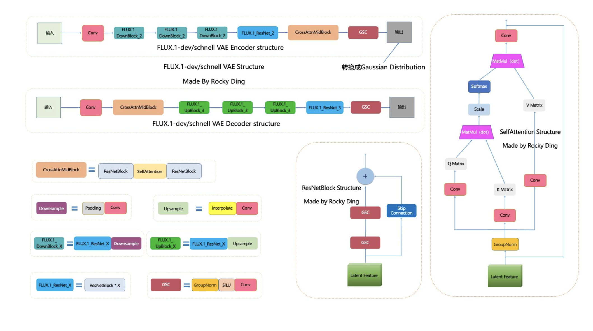

# 目录

## 第一章 FLUX.1系列核心高频考点

- [1.介绍一下FLUX.1的整体架构](#1.介绍一下FLUX.1的整体架构)
- [2.与Stable Diffusion 3相比，FLUX.1的核心优化有哪些？](#2.与Stable-Diffusion-3相比，FLUX.1的核心优化有哪些？)
- [3.介绍一下FLUX.1中VAE部分的特点，比起Stable Diffusion 3有哪些改进？详细分析改进的意图](#3.介绍一下FLUX.1中VAE部分的特点，比起Stable-Diffusion-3有哪些改进？详细分析改进的意图)
- [4.介绍一下FLUX.1中Backbone部分的特点，比起Stable Diffusion 3有哪些改进？详细分析改进的意图](#4.介绍一下FLUX.1中Backbone部分的特点，比起Stable-Diffusion-3有哪些改进？详细分析改进的意图)
- [5.介绍一下FLUX.1中Text Encoder部分的特点，比起Stable Diffusion 3有哪些改进？详细分析改进的意图](#5.介绍一下FLUX.1中Text-Encoder部分的特点，比起Stable-Diffusion-3有哪些改进？详细分析改进的意图)
- [6.介绍一下Rectified Flow的原理，Rectified Flow相比于DDPM、DDIM有哪些优点？](#6.介绍一下Rectified-Flow的原理，Rectified-Flow相比于DDPM、DDIM有哪些优点？)
- [7.FLUX.1系列不同版本模型之间的差异是什么？](#7.FLUX.1系列不同版本模型之间的差异是什么？)
- [8.训练FLUX.1过程中官方使用了哪些训练技巧？](#8.训练FLUX.1过程中官方使用了哪些训练技巧？)
- [9.FLUX.1模型的微调训练流程一般包含哪几部分核心内容？](#9.FLUX.1模型的微调训练流程一般包含哪几部分核心内容？)
- [10.FLUX.1模型的微调训练流程中有哪些关键参数？](#10.FLUX.1模型的微调训练流程中有哪些关键参数？)
- [11.介绍一下FLUX.1 Lite与FLUX.1的异同](#11.介绍一下FLUX.1-Lite与FLUX.1的异同)
- [12.什么是flow matching？](#12.什么是flow-matching？)
- [13.Flow Matching和DDPM之间有什么区别？](#13.Flow-Matching和DDPM之间有什么区别？)


## 第二章 FLUX.1 Kontext系列核心高频考点

- [1.介绍一下FLUX.1 Kontext的原理](#1.介绍一下FLUX.1-Kontext的原理)
- [2.FLUX.1 Kontext能够执行哪些AIGC任务？](#2.FLUX.1-Kontext能够执行哪些AIGC任务？)
- [3.FLUX.1 Kontext和FLUX.1相比，有哪些核心优化？详细分析改进的意图](#3.FLUX.1-Kontext和FLUX.1相比，有哪些核心优化？详细分析改进的意图)
- [4.介绍一下FLUX.1 Kontext的提示词构建技巧](#4.介绍一下FLUX.1-Kontext的提示词构建技巧)

---

## 第一章 FLUX.1系列核心高频考点

<h3 id="1.介绍一下FLUX.1的整体架构">1.介绍一下FLUX.1的整体架构</h3>


<h3 id="2.与Stable-Diffusion-3相比，FLUX.1的核心优化有哪些？">2.与Stable Diffusion 3相比，FLUX.1的核心优化有哪些？</h3>

FLUX.1系列模型是基于Stable Diffuson 3进行了升级优化，是目前性能最强的开源AI绘画大模型，其主要的创新点如下所示：

1. FLUX.1系列模型将VAE的通道数扩展至64，比SD3的VAE通道数足足增加了4倍（16）。
2. 目前公布的两个FLUX.1系列模型都是经过指引蒸馏的产物，这样我们就无需使用Classifier-Free Guidance技术，只需要把指引强度当成一个约束条件输入进模型，就能在推理过程中得到带指定指引强度的输出。
3. FLUX.1系列模型继承了Stable Diffusion 3 的噪声调度机制，对于分辨率越高的图像，把越多的去噪迭代放在了高噪声的时刻上。但和Stable Diffusion 3不同的是，FLUX.1不仅在训练时有这种设计，采样时也使用了这种技巧。
4. FLUX.1系列模型中在DiT架构中设计了双流DiT结构和单流DiT结构，同时加入了二维旋转式位置编码 (RoPE) 策略。
5. FLUX.1系列模型在单流的DiT中引入了并行注意力层的设计，注意力层和MLP并联执行，执行速度有所提升。


<h3 id="3.介绍一下FLUX.1中VAE部分的特点，比起Stable-Diffusion-3有哪些改进？详细分析改进的意图">3.介绍一下FLUX.1中VAE部分的特点，比起Stable Diffusion 3有哪些改进？详细分析改进的意图</h3>

**FLUX.1系列中，FLUX.1 VAE架构依然继承了SD 3 VAE的8倍下采样和输入通道数（16）。在FLUX.1 VAE输出Latent特征，并在Latent特征输入扩散模型前，还进行了Pack_Latents操作，一下子将Latent特征通道数提高到64（16 -> 64），换句话说，FLUX.1系列的扩散模型部分输入通道数为64，是SD 3的四倍**。这也代表FLUX.1要学习拟合的内容比起SD 3也增加了4倍，所以官方大幅增加FLUX.1模型的参数量级来提升模型容量（model capacity）。下面是Pack_Latents操作的详细代码，让大家能够更好的了解其中的含义：

```
@staticmethod
def _pack_latents(latents, batch_size, num_channels_latents, height, width):
    latents = latents.view(batch_size, num_channels_latents, height // 2, 2, width // 2, 2)
    latents = latents.permute(0, 2, 4, 1, 3, 5)
    latents = latents.reshape(batch_size, (height // 2) * (width // 2), num_channels_latents * 4)

    return latents
```

**可以看到FLUX.1模型的Latent特征Patch化方法是将 $2\times2$ 像素块直接在通道维度上堆叠。这种做法保留了每个像素块的原始分辨率，只是将它们从空间维度移动到了通道维度。与之相对应的，SD 3使用下采样卷积来实现Latent特征Patch化，但这种方式会通过卷积减少空间分辨率从而损失一定的特征信息。**

Rocky再举一个形象的例子来解释SD 3和FLUX.1的Patch化方法的不同：
1. SD 3（下采样卷积）：想象我们有一个大蛋糕，SD 3的方法就像用一个方形模具，从蛋糕上切出一个 $2\times2$ 的小方块。在这个过程中，我们提取了蛋糕的部分信息，但是由于进行了压缩，Patch块的大小变小了，信息会有所丢失。
2. FLUX.1（通道堆叠）：FLUX.1 的方法更像是直接把蛋糕的 $2\times2$ 块堆叠起来，不进行任何压缩或者切割。我们仍然保留了蛋糕的所有部分，但是它们不再分布在平面上，而是被一层层堆叠起来，像是三明治的层次。这样一来，蛋糕块的大小没有改变，只是它们的空间位置被重新组织了。

总的来说，**相比SD 3，FLUX.1将 $2\times2$ 特征Patch化操作应用于扩散模型之前**。这也表明FLUX.1系列模型认可了SD 3做出的贡献，并进行了继承与优化。

目前发布的FLUX.1-dev和FLUX.1-schnell两个版本的VAE结构是完全一致的。**同时与SD 3相比，FLUX.1 VAE并不是直接沿用SD 3的VAE，而是基于相同结构进行了重新训练，两者的参数权重是不一样的**。并且SD 3和FLUX.1的VAE会对编码后的Latent特征做平移和缩放，而之前的SD系列中VAE仅做缩放：

```
def encode(self, x: Tensor) -> Tensor:
    z = self.reg(self.encoder(x))
    z = self.scale_factor * (z - self.shift_factor)
    return z
```

平移和缩放操作能将Latent特征分布的均值和方差归一化到0和1，和扩散过程加的高斯噪声在同一范围内，更加严谨和合理。

下面是**Rocky梳理的FLUX.1-dev/schnell系列模型的VAE完整结构图**，希望能让大家对这个从SD系列到FLUX.1系列都持续繁荣的模型有一个更直观的认识，在学习时也更加的得心应手：



**Rocky认为Stable Diffusion系列和FLUX.1系列中VAE模型的改进历程，为工业界、学术界、竞赛界以及应用界都带来了很多灵感，有很好的借鉴价值。Rocky也相信AI绘画中针对VAE的优化是学术界一个非常重要的论文录用点！**


<h3 id="4.介绍一下FLUX.1中Backbone部分的特点，比起Stable-Diffusion-3有哪些改进？详细分析改进的意图">4.介绍一下FLUX.1中Backbone部分的特点，比起Stable Diffusion 3有哪些改进？详细分析改进的意图</h3>


<h3 id="5.介绍一下FLUX.1中Text-Encoder部分的特点，比起Stable-Diffusion-3有哪些改进？详细分析改进的意图">5.介绍一下FLUX.1中Text Encoder部分的特点，比起Stable Diffusion 3有哪些改进？详细分析改进的意图</h3>


<h3 id="6.介绍一下Rectified-Flow的原理，Rectified-Flow相比于DDPM、DDIM有哪些优点？">6.介绍一下Rectified Flow的原理，Rectified Flow相比于DDPM、DDIM有哪些优点？</h3>


<h3 id="7.FLUX.1系列不同版本模型之间的差异是什么？">7.FLUX.1系列不同版本模型之间的差异是什么？</h3>


<h3 id="8.训练FLUX.1过程中官方使用了哪些训练技巧？">8.训练FLUX.1过程中官方使用了哪些训练技巧？</h3>


<h3 id="9.FLUX.1模型的微调训练流程一般包含哪几部分核心内容？">9.FLUX.1模型的微调训练流程一般包含哪几部分核心内容？</h3>


<h3 id="10.FLUX.1模型的微调训练流程中有哪些关键参数？">10.FLUX.1模型的微调训练流程中有哪些关键参数？</h3>


<h3 id="11.介绍一下FLUX.1-Lite与FLUX.1的异同">11.介绍一下FLUX.1-Lite与FLUX.1的异同</h3>


<h3 id="12.什么是flow-matching？">12.什么是flow matching？</h2

## 概览

Flow Matching（流匹配）是一种基于连续可正规流（Continuous Normalizing Flows, CNFs）的模拟无关训练范式，它通过回归在预设概率路径上的向量场来学习生成模型，无需在训练时进行繁重的数值仿真 。在高斯路径（包括传统扩散模型路径）上应用 Flow Matching，不仅可获得与扩散模型相当的生成质量，还能实现更稳定的训练和更高效的采样 。

### 原理简述

#### 条件概率路径

在 Flow Matching 中，我们预先指定一条从噪声分布 $$p_0$$ 到数据分布$$ p_1$$ 的连续概率路径
$$
p_t(x)\propto\exp\biggl(-\frac{||x-\mu(t)||^2}{2\sigma(t)^2}\biggr)\:,
$$
其中 $$\mu(t)$$ 和 $$\sigma(t) $$控制路径的均值与方差 。

#### 向量场回归

给定路径 $$p_t$$ 和其对应的真实流场$$u(x,t)$$，我们训练一个神经网络 $$v_\theta(x,t) $$来最小化
$$
\mathbb{E}_{t\sim U(0,1),\:x\sim p_t}\|v_\theta(x,t)-u(x,t)\|^2
$$
的均方误差，无需在训练迭代中求解 ODE/SDE 。

#### 采样流程

1. 从简单噪声 $$z_0\sim p_0 $$开始。

2. 通过离散化 ODE：
   $$
   z_{t+\Delta t}=z_{t}+v_{\theta}(z_{t},t)\:\Delta t
   $$
   沿时间轴 $$t=0\to1$$ 迭代，最终得到 $$z_1 $$作为生成样本 

### 优势与实践

- **稳定高效**：与基于 SDE 的扩散模型相比，Flow Matching 训练过程无仿真步骤，更少误差累积，训练更稳定、收敛更快 ([mlg.eng.cam.ac.uk](https://mlg.eng.cam.ac.uk/blog/2024/01/20/flow-matching.html?utm_source=chatgpt.com))。
- **灵活路径设计**：除扩散路径外，还可采用最优传输（Optimal Transport）等路径，实现更短、更平滑的生成轨迹，进一步加速采样 ([openreview.net](https://openreview.net/forum?id=PqvMRDCJT9t&utm_source=chatgpt.com))。
- **潜在空间应用**：将 Flow Matching 应用于预训练自动编码器的潜在空间，可大幅降低计算资源需求，同时在高分辨率图像生成中保持高质量 ([github.com](https://github.com/VinAIResearch/LFM?utm_source=chatgpt.com))。
- **开源资源**：可参考官方论文（arXiv:2210.02747）和最新的 Flow Matching Guide（arXiv:2412.06264）获取详尽理论与示例代码 ([arxiv.org](https://arxiv.org/abs/2412.06264?utm_source=chatgpt.com))。


<h3 id="13.Flow-Matching和DDPM之间有什么区别？">13.Flow Matching和DDPM之间有什么区别？</h3>

Flow Matching和去噪扩散概率模型（DDPM）都是生成模型，但它们在理论基础、训练目标和生成过程上都有显著区别。

**核心区别**：  
DDPM通过随机扩散和去噪过程生成数据，强调概率建模；Flow Matching通过确定性ODE路径直接匹配目标分布，追求高效的最优传输。前者生成质量高但速度慢，后者在速度上更具优势，同时理论更简洁。

### **1. 理论基础**
- **DDPM**：
  - 基于**扩散过程**，属于概率模型，通过马尔可夫链的前向（加噪）和反向（去噪）过程建模。
  - 前向过程逐步添加高斯噪声，将数据转化为纯噪声；反向过程通过神经网络学习逐步去噪。
  - 数学上对应 **随机微分方程（SDE）** 的离散化。

- **Flow Matching**：
  - 基于 **连续归一化流（CNF）** 或 **最优传输（Optimal Transport, OT）** ，通过常微分方程（ODE）定义确定性路径。
  - 目标是从噪声分布到数据分布构建一条平滑的概率路径，通常通过匹配向量场实现。
  - 数学上对应 **确定性ODE** ，强调路径的直线性或最优性。

### **2. 过程类型**
- **DDPM**：
  - **随机过程**：每一步添加或去除的噪声是随机的高斯噪声。
  - 前向和反向过程均为马尔可夫链，依赖多步迭代。

- **Flow Matching**：
  - **确定性过程**：生成路径由ODE定义，通常为确定性映射（如Rectified Flow）。
  - 可能通过最优传输直接规划最小能量路径，减少随机性。

### **3. 训练目标**
- **DDPM**：
  - 优化**变分下界（ELBO）**，简化为预测每一步的噪声（均方误差损失）。
  - 需要模拟所有时间步的噪声扰动，训练复杂但稳定。

- **Flow Matching**：
  - 直接匹配**条件概率路径**或**向量场**（如条件流匹配，CFM）。
  - 损失函数设计为最小化预测路径与目标路径的差异（如Wasserstein距离），训练更高效。

### **4. 采样过程**
- **DDPM**：
  - **多步迭代采样**：通常需要几十到几百步去噪，速度较慢。
  - 依赖设计的噪声调度（Noise Schedule）控制加噪/去噪速度。

- **Flow Matching**：
  - **高效采样**：通过ODE求解器可加速，甚至实现少步或一步生成（如Rectified Flow的直线路径）。
  - 路径设计更灵活（如直线化路径减少采样步数）。

### **5. 数学形式对比**
- **DDPM**：
  - 前向过程： $q(x_t | x_{t-1}) = \mathcal{N}(x_t; \sqrt{1-\beta_t}x_{t-1}, \beta_t I)$
  - 反向过程： $p_\theta(x_{t-1} | x_t) = \mathcal{N}(x_{t-1}; \mu_\theta(x_t, t), \Sigma_t)$

- **Flow Matching**：
  - 生成路径： $\frac{d}{dt}x(t) = v_\theta(x(t), t)$ ，其中 $v_\theta$ 是学习的向量场。
  - 目标是最小化 $\mathbb{E}_{t, x(t)} \|v_\theta(x(t), t) - u_t(x(t))\|^2$ ， $u_t$ 为目标路径的瞬时速度。

### **6. 优缺点对比**
- **DDPM**：
  - **优点**：生成质量高，训练稳定。
  - **缺点**：采样速度慢，依赖大量时间步。

- **Flow Matching**：
  - **优点**：采样速度快，路径设计灵活（可直线化），理论更简洁。
  - **缺点**：可能需要复杂ODE求解器，训练技巧要求高。

### **7. 典型应用**
- **DDPM**：图像生成（如Stable Diffusion）、音频合成。
- **Flow Matching**：快速图像生成（如Rectified Flow）、3D形状生成、基于最优传输的任务。

### **8. 总结**
| 维度               | DDPM                          | Flow Matching                  |
|--------------------|-------------------------------|--------------------------------|
| **理论基础**       | 随机扩散（SDE）               | 确定性流（ODE/OT）             |
| **训练目标**       | 变分下界（预测噪声）          | 条件流匹配（匹配向量场）        |
| **采样速度**       | 慢（多步迭代）                | 快（少步或一步）               |
| **路径性质**       | 随机噪声扰动                  | 确定性最优路径                 |
| **数学复杂度**     | 中等（马尔可夫链）            | 高（ODE求解/最优传输）         |

---

## 第二章 FLUX.1 Kontext系列核心高频考点

<h3 id="1.介绍一下FLUX.1-Kontext的原理">1.介绍一下FLUX.1 Kontext的原理</h3>


<h3 id="2.FLUX.1-Kontext能够执行哪些AIGC任务？">2.FLUX.1 Kontext能够执行哪些AIGC任务？</h3>


<h3 id="3.FLUX.1-Kontext和FLUX.1相比，有哪些核心优化？详细分析改进的意图">3.FLUX.1 Kontext和FLUX.1相比，有哪些核心优化？详细分析改进的意图</h3>


<h3 id="4.介绍一下FLUX.1-Kontext的提示词构建技巧">4.介绍一下FLUX.1 Kontext的提示词构建技巧</h3>

---
