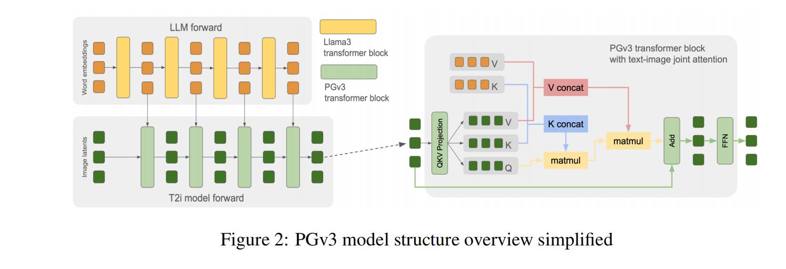
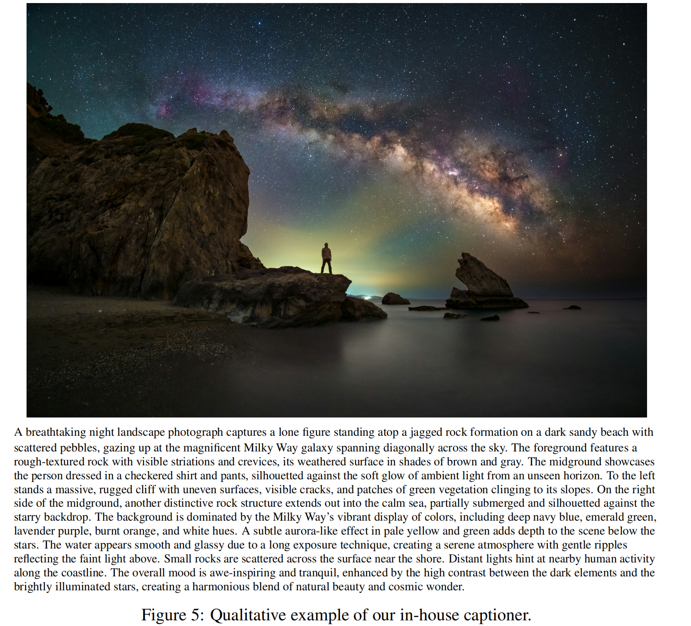
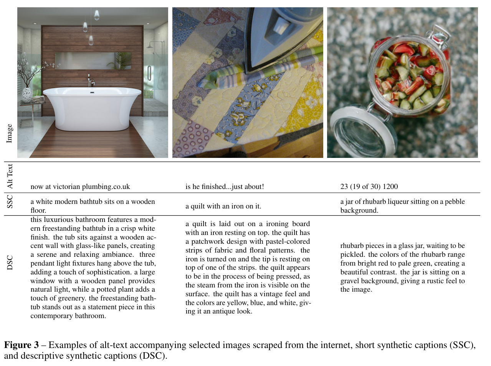

# 目录

## 第一章 Midjourney高频考点

- [1.Midjourney是什么？](#1.Midjourney是什么？)
- [2.Midjourney的应用领域是什么？](#2.Midjourney的应用领域是什么？)
- [3.Midjourney提示词规则有哪些？](#3.Midjourney提示词规则有哪些？)
- [4.Midjourney的界面有哪些？](#4.Midjourney的界面有哪些？)
- [5.Midjourney如何优化三视图效果？](#5.Midjourney如何优化三视图效果？)
- [6.Midjourney迭代至今有哪些优秀的特点？](#6.Midjourney迭代至今有哪些优秀的特点？)
- [7.Midjourney有哪些关键的参数？](#7.Midjourney有哪些关键的参数？)


## 第二章 其他主流AI绘画大模型高频考点

- [1.Playground V2模型有哪些特点？](#1.Playground-V2模型有哪些特点？)
- [2.Imagen模型有什么特点?](#2.Imagen模型有什么特点?)
- [3.PlaygroundV3模型有哪些特点？](#3.PlaygroundV3模型有哪些特点？)
- [4.目前主流的AI绘画大模型（文生图大模型）有哪些？](#4.目前主流的AI绘画大模型（文生图大模型）有哪些？)
- [5.什么是DALL-E 2及其主要功能？](#5.什么是DALL-E2及其主要功能？)
- [6.什么是DALL-E 3及其主要功能？](#6.什么是DALL-E3及其主要功能？)
- [7.关于GPT4O生成的看法（技术路线未公布）](#7.关于GPT4O生成的看法（技术路线未公布）)
- [8.介绍一下Kandinsky 2.1](#8.介绍一下Kandinsky-2.1)
- [9.介绍一下Kandinsky 2.2](#9.介绍一下Kandinsky-2.2)
- [10.介绍一下Kandinsky3](#10.介绍一下Kandinsky3)


## 第一章 Midjourney高频考点正文

<h2 id="1.Midjourney是什么？">1.Midjourney是什么？</h2>

《Midjourney》是一款 2022 年 3 月面世的 AI 绘画工具，创始人是 David Holz。只要输入想到的文字，就能通过人工智能产出相对应的图片，耗时只有大约一分钟。推出 beta 版后，这款搭载在 Discord 社区上的工具迅速成为讨论焦点。


<h2 id="2.Midjourney的应用领域是什么？">2.Midjourney的应用领域是什么？</h2>

Midjourney 是一个基于人工智能的图像生成工具，广泛应用于多个领域。以下是一些主要应用领域：

### 1. 艺术与设计
- 概念艺术：用于创作新颖的概念艺术，帮助艺术家和设计师在项目早期阶段进行视觉探索。
- 平面设计：生成独特的图像和图形元素，供平面设计师使用在广告、海报、封面等作品中。
- 动画与游戏设计：为动画和游戏项目提供角色设计、场景设定和其他视觉素材。

### 2. 广告与营销
- 品牌宣传：创建引人注目的广告图像和品牌视觉元素。
- 社交媒体内容：生成高质量的社交媒体图片，提高品牌在数字平台上的影响力。

### 3. 出版与媒体
- 书籍插图：为书籍、杂志和其他出版物提供插图。
- 新闻报道：为新闻文章生成相关的视觉内容，提高读者的参与度。

### 4. 教育与科研
- 教育材料：制作教育内容的图示和插图，增强学习体验。
- 科研项目：为科学研究和学术论文生成图表和可视化图像，帮助解释复杂的概念。

### 5. 娱乐与文化
- 影视制作：为电影和电视项目创建故事板、场景设定和概念艺术。
- 文学创作：为小说和故事提供视觉支持，帮助作者构建故事世界。

### 6. 产品开发
- 工业设计：辅助产品设计和原型开发，生成产品概念图。
- 用户界面设计：为软件和应用程序设计用户界面元素。

通过以上这些应用领域，Midjourney 帮助各行各业的专业人士提升创作效率和作品质量。


<h2 id="3.Midjourney提示词规则有哪些？">3.Midjourney提示词规则有哪些？</h2>

### 1. 类别
#### 1.1 模型/风格切换
- `--v` 1~5：切换为相应的 Midjourney 模型，不推荐早期模型 1/2/3。
- `--niji` 留空，5：切换为相应的 Nijidjourney 模型。
- `--style` 4a/4b/4c：切换为 4a/4b/4c 风格，Midjourney V4 模型下才能生效，不推荐使用。
- `--style` expressive/cute/scenic：切换为相应的风格，Nijidjourney5 模型下才能生效。
- `--hd/test/testp` 留空：切换为相应的模型，早期模型 hd 和测试模型 test/testp，不推荐使用。


<h2 id="4.Midjourney的界面有哪些？">4.Midjourney的界面有哪些？</h2>

成功登录 Midjourney 后你将被引导至应用的主界面。这个界面通常包括几个核心区域：

### 1. 画布区域
这是你进行绘画创作的主要区域，你可以在这里使用画笔工具绘制图像。

### 2. 工具栏
工具栏通常位于界面的一侧或顶部，包含各种绘画工具和选项，如不同类型的画笔、颜色选择器、图层管理等。

### 3. 图层管理
图层管理功能通常位于界面的底部或侧边，用于管理绘画中的不同元素的叠加顺序和可见性。

熟悉界面布局是入门的第一步。花些时间探索各个区域的功能和位置，确保你理解每个部分在绘画过程中的作用。


<h2 id="5.Midjourney如何优化三视图效果？">5.Midjourney如何优化三视图效果？</h2>

三视图不完整这种情况，很大原因是因为图像的宽度不够导致的，虽然在提示词内有强调三视图，但由于画面宽度有限，MJ 很难在这么窄的画面内渲染出 3 个完整且独立的形象，所以只能少渲染一个，或者改变角度。

对应的解决方法很简单，只需要添加 `--ar` 参数，将画幅设置为横向，有了足够空间，三视图的效果立刻会得到改善。

不过画幅并不是越宽越好，比如设置成 `--ar 16:9` 的时候，图像生成的效果又会开始下降。经过测试对比，画幅比在 `7:5` 或者 `14:9` 时三视图效果最稳定。

另外建议一组参数至少生成 3 次，确定了稳定的出图效果后，再决定要不要换另一组参数。


<h2 id="6.Midjourney迭代至今有哪些优秀的特点？">6.Midjourney迭代至今有哪些优秀的特点？</h2>

Rocky认为Midjourney系列是AIGC时代AI绘画ToC产品的一个非常有价值的标杆，我们需要持续研究挖掘其价值与优秀特点：

1. 图像生成整体性能持续提升。
2. 图像细节持续提升，包括图像背景、内容层次、整体光影、人物结构、手部特征、皮肤质感、整体构图等。
3. 语义理解持续增强，生成的图像内容与输入提示词更加一致。
4. 审美标准持续提升。
5. 更多辅助功能支持：超分、可控生成、人物一致性、风格参考等。
6. 用户易用性持续提升：用户输入更加简洁的提示词就能生成高质量的图片，更加符合用户的使用习惯。


<h2 id="7.Midjourney有哪些关键的参数？">7.Midjourney有哪些关键的参数？</h2>

Rocky认为，了解Midjourney的关键参数，能够从中挖掘出一些借鉴价值，并对其底层技术进行判断，是非常有价值的事情。

Rocky也会持续补充更新Midjourney的最新关键参数。

### 1. **版本参数：`--version` 或 `--v`**

**作用：**

指定使用 Midjourney 的模型版本。不同版本的模型在风格、细节和渲染效果上有所区别。

**使用方法：**

```plaintext
--version <版本号>
或
--v <版本号>
```

**示例：**

```plaintext
/imagine prompt: a serene landscape --v 6
```

### 2. **风格化参数：`--stylize` 或 `--s`**

**作用：**

控制生成图像的艺术风格程度。数值越大，图像越具艺术性；数值越小，图像越接近于严格按照提示生成。可以用数值范围是0-1000，默认值是100。

默认情况下，Midjourney会为图像加上100的--s参数数值。如果将数值调到低于100，那么画面的细节会变少、质感会更粗糙，图像整体质量会下降；而如果将数值调至高于100，那么画面的细节会更丰富、光影、纹理的质感也会更精致。如下图，随着--s数值的提升，树精灵的服装变得更华丽了，面部五官也更加可爱精致，与--s为0时有明显的区别。

**使用方法：**

```plaintext
--stylize <数值>
或
--s <数值>
```

**示例：**

```plaintext
/imagine prompt: a portrait of a cat --s 1000
```

### 3. **宽高比参数：`--aspect` 或 `--ar`**

**作用：**

指定生成图像的宽高比例。

=**使用方法：**

```plaintext
--aspect <宽比>:<高比>
或
--ar <宽比>:<高比>
```

**示例：**

```plaintext
/imagine prompt: a tall skyscraper --ar 9:16
```

**详细说明：**

- **常用比例：**
  - `1:1`（正方形）
  - `16:9`（宽屏）
  - `9:16`（竖屏）
  - 自定义比例，如 `4:3`、`3:2` 等。
- **影响：**调整图像的构图和布局，以适应特定的显示需求，如手机壁纸、海报等。

### 4. **质量参数：`--quality` 或 `--q`**

**作用：**

控制图像生成的质量和渲染速度。较高的质量会产生更精细的图像，但需要更多的时间和资源。

**使用方法：**

```plaintext
--quality <数值>
或
--q <数值>
```

**示例：**

```plaintext
/imagine prompt: an intricate mechanical watch --q 2
```

**详细说明：**

- **数值选项：**
  - `0.25`（低质量，速度快）
  - `0.5`（中等质量）
  - `1`（默认质量）
  - `2`（高质量，速度慢）
- **影响：**提高质量参数会增加图像的细节和分辨率，但渲染时间也会相应增加。适用于对细节有高要求的图像生成。

### 5. **种子参数：`--seed`**

**作用：**

指定随机数生成的种子，以控制图像生成的随机性。使用相同的种子和提示，可以复现相似的图像。

**使用方法：**

```plaintext
--seed <数值>
```

**示例：**

```plaintext
/imagine prompt: a mystical forest --seed 123456789
```

**详细说明：**

- **数值范围：**0 到 4294967295 之间的整数。
- **影响：**
  - **复现性：**相同的提示和种子会生成相似的图像，方便对结果进行微调和比较。
  - **多样性：**更改种子值可以探索不同的图像变体。

### 6. **混乱度参数：`--chaos`**

**作用：**

Chaos 是一种混沌值参数，可以缩写为 --c 添加在提示词之后，控制生成图像的随机性和不可预测性。较高的值会产生更意想不到的结果。可以用数值范围是0-100，默认值是0。

Midjourney对每组提示词返回的并非单张图像，而是4张，这让我们一次就能得到多张图像，提升了出图效率。在之前的版本中，每次生成的4张图像是非常相似的，官方觉得这不利于用户获取更多样的结果，于是在V6版本中调大了图像间的差异性，让4张图像在风格、构图、内容等方面有明显不同。

如下图，--c 数值达到 25 时，画面虽然还能保持 “穿白色衣服，头戴桃子花环的男孩” 这一形象，但已经不再局限于 “3D、玩偶” 的风格范围了，拓展到真人、布偶、陶偶等类型上；而在数值达到 50 以及更高时，画面已经和最初的提示词关联度很低了，风格和内容都变得很随机。

**使用方法：**

```plaintext
--chaos <数值>
```

**示例：**

```plaintext
/imagine prompt: abstract shapes and colors --chaos 80
```

**详细说明：**

- **数值范围：**0 到 100。
- **影响：**增加混乱度会使生成的图像更具创意和不可预测性，但可能与提示的相关性降低。

### 7. **图像提示参数：`--image`**

**作用：**

提供一个参考图像，指导生成的图像风格或内容。本质上和Stable Diffusion系列的图生图功能是一样的。

**使用方法：**

```plaintext
在提示中上传图像或提供图像 URL
```

**示例：**

```plaintext
/imagine prompt: [上传的图片] + a sunset over the ocean
```

**详细说明：**

- **使用方法：**在提示中添加一张图片，Midjourney 将其作为参考。
- **影响：**生成的图像会结合文字描述和参考图像的风格或内容。

### 8. **负面提示参数：`--no`**

**作用：**

排除特定元素或特征，使生成的图像不包含指定内容。与Stable Diffusion系列的Negative Prompt效果一致。

**使用方法：**

```plaintext
--no <不希望出现的元素>
```

**示例：**

```plaintext
/imagine prompt: a city street at night --no cars
```

**详细说明：**

- **影响：**指导模型避免生成包含指定元素的内容，提高结果的符合度。

### 9. **Tile 参数：`--tile`**

**作用：**

生成可无缝平铺的图像，适用于纹理和背景设计。

**使用方法：**

```plaintext
--tile
```

**示例：**

```plaintext
/imagine prompt: a floral pattern --tile
```

**详细说明：**

- **影响：**生成的图像可以在水平和垂直方向上无缝衔接，适合用于壁纸、纹理等设计。

### 10. **UPBETA 参数：`--UPBETA`**

**作用：**

提供更好的图像质量和细节，在图像的细节处理上有更好的表现，呈现出更精细的纹理和轮廓。与Stable Diffusion系列模型的精绘功能非常相似。

**使用用法：**

  ```plaintext
  /imagine prompt: <描述文本> --upbeta
  ```

**示例：**

  ```plaintext
  /imagine prompt: a futuristic city skyline at sunset --upbeta
  ```


## 第二章 其他主流AI绘画大模型高频考点正文

<h2 id="1.Playground-V2模型有哪些特点？">1.Playground V2模型有哪些特点？</h2>

Playground系列AI绘画大模型到目前已经发展到第三个版本，也就是Playground V2.5，其特点主要有：
1. 与SDXL相同模型架构。
2. 与SDXL相比，增强了色彩和对比度（EDM框架），改善了跨多种长宽比的生成（均衡分桶策略），以及改善了中心人物的细节（SFT策略）。
3. 其中EDM框架能在扩散模型的扩散过程最终“时间步长”上表现出接近零的信噪比。这消除了对偏移噪声的需求，让Playground V2.5能够生成背景是纯黑色或纯白色的图像。
4. 其中SFT策略主要使用一个高质量的小数据集对预训练的扩散模型进行微调训练。而这个数据集通过用户评级自动策划。
5. 从头开始训练（trained from scratch）。
6. 设计MJHQ-30K测试集用于评估AI绘画大模型，主要是在高质量数据集上计算FID来衡量美学质量。MJHQ-30K是从Midjourney上收集的30000个高质量数据集，共包含10个常见的类别，每个类别包含3000个样本。


<h2 id="2.Imagen模型有什么特点?">2.Imagen模型有什么特点?</h2>

**Imagen是AIGC时代AI绘画领域的第一个多阶段级联大模型，由一个Text Encoder（T5-XXL）、一个文生图 Pixel Diffusion、两个图生图超分Pixel Diffusion共同组成，让Rocky想起了传统深度学习时代的二阶段目标检测模型，这也说明多模型级联架构是跨周期的，是有价值的，是可以在AIGC时代继续成为算法解决方案构建的重要一招。**


同时Imagen是AI绘画领域第一个使用大语料预训练语言模型T5-XXL作为Text Encoder的AI绘画大模型。论文中认为在文本编码器部分下功夫比在生成模型上下功夫效果要好，即使文本编码器部分的T5-XXL是纯文本语言模型，也比加大加深生成模型参数效果要好。

不过Imagen也有他的局限性，在扩散模型部分还是选用经典的64x64分辨率的U-Net结构。选择小模型可以缓解Diffusion迭代耗时太长，导致生成过慢的问题，生成小图像再超分确实是加速生成最直观的方法。但是也注定了无法生成比较复杂内容和空间关系的大图像。

---

<h2 id="3.PlaygroundV3模型有哪些特点？">3.PlaygroundV3模型有哪些特点？</h2>

### 技术架构创新

1. **深度融合大型语言模型**：不同于传统文本到图像模型使用T5或CLIP等预训练语言模型，Playground v3采用创新结构完全集成大型语言模型，专门从解码器型LLM获取文本条件
2. **内置高质量字幕器**：团队开发了专有字幕生成器，增强图像字幕质量





### 性能与能力

1. **超越人类的图形设计能力**：在电子书封面、艺术海报、社交媒体帖子等多种设计场景中，用户偏好研究显示其设计能力受到高度评价
2. **强大的提示遵循和推理能力**：模型能够准确理解并执行文本提示，展现出强大的推理能力和文本渲染能力

<h2 id="4.目前主流的AI绘画大模型（文生图大模型）有哪些？">4.目前主流的AI绘画大模型（文生图大模型）有哪些？</h2>

目前，AIGC时代主流的AI绘画大模型（文生图大模型）包括：

1. FLUX.1系列文生图大模型（pro、dev、schnell）
2. Stable Diffusion系列文生图大模型（1.x、2.x、XL、3、3.5）
3. Seedream系列文生图大模型（Seedream 3.0、2.0）
4. Midjourney系列文生图大模型（V5、V6、V7）
5. 可图系列文生图大模型
6. Ideogram系列文生图大模型
7. DaLL·E系列文生图大模型（2-3）
8. PixArt系列文生图大模型（α、Σ）
9. Playground系列文生图大模型（v2.5-v3）
10. Imagen系列文生图大模型（1、2、3）
11. PixArt系列文生图大模型
12. 混元系列文生图大模型
13. NovelAI系列文生图大模型

- [点击查看详细答案](https://articles.zsxq.com/id_bkt6vb2dw655.html)

Rocky会根据AIGC时代的AI绘画大模型技术更新来持续补充完善详细答案和本答案！

<h2 id="5.什么是DALL-E2及其主要功能？">5.什么是DALL-E 2及其主要功能？</h2>

论文链接：[dall-e-2.pdf](https://cdn.openai.com/papers/dall-e-2.pdf)

DALL-E 2是OpenAI于2022年4月推出的AI图像生成系统，它能将文字描述转化为高质量图像。其三大核心功能包括：从文本创建原创逼真图像、编辑现有图像(添加或删除元素)、以及生成图像变体。它结合CLIP和扩散模型技术，使艺术家、设计师和内容创作者能快速将创意可视化。2022年9月向公众开放后，DALL-E 2已广泛应用于设计、营销和艺术创作领域，用户对生成的图像拥有完整版权。虽然2023年9月被DALL-E 3取代，但它在AI辅助视觉创作史上仍是重要里程碑


<h2 id="6.什么是DALL-E3及其主要功能？">6.什么是DALL-E 3及其主要功能？</h2>

技术报告链接：[dall-e-3.pdf](https://cdn.openai.com/papers/dall-e-3.pdf)

 DALL-E 3是OpenAI于2023年9月推出的革命性AI图像生成系统，代表了文本到图像转换技术的重大飞跃。与DALL-E 2相比，它具有更强大的自然语言理解能力，能精确解读复杂、微妙的文本描述，包括抽象概念和多层次指令。生成的图像质量显著提升，呈现出更高分辨率、更丰富细节和更自然的光影效果。DALL-E 3彻底解决了前代产品处理文字的局限性，能在图像中准确呈现各种字体和文本布局。其与ChatGPT的创新集成使用户能通过对话式体验逐步完善创意，获得提示词优化建议。在艺术表现方面，它能更精准地模拟从古典油画到现代数字艺术的各种风格和媒介。安全性也得到加强，内置更严格的保护机制防止生成不当内容。用户可通过ChatGPT Plus订阅、OpenAI API或Microsoft的Bing Image Creator和Designer工具使用DALL-E 3，已广泛应用于广告、出版、产品设计、游戏开发和建筑可视化等专业领域，为创意工作流程带来前所未有的效率和可能性。

不同文本对比：




<h2 id="7.关于GPT4O生成的看法（技术路线未公布）">7.关于GPT4O生成的看法（技术路线未公布）</h2>

根据OpenAI的报告，GPT-4o模型现在集成了图像生成功能。这是一项重要的技术进步，但我们也应该保持客观的认识。

技术报告地址：[Introducing 4o Image Generation | OpenAI](https://openai.com/index/introducing-4o-image-generation/)

## 主要特点与功能

GPT-4o的图像生成功能有几个值得注意的特点：

1. **文本渲染能力**：模型能够在图像中准确呈现文本，这解决了之前AI生成图像中文字常常模糊不清的问题。
2. **多轮对话生成**：用户可以通过自然对话方式逐步调整图像，使创作过程更加灵活。
3. **指令遵循能力**：能够处理较为复杂的提示，按照用户要求生成包含多个元素的图像。
4. **上下文学习能力**：能分析用户上传的图片，并将这些元素整合到新生成的图像中。
5. **知识整合**：将文本理解和图像生成能力结合起来，例如能够将代码可视化或创建基于配方的图示。

## 实际局限性

然而，这项技术仍有局限性：

1. **裁剪问题**：长图像容易被过度裁剪，特别是底部部分。
2. **幻觉现象**：在低上下文提示时仍会生成虚构内容。
3. **复杂度限制**：处理超过10-20个概念的复杂图像时容易出错。
4. **非拉丁文字渲染不稳定**：多语言文本渲染存在困难。
5. **编辑精度不足**：精确编辑图像特定部分时可能导致其他部分也发生变化。

## 与专业工具的比较

重要的是，尽管GPT-4o的图像生成功能令人印象深刻，但它**目前无法替代专业的图像生成流程**。专业设计师和艺术家使用的工具(如Photoshop、Illustrator或专门的AI工具如Midjourney、Stable Diffusion)提供了更精细的控制和更高质量的输出。

对于需要精确控制细节、专业品质和特定风格一致性的商业项目，专业工具和工作流程仍然是不可替代的。GPT-4o的图像生成更适合快速原型设计、概念探索或非专业用途。

## 实用价值

GPT-4o的图像生成功能最大的价值在于其便捷性和多模态整合能力。它使普通用户能够在对话中轻松创建视觉内容，而不必切换到专门的图像生成工具。这对于日常交流、简单创意表达和教育用途特别有用。这是AI技术向前迈进的重要一步，但我们应该保持对其能力的客观认识，理解它是对专业图像创作工具的补充，而非替代。在可预见的未来，复杂的设计任务和专业视觉创作仍将需要专门的工具和人类专业知识。


<h2 id="8.介绍一下Kandinsky-2.1">8.介绍一下Kandinsky 2.1</h2>

Kandinsky 2.1 是由俄罗斯 AI 团队 AI Forever 开发的开源文本到图像生成模型，继承了 DALL·E 2 和 Latent Diffusion 的最佳实践，并引入了新的架构创新，显著提升了图像生成质量和多语言支持能力。[Kandinsky 2.1](https://huggingface.co/docs/diffusers/api/pipelines/kandinsky) 更改了体系结构，以包括图像先验模型 （[`CLIP`](https://huggingface.co/docs/transformers/model_doc/clip)），以生成文本和图像嵌入之间的映射。该映射提供了更好的文本-图像对齐，并在训练期间与文本嵌入一起使用，从而获得更高质量的结果。最后，Kandinsky 2.1 使用[调制量子化向量 （MoVQ）](https://huggingface.co/papers/2209.09002) 解码器（它添加了空间条件归一化层以提高照片级真实感）将潜在因素解码为图像。

### 核心架构与技术亮点

Kandinsky 2.1 采用了两阶段生成架构，核心组件包括：

- **文本编码器**：使用 XLM-Roberta-Large-ViT-L-14 模型，具有 5.6 亿参数，支持多语言文本输入。
- **图像编码器**：采用 CLIP ViT-L/14 模型，参数量为 4.27 亿，用于生成图像嵌入。
- **扩散图像先验模型**：参数量为 10 亿，负责在文本和图像嵌入之间建立映射。
- **潜在扩散 U-Net**：参数量为 12.2 亿，负责从图像嵌入生成潜在表示。
- **MoVQ 编码器/解码器**：参数量为 6700 万，用于将潜在表示解码为最终图像。

这种架构结合了 CLIP 模型的文本和图像编码能力，以及扩散模型在图像生成中的优势，实现了高质量的图像生成。

### 功能特性

Kandinsky 2.1 支持多种图像生成和编辑功能，包括：

- **文本到图像生成**：根据文本描述生成全新的图像。
- **图像融合**：将多个图像或文本描述融合，创造出新的复合图像。
- **图像修复**：根据提供的蒙版和提示，修复或替换图像中的特定区域。
- **图像到图像转换**：在保留原始图像结构的同时，根据文本提示修改图像风格或内容。

<h2 id="9.介绍一下Kandinsky-2.2">9.介绍一下Kandinsky 2.2</h2>

[Kandinsky 2.2](https://huggingface.co/docs/diffusers/api/pipelines/kandinsky_v22) 对以前的模型进行了改进，将图像先验模型的图像编码器替换为更大的 CLIP-ViT-G 模型以提高质量。图像先验模型还在具有不同分辨率和纵横比的图像上进行了重新训练，以生成更高分辨率的图像和不同的图像尺寸。

### 技术架构升级

Kandinsky 2.2 的核心技术亮点包括：

- **CLIP-ViT-G 图像编码器**：相较于前代使用的 CLIP 模型，CLIP-ViT-G 提供了更强大的图像编码能力，使得模型能够生成更具美感的图片，并更好地理解文本描述。
- **ControlNet 机制**：这一机制的引入使得模型在生成图像的过程中能够更精确地控制图像的生成过程，从而实现更高质量的输出。

模型的架构细节如下：

- **文本编码器**：XLM-Roberta-Large-Vit-L-14（560M 参数）
- **扩散图像先验**：1B 参数
- **CLIP 图像编码器**：ViT-bigG-14-laion2B-39B-b160k（1.8B 参数）
- **潜在扩散 U-Net**：1.22B 参数
- **MoVQ 编码器/解码器**：67M 参数

### 功能增强

Kandinsky 2.2 在功能上也进行了增强，包括：

- **高分辨率图像生成**：支持生成 1024x1024 分辨率的图像，满足更高质量的视觉需求。

- **多任务支持**：模型支持文本到图像生成、图像融合和图像修复等多种任务，满足不同应用需求。

- **精确控制**：ControlNet 机制使得图像生成过程更加可控，能够根据需求调整生成结果。

  

<h2 id="10.介绍一下Kandinsky3">10.介绍一下Kandinsky3</h2>

[Kandinsky 3](https://huggingface.co/docs/diffusers/api/pipelines/kandinsky3) 简化了架构，并摆脱了涉及先验模型和扩散模型的两阶段生成过程。相反，Kandinsky 3 使用 [Flan-UL2](https://huggingface.co/google/flan-ul2) 对文本进行编码，使用具有 [BigGan 深度](https://hf.co/papers/1809.11096)块的 UNet，并使用 [Sber-MoVQGAN](https://github.com/ai-forever/MoVQGAN) 将潜在数据解码为图像。文本理解和生成的图像质量主要是通过使用更大的文本编码器和 UNet 来实现的。

### 架构创新

Kandinsky 3.0 的主要技术特点包括：

- **超大文本编码器**：使用谷歌的 Flan-UL2 模型，encoder 部分参数量高达 8.6B，是目前文生图模型中最大的文本编码器之一。
- **高分辨率图像生成**：支持直接生成 1024×1024 分辨率的图像，满足更高


