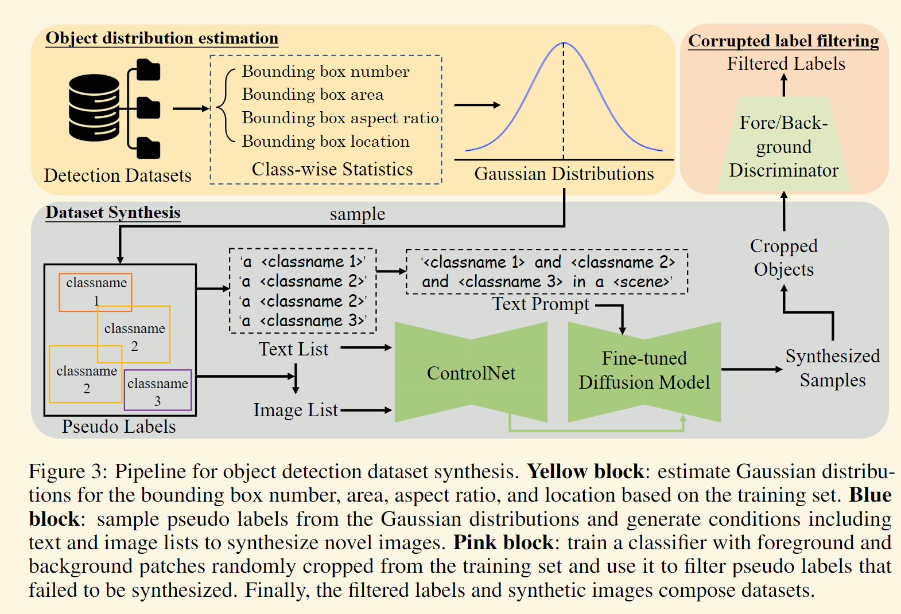
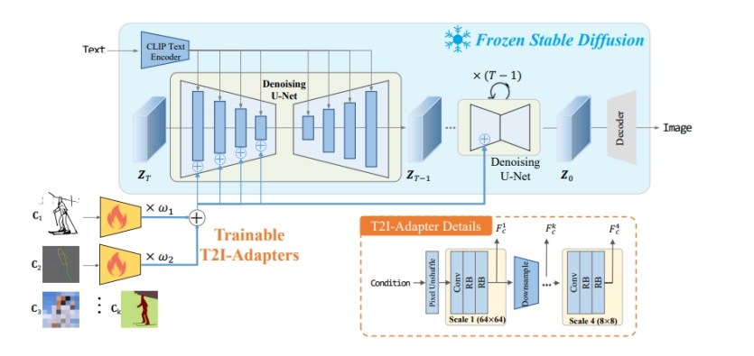

# 目录

- [1.Ip-adapter的模型结构与原理](#1.Ip-adapter的模型结构与原理)
- [2.Controlnet的模型结构与原理](#2.Controlnet的模型结构与原理)
- [3.人物一致性模型PhotoMaker原理](#3.人物一致性模型PhotoMaker原理)
- [4.人物一致性模型InstantID原理](#4.人物一致性模型InstantID原理)
- [5.单ID图像为什么InstantID人物一致性比Photomaker效果好](#5.单ID图像为什么InstantID人物一致性比Photomaker效果好)
- [6.Controlnet++的模型结构和原理](#6.Controlnet++的模型结构和原理)
- [7.Controlnext的模型结构和原理](#7.Controlnext的模型结构和原理)
- [8.ODGEN的模型结构和原理](#8.ODGEN的模型结构和原理)
- [9.Controlnet如何处理条件图的？](#9.Controlnet如何处理条件图的？)
- [10.加入Controlnet训练后，训练时间和显存的变化？](#10.加入Controlnet训练后，训练时间和显存的变化？)
- [11.T2I-Adapter的模型结构和原理](#11.T2I-Adapter的模型结构和原理)
- [12.T2I-Adapter和ControlNet的异同点是什么？](#12.T2I-Adapter和ControlNet的异同点是什么？)

<h2 id="1.Ip-adapter的模型结构与原理">1.Ip-adapter的模型结构与原理 </h2>
IP-Adapter 采用了一种解耦的交叉注意力机制，将文本特征和图像特征分开处理，从而使得生成的图像能够更好地继承和保留输入图像的特征。

图像编码：IP-Adapter 使用预训练的 CLIP（Contrastive Language-Image Pre-training）图像编码器来提取图像提示的特征。

解耦交叉注意力机制：IP-Adapter 通过这种机制，将文本特征的 Cross-Attention 和图像特征的 Cross-Attention 分区开来。在Unet 的模块中新增了一路 Cross-Attention 模块，用于引入图像特征。

适配模块：IP-Adapter 包含一个图像编码器和包含解耦交叉注意力机制的适配器。这个适配器允许模型在生成图像时，同时考虑文本提示和图像提示，生成与文本描述相匹配的图像。

<h2 id="2.Controlnet的模型结构与原理">2.Controlnet的模型结构与原理 </h2>

权重克隆：ControlNet 将大型扩散模型的权重克隆为两个副本，一个“可训练副本”和一个“锁定副本”。锁定副本保留了从大量图像中学习到的网络能力，而可训练副本则在特定任务的数据集上进行训练，以学习条件控制。

零卷积：ControlNet 引入了一种特殊类型的卷积层，称为“零卷积”。这是一个 1x1 的卷积层，其权值和偏差都初始化为零。零卷积层的权值会从零逐渐增长到优化参数，这样设计允许模型在训练过程中逐渐调整和学习条件控制，而不会对深度特征添加新的噪声。

特征融合：ControlNet 通过零卷积层将额外的条件信息融合到神经网络的深层特征中。这些条件可以是姿势、线条结构、颜色分布等，它们作为输入调节图像，引导图像生成过程。

灵活性和扩展性：ControlNet 允许用户根据需求选择不同的模型和预处理器进行组合使用，以实现更精准的图像控制和风格化。例如，可以结合线稿提取、颜色控制、背景替换等多种功能，创造出丰富的视觉效果。

<h2 id="3.人物一致性模型PhotoMaker原理">3.人物一致性模型PhotoMaker原理 </h2>

编码器（Encoders）：PhotoMaker使用CLIP图像编码器来提取图像嵌入（image embeddings），并通过微调部分Transformer层来优化模型对于屏蔽图像中ID特征的提取能力。

堆叠ID嵌入（Stacked ID Embedding）：通过将多个输入ID图像的编码堆叠起来，构建了一个统一的ID表示。这个表示能够保留每个输入ID图像的原始特征，并在推理阶段接受任意数量的ID图像作为输入，从而保持高生成效率。

融合（Merging）：利用扩散模型中的交叉注意力机制来自适应地合并堆叠的ID嵌入中包含的ID信息，从而在生成过程中实现对ID特征的有效控制。

ID导向的数据构建流程（ID-Oriented Human Data Construction）：为了支持PhotoMaker的训练，研究者设计了一个自动化流程来构建一个以ID为中心的人类数据集。这个数据集包含大量具有不同表情、属性、场景的图像，有助于训练过程中的ID信息学习。

<h2 id="4.人物一致性模型InstantID原理">4.人物一致性模型InstantID原理 </h2>
ID Embedding：InstantID利用预训练的人脸模型（如insightface库中的模型）来提取面部特征的语义信息，这些特征被称为ID Embedding。与使用CLIP模型相比，这种方法能够更精准和丰富地捕获人物面部表情的特征。

Image Adapter：这是一个轻量级的自适应模块，它结合了文本提示信息和图像提示信息。该模块的设计思路与IP-Adapter相似，通过解耦交叉注意力机制来适应不同的生成任务。

IdentityNet：为了在粗粒度上改进图像生成并更精确地控制人物ID图像的生成，InstantID引入了IdentityNet模块。这个模块利用弱空间信息（如面部关键点）和强语义信息（从ID Embedding模块提取的面部表情特征）来引导图像的生成。

ControlNet：InstantID还使用了ControlNet来增强面部特征提取，进一步提高图像生成的质量和准确性。

<h2 id="5.单ID图像为什么InstantID人物一致性比Photomaker效果好">5.单ID图像为什么InstantID人物一致性比Photomaker效果好</h2>

1.InstantID利用预训练的人脸模型（如insightface库中的模型）来提取面部特征的语义信息。与Photomaker所使用的CLIP模型相比，这种方法能够更精准和丰富地捕获人物面部表情的特征。

2.InstantID还使用ControlNet来增强面部特征提取，进一步提高图像生成的质量和准确性。

3.Photomaker是先将文本特征和图像特征通过MLPs融合，再做CrossAttention加入U-net.InstantID是图像特征和文本特征分开做CrossAttention,再融合。（可以认为是区别，不要一定是效果好的原因）

<h2 id="6.Controlnet++的模型结构和原理">6.Controlnet++的模型结构和原理</h2>

论文链接：https://arxiv.org/pdf/2404.07987.pdf

参照cyclegan，采用预先训练的判别优化循环一致性损失。

输入的条件信息与从生成的图像中提取出来的条件信息做损失，如mask。

 

同时提出了一种通过添加噪声扰乱训练图像的一致性，并使用单步去噪图像进行奖励微调的新策略。相比从随机噪声开始多步采样，此方法显著减少了时间和内存成本，同时保持了高效的奖励微调,最终提高了生成图像与输入条件的一致性。

<h2 id="7.Controlnext的模型结构和原理">7.Controlnext的模型结构和原理</h2>

论文链接：https://arxiv.org/pdf/2408.06070

该论文提出了一种名为ControlNeXt的新方法，用于高效且可控的图像和视频生成。作者指出，现有的可控生成方法通常需要大量的额外计算资源，尤其是在视频生成方面。此外，这些方法在训练时也面临挑战，如控制能力弱或收敛缓慢。为了解决这些问题，作者设计了一种更为简单且高效的架构，并提出了新的技术，如跨归一化（Cross Normalization），以替代传统的零卷积（Zero Convolution），从而实现更快更稳定的训练收敛。

### 主要内容：

1. **ControlNeXt架构**：该架构减少了与基础模型相比的额外成本，提供了一种轻量级的结构，能够无缝整合其他权重（如LoRA权重），无需额外训练即可实现风格转换。
2. **跨归一化技术**：作者提出了一种新的归一化方法，用于大规模预训练模型的微调，使得训练更加高效和稳定。
3. **参数效率**：ControlNeXt减少了多达90%的可学习参数，并在多个基于扩散模型的图像和视频生成任务中展示了其鲁棒性和兼容性。

整体训练框架如下图所示：

ControlNeXt 采用精简的架构，消除了繁重的辅助组件，从而最大限度地减少延迟开销并减少可训练参数。这种轻量级设计使其能够充当具有强大鲁棒性和兼容性的即插即用模块，进一步允许与其他 LoRA 权重集成以改变生成样式，而无需额外训练。提出的交叉归一化，用新引入的参数对预训练的大型模型进行微调，从而促进更快、更稳定的训练收敛。

<h2 id="8.ODGEN的模型结构和原理">8.ODGEN的模型结构和原理 </h2>

论文链接：https://arxiv.org/pdf/2405.15199

ODGEN（**O**bject **D**etection **GEN**eration）是一个基于扩散模型（Diffusion Model）的图像生成方法，专门用于生成领域特定的物体检测数据。其核心目标是通过控制扩散模型，生成具有多类物体、复杂场景和重叠物体的高质量图像，以此扩展训练数据，提高物体检测任务的性能。

模型框架如下：

该方法的关键技术包括：

1. **扩散模型的微调**：在领域特定的数据集上微调扩散模型，以便适应目标场景的分布。
2. **对象级别的控制策略**：通过文本提示和视觉条件，确保生成的图像准确地包含指定类别的物体，并符合空间约束（如边界框位置）。

### 1. 领域特定的扩散模型微调

#### 基本思路

扩散模型（如Stable Diffusion）通常是在大规模网络数据上进行预训练的，但这些数据的分布与实际的特定领域数据（如医疗图像、游戏场景）存在很大差异。因此，ODGEN首先在领域特定的数据集上微调扩散模型。

微调的过程中，模型不仅会使用整个图像，还会使用裁剪后的前景物体来优化生成效果。这有助于模型更好地学习前景物体的细节，同时保留生成完整背景场景的能力。

#### 具体步骤

- 首先，从数据集中裁剪前景物体，并将其调整为512×512大小的图像。
- 然后，使用基于边界框和类别的文本提示，生成整个场景和前景物体。对于场景使用模板“a <场景名称>”，对于物体使用模板“a <类别名称>”。
- 最后，通过一个重建损失函数对扩散模型进行优化，确保生成图像的质量。

### 2. 对象级别的控制策略

#### 背景问题

现有的生成方法在处理多类别物体和复杂场景时，往往会出现“概念混叠”现象，即多个类别的物体会在生成的图像中相互干扰。同时，物体重叠时，部分对象可能会丢失。因此，ODGEN引入了对象级别的控制策略，确保生成的图像严格符合指定的物体类别和位置。

#### 控制策略

ODGEN使用了两种主要的控制条件：

1. **文本列表编码**：将每个物体的类别和边界框信息转化为一个文本列表。每个物体的描述采用固定模板“a <类别名称>”，然后通过预训练的CLIP文本编码器编码为文本嵌入。嵌入结果通过卷积网络进行处理，确保每个类别的物体不会相互干扰。
2. **图像列表编码**：对于每个类别的物体，生成对应的前景图像，然后将这些图像根据边界框的位置粘贴到一个空白画布上，形成图像列表。这个图像列表可以有效避免物体之间的遮挡问题，确保每个物体都能正确生成。

#### 最终生成

生成过程通过将文本嵌入和图像嵌入同时输入到ControlNet中，实现对生成图像的精准控制。ControlNet能够处理边界框信息，确保生成的图像在空间和类别上都满足要求。

### 3. 数据集生成流程

ODGEN不仅是一个生成模型，还设计了一套完整的数据集生成流程。该流程包括以下步骤：

1. **对象分布估计**：根据训练数据集中的边界框属性，估计每个类别的物体数量、位置、面积和宽高比等统计分布。
2. **伪标签生成**：从估计的分布中随机采样生成边界框和类别信息，作为生成图像的条件。
3. **图像合成**：使用ODGEN生成带有伪标签的新图像。
4. **标签过滤**：使用训练好的分类器对生成的图像进行过滤，剔除那些未能生成前景物体的图像，确保生成数据的高质量。

流程图如下：

<h2 id="9.Controlnet如何处理条件图的？">9.Controlnet如何处理条件图的？</h2>

我们知道在 sd 中，模型会使用 VAE-encoder 将图像映射到隐空间，512×512 的像素空间图像转换为更小的 64×64 的潜在图像。而 controlnet 为了将条件图与 VAE 解码过的特征向量进行相加，controlnet 使用了一个小型的卷积网络，其中包括一些普通的卷积层，搭配着 ReLU 激活函数来完成降维的功能。

<h2 id="10.加入Controlnet训练后，训练时间和显存的变化？">10.加入Controlnet训练后，训练时间和显存的变化？</h2>

在论文中，作者提到，与直接优化 sd 相比，优化 controlnet 只需要 23% 的显存，但是每一个 epoch 需要额外的 34% 的时间。可以方便理解的是，因为 controlnet 其实相当于只优化了unet-encoder，所以需要的显存较少，但是 controlnet 需要走两个网络，一个是原 sd 的 unet，另一个是复制的 unet-encoder，所以需要的时间会多一些。

<h2 id="11.T2I-Adapter的模型结构和原理">11.T2I-Adapter的模型结构和原理</h2>

如图所示为 T2I-Adapter 模型结构，它包含了四个特征提取模块和三个下采样模块。模型首
先利用了 Pixel Unshuffle 来将 512x512 的图片下采样到 64x64，然后经过 Adapter 模块，他会输出四个不同尺寸的特征图 

F_c ={F^1_c, F^2_c, F^3_c, F^4_c}

$$
    F_c ={F^1_c, F^2_c, F^3_c, F^4_c}
$$
注意Adapter 输出的特征图的大小是和 Unet-encoder 输出的特征图 

$$
F_enc = {F^1_enc, F^2_enc, F^3_enc, F^4_enc}
$$
大小一致，然后再通过按位相加的方式来完成特征融合：

<h2 id="12.T2I-Adapter和ControlNet的异同点是什么？">12.T2I-Adapter和ControlNet的异同点是什么？</h2>

- 如何将图片转化为隐变量：controlnet 和 T2I-Adapter 采用了不同的方法来将图片转化为隐向量。在 controlnet 中，作者是设计了一个小型的卷积网络，这其中包括了不同的卷积和激活函数，其中由 4x4 和 2x2 的卷积，来完成下采样的功能，而在 T2I-Adapter 中，作者是使用了Pixel-Unshuffle 的操作来完成该功能。
- Condition Encoder：controlnet 和 T2I-Adapter 采用了不同的方式来对条件控制信息进行编码。在 controlnet 中，作者是直接将 sd-encoder 将复制了一份，当作可训练模块，因为作者认为，sd 是在 10 亿级别上进行训练的，它的 encoder 足够强大和鲁棒，因此作者并没有专门设计针对条件信息的编码器。而在 T2I-Adapter 的作者是设计了一个小型的卷积网络，来完成下采样的功能，让下采样倍数和 sd-encoder 的下采样倍数一样，然后通过按位相加的方式来完成特征融合。
- 参数量和训练时间：前面我们提到了，controlnet 的 condition encoder 是 sd-encoder，这其中的参数数目比 T2I-Adapter 的参数要多的多，因此，controlnet 的训练时间也比 T2I-Adapter要长。