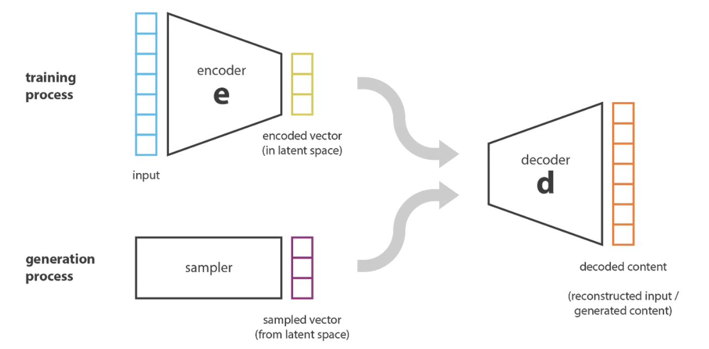

## 目录

- [1.说一下什么是AI视频，包括哪些关键技术?](#1.说一下什么是AI视频，包括哪些关键技术?)
- [2.请介绍下什么是视频生成，主要包括哪些方向？](#2.请介绍下什么是视频生成，主要包括哪些方向？)
- [3.请介绍下视频生成技术的演进路径？](#3.请介绍下视频生成技术的演进路径？)
- [4.请介绍下视频生成技术的应用场景？](#4.请介绍下视频生成技术的应用场景？)
- [5.什么DiT模型？](#5.什么DiT模型？)
- [6.简要解释下什么是扩散模型？](#6.简要解释下什么是扩散模型？)
- [7.简要介绍下GAN网络？并分析为什么视频生成模型很少采用GAN网络?](#7.简要介绍下GAN网络？并分析为什么视频生成模型很少采用GAN网络?)
- [8.请简要介绍下什么是VAE网络，及其在视频生成与分析中的应用？](#8.请简要介绍下什么是VAE网络，及其在视频生成与分析中的应用？)
- [9.生成对抗网络(GAN)和变分自动编码器(VAE)主要有哪些区别？](#9.生成对抗网络(GAN)和变分自动编码器(VAE)主要有哪些区别？)
- [10.生成对抗网络(GAN)和变分自动编码器(VAE)的训练过程有哪些挑战？](#10.生成对抗网络(GAN)和变分自动编码器(VAE)的训练过程有哪些挑战？)

<h2 id="1.说一下什么是AI视频，包括哪些关键技术?">1.说一下什么是AI视频，包括哪些关键技术?</h2>

AI视频是指利用人工智能技术对视频进行智能处理和分析，包括但不限于视频理解、视频生成、视频编辑、视频推荐等。
关键技术包括计算机视觉、自然语言处理、深度学习、强化学习等。

- 计算机视觉：用于视频理解，如物体识别、场景识别、行为识别等。
- 自然语言处理：用于视频生成，如文本到视频生成、语音识别等。
- 深度学习：用于视频推荐，如用户行为分析、内容推荐等。
- 强化学习：用于视频编辑，如自动剪辑、自动配乐等。

<h2 id="2.请介绍下什么是视频生成，主要包括哪些方向？">2.请介绍下什么是视频生成，主要包括哪些方向？</h2>

**视频生成**是指通过对人工智能的训练，使其能够根据给定的文本、图像、视频等单模态或多模态数据，自动生成符合描述的、高保真的视频内容。
**从生成方式进行划分**，当前AI视频生成可分为**文生视频、图生视频、视频生视频**。

**主要包含以下技术内容：**
- **文生视频、图生视频**：（Runway、Pika labs、SD + Deforum、Stable Video Diffusion、MagicAnimate、DemoFusion等）
- **视频生视频**：又分逐帧生成（SD + Mov2Mov）、关键帧+补帧（SD + Ebsynth、Rerender A Video）、
动态捕捉（Deep motion、Move AI、Wonder Dynamics）、视频修复（Topaz Video AI）
- **AIAvatar+语音生成**：Synthesia、HeyGen AI、D-ID
- **长视频生短视频**：Opus Clip
- **脚本生成+视频匹配**：Invideo AI
- **剧情生成**：Showrunner AI

<h2 id="3.请介绍下视频生成技术的演进路径？">3.请介绍下视频生成技术的演进路径？</h2>

图片生成和视频生成的底层技术框架较为相似，主要包括GAN、自回归模型、扩散模型、DiT四大路径，其中扩散模型（Diffusion model）和DiT为当前主流生成模型。

<h2 id="4.请介绍下视频生成技术的应用场景？">4.请介绍下视频生成技术的应用场景？</h2>

视频生成技术广泛应用于广告、影视、教育、娱乐、医疗、金融等领域，如：
- **广告营销**：利用视频生成技术制作吸引人的广告视频，提高广告效果。
- **影视创作**：利用视频生成技术自动生成剧本、剪辑、配乐等，提高创作效率。
- **教育**：利用视频生成技术制作生动、有趣的课程视频，提高学生的学习兴趣和效果。
- **娱乐**：利用视频生成技术制作

<h2 id="5.什么DiT模型？">5.什么DiT模型？</h2>

**DiT**是一种结合了**Transformer架构的扩散模型**，用于图像和视频生成任务，能够高效地捕获数据中的依赖关系并生成高质量的结果。
其本质是一种新型的扩散模型，结合了去噪扩散概率模型(DDPM)和Transformer架构。

**其核心思想是**：
使用Transformer作为扩散模型的骨干网络，而不是传统的卷积神经网络(如U-Net)，以处理图像的潜在表示。

<h2 id="6.简要解释下什么是扩散模型？">6.简要解释下什么是扩散模型？</h2>

**Diffusion Models**是一种新型的、先进的生成模型，用于生成与训练数据相似的数据，可以生成各种高分辨率图像。

**扩散模型的核心思想：**

**Diffusion Models**是一种受到非平衡热力学启发的生成模型，**其核心思想是**通过模拟扩散过程来逐步添加噪声到数据中，
并随后学习反转这个过程以从噪声中构建出所需的数据样本。

<h2 id="7.简要介绍下GAN网络？并分析为什么视频生成模型很少采用GAN网络?">7.简要介绍下GAN网络？并分析为什么视频生成模型很少采用GAN网络?</h2>

**GAN**（Generative Adversarial Networks）是一种生成模型，由Ian Goodfellow等人于2014年提出，由两个神经网络组成：生成器（Generator）和判别器（Discriminator）。
生成器负责生成与训练数据相似的数据，而判别器则负责判断生成器生成的数据是否真实。

**GAN网络的核心思想：**

**GAN网络的核心思想是**通过对抗训练来学习生成器，使其生成的数据越来越接近真实数据。
生成器和判别器之间进行对抗训练，生成器不断优化生成数据，而判别器则不断优化判断生成数据的能力。

    

**GAN的特点：**

相较于其他模型，GAN的模型参数量小，较轻便，所以更加擅长对单个或多个对象类进行建模。但由于其训练过程的不稳定性，针对复杂数据集则极具挑战性，
稳定性较差、生成图像缺乏多样性。这也导致其终被自回归模型和扩散模型所替代。

**GAN网络在视频生成中的应用：**

在扩散模型前，GAN网络在视频生成中的应用比较广泛，如视频生成、视频修复、视频超分辨率等。
但是，由于视频数据量较大，计算复杂度较高，GAN网络在视频生成中的应用相对较少。

<h2 id="8.请简要介绍下什么是VAE网络，及其在视频生成与分析中的应用？">8.请简要介绍下什么是VAE网络，及其在视频生成与分析中的应用？</h2>

**VAE**（Variational Autoencoders）是一种结合了深度学习和概率图模型思想的生成式模型，
最早由Diederik P. Kingma和Max Welling在2013年的论文《Auto-Encoding Variational Bayes》中提出。

**VAE网络的核心思想：**

**VAE网络的核心思想是**通过最大化潜在空间中的概率分布来学习生成模型，从而生成与训练数据相似的数据。

**VAE由编码器和解码器两部分组成**，编码器将输入数据映射到潜在空间，解码器将潜在空间中的数据映射回原始数据空间。
- 编码器：将输入数据映射到潜在空间中的概率分布，通常是高斯分布。
- 解码器：将潜在空间中的样本重构为原始数据。

**在训练过程中，VAE试图最大化数据的边际对数似然**，同时最小化潜在表示与先验分布之间的KL散度（Kullback-Leibler divergence），
这样可以确保学习到的潜在表示更加连续和有意义。
通过VAE学习到的潜在表示可以用于数据压缩、降维、生成新样本等任务。

**VAE技术在视频生成与分析中的应用包括：**

- **视频内容分析**‌：VAE技术可以对音视频数据进行深入的分析，以获得更丰富的信息。
- **数据压缩‌**：VAE技术可以有效地对音视频数据进行压缩，以获得更小的文件大小。
- **生成质量**‌：VAE技术可以生成高质量音视频内容，使得视频内容更加丰富、生动。

<h2 id="9.生成对抗网络(GAN)和变分自动编码器(VAE)主要有哪些区别？">9.生成对抗网络(GAN)和变分自动编码器(VAE)主要有哪些区别？</h2>

**GAN和VAE理论和实践上有一些区别：**
GAN通过竞争的方式实现数据生成和分类，而VAE通过概率模型的学习实现数据生成和表示。

<h2 id="10.生成对抗网络(GAN)和变分自动编码器(VAE)的训练过程有哪些挑战？">10.生成对抗网络(GAN)和变分自动编码器(VAE)的训练过程有哪些挑战？</h2>

GAN和VAE在训练过程面临挑战，如训练稳定性、模型解释性、数据生成质量等。未来的研究应该关注如何解决这些挑战，以便更好地应用这两种模型。
比如提高训练稳定性、提高模型解释性、提高数据生成质量、拓展到多模态和多任务学习等。这些研究方向和挑战将有助于更广泛地应用GAN和VAE。

