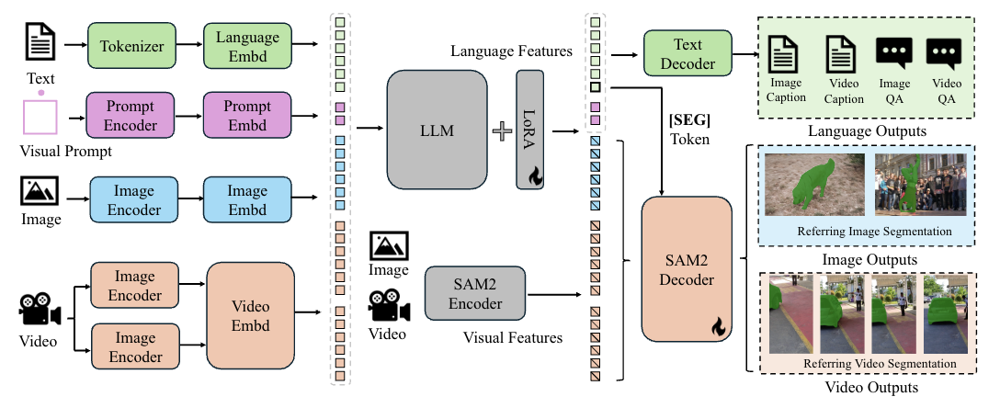

# 目录

- [1.VideoLLaMB的递归记忆桥接层是如何设计的？其主要优势是什么？](#1.VideoLLaMB的递归记忆桥接层是如何设计的？其主要优势是什么？)
- [2.VideoLLaMB的 SceneTilling 算法是如何工作的？它在视频分割和流式字幕生成中有何优势？](#2.VideoLLaMB的SceneTilling算法是如何工作的？它在视频分割和流式字幕生成中有何优势？)
- [3.VideoLLaMB在NIAVH基准上的表现如何？其独特之处体现在哪些方面？](#3.VideoLLaMB在NIAVH基准上的表现如何？其独特之处体现在哪些方面？)
- [4.VideoGPT+是如何利用分段采样策略来捕捉细粒度的时间动态的？](#4.VideoGPT+是如何利用分段采样策略来捕捉细粒度的时间动态的？)
- [5.VideoGPT+中的视觉适配器模块是如何促进图像和视频特征集成的？](#5.VideoGPT+中的视觉适配器模块是如何促进图像和视频特征集成的？)
- [6.与其他方法相比，VideoGPT+在方法架构上有哪些优势？](#6.与其他方法相比，VideoGPT+在方法架构上有哪些优势？)
- [7.Sa2VA模型是如何将SAM-2和LLaVA-like模型结合在一起的？这种结合方式有哪些优势？](#7.Sa2VA模型是如何将SAM-2和LLaVA-like模型结合在一起的？这种结合方式有哪些优势？)
- [8.Sa2VA如何处理多任务表示？](#8.Sa2VA如何处理多任务表示？)
- [9.为什么Sa2VA采用解耦设计?](#9.为什么Sa2VA采用解耦设计?)
- [10.Sa2VA有哪些潜在的应用场景？](#10.Sa2VA有哪些潜在的应用场景？)

<h2 id="1.VideoLLaMB的递归记忆桥接层是如何设计的？其主要优势是什么？">1.VideoLLaMB的递归记忆桥接层是如何设计的？其主要优势是什么？</h2>

**VideoLLaMB**是一种新颖的长视频理解框架，利用带有递归内存 token 的内存桥接层对 100% 的视频内容进行编码，而不会丢弃关键的视觉提示。

VideoLLaMB的递归记忆桥接层通过在桥接层内集成递归记忆令牌来增强线性层的记忆能力。具体设计如下：

- **记忆token**：在每个视频段前缀固定数量的记忆令牌，表示为[mi;si]，其中mi表示记忆令牌，si表示视频段。

- **自注意力操作**：对包含记忆令牌的视频段应用标准的自注意力操作，生成更新后的记忆令牌和视觉表示，公式如下：

- **递归处理**：这个过程递归进行，遍历语义视频段的同时更新记忆 token，最终生成视频序列的压缩视觉摘要。

**其主要优势包括：**

- **增强记忆能力**：通过递归记忆令牌，桥接层能够增强对视频内容的记忆能力。
- **信息压缩**：记忆令牌能够在保留当前视频场景的同时压缩过去视频的信息，提高计算效率。
- **缓解梯度消失**：通过记忆缓存和检索机制，能够有效缓解梯度消失问题，保留长期依赖信息。

<h2 id="2.VideoLLaMB的 SceneTilling 算法是如何工作的？它在视频分割和流式字幕生成中有何优势？">2.VideoLLaMB的 SceneTilling 算法是如何工作的？它在视频分割和流式字幕生成中有何优势？</h2>

SceneTilling算法通过以下步骤实现视频分割：

- 余弦相似度计算：计算相邻帧对之间的余弦相似度，生成相似度分数序列。
- 深度分数计算：根据相似度分数计算每个点的深度分数，公式为：

- **分割阈值设置**：根据深度分数的分位数设置分割阈值，选择超过阈值的深度分数对应的分割点，将视频分割成多个语义段。

**在流式字幕生成中，SceneTilling算法的优势包括：**

- **自动字幕结束点预测**：无需特殊训练令牌即可自动识别流式视频的字幕结束点。
- **场景变化检测**：能够有效检测视频中的场景变化，并生成相应的事件字幕。
- **无需额外训练**：利用视频的语义分割结果，无需额外的训练数据即可实现流式字幕生成。

<h2 id="3.VideoLLaMB在NIAVH基准上的表现如何？其独特之处体现在哪些方面？">3.VideoLLaMB在NIAVH基准上的表现如何？其独特之处体现在哪些方面？</h2>

**在NIAVH基准上，VideoLLaMB表现出色，主要得益于其独特的设计和多模态查询能力：**

- 多模态查询支持：NIAVH支持文本、图像和视频等多种模态的查询，能够全面评估模型在长视频中识别特定内容的能力。
- 高效的视频理解：VideoLLaMB 通过递归记忆桥接层和SceneTilling算法，能够在各种视频长度下准确检索到正确的图像针。
- 对比其他方法：与现有的自适应池化、位置外推结合采样等方法相比，VideoLLaMB在处理长视频时表现出更高的效率和更低的成本。

**其独特之处体现在：**

- **记忆缓存与检索**：通过记忆缓存和检索机制，VideoLLaMB 能够有效保留先前的状态记忆，缓解梯度消失问题。
- **语义分割**：SceneTilling 算法将视频分割成独立的语义单元，确保语义完整性和场景变化的准确性。
- **综合性能**：在长视频问答、自我中心规划和帧检索等多个任务上，VideoLLaMB 均表现出显著优于现有方法的性能。

<h2 id="4.VideoGPT+是如何利用分段采样策略来捕捉细粒度的时间动态的？">4.VideoGPT+是如何利用分段采样策略来捕捉细粒度的时间动态的？</h2>

- VideoGPT+采用了分段采样策略，将视频分割成多个小段，并对每段的帧进行编码。具体来说，输入视频被分成K个段，每个段包含T/K帧。
每个段被下采样到低分辨率n×h×w×c进行视频编码。
- 相比均匀采样，**分段采样**更好地与双编码器设计对齐，使视频编码器能够在每个段内高效捕捉丰富的temporal cues。
分段采样策略确保了模型能够在不增加计算复杂性的情况下，捕捉到视频中的细粒度时间动态。

<h2 id="5.VideoGPT+中的视觉适配器模块是如何促进图像和视频特征集成的？">5.VideoGPT+中的视觉适配器模块是如何促进图像和视频特征集成的？</h2>

- VideoGPT+引入了一个视觉适配器模块，用于促进图像和视频特征的集成。该模块首先对图像和视频编码器的输出嵌入进行投影，分别通过独立的视觉语言（V-L）投影层Wg和Wh，
将这些多维特征映射到语言空间。
- **投影层是可训练的，而视觉编码器保持冻结状态，** 从而保留了丰富的预训练表示。投影后的嵌入被重塑回网格形式，并经过一个2×2的自适应令牌池化操作，
该操作在局部和全局特征的空间维度上操作，减少了令牌长度，使得更大的视觉上下文能够适应相同的LLM上下文窗口。最终，池化的嵌入被连接起来，
形成一个包含详细空间表示和全面时间上下文的序列，输入到LLM中进行处理。

<h2 id="6.与其他方法相比，VideoGPT+在方法架构上有哪些优势？">6.与其他方法相比，VideoGPT+在方法架构上有哪些优势？</h2>

- **VideoGPT+在VCGBench-Diverse基准上的平均得分为2.47**，超过了所有之前的方法。具体来说，VideoGPT+在详细字幕、空间理解和视觉推理能力方面分别达到了不错的分数。
- 与其他方法相比，**VideoGPT+的优势**在于其双编码器设计，结合了图像编码器的空间细节和视频编码器的时间上下文；轻量级视觉适配器模块有效地将图像和视频特征映射到共同空间；
分段采样策略保留了细粒度的时间动态。这些设计使得VideoGPT+在处理多样化视频内容和复杂推理任务时表现出色。

<h2 id="7.Sa2VA模型是如何将SAM-2和LLaVA-like模型结合在一起的？这种结合方式有哪些优势？">7.Sa2VA模型是如何将SAM-2和LLaVA-like模型结合在一起的？这种结合方式有哪些优势？</h2>

**Sa2VA模型通过将SAM-2和LLaVA-like模型**结合在一起，创建了一个统一的、真实世界视频理解框架。具体来说，**Sa2VA模型包含两个主要部分**：**预训练的MLLMs和SAM-2**。
预训练的MLLMs负责处理**图像、视频和视觉提示，并将其转换为视觉令牌**，然后输入到LLM中进行文本预测。SAM-2则通过特殊的"[SEG]"令牌与MLLM连接，
"[SEG]"令牌的隐藏状态被用作新的空间-时间提示，输入到SAM-2的解码器中，生成分割掩码。

**这种结合方式的优势包括：**

**1. 任务统**：所有图像和视频理解任务（包括指代分割、图像/视频聊天和真实字幕生成）都被统一为一个一次性指令调优过程，简化了模型的设计和训练。

**2. 性能平衡**：通过联合训练，Sa2VA能够在不同任务之间平衡性能，确保强大的指代视觉理解能力而不牺牲MLLMs的语言能力。

**3. 灵活性**：Sa2VA的设计使其成为一个插件式的模块，可以方便地更新最新的MLLMs，利用其最新的知识和改进。

<h2 id="8.Sa2VA如何处理多任务表示？">8.Sa2VA如何处理多任务表示？</h2>

**Sa2VA**通过**统一的任务表示**方法来处理多种任务，包括**图像和视频的参考分割、聊天和基于地面的描述生成**。所有这些任务都被统一为一个单次指令调整过程。
具体来说，**输入的文本、图像和视频被编码为令牌**，并通过LLaVA进行处理，**生成相应的输出文本或掩码。**

<h2 id="9.为什么Sa2VA采用解耦设计?">9.为什么Sa2VA采用解耦设计?</h2>

**Sa2VA采用解耦设计**是为了简化模型结构并减少计算开销。通过不将SAM-2的输出令牌直接输入到LLaVA中，避免了额外的对齐过程。
这种设计使得模型更加模块化，便于更新和扩展。此外，解耦设计还使Sa2VA成为一个即插即用的模块，能够轻松集成最新的LLM模型。

<h2 id="10.Sa2VA有哪些潜在的应用场景？">10.Sa2VA有哪些潜在的应用场景？</h2>

**Sa2VA在多种应用场景中具有潜力**，包括：

- **视频编辑和生成**
- **机器人导航和视觉伺服控制**
- **监控分析和异常检测**
- **增强的虚拟现实和增强现实体验**

通过这些问题和答案，可以**全面了解Sa2VA的技术细节和应用潜力**。