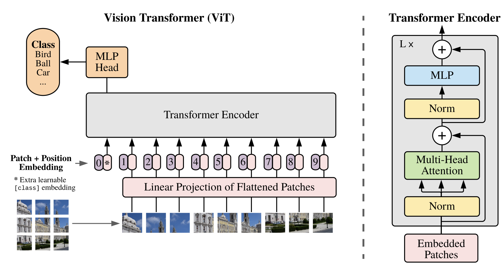

# 目录

- [1.请讲一讲ViT模型的原理及其优缺点？](#1.请讲一讲ViT模型的原理及其优缺点？)
- [2.请讲一讲CLIP模型的原理及其应用场景？](2.请讲一讲CLIP模型的原理及其应用场景？)
- [3.请介绍下什么是对比学习？](#3.请介绍下什么是对比学习？)
- [4.请介绍下对比学习有哪些常见的方法？](#4.请介绍下对比学习有哪些常见的方法？)
- [5.MLLM的模态接口有哪些主要类型？它们各自的工作原理是什么？](#5.MLLM的模态接口有哪些主要类型？它们各自的工作原理是什么？)
- [6.在MLLM的训练过程中，指令调优和对齐调优分别起到了什么作用？](#6.在MLLM的训练过程中，指令调优和对齐调优分别起到了什么作用？)
- [7.多模态大模型高效训练的技术有哪些？](#7.多模态大模型高效训练的技术有哪些？)
- [8.请讲一讲BLIP2模型的原理及其优势？](#8.请讲一讲BLIP2模型的原理及其优势？)
- [9.在BLIP2中的Q-Former作用是什么？](#9.在BLIP2中的Q-Former作用是什么？)
- [10.BLIP2中的Q-Former有什么缺点？](#10.BLIP2中的Q-Former有什么缺点？)
- [11.请介绍下什么是交叉注意力(Cross Attention),与自注意力机制有什么区别？](11.请介绍下什么是交叉注意力(Cross-Attention),与自注意力机制有什么区别？)
- [12.Transformer为何能够有效地处理长距离依赖问题?与传统RNN和LSTM相比有哪些优势?](#12.Transformer为何能够有效地处理长距离依赖问题?与传统RNN和LSTM相比有哪些优势?)

<h2 id="1.请讲一讲ViT模型的原理及其优缺点？">1.请讲一讲ViT模型的原理及其优缺点？</h2>

**ViT模型（Vision Transformer）** 是一种将Transformer架构应用于图像识别任务的模型，由Google团队在2020年提出.
ViT模型的提出是为了解决传统卷积神经网络（CNN）在处理图像时的局限性，通过将图像分割成若干个patch，
并将这些patch视为序列数据输入到Transformer中进行处理，从而**实现图像识别**。

**ViT模型的工作原理**

- **图像分割‌**：首先将输入的图像分割成若干个小的patch（类似于将图像切割成小块）。
- **线性嵌入**‌：每个patch通过一个线性层被转换为高维向量。
- **位置编码‌**：为了保持空间信息，给每个patch添加位置编码。 
- **Transformer编码**‌：将处理后的数据输入到Transformer编码器中进行特征提取和分类。

**ViT模型的优缺点**

**‌优点‌：**

- **简单且效果好**‌：ViT模型结构简单，效果显著，尤其是在大规模数据集上表现优异。
- **可扩展性强**‌：随着数据量的增加，ViT的性能会显著提升。

**‌缺点‌：**
- **计算量大**‌：相比于CNN，ViT的计算量更大，尤其是在小数据集上表现较差。
- **缺乏归纳偏差**‌：ViT缺乏CNN的归纳偏差，如平移不变性和局部感受野，这在一定程度上影响了其性能。

<h2 id="2.请讲一讲CLIP模型的原理及其应用场景？">2.请讲一讲CLIP模型的原理及其应用场景？</h2>

**CLIP模型**是一种多模态模型，能够通过**对比学习**同时理解图像和文本。‌ 该模型由两个子模块组成：**一个文本编码器和一个图像编码器**，
通过**对比学习将图像和文本的特征对齐**，从而在同一个向量空间中进行匹配。

CLIP的核心思想是将**图像和文本编码到同一个向量空间中**，这使得它能够进行**文本与图像的跨模态检索**。

**在预训练阶段**，CLIP通过对比图像和文本的向量表示，学习它们之间的匹配关系。模型接收一批图像-文本对作为输入，
尝试将匹配的图像和文本向量在共同的语义空间中拉近，而不匹配的向量则推远。这种学习方式使得CLIP能够捕捉到图像和文本之间的深层语义联系，
实现**跨模态理解**。

CLIP的应用场景非常广泛，包括**零样本学习、图像分类、文本-图像检索、文本到图像生成以及开放领域的检测分割**等任务。

<h2 id="3.请介绍下什么是对比学习？">3.请介绍下什么是对比学习？</h2>

**对比学习（Contrastive Learning）** 是一种基于样本之间相似性和差异性的无监督或自监督学习方法，旨在通过构建**正负样本对**来学习数据的有效表示。
对比学习广泛应用于**自然语言处理（NLP）、计算机视觉（CV）等领域，尤其在表征学习（Representation Learning）** 中表现出色。
通过对比正例和负例，模型能够学习到不同样本之间的相似性和差异性，从而生成更具区分性的特征表示。

**核心思想：**

通过样本之间的相似性和差异性来训练模型。它通过引入正例和负例，希望模型能够将正例样本对（即相似的样本对）的嵌入距离拉近，
同时将负例样本对（即不相似的样本对）的嵌入距离拉远，即**最小化类内距离，最大化类间距离**。

**对比学习的目标函数：**
对比学习的目标是**最小化类内距离，最大化类间距离**。其基本目标函数可以表示为：

$$
L = \sum_{(x_i, x_{j+}) \in P} \|f(x_i) - f(x_{j+})\|^2_2 - \sum_{(x_i, x_{j-}) \in N} \|f(x_i) - f(x_{j-})\|^2_2
$$

其中：

$x_i$ 是样本 $i$ ，$x_{j^+}$ 是与 $x_i$ 相似的正例样本，$x_{j^-}$ 是与 $x_i$ 不相似的负例样本。

$f(x)$ 是模型的嵌入函数，它将样本 $x$ 映射到一个低维向量空间。

$\mathcal{P}$ 和 $\mathcal{N}$ 分别是正例对和负例对的集合。

通过最小化这个目标函数，模型可以学习到在嵌入空间中相似的样本靠得更近，而不相似的样本被推得更远。

<h2 id="4.请介绍下对比学习有哪些常见的方法？">4.请介绍下对比学习有哪些常见的方法？</h2>

**SimCLR:** 一种用于自监督表征学习的对比学习方法，主要用于计算机视觉任务。SimCLR 通过数据增强生成正例对，并使用对比损失函数来最大化正样本对的相似度，
同时最小化负样本对的相似度。

**SimCLR 的主要步骤包括：**

- 数据增强：对同一张图片进行不同的数据增强（如翻转、裁剪、颜色变化），生成两张不同的视角，构成正例对。
- 特征提取：通过神经网络（如 ResNet）对两张增强后的图片进行编码，生成嵌入向量。
- 对比损失：通过对比损失函数（如 InfoNCE），最大化正例对的相似度，最小化负例对的相似度。

SimCLR 的损失函数（InfoNCE 损失）：

    

其中：
- $z_i$ 和 $z_{j^+}$ 是正例对的嵌入表示。

- $\text{sim}(z_i, z_j)$ 是嵌入向量之间的相似度，通常使用余弦相似度。

- $\tau$ 是一个温度超参数。

**MoCo（Momentum Contrast for Unsupervised Visual Representation Learning）** 是另一种用于自监督学习的对比学习方法。
MoCo 使用一个动态更新的队列来存储负例，从而提高对比学习在大规模数据集上的效率。

**MoCo 的核心思想**是使用一个动量编码器（momentum encoder）生成稳定的负例，并通过一个动态队列保存大量负例样本，确保训练过程中的负例样本丰富多样。

**Triplet Loss** 是一种经典的对比学习损失函数，通常用于人脸识别等任务。Triplet Loss 使用三个样本构建一个样本三元组(anchor,positive,negative)，其中：

- Anchor：参考样本。
- Positive：与 Anchor 类似的样本。
- Negative：与 Anchor 不相似的样本。

Triplet Loss 的目标是让 Anchor 和 Positive 的距离比 Anchor 和 Negative 的距离更近：

    

其中，$x_a$、$x_p$ 和 $x_n$ 分别是 Anchor、Positive 和 Negative 样本，$\alpha$ 是一个边界值。

<h2 id="5.MLLM的模态接口有哪些主要类型？它们各自的工作原理是什么？">5.MLLM的模态接口有哪些主要类型？它们各自的工作原理是什么？</h2>

**MLLM的模态接口主要有两种类型：投影式连接器和查询式连接器**。

- **投影式连接器**：这种连接器的核心思想是**将编码器输出的特征转换为标记（tokens）**，然后将这些标记与文本标记一起发送到LLM中。具体实现上，
通常会使用一组可学习的查询标记来提取信息，这种方式最初在BLIP-2中实现，并随后被多种工作继承和改进。
例如，Q-Former风格的连接器通过压缩视觉标记来减少表示向量的数量。
- **查询式连接器**：这种连接器**通过一个线性MLP将视觉标记投影到与词嵌入对齐的特征空间中**。例如，LLaVA系列使用一个或两个线性MLP来实现这一点。

此外，还有一种**融合式连接器**，它允许在LLM内部进行特征级融合。例如，Flamingo在LLM的冻结Transformer层之间插入**额外的交叉注意力层**，
从而**增强语言特征与外部视觉线索**的结合。

<h2 id="6.在MLLM的训练过程中，指令调优和对齐调优分别起到了什么作用？">6.在MLLM的训练过程中，指令调优和对齐调优分别起到了什么作用？</h2>

- **指令调优**：指令调优的主要目标是教授模型更好地理解用户指令并完成任务。具体来说，**指令样本通常包括一个可选的指令和一个输入-输出对**。
模型被训练以预测给定指令和输入的输出。通过指令调优，模型可以学习到如何根据用户的指示生成相应的响应，从而提高了模型的灵活性和泛化能力。

- **对齐调优**：对齐调优用于将模型与特定的人类偏好对齐。目前主要使用**强化学习（RLHF）和直接偏好优化（DPO）** 两种技术。RLHF通过人类反馈监督来优化模型，
使模型生成的响应更符合人类的期望。DPO则通过简单的二元分类损失来学习人类偏好，简化了整个流程。对齐调优的目的是确保模型生成的响应不仅在语义上正确，
而且在情感和主观感受上也与人类偏好一致。

<h2 id="7.多模态大模型高效训练的技术有哪些？">7.多模态大模型高效训练的技术有哪些？</h2>

**1. ‌并行训练技术‌：**

- **数据并行（Data Parallel）：** 这是最常见的并行方式，通过将输入数据按batch维度划分，每个GPU计算一部分数据，然后将梯度汇总求平均。
这种方法简单易行，但需要足够的显存来存储模型副本‌.
- **张量并行（Tensor Parallel）：** 当单个GPU无法容纳整个模型时，可以将模型张量拆分到多个GPU上。例如，对于线性变换Y=AX，可以将A按列或行拆分‌.
- **流水线并行（Pipeline Parallel）‌：** 将模型分成多个阶段，每个阶段由不同的GPU处理，适用于非常大的模型，但需要解决跨阶段通信和同步问题‌.

**2. 显存优化技术‌：**

- **梯度累积（Gradient Accumulation）‌：** 在显存不足时，将多个小批次的数据累积起来一起计算梯度，减少对显存的需求‌。
- **模型剪枝（Model Pruning）‌：** 通过移除不重要的参数来减少模型大小和计算需求，适用于已经训练好的模型‌。
- **量化（Quantization）‌：** 将模型的权重和激活值从高精度转换为低精度，减少存储和计算需求‌。

**3. 其他技术‌：**

- **分布式训练‌**：将训练任务分配到多个节点上，通过通信来同步梯度和更新模型，适用于大规模训练任务‌。
- **混合精度训练‌：** 结合使用高精度和低精度计算，平衡计算速度和精度，适用于需要高性能计算的场景‌。

<h2 id="8.请讲一讲BLIP2模型的原理及其优势？">8.请讲一讲BLIP2模型的原理及其优势？</h2>

BLIP-2模型是一种创新的视觉-语言预训练模型，通过结合**冻结的图像编码器和大语言模型**，降低了预训练成本，提高了视觉语言任务的性能‌‌。
BLIP-2采用两阶段预训练策略：第一阶段学习视觉语言表示，第二阶段进行视觉到语言的生成学习‌。

**模型结构：**

BLIP-2的核心是Q-Former，这是一个轻量级的变换器模块，用于从视觉特征中提取与语言相关的多模态嵌入。Q-Former由两个Transformer子模块组成，
分别用于图像特征提取和文本处理‌。图像特征提取使用ViT（Vision Transformer），而文本处理则通过一个既可以作为编码器也可以作为解码器的Transformer实现‌。

**BLIP-2的预训练任务包括以下三个目标：**

- 图文匹配（ITM）‌：这是一个分类任务，判断图像和文本描述是否匹配。通过在一个batch内寻找负样本，进行二分类‌。
- ‌图像-文本对比学习（ITC）‌：将图像表示和文本表示对齐，使它们的互信息达到最大‌。
- 语言建模‌：通过大型语言模型进行语言生成任务，如文本生成或问答任务‌。

**创新点和优势：**

BLIP-2的创新点在于其模块化设计，使得模型可以复用现有的强大视觉模型（如CLIP、ViT）和语言模型（如GPT、OPT），无需端到端联合训练，
从而大大降低了开发和训练成本‌。此外，BLIP-2通过冻结图像编码器和大型语言模型，仅训练投影层，进一步减少了计算成本‌。

<h2 id="9.在BLIP2中的Q-Former作用是什么？">9.在BLIP2中的Q-Former作用是什么？</h2>

BLIP2中的Q-Former的主要作用是融合视觉语义和LLM（大语言模型）的能力‌。

Q-Former是一个轻量级的transformer，它使用一个可学习的query向量集，从冻结的视觉模型提取视觉特征。

Q-Former的设计是为了解决视觉语义向量和LLM融合的挑战。

<h2 id="10.BLIP2中的Q-Former有什么缺点？">10.BLIP2中的Q-Former有什么缺点？</h2>

BLIP2的Q-Former结构的主要缺点包括**参数量庞大、收敛过程缓慢以及性能提升不显著‌**。具体来说：
- **参数量庞大‌**：Q-Former模型的参数量超过100百万，这使得模型在有限的数据量下难以实现有效训练‌。庞大的参数集使得模型训练过程更加复杂和耗时。
- **收敛过程缓慢**‌：Q-Former的训练具有一定的挑战性，因为它引入了大量的参数，这些参数在样本量有限的情况下难以有效收敛。即使在数据和计算资源都很充裕的情况下，Q-Former的性能提升也并不显著‌。
- **性能提升不显著‌**：即使在数据量充足的情况下，Q-Former的性能上限也未能显著超越LLaVA-1.5的性能表现。

<h2 id="11.请介绍下什么是交叉注意力(Cross Attention),与自注意力机制有什么区别？">11.请介绍下什么是交叉注意力(Cross Attention),与自注意力机制有什么区别？</h2>

在交叉注意力机制中，模型会使用一个输入序列（例如问题）作为查询（Query），然后根据另一个输入序列（例如文本段落）计算与其相关的注意力权重。
这种机制允许模型动态地关注不同的输入，决定哪些部分最重要。

交叉注意力的主要功能是**捕捉两个输入之间的依赖关系。** 例如，在问答系统中，交叉注意力机制可以让模型根据问题动态选择文本段落中最相关的部分，从而生成准确的答案。

交叉注意力机制基于查询（Query）、键（Key） 和 值（Value） 的计算，它的计算流程类似于自注意力机制，但有一个关键区别：
自注意力机制中的查询、键和值都来自**同一个输入序列**，而**交叉注意力机制的查询和键/值来自不同的输入序列**。

<h2 id="12.Transformer为何能够有效地处理长距离依赖问题?与传统RNN和LSTM相比有哪些优势?">12.Transformer为何能够有效地处理长距离依赖问题?与传统RNN和LSTM相比有哪些优势?</h2>

长距离依赖处理：Transformer 通过自注意力机制直接计算序列中任意两点间的依赖关系,避免了RNN和LSTM中的逐步传播，因此能有效捕捉长距离依赖。

优势：相比RNN和LSTM，Transformmer 具有并行化处理的优势,缩短了训练时间。同时它避免了梯度消失问题，提高了对长序列的建模能力。
