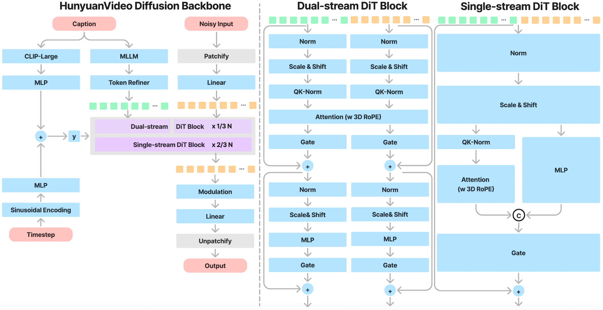
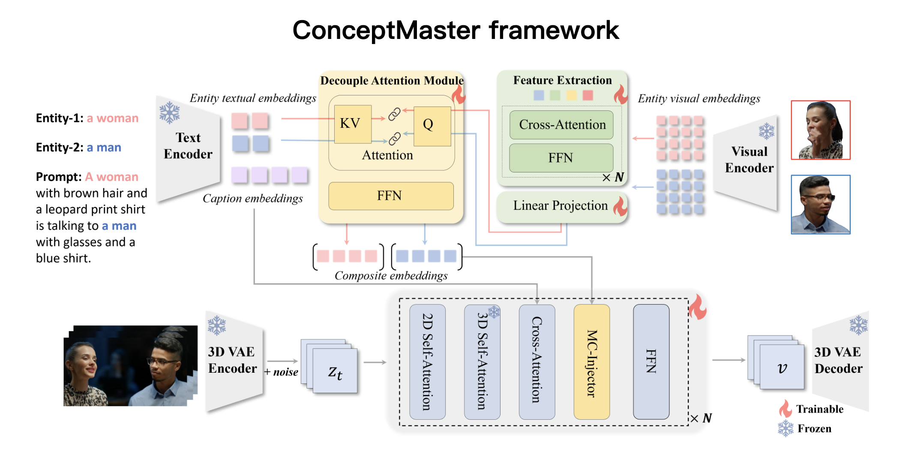
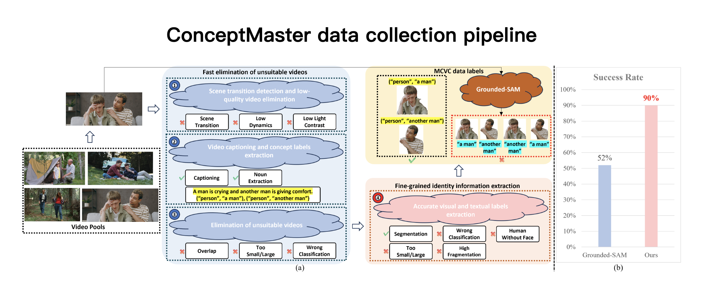
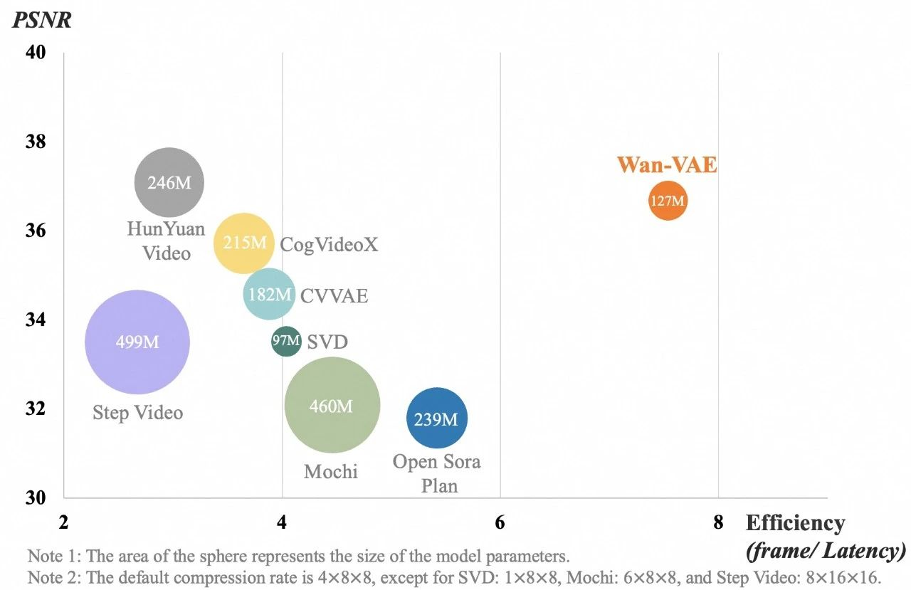
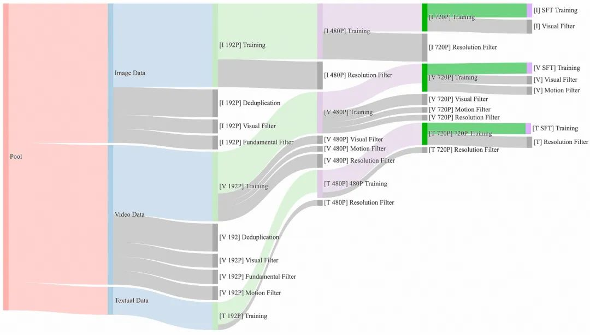
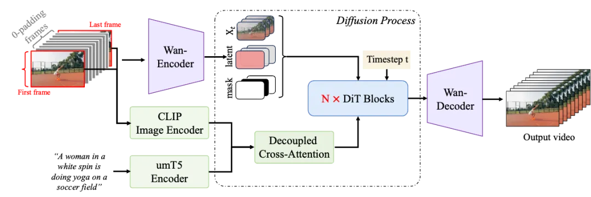
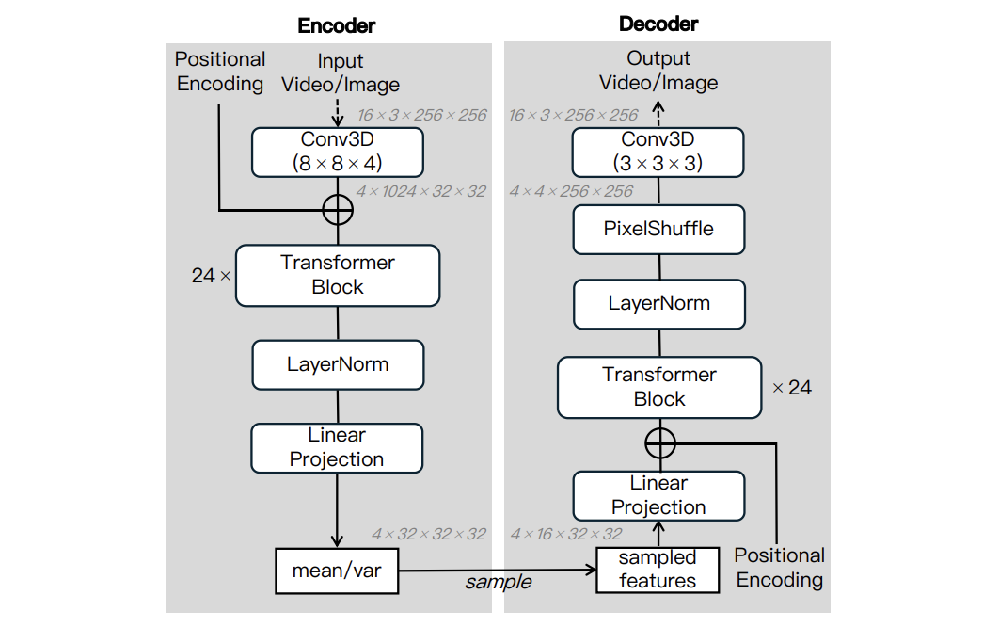

# 目录

- [1.目前主流的AI视频技术框架有哪几种？](#1.目前主流的AI视频技术框架有哪几种？)
- [2.目前主流的AI视频大模型有哪些？](#2.目前主流的AI视频大模型有哪些？)
- [3.Sora有哪些创新点？](#3.Sora有哪些创新点？)
- [4.SVD（Stable-Video-Diffusion）有哪些创新点？](#4.SVD（Stable-Video-Diffusion）有哪些创新点？)
- [5.AIGC时代的主流AI视频生成流程有哪些？](#5.AIGC时代的主流AI视频生成流程有哪些？)
- [6.Sora在训练时是如何处理输入数据的？](#6.Sora在训练时是如何处理输入数据的？)
- [7.Sora是如何对视频数据进行标注的？](#7.Sora是如何对视频数据进行标注的？)
- [8.为什么说Sora等AI视频大模型具备世界模拟器（world simulator）的潜质？](#8.为什么说Sora等AI视频大模型具备世界模拟器（world-simulator）的潜质？)
- [9.AI视频领域的数据工程是什么样的？](#9.AI视频领域的数据工程是什么样的？)
- [10.Sora模型的整体架构是什么样的？](#10.Sora模型的整体架构是什么样的？)
- [11.CogVideoX模型的整体架构是什么样的？](#11.CogVideoX模型的整体架构是什么样的？)
- [12.AI视频经典的工作流有哪些？](#12.AI视频经典的工作流有哪些？)
- [13.CogVideoX-5B和CogVideoX-2B有哪些异同？](#13.CogVideoX-5B和CogVideoX-2B有哪些异同？)
- [14.介绍一下CogVideoX系列模型的VAE结构](#14.介绍一下CogVideoX系列模型的VAE结构)
- [15.在CogVideoX系列模型中VAE是如何训练的？](#15.在CogVideoX系列模型中VAE是如何训练的？)
- [16.Sora等AI视频大模型的创新与优化经验有哪些？](#16.Sora等AI视频大模型的创新与优化经验有哪些？)
- [17.AI视频大模型的宏观关键指标有哪些？](#17.AI视频大模型的宏观关键指标有哪些？)
- [18.Sora的扩散模型部分架构是什么样的？](#18.Sora的扩散模型部分架构是什么样的？)
- [19.CogVideoX的扩散模型部分架构是什么样的？](#19.CogVideoX的扩散模型部分架构是什么样的？)
- [20.Sora的Text Encoder模型架构是什么样的？](#20.Sora的Text-Encoder模型架构是什么样的？)
- [21.AI视频大模型的生成质量指标有哪些？](#21.AI视频大模型的生成质量指标有哪些？)
- [22.Sora的最新功能有哪些？](#22.Sora的最新功能有哪些？)
- [23.Sora支持哪几种多模态输入？](#23.Sora支持哪几种多模态输入？)
- [24.介绍一下HunyuanVideo模型的架构](#24.介绍一下HunyuanVideo模型的架构)
- [25.HunyuanVideo模型有哪些特点？](#25.HunyuanVideo模型有哪些特点？)
- [26.可灵AI视频大模型的架构是什么样的？](#26.可灵AI视频大模型的架构是什么样的？)
- [27.可灵AI视频大模型是如何处理训练数据的？](#27.可灵AI视频大模型是如何处理训练数据的？)
- [28.SG-I2V方法如何在预训练的视频扩散模型中实现特征的对齐？](#28.SG-I2V方法如何在预训练的视频扩散模型中实现特征的对齐？)
- [29.在SG-I2V的潜在优化过程中，如何确保优化后的潜在变量不会偏离扩散过程的分布？](#29.在SG-I2V的潜在优化过程中，如何确保优化后的潜在变量不会偏离扩散过程的分布？)
- [30.SG-I2V在实验中如何验证其有效性，使用了哪些评估指标？](#30.SG-I2V在实验中如何验证其有效性，使用了哪些评估指标？)
- [31.介绍一下Wan2.1视频大模型的主要架构](#31.介绍一下Wan2.1视频大模型的主要架构)
- [32.介绍一下Wan2.1视频大模型的数据处理策略和训练/推理优化策略](#32.介绍一下Wan2.1视频大模型的数据处理策略和训练/推理优化策略)
- [33.介绍一下Hunyuan-Video的数据标注策略](#33.介绍一下Hunyuan-Video的数据标注策略)
- [34.Wan2.1视频大模型的Text Encoder模型架构是什么样的？](#34.Wan2.1视频大模型的Text-Encoder模型架构是什么样的？)
- [35.万相首尾帧模型（Wan2.1-FLF2V-14B）架构是什么样的？](#35.万相首尾帧模型（Wan2.1-FLF2V-14B）架构是什么样的？)
- [36.什么是MAGI-1模型，它的主要特点是什么？](#36.什么是MAGI-1模型，它的主要特点是什么？)
- [37.MAGI-1模型是如何进行视频生成的？](#37.MAGI-1模型是如何进行视频生成的？)
- [38.MAGI-1模型在推理过程中是如何实现高效生成的？](#38.MAGI-1模型在推理过程中是如何实现高效生成的？)
- [39.MAGI-1模型在处理长时间视频生成时面临哪些挑战，是如何解决的？](#39.MAGI-1模型在处理长时间视频生成时面临哪些挑战，是如何解决的？)
- [40.MAGI-1在处理视频生成任务时，如何利用Transformer架构来提高训练和推理效率？](#40.MAGI-1在处理视频生成任务时，如何利用Transformer架构来提高训练和推理效率？)
- [41.MAGI-1在推理过程中如何支持实时流式视频生成？](#41.MAGI-1在推理过程中如何支持实时流式视频生成？)
- [42.AnimateDiff视频模型能够支持哪些AI视频任务？](#42.AnimateDiff视频模型能够支持哪些AI视频任务？)
- [43.Wan2.1中的UmT5架构比经典的T5有哪些改进？](#43.Wan2.1中的UmT5架构比经典的T5有哪些改进？)


<h2 id="1.目前主流的AI视频技术框架有哪几种？">1.目前主流的AI视频技术框架有哪几种？</h2>

Rocky梳理总结了AIGC时代到目前为止主流的AI视频技术框架，市面上的所有AI视频产品基本上都是基于以下这些框架：
1. 文本生成视频：输入文本，先生成图片或者直接生成视频。主要流程包括工作流前处理+扩散模型+运动模块+条件控制+工作流后处理。
2. 图像生成视频：输入图像，先生成前后帧图像，然后使用插帧与语义扩展持续生成前后序列帧图像，最后生成完整视频。主要流程包括工作流前处理+扩散模型+运动模块+条件控制+工作流后处理。
3. 视频生成视频：输入视频，提取关键帧，对关键帧进行转绘，然后再进行插帧，从而生成新的视频。主要流程包括工作流前处理+扩散模型+运动模块+条件控制+工作流后处理。


<h2 id="2.目前主流的AI视频大模型有哪些？">2.目前主流的AI视频大模型有哪些？</h2>

Rocky为大家持续梳理总结AIGC时代到目前为止的主流AI视频大模型，大家可以学习借鉴，提炼其中的跨周期知识。具体模型如下所示：

1. Wan2.1
2. Step-Video-T2V
3. Hunyuan-Video
4. Stable Video Diffusion（SVD）系列
5. Sora
6. 可灵AI
7. LUMA
8. Gen系列
9. Stable Diffusion系列 + Animatediff系列


<h2 id="3.Sora有哪些创新点？">3.Sora有哪些创新点？</h2>

OpenAI对Sora的定位不只是视频生成工具，而是希望在此基础上开发出能够让计算机理解真实世界的算法与技术——“作为世界模拟器的视频生成模型”。在这个宏大愿景下最具潜力的技术基底之一便是生成式模型 (generative model)。

下面是Sora的一些创新点：
1. 海量的数据：在Sora的技术报告中，关于数据量级是一句话都没有提。这就说明，Sora使用了海量的高质量视频数据用作训练，Rocky相信未来全互联网的视频数据都会被Sora用作训练，同时在视频数据领域的数据生成、数据增强将会有非常大的机会。
2. 灵活编码：在Sora中，借鉴了大语言模型的构建方式，使用video compression network（convolutional VAEs）将视频数据tokenizer化，获得visual patches，使得任何长度和内容的视频都能编码成AI视频模型可以直接处理（输入/输出）的embeddings。首先video compression network将输入视频的时间和空间两个维度同时进行压缩，编码成一个和视频大小成正比的3D visual patch矩阵，然后再将其展开成1D array of patches Embeddings，送入到后续的DiT model中。这样可以带来两个好处，分别是让Sora能够生成不同分辨率的视频分和生成的视频的边框更加合理。
3. DiT模型架构：Sora使用了DiT（Diffusion Transformer）作为核心架构，这让Transformer在AI领域的大一统更进一步。
4. 精细化数据标注：和DALL-E 3一样，OpenAI用内部标注工具（可能是GPT4-4o等）给视频数据进行详尽的描述标注，从而提升Sora模型生成视频与输入prompt的一致性、生成视频的质量和视频中正确显示文本的能力。Rocky认为数据工程是非常关键的一点，无论是传统深度学习时代还是AIGC时代，都是AI领域的杀手锏。
5. 让AI视频领域的Scaling Law成立：保证模型越大，数据越多，效果就越好。Sora也不例外。一句话概括Sora的贡献，便是：在足量的数据，优质的标注，灵活的编码下，scaling law 在 transformer + diffusion model 的架构上继续成立。


<h2 id="4.SVD（Stable-Video-Diffusion）有哪些创新点？">4.SVD（Stable-Video-Diffusion）有哪些创新点？</h2>

Rocky认为SVD（Stable Video Diffusion）模型非常有价值，其开源精神让我们动容，下面是SVD模型的主要创新点：
1. 基于Stable Diffusion 2.1模型架构
2. 海量数据集：StabilityAI使用了一个包含5.8亿个视频剪辑的巨大数据集，来训练SVD模型。为了筛选高质量数据，首先需要检测每个视频中的不同镜头和转场，并且评估每个镜头中的运动信息，然后为每个镜头自动生成描述文字和每个镜头的美学效果等。
3. 数据精细化处理：（1）级联切换检测：采用级联的切换检测方法识别视频中的场景转场。（2）运动信息提取:基于稠密光流估计每个视频片段的运动信息。（3）文本描述生成:为每个视频片段自动生成三种形式的文字描述。（4）质量评估:使用CLIP等方法评估每个片段的视觉质量、文本匹配度等。（5）过滤去噪:根据上述评估指标过滤掉质量较差的视频片段。经过层层筛选，最后保留了一个约1.5亿视频片段的超高质量数据集，为后续的SVD模型训练奠定重要基础。
4. 多阶段训练：SVD模型在模型训练方面也与传统方法不同，其采用了一个三层训练架构。第一阶段是进行图像预训练，初始化一个图像生成模型。第二阶段是在已经构建的大规模视频数据集上进行视频预训练，学习运动表征。第三阶段是在一个小规模的高质量视频数据集上进行微调。这种分阶段的训练策略可以让模型更好地生成高保真视频。


<h2 id="5.AIGC时代的主流AI视频生成流程有哪些？">5.AIGC时代的主流AI视频生成流程有哪些？</h2>

Rocky总结了如下图所示的AIGC时代主流AI视频生成流程，可以作为大家构建AI视频产品构架的基础底座：


<h2 id="6.Sora在训练时是如何处理输入数据的？">6.Sora在训练时是如何处理输入数据的？</h2>

**Sora在处理输入数据的过程中引入了大语言模型标配的Tokenizer思想。**

在文本对话领域，Tokenizer可使任何长度和内容的文本编码成大语言模型可以直接处理（输入/输出）的Text Embeddings特征。在AI视频领域则是将视频数据进行编码获得**visual patches**，下图展示了Sore将输入视频转换成visual patches的过程：


**其中先使用一个Visual Encoder模型将视频数据（空间和时间维度）压缩编码到Latent特征空间，获得一个3D visual patch array，接着将整个Latent特征分解成spacetime patches，最后再排列组合成为一个visual patches向量。**

为了能有一个高质量的视频数据压缩编码效果，OpenAI针对性训练了一个Video compression network作为Visual Encoder模型。同时也训练了一个Visual Decoder模型用于Sora的解码来获取生成的视频结果。

Sora通过对输入数据的压缩编码，**为AI视频的生成带来了很多帮助：**

1. **训练的数据分辨率获得了解放：** Sora能够训练任意的分辨率、时间长度和长宽比的视频/图像数据。
2. **灵活的生成分辨率：** Sora可以生成1920x1080像素（横屏）到1080x1920像素（竖屏）之间任意分辨率的视频。
3. **生成视频的边缘更加符合真实常理：** Sora尝试过固定分辨率进行训练，这种情况下就需要裁剪视频数据。这样数据的裁剪bias会被带入到模型中，导致Sora模型生成很多主要内容缺失的视频。


<h2 id="7.Sora是如何对视频数据进行标注的？">7.Sora是如何对视频数据进行标注的？</h2>

和AI绘画领域的DALL-E 3一样，**OpenAI使用内部的数据标注模型（大概率是GPT4-v等）给视频数据进行了详细的描述（Caption）**，从而提升了Sora模型生成的视频与输入Prompt的一致性，同时生成视频的质量与视频中文本的渲染能力也有一定的提升。

Rocky认为视频数据的精细化标注非常关键，是AI视频模型生成效果的关键一招，**因为视频生成的动态性非常高，是一个非常大的数据分布**。

与此同时，虽然在训练中使用详细的描述（Caption）作为数据标签能够增强AI视频模型的文本一致性能力，但是在用户使用时可能会出现bias，因为用户输入的描述一般都相对较短。**这里Sora和DALL-E 3一样，也使用GPT-4来对用户的输入描述进行扩充完善来解决这个问题，同时提高了用户的使用体验和视频生成的多样性**。


<h2 id="8.为什么说Sora等AI视频大模型具备世界模拟器（world-simulator）的潜质？">8.为什么说Sora等AI视频大模型具备世界模拟器（world simulator）的潜质？</h2>

Sora能够根据文本提示词生成逼真或富有创意的场景视频，展现出强大的模拟物理世界的潜力。

**OpenAI一直以来有一个宏大愿景：开发出能够让计算机理解我们物理世界的AI算法技术，目前最有可能的技术之一就是AIGC模型。**

也正因此，Sora的技术报告中对Sora的定位正是“作为世界模拟器的视频生成模型”。

当前世界的物理信息与数字信息都呈爆发式增长，如此庞大的信息量，**包括图像、视频、文本、语音、3D等多种模态**，**我们需要为AIGC时代之后即将到来的元宇宙初级阶段与AGI初级阶段构建一个AI模型基底**，来理解上述的多模态信息，能够有逻辑的分析表达这些信息。

因此Rocky也认为，AIGC模型是朝向这个目标迈进的最有希望的技术之一。正如理查德·费曼的一句名言：

> 我所无法创造的，我也不能理解。

**这句话的潜台词就是要真正理解一个事物，我们就需要去创造它。**

这正与AIGC时代的核心思想耦合，我们要训练一个AIGC模型，我们首先要构建海量的数据集库，然后配置充足算力去训练AIGC模型去创造生成无穷无尽的内容。

Sora等AI视频大模型是能够理解和模拟现实世界的模型基础，是AI技术向前迈进的重要一步，2024年也将成为AIGC时代早期的一个重要时间节点。

总的来说，**Rocky认同OpenAI乃至AI行业的这个愿景与观点，未来的元宇宙时代和AGI时代，以AI视频大模型为基座的多模态AI会给我们创造出无穷无尽的价值**。


<h2 id="9.AI视频领域的数据工程是什么样的？">9.AI视频领域的数据工程是什么样的？</h2>

**不管是传统深度学习时代，还是现在的AIGC时代，数据质量都是决定AI模型性能上限的关键一招**，在AI视频领域也不例外。

**所以在AI视频数据的处理优化上，不管投入多少都是有价值的，因为这是AI模型这个黑盒系统中反馈最为显著的优化方式。**

接下来，Rocky以经典的AI视频数据处理工作流为例，向大家详细介绍我们该如何制作出高质量的AI视频数据。


AI视频大模型的训练数据必须是经过筛选的高质量视频数据集，才能让AI视频达模型深刻学习真实世界内容。

首先，我们需要识别和排除低质量视频，如过度编辑、运动不连贯、质量低下、讲座式、文本主导和屏幕噪声等视频。我们可以通过基于video-llama训练的视频过滤器来筛选视频数据。同时基于光流计算和美学分数等指标，动态调整阈值来确保视频数据集的质量。

接着，我们需要对视频数据进行标注，由于视频数据通常没有对应的文本描述，同时现有的视频字幕较短，无法全面描述视频的内容。所以需要从生成图像字幕到生成视频字幕的完整工作流，并微调端到端的视频字幕模型以获得更详细的字幕标签。

整体的标注工作流程如下：
1. 将视频数据输入Panda-70M模型（Caption Model）先生成简短的字幕标注（Short Caption）。
2. 再将视频数据逐帧（Video Frames）和简短的字幕标注一起输入到CogView3模型（Recaption Model）中，生成密集详细的每一帧图像字幕标签。
3. 然后使用GPT-4模型对这些图像字幕标签进行总结，生成最终的视频数据标签。与此同时，基于GPT-4的总结标签微调训练Llama 2模型，来为GPT-4分担压力，加速视频数据集完整字幕标签的生成。


<h2 id="10.Sora模型的整体架构是什么样的？">10.Sora模型的整体架构是什么样的？</h2>

虽然Sora模型暂未开源，**但是Rocky相信2024年之后的主流AI视频大模型的架构都将在Sora模型架构的基础上进行扩展创新，是AI视频领域从业者必须要熟悉的“核心基础架构”** 。


**Sora模型是AI视频领域第一个基于DiT架构（diffusion transformer）的大模型，具有灵活的采样维度**，如上图所示。Sora主要包括三个部分：

1. **3D VAE模型**：3D VAE Encoder能在时间和空间维度上将输入的原始视频映射到Latent空间中。同时3D VAE Decoder能将扩散模型生成的视频Latent特征进行重建，获得像素级视频内容。
2. **基于DiT的扩散模型架构**：使用类似于ViT（视觉转换器）的处理方式将视频的Latent特征进行Patch化，并进行扩散过程输出去噪后的视频Latent特征。
3. **一个类似CLIP模型架构的条件接收机制**：接收经过大型语言模型（LLM）增强的用户输入Prompt和视觉信息的Prompt，用以引导扩散模型生成具有特定风格或者主题的视频内容。


<h2 id="11.CogVideoX模型的整体架构是什么样的？">11.CogVideoX模型的整体架构是什么样的？</h2>

**CogVideoX是基于DiT架构的AI视频大模型**，可以说DiT架构已经经过考验，成为AI视频领域的核心基底模型。


CogVideoX主要包括三个部分：

1. **3D Causal VAE模型**：3D Causal VAE Encoder能在时间和空间维度上将输入的原始视频映射到Latent空间中。同时3D Causal VAE Decoder能将扩散模型生成的视频Latent特征进行重建，获得像素级视频内容。
2. **DiT Expert模型**：将视频信息的Latent特征和文本信息的Embeddings特征进行Concat后，再Patch化，并进行扩散过程输出去噪后的视频Latent特征。
3. **Text Encoder模型**：Text Encoder模型将输入的文本Prompt编码成Text Embeddings，作为条件注入DiT Expert模型中。CogVideoX中选用T5-XXL作为Text Encoder，Text Encoder具备较强的文本信息提取能力。

目前CogVideoX-2B的输入Prompt提示词上限为226个tokens，可以生成的视频长度为6秒，帧率为8帧/秒，生成视频分辨率为720*480。


<h2 id="12.AI视频经典的工作流有哪些？">12.AI视频经典的工作流有哪些？</h2>

本问答Rocky将根据AI视频领域的发展阶段持续更新，将最有价值的AI视频工作流分享给大家：

1. 文生视频：可以使用Sora、可灵、CogVideoX + LoRA + ControlNet组成的工作流。
2. 图生视频：可以使用SVD + LoRA + ControlNet组成的工作流。
3. 视频编辑（视频生视频）：AnimateDiff + LoRA + ControlNet组成的工作流。


<h2 id="13.CogVideoX-5B和CogVideoX-2B有哪些异同？">13.CogVideoX-5B和CogVideoX-2B有哪些异同？</h2>

CogVideoX-5B模型是CogVideoX-2B模型的升级版本，CogVideoX-2B模型的特点是入门级模型，兼顾兼容性。运行、二次开发成本低。CogVideoX-5B模型的特点是视频生成质量更高，视觉效果更好，同时模型参数量也更大。

下面汇总了CogVideoX-5B模型和CogVideoX-2B模型的异同，供大家参考：


<h2 id="14.介绍一下CogVideoX系列模型的VAE结构">14.介绍一下CogVideoX系列模型的VAE结构</h2>

和Sora类似，CogVideoX模型在输入端也是设计了一个3D Causal VAE结构对输入视频数据进行Latent编码。

**视频数据比起图像数据，本质上是增加了时间信息，所以其数据量级和计算量级也远超图像数据，处理难度也更高**。3D VAE架构主要通过3D卷积同时压缩视频的空间和时间维度，从而实现了对视频数据更高的压缩编码效率和更好的重建质量与连续性。
下图展示了3D VAE的结构示意图，主要包括一个Encoder（编码器）、一个Decoder（解码器）以及一个Latent Space Regularizer（潜在空间正则器）：

1. **编码器**：用于将输入视频数据转换为Latent Feature。这一过程中，编码器会通过四个下采样阶段逐步减少视频数据的空间和时间分辨率。
2. **解码器**：将视频数据的Latent Feature转换成原始的像素级视频。解码器也包含四个对称的上采样阶段，用于恢复视频数据的空间和时间分辨率。
3. **潜在空间正则化器**：通过KL散度来约束高斯Latent空间，对编码器生成的Latent Feature进行正则化。这对于AI视频大模型的生成效果和稳定性至关重要。


值得注意的是，编码器的前两个下采样阶段和解码器的最后两个上采样阶段涉及空间和时间维度，而最后一个阶段仅应用于空间采样。**所以3D VAE在时间维度上实现了4倍的压缩，而在空间维度上实现了8×8倍的压缩。总的来说，实现了视频数据从像素级到Latent Feature的4×8×8压缩比率，整体压缩效率还是非常高的**。

同时在3D VAE中采用了时间因果卷积，这是一种特殊的卷积网络，该卷积将所有填充放置在时间卷积的开头，如上图(b)中所示。这确保了未来帧的信息不会影响现在或过去的预测。这对于时间序列数据的处理非常重要，因为它保留了因果关系，使得模型的预测不会违反时间顺序。

由于处理视频数据的所有帧会消耗大量的GPU显存，**CogVideoX为了适应大规模视频的处理，在时间维度上应用了上下文并行（context parallel）的策略进行3D卷积操作**，将时间维度上的计算分配到多个GPU设备上进行并行计算，如上图中(b)所示。每个GPU设备只需要处理一部分时间段的数据，并将必要的信息传递给下一个GPU设备，这减少了GPU设备间的通信开销，并有效地分配了计算资源。由于卷积的因果性。

下图是**Rocky梳理的CogVideoX 3D VAE的完整结构图**，大家可以感受一下其魅力，看着这个完整结构图学习CogVideoX 3D VAE模型部分，相信大家脑海中的思路也会更加清晰：


<h2 id="15.在CogVideoX系列模型中VAE是如何训练的？">15.在CogVideoX系列模型中VAE是如何训练的？</h2>

为了节省计算资源并提高模型的泛化能力，CogVideoX系列模型在3D VAE的训练过程中设计了两阶段的训练策略：

第一阶段：在低分辨率和较少帧的视频数据（短视频）上训练3D VAE模型，这样既能让模型学习到基础的视频编码和解码能力，同时也节省了计算资源。经过第一阶段的训练后，3D VAE模型在较大分辨率的编码上有较好的泛化能力，但是在扩展要编码的帧数时则不那么顺畅。

第二阶段：在长视频上进行进一步微调训练。使用上下文并行的方法，在长视频上继续训练3D VAE模型，使其能够处理更多的视频帧数，同时保持高效的显存使用。

3D VAE模型的两个阶段训练都使用了三种损失函数的加权组合，分别是：

1. L2损失：衡量重建图像与原始图像之间的像素级差异。
2. LPIPS感知损失：用于衡量重建图像与原始图像之间的感知差异，即从视觉感知的角度来评估重建质量。
3. GAN损失：通过3D鉴别器，使用对抗训练策略，进一步提升重建图像的真实性。


<h2 id="16.Sora等AI视频大模型的创新与优化经验有哪些？">16.Sora等AI视频大模型的创新与优化经验有哪些？</h2>

关于AI视频大模型的一些创新与优化经验，Rocky为大家持续总结：

1. 使用先验帧：通过为AI视频大模型提供多个先验帧，OpenAI解决了如何确保主题即使暂时离开视野也保持不变这个具有挑战性的问题。
2. Scaling Law在AI视频领域的有效性：大数据+DiT模型架构+大算力，让Scaling Law在AI视频领域生效。Rocky相信未来工业界和学术界会在不断scale up数据规模和模型规模的同时，探究更具突破式创新的新型模型架构、更高效地压缩视频信息、更充分地融合文本、图像、视频等多模态内容。
3. 采样方法的改进：AI绘画领域的Stable Diffusion系列模型已经从DDPM采样方法优化到Rectified Flow采样方法，AI视频领域的技术发展在采样方式上也有很大的创新空间，这也是非常重要的论文点！
4. 单阶段模型和多阶段模型的选择：不管是在传统深度学习时代，还是AIGC时代，单阶段End-to-End模型和多阶段级联模型架构的选型一直都是行业的论文点与工程优化选项。
5. AI视频大模型Backbone、3D VAE、Text Encoder的改进：就像传统深度学习时代的YOLO系列一样，AI视频大模型的每个模块都有很大的升级优化空间，也都是含金量十足的论文点！
6. AI视频大模型的轻量化与端侧部署：AI绘画领域的模型轻量化、快速出图、小型化工作已经有较多的开展，未来AI视频大模型的轻量化与端侧部署也是非常重要的一个方向。


<h2 id="17.AI视频大模型的宏观关键指标有哪些？">17.AI视频大模型的宏观关键指标有哪些？</h2>

伴随着AI视频领域的持续发展和开源社区的持续繁荣，Rocky相信下面的AI视频宏观关键指标都有广阔的提升空间：

1. 生成视频的时长
2. AI视频大模型的推理耗时
3. AI视频大模型的计算资源占用情况
4. 生成视频的帧率
5. 生成视频的分辨率
6. 生成视频的内容质量与逻辑性


<h2 id="18.Sora的扩散模型部分架构是什么样的？">18.Sora的扩散模型部分架构是什么样的？</h2>

**Sora采用Transformer+Diffusion作为核心架构**，让其具有好的扩展性能，可以从一个随机噪声开始经过逐步去噪生成视频。

与ViT一样，在使用Transformer架构后，可以将视频数据和图像数据表示为一个patch的集合，每个patch类似于 GPT中的token。**通过统一的数据表示方式**，可以在比以前更广泛的视觉数据上训练Transformer+Diffusion模型，涵盖不同的持续时间、分辨率和宽高比。

**这样一来，Transformer在自然语言处理、图像生成、视频生成、语音合成以及科学计算等领域都实现了大一统。**

同时将Transformer与Diffusion的结合能够让生成的视频内容更加惊喜，同时有更多生成可控的空间（比如SDEdit等操作）。

Sora的扩散模型架构大概率参考了 Scalable Diffusion Models with Transformers，这是Sora技术分析中引用的文章，同时Sora透露出的细节和这篇文章也比较吻合。

**Sora也验证了scaling law在AI视频领域的有效性，也给全球AI视频领域的从业者一个启发与经验，在不断扩大数据量级和模型规模的基础上，进而探索创新的AI视频模型架构，是AI视频领域持续发展的正确道路。**


<h2 id="19.CogVideoX的扩散模型部分架构是什么样的？">19.CogVideoX的扩散模型部分架构是什么样的？</h2>

在CogVideoX的3D VAE将视频数据的每一帧编码为一个形状为 $T\times H\times W\times C$ 的视频潜在向量（Latent Vector）后（ $T$ 代表帧数， $H$ 和 $W$ 代表每帧图像的高度和宽度， $C$ 代表通道数），再将这些视频潜在向量在空间维度上进行补丁化（patching）处理，生成长度为 $T\times frac{H}{p}\times frac{W}{p}$ 的序列 $z_{vision}$ 。

值得注意，**CogVideoX并未在时间维度上进行补丁化处理，这样做的目的是实现图像和视频的联合训练**。

同时，CogVideoX的Text Encoder部分将输入的文本Prompt编码层文本嵌入 $z_{text}$ ，然后将 $z_{text}$ 和 $z_{vision}$ 进行Concat拼接，来更好地对齐视觉信息和语义信息。**但是这两种信息模态的特征空间可能差异很大，它们的Embeddings可能具有不同的数值尺度**。

为了在同一序列中更好地处理它们，CogVideoX设计了Expert Adaptive Layernorm来分别处理每个模态。如下图所示，我们使用扩散过程中的时间步长 $t$ 作为调制模块的输入。然后，视觉专家自适应层归一化（Vision Expert AdaLN）和文本专家自适应层归一化（Text Expert AdaLN）分别将这种调制机制应用于视觉隐藏状态和文本隐藏状态。**这种策略促进了两种模态之间特征空间的对齐，同时尽量减少了额外的参数**。


同时在CogVideoX中还引入了旋转位置嵌入（Rotary Position Embedding, RoPE），这是一种相对位置编码技术，已被证明在LLMs中能够有效捕捉词元间关系，尤其擅长处理长序列数据。为了适应视频数据，CogVideoX将RoPE技术扩展为3D-RoPE。视频张量中的每个潜在向量都可以由三维坐标 $x,y,t$ 表示。因此分别将1D-RoPE应用于这些坐标的每个维度，分别占据隐藏状态通道的3/8、3/8和2/8。最终，这些编码沿着通道维度Concat起来，以获得最终的3D-RoPE编码。

在之前的AI视频模型中，通常采用分离的空间注意力机制和时间注意力机制，这样虽然能减少计算复杂性。但是这种注意力分离的方法需要视觉信息的隐式传递，这显著增加了学习的复杂性与难度，并且AI视频模型很难学到大幅度运动物体的一致性。如下图所示，第i帧中的人物的头部无法直接关注到第i+1帧中的人物头部。


为了解决这个问题，CogVideoX设计了一种3D文本-视频混合注意力机制（3D Full Attention）。3D Full Attention充分利用了长上下文训练和FlashAttention技术的优势，实现了高效且精确的多模态数据处理。

下图是**Rocky梳理的CogVideoX 3D Expert Transformer的完整结构图**，大家可以感受一下其魅力，看着这个完整结构图学习CogVideoX 3D Expert Transformer部分，相信大家脑海中的思路也会更加清晰：


<h2 id="20.Sora的Text-Encoder模型架构是什么样的？">20.Sora的Text Encoder模型架构是什么样的？</h2>

从Sora开源的技术报告中我们可以看到，Sora支持文本Promot和图像Prompt的输入，直观地来说，Sora可能配备了类似于CLIP的Text Encoder和Image Encoder来提取文本和图像两个模态的信息，并进行多模态信息特征的对齐。


<h2 id="21.AI视频大模型的生成质量指标有哪些？">21.AI视频大模型的生成质量指标有哪些？</h2>

在AI视频大模型的生成质量评价指标中，我们可以使用自动化指标评估和人工评估两种方式。

在自动化评估指标方面，为了评估文本到视频生成的质量，我们可以使用VBench中的多个指标，如人类动作、场景、动态程度、外观风格等。同时还可以使用两个额外的视频评估工具：Devil 中的 Dynamic Quality （动态质量）和 Chrono-Magic 中的 GPT4o-MT Score，这些工具专注于视频的动态特性。动态质量是通过将各种质量指标与动态评分相结合来定义的，这种方法减少了视频动态性与视频质量之间的负相关性所带来的偏差，从而更全面地评估视频质量。

同时我们还可以设置人工评估，比如CogVideoX论文中设计了一百个精心编写的Prompt，这些Prompt的特点是分布广泛、表述清晰、概念范围明确。用这些提示词生成视频，并让评估小组为视频进行打分，每个子项评分范围为0到1，整体总分则在0到5之间，得分越高表示视频质量越好。同时任何分数扣减的原因也被仔细记录。主要从下面四个角度进行人工打分：

1. 感官质量（Sensory Quality）：主要关注生成的视频的感知质量，包括主体一致性、帧的连续性和稳定性。
2. 指令遵循（Instruction Following）：主要关注生成的视频是否与输入Prompt对齐，包括主体的准确性、数量、元素和细节的正确性。
3. 物理模拟（Physics Simulation）：主要关注生成的视频是否能够遵循物理世界的客观法则，例如光照效果、不同物体之间的交互以及流体动力学的逼真度。
4. 封面质量（Cover Quality）：主要关注从单帧图像中可以评估的指标，包括美学质量、清晰度和逼真度。


<h2 id="22.Sora的最新功能有哪些？">22.Sora的最新功能有哪些？</h2>

1. 可以生成 1080p 分辨率、最长 20 秒、宽屏、竖屏或方形的视频。
2. 使用 Remix 替换、删除或重新构想视频中的元素。
3. 通过 Re-cut 找到并隔离最佳帧，然后向任一方向延伸它们以完成场景。
4. 通过 Storyboard 在时间线上组织和编辑视频的独特序列。
5. 使用 Loop 剪辑并创建无缝重复的视频。
6. 通过 Blend 将两个视频合并为一个无缝剪辑。
7. 通过Style presets 创建独特的风格。


<h2 id="23.Sora支持哪几种多模态输入？">23.Sora支持哪几种多模态输入？</h2>

1. 文本到视频（Text-to-Video）模式：这是Sora的核心功能之一，它允许用户仅通过输入文本描述就能生成完整的视频内容。依托于先进的自然语言处理技术和生成模型，Sora能够准确把握文字的精髓，将其转化为生动的视觉画面。无论是制作简短的短视频还是构建情节丰富的叙事视频，这一模式都能帮助创作者轻松实现他们的创意构想。
2. 文本+图像到视频（Text+Image-to-Video）模式：在这一模式下，用户不仅可以提供文本描述，还能上传图像来辅助视频的生成过程。通过结合文本和图像，Sora能够更精确地理解并展现创作者的创意意图，制作出更符合视觉预期的视频内容。这一功能特别适合需要在视频中融入特定图像元素的场景，如广告制作、产品展示等，为创作者提供了更多的创意空间。
3. 文本+视频到视频（Text+Video-to-Video）模式：Sora还提供了视频编辑和转换的功能，用户可以上传已有的视频素材，并结合文本描述进行修改或扩展。这一模式让用户能够在现有视频的基础上，添加新的情节、细节，甚至创作出全新的版本或完全不同的内容。例如，用户可以对现有的广告视频进行重新编辑，加入新的对话、场景或动画效果，从而提升视频的吸引力和表现力。


<h2 id="24.介绍一下HunyuanVideo模型的架构">24.介绍一下HunyuanVideo模型的架构</h2>

HunyuanVideo是一个基于Latent空间的AI视频扩散模型。它设计了一个3D VAE架构，用于在训练中压缩时间维度和空间维度的特征。同时通过一个大语言模型来对文本Prompts进行编码，作为额外条件输入模型中，来引导模型通过对高斯噪声的多步去噪，输出一个AI视频的Latent空间表示。最后，在HunyuanVideo推理时通过3D VAE解码器将Latent空间表示解码为AI视频。

下面是HunyuanVideo模型架构的示意图：


<h2 id="25.HunyuanVideo模型有哪些特点？">25.HunyuanVideo模型有哪些特点？</h2>

### 单-双流TransFormer架构

HunyuanVideo模型采用了Transformer架构，设计了一个“双流到单流”的混合模型用于视频生成。在双流阶段，视频特征和文本token通过并行的Transformer Block独立处理，使得每个模态可以学习适合自己的调制机制而不会相互干扰。在单流阶段，再将视频特征和文本token连接起来并将它们输入到后续的Transformer Block中进行有效的多模态信息融合。**这种设计和FLUX.1这个AI绘画大模型有异曲同工之妙，捕捉了视觉和语义信息之间的复杂交互，增强了整体模型性能**。

下面是HunyuanVideo模型的单-双流TransFormer架构示意图：



### 使用MLLM文本编码器

之前的AI视频大模型通常使用预训练的CLIP和T5-XXL作为文本编码器。而HunyuanVideo则是使用了一个预训练的Multimodal Large Language Model (MLLM)作为文本编码器，其具有以下优势：

1. 与T5-XXL相比，MLLM模型基于图文数据指令微调后在特征空间中具有更好的图像-文本对齐能力，这就减轻了扩散模型中的图文特征对齐的难度。
2. 与CLIP相比，MLLM模型在图像的细节描述和复杂推理方面表现出更强的能力。
3. MLLM模型可以通过遵循系统指令实现零样本生成，从而帮助文本特征更多地关注关键信息。
4. 由于MLL模型是基于Causal Attention机制的，而T5-XXL使用了Bidirectional Attention机制为扩散模型提供更好的文本引导。因此，HunyuanVideo引入了一个额外的token优化器来增强文本特征的引导。

下面是HunyuanVideo模型中MLLM文本编码器的示意图：


### 设计了3D VAE

HunyuanVideo的VAE部分采用了CausalConv3D作为AI视频的编码器和解码器，用于压缩视频的时间维度和空间维度，其中时间维度压缩 4 倍，空间维度压缩 8 倍，压缩为 16 channels。这样可以显著减少后续 Transformer 模型的 token 数量，使我们能够在原始分辨率和帧率下训练AI视频大模型。

下面是HunyuanVideo的3D VAE部分的示意图：


### 对输入Prompt进行改写

为了解决用户输入文本提示的多样性和不一致性的困难，官方微调了Hunyuan-Large model模型作为HunyuanVideo的prompt改写模型，将用户输入的提示词改写为更适合HunyuanVideo模型偏好的写法。

Hunyuan-Large model模型提供了两个改写模式：正常模式和导演模式。正常模式旨在增强视频生成模型对用户意图的理解，从而更准确地解释提供的指令。导演模式增强了诸如构图、光照和摄像机移动等方面的描述，倾向于生成视觉质量更高的视频。注意，这种增强有时可能会导致一些语义细节的丢失。


<h2 id="26.可灵AI视频大模型的架构是什么样的？">26.可灵AI视频大模型的架构是什么样的？</h2>

我们从快手可灵团队发布的多主体视频生成技术方案ConceptMaster中可以窥探可灵AI视频大模型的架构：
1. 包含一个3D VAE架构，用于将视频转到Latent空间。
2. 扩散模型使用了DiT Diffusion架构，这里的transformer不是采用SD 3中的MM-DiT，而是每个transformer的block包括2D spatial self-attention，3D spatial-temporal self-attention，text cross-attention，以及feed-forward network (FFN)。
3. 包含文本编码器T5-XXL来提取文本特征。
4. 采样方法使用Flow Matching方法。

可灵AI视频大模型的架构的详细图解如下：



<h2 id="27.可灵AI视频大模型是如何处理训练数据的？">27.可灵AI视频大模型是如何处理训练数据的？</h2>

**ConceptMaster设计了详细的数据收集Pipeline** ，能够高效地收集和处理多概念视频数据：

1. **快速排除不合适的视频**：
   - 在数据收集的初期阶段，系统会快速排除不符合要求的视频，比如说低画质的数据。这一步是为了提高数据处理的效率，避免在后续步骤中浪费资源处理低质量或不相关的视频。

2. **访问视频和文本标签**：
   - 提取视频数据对应的文本标签。文本标签提供了视频内容的语义信息，帮助系统更好地理解和处理视频中的实体。
  
3. **再次删除不合适的视频**：
   - 提取视频数据对应的文本标签。文本标签提供了视频内容的语义信息，帮助系统更好地理解和处理视频中的实体。

5. **分割（Segmentation）**：
   - 再次删除不符合要求的数据，比如重复的数据、太长/太短的数据、分类错误的数据等。

6. **提取精细化内容与标签**：
   - 使用自研分割模型提取精确的实体图像和相应的标签，而简单地采用之前的方法（如Grounded-SAM）会引入大量错误，并且很难通过后续处理消除这些错误。

下面是可灵AI视频大模型处理视频数据的示意图：




<h2 id="28.SG-I2V方法如何在预训练的视频扩散模型中实现特征的对齐？">28.SG-I2V方法如何在预训练的视频扩散模型中实现特征的对齐？</h2>

**SG-I2V**通过对**自注意力层进行修改来实现特征的对齐**。具体来说，原始的SVD模型在每个帧上独立应用空间自注意力，这导致跨帧的特征对应关系较弱。
为了解决这个问题，**SG-I2V**将每个帧的自注意力层的键和值替换为第一帧的键和值，**从而使得所有帧的特征在语义上对齐**。
这种修改后的自注意力层能够更好地**捕捉跨帧的语义信息**，使得优化过程能够更有效地控制视频元素的轨迹。


<h2 id="29.在SG-I2V的潜在优化过程中，如何确保优化后的潜在变量不会偏离扩散过程的分布？">29.在SG-I2V的潜在优化过程中，如何确保优化后的潜在变量不会偏离扩散过程的分布？</h2>

为了确保优化后的**潜在变量不会偏离扩散过程**的分布，**SG-I2V**采用了一种基于频率的后处理方法。
具体来说，使用快速傅里叶变换（FFT）和逆快速傅里叶变换（IFFT）来分离原始潜在变量zt∗的**低频和高频分量**。 然后，**保留低频分量，
并将高频分量替换为原始潜在变量的对应分量。**
这种方法有效地保留了**原始潜在的低频信号**，同时消除了可能引入的不必要的高频干扰，从而保持了生成视频的视觉质量。


<h2 id="30.SG-I2V在实验中如何验证其有效性，使用了哪些评估指标？">30.SG-I2V在实验中如何验证其有效性，使用了哪些评估指标？</h2>

**SG-I2V**在**VIPSeg数据集**的验证集上进行了评估。实验中使用了多种评估指标来验证其有效性，包括**Frechet Inception Distance（FID）、
Frechet Video Distance（FVD）和ObjMC**。**FID和FVD**用于衡量生成视频的视觉质量，而**ObjMC用于衡量运动保真度**。

具体来说，**FID和FVD越低，表示生成视频的质量越高**；**ObjMC越低，表示生成视频的运动越接近目标轨迹**。

实验结果表明，**SG-I2V**在视觉质量和运动保真度上都优于所有零样本基线方法，并且在某些指标上甚至与监督基线方法竞争。


<h2 id="31.介绍一下Wan2.1视频大模型的主要架构">31.介绍一下Wan2.1视频大模型的主要架构</h2>

Wan2.1视频大模型基于主流的DiT和线性噪声轨迹Flow Matching范式，包括3D因果VAE、可扩展的预训练策略、大规模数据链路构建以及自动化评估指标，这些创新共同提升了模型的最终性能表现。

### 3D因果VAE架构

Wan2.1基于3D因果VAE模块，实现了256倍无损视频隐空间压缩。为了能够高效支持任意长度视频的编码与解码，3D VAE的因果卷积模块中还引入了特征缓存机制。该机制通过分块处理视频并缓存每块尾帧特征，避免了直接对长视频进行端到端的编解码，从而实现无限长1080P视频的高效编解码。


此外，Wan2.1通过将空间降采样压缩提前，在不损失性能的情况下进一步减少了29%的推理时显存占用。这是借鉴了SDXL中U-Net架构优化的策略。

实验结果表明，Wan2.1的3D因果VAE在视频质量和处理效率上均表现出色。在相同硬件环境（单个A800 GPU）下，Wan2.1的3D因果VAE重建速度比现有最先进方法快2.5倍，且在较小模型参数下实现业内领先的压缩重构质量。得益于小尺寸设计和特征缓存机制，高分辨率下的性能优势更为显著。



### 视频Diffusion Transformer架构

Wan2.1基于主流的视频DiT结构，通过Full Attention机制有效建模长时程时空依赖，生成时空一致的高质量视频。在噪声采样策略上，采用Flow Matching方法，不仅确保模型快速收敛，还提升了训练效率。

模型首先利用多语言umT5编码器对输入文本进行语义编码，并通过逐层交叉注意力层将文本特征注入每个Transformer Block，实现细粒度语义对齐。此外，通过共享参数的MLP模块将时间步特征映射为可学习参数，显著降低了计算量和参数规模。

在训练策略上，主要采用6阶段分步训练法：从256P图像数据的初始预训练，逐步引入低分辨率、高时长视频数据，再到480P、720P的高分辨率数据训练，最后通过Post-training阶段使用高质量标注数据进行微调，进一步提升生成效果。

这种渐进式训练策略让模型在不同分辨率和复杂场景下都能表现出色。


<h2 id="32.介绍一下Wan2.1视频大模型的数据处理策略和训练/推理优化策略">32.介绍一下Wan2.1视频大模型的数据处理策略和训练/推理优化策略</h2>

### Wan2.1数据处理策略

Wan2.1视频大模型的训练依赖于大规模、高质量的数据集，因此在预训练阶段，需要从庞大但嘈杂的初始数据集中选取高质量且多样化的数据，以促进有效的训练。

如下图所示，Wan2.1设计了一个四步数据清洗流程，重点关注基础维度、视觉质量和运动质量。对应的整个预训练过程也分为四个阶段，每个阶段逐渐增加分辨率和视频时长，让模型在一定算力限制下得到更充分的训练。最终的SFT阶段，我们进行了更严格的数据过滤，保障模型稳定收敛到高质量视频输出。



### Wan2.1训练和推理优化策略

在训练阶段，对于文本、视频编码模块，Wan2.1使用DP和FSDP组合的分布式策略；DiT模块，采用DP、FSDP、RingAttention、Ulysses混合的并行策略。

基于Wan2.1模型参数量较小和长序列带来的计算量较大的特征，结合集群计算性能和通信带宽，采用FSDP切分模型，并在FSDP外嵌套DP提升多机拓展性，FSDP和DP的通信均能够完全被计算掩盖。为了切分长序列训练下的activation，DiT部分使用了Context Parallelism（CP）对sequence维度进行切分，并使用外层RingAttention、内层Ulysses的2DCP的方案减少CP通信开销。

此外，为了提升端到端整体效率，Wan2.1在文本、视频编码和DiT模块间进行高效策略切换，避免计算冗余。具体来说，文本、视频编码模块每个device读不同数据，在进入DiT之前，通过循环广播不同device上的数据来保证CP组里的数据一样。


在显存优化方面，Wan2.1采用分层的显存优化策略，选择一些层进行offload，其他层根据不同算子计算量和显存占用的分析使用细粒度Gradient Checkpointing（GC）进一步优化activation显存。

同时也利用PyTorch显存管理机制，解决显存碎片问题。训练稳定性方面借助于阿里云训练集群的智能化调度、慢机检测以及自愈能力，在训练过程中自动识别故障节点并快速重启任务，平均重启时间为39秒，重启成功率超过98.23％。

在推理阶段，为了使用多卡减少生成单个视频的延迟，Wan2.1需要选择CP来进行分布式加速。此外，当模型较大时，还需要进行模型切分。

模型切分策略：单卡显存不足时必须考虑模型切分。鉴于序列长度通常较长，与张量并行（TP）相比，FSDP的通信开销更小，并且可以被计算掩盖。因此，Wan2.1选择FSDP方法进行模型切分（注意：这里仅做切分权重，而不做数据并行）。序列并行策略：采用与训练阶段相同的2D CP方法，外层（跨机器） 使用RingAttention，内层（机器内）使用Ulysses。在Wan2.1 140亿参数模型上，使用FSDP和2D CP的组合方法，在多卡上具有如下图所示的近线性加速。


为了减少DiT实际计算量，Wan2.1使用了效果无损的step间cache和CFG cache的方法，仅对若干关键去噪步骤进行实际计算并缓存结果，其他步骤则复用这些缓存，最终性能提升约61％。在推理过程中，Wan2.1也使用了量化方法，在部分层（qkvo projection和FFN）使用fp8gemm，同时实现了FlashAttention3 INT8和FP8混合算子进行attention部分的8bit 量化，在保证效果无损的情况下，端到端性能提升30%以上。


<h2 id="33.介绍一下Hunyuan-Video的数据标注策略">33.介绍一下Hunyuan-Video的数据标注策略</h2>

在AI视频领域，数据标签的精确性和全面性在提高AI视频生成模型的提示遵循能力和输出质量方面起着至关重要的作用。以前的工作主要集中在提供简短的字幕或密集字幕。然而，这些方法因信息不完整、冗余话语和不准确而受到批评。

为了实现更高全面性、信息密度和准确性的字幕，Hunyuan-Video开发并应用了了一个内部的视觉语言模型（VLM），旨在为图像和视频生成结构化字幕。这些结构化字幕采用JSON格式，提供多维度的描述信息，从各个角度包括：

1. 简短描述：捕捉场景的主要内容。
2. 密集描述：详细描述场景内容，特别包括场景转换和摄像机运动，这些内容与视觉内容相结合，例如摄像机跟随某个主体。
3. 背景：描述主体所处的环境。
4. 风格：描述视频的风格，例如纪录片、电影、现实主义或科幻。
5. 镜头类型：识别突出或强调特定视觉内容的视频镜头类型，例如航拍镜头、特写镜头、中镜头或长镜头。
6. 照明：描述视频的照明条件。
7. 氛围：传达视频的氛围，例如舒适、紧张或神秘。

同时Hunyuan-Video还训练了一个摄像机运动分类器，能够预测14种不同的摄像机运动类型，包括放大、缩小、向上摇摄、向下摇摄、左摇摄、右摇摄、向上倾斜、向下倾斜、向左倾斜、向右倾斜、向左旋转、向右旋转、静态镜头和手持镜头。


<h2 id="34.Wan2.1视频大模型的Text-Encoder模型架构是什么样的？">34.Wan2.1视频大模型的Text Encoder模型架构是什么样的？</h2>

Wan2.1的Text Encoder架构使用了umT5来编码输入文本。通过大量实验，Wan2.1官方发现 umT5 在Wan2.1的框架中具有多个优势：
1. 它拥有强大的多语言编码能力，能够有效理解中文和英文，以及输入的视觉文本。
2. 在相同条件下，Wan2.1发现 umT5 在组合性能上优于其他单向注意力机制的 LLM。
3. 它展现出卓越的收敛性，umT5 在相同参数规模下能够更快收敛。

基于这些发现，Wan2.1最终选择 umT5 作为文本编码器。


<h2 id="35.万相首尾帧模型（Wan2.1-FLF2V-14B）架构是什么样的？">35.万相首尾帧模型（Wan2.1-FLF2V-14B）架构是什么样的？</h2>

万相首尾帧大模型是一个百亿参数规模（14B）的首尾帧生视频大模型，其核心架构设计旨在实现高可控性、高质量的视频生成。

### **1. 核心架构：Diffusion in Time（DiT）** 
- **基础框架**：基于扩散模型（Diffusion Model）与Transformer的融合架构，专为AI视频生成设计。DiT通过**Full Attention机制**捕捉视频的**长时程时空依赖关系**，确保生成视频在时间（帧间连贯性）和空间（画面细节一致性）上的高度统一。

### **2. 视频压缩VAE（变分自编码器）** 
- **功能**：将输入视频压缩至低维潜在空间，减少计算复杂度。支持720p高清视频的无损压缩，压缩比达256倍。
- **创新设计**：
  - **因果性约束**：在编码和解码过程中引入时间维度的因果性约束，防止信息泄漏，确保首尾帧与中间帧的逻辑连贯性。

### **3. 条件控制机制** 
- **首尾帧输入处理**：用户提供的首帧和尾帧图像与若干零填充中间帧拼接，形成**控制视频序列**。该序列与噪声及掩码（Mask）拼接后，作为DiT的输入。
- **指令遵循**：通过文本提示词（如“镜头移动”“特效变化”）控制生成内容，模型结合CLIP语义特征与交叉注意力机制动态调整生成细节。

### **4. 交叉注意力机制（Cross-Attention）** 
- **功能**：将首尾帧的语义特征（通过CLIP编码器提取）注入DiT生成过程，强化条件控制。
- **实现方式**：
  - 首尾帧的CLIP特征与扩散模型的潜在特征进行注意力交互。




<h2 id="36.什么是MAGI-1模型，它的主要特点是什么？">36.什么是MAGI-1模型，它的主要特点是什么？</h2>

MAGI-1是一个大规模的自回归视频生成模型，通过自回归地预测固定长度的视频块序列来生成视频。其主要特点包括：

- **自回归生成**：视频块按顺序生成，确保因果时间建模和实时流式生成。
- **高时间一致性**：通过逐步增加的噪声水平训练，确保视频的时间一致性。
- **可扩展性**：支持长达400万token的上下文长度，适用于大规模视频生成任务。
- **实时流式生成**：由于自回归设计和固定峰值推理成本，支持实时流式视频生成。


<h2 id="37.MAGI-1模型是如何进行视频生成的？">37.MAGI-1模型是如何进行视频生成的？</h2>

MAGI-1模型通过以下步骤处理视频生成：

- **视频分块**：将视频分割成固定长度的块，每个块包含多个连续帧。
- **自回归生成**：按顺序生成每个块，当前块的生成依赖于之前生成的所有块。
- **去噪过程**：在每个块的去噪过程中，逐步减少噪声，直到生成清晰的视频块。
- **并行处理**：利用多GPU并行处理多个块，提高生成效率。


<h2 id="38.MAGI-1模型在推理过程中是如何实现高效生成的？">38.MAGI-1模型在推理过程中是如何实现高效生成的？</h2>

MAGI-1模型在推理过程中通过以下方式实现高效生成：

- **KV Cache**：利用KV缓存机制，避免重复计算，提高生成效率。
- **动态调整引导强度**：在生成过程中动态调整引导强度，减少时间伪影，提高视频质量。
- **多阶段训练和数据调整**：通过多阶段训练和动态调整数据分布，确保模型在不同阶段的性能优化。


<h2 id="39.MAGI-1模型在处理长时间视频生成时面临哪些挑战，是如何解决的？">39.MAGI-1模型在处理长时间视频生成时面临哪些挑战，是如何解决的？</h2>

MAGI-1模型在处理长时间视频生成时面临以下挑战：

- **计算资源需求高**：长时间视频生成需要大量的计算资源。
- **时间一致性维护**：确保长时间视频的时间一致性是一个挑战。

**解决方案：**

- **分块生成**：将视频分割成固定长度的块，按顺序生成，减少单次计算的复杂度。
- **KV Cache**：利用KV缓存机制，避免重复计算，提高生成效率。
- **动态调整引导强度**：在生成过程中动态调整引导强度，减少时间伪影，提高视频质量。


<h2 id="40.MAGI-1在处理视频生成任务时，如何利用Transformer架构来提高训练和推理效率？">40.MAGI-1在处理视频生成任务时，如何利用Transformer架构来提高训练和推理效率？</h2>

MAGI-1采用了**基于Transformer的变体自编码器（VAE）来**提高训练和推理效率。

具体来说，MAGI-1的VAE架构包括一个编码器和一个解码器，编码器将输入视频分割成固定长度的块，并对其进行去噪处理，解码器则将这些块重构为原始视频。

Transformer架构的优势在于其高效的自我关注和并行计算能力，这使得MAGI-1能够在保持高训练效率的同时，处理大规模的视频数据。

此外，MAGI-1还进行了多项优化，如块因果注意力、并行注意力块、QK-Norm和GQA、三明治归一化和SwiGLU等，进一步提升了模型的性能和稳定性。




<h2 id="41.MAGI-1在推理过程中如何支持实时流式视频生成？">41.MAGI-1在推理过程中如何支持实时流式视频生成？</h2>

MAGI-1通过自回归方式生成视频块，每个块包含多个连续帧。每个块的去噪过程是逐步进行的，前一个块去噪到一定程度后，才开始下一个块的生成。

这种方法利用了并行性，减少了后续块获取清洁块的延迟，支持实时流式视频生成。

具体实现上，MAGI-1采用了分布式打包和填充（PnP）策略，在线批量处理视频数据，减少GPU气泡，提高整体训练效率。

此外，MAGI-1还使用了多模型异构服务管道，将T5和MAGI-1部署在高性能GPU上，同时将VAE解码器部署在成本较低的硬件上，从而实现高效的并行推理。

通过这些优化措施，MAGI-1能够在保证高质量生成的同时，实现低延迟的实时流式视频生成。


<h2 id="42.AnimateDiff视频模型能够支持哪些AI视频任务？">42.AnimateDiff视频模型能够支持哪些AI视频任务？</h2>

1. 在文生视频任务中，可以与Stable Diffusion（以及其他文生图大模型）+ LoRA + ControlNet等AI绘画工作流完美结合，产生丰富的玩法。
2. 在图生视频任务中，可以与IPadapter等一致性模型一起使用，通过输入一张图像来生成动图，之前火爆全网的《一个男人/女人的一生》视频的底层技术逻辑就是来源于此。
3. 在视频生视频任务中，AnimateDiff依旧可以与Stable Diffusion（以及其他文生图大模型）+ LoRA + ControlNet等AI绘画工作流配合，将原视频进行逐帧转绘和编辑，从而生成不同风格或者不同内容的新视频。


<h2 id="43.Wan2.1中的UmT5架构比经典的T5有哪些改进？">43.Wan2.1中的UmT5架构比经典的T5有哪些改进？</h2>

### **一、UmT5 与 经典T5 的主要改进点**
| **改进维度**       | **UmT5**                          | **T5**                          |
|--------------------|-----------------------------------------------|---------------------------------------------|
| **激活函数**       | 支持 GEGLU（门控线性单元 + Gaussian Error）   | 仅使用 ReLU                                 |
| **位置编码**       | 动态相对位置编码，支持 RoPE 扩展              | 固定相对位置编码（T5 原始实现）             |
| **多语言支持**     | 原生适配多语言混合数据（如 mT5 扩展）         | 主要针对单语言（如英语）优化                |
| **参数效率**       | 编码器-解码器共享嵌入，Softmax 层独立         | 完全共享嵌入矩阵                            |
| **训练目标**       | 统一文本到文本框架，强调多任务迁移学习        | 侧重单任务微调                              |
| **长序列优化**     | 通过动态分桶和缓存管理支持更长序列            | 原始 T5 对长序列支持较弱                    |

### **二、关键代码级改进**
1. **GEGLU 激活函数**  
   ```python
   # UmT5 实现
   hidden_gelu = self.act(self.wi_0(hidden_states))  # GELU 门控
   hidden_linear = self.wi_1(hidden_states)
   hidden_states = hidden_gelu * hidden_linear  # 门控融合
   ```
   - 相比 T5 的简单 ReLU，GEGLU 通过门控机制增强非线性表达能力。

2. **动态位置编码**  
   ```python
   # UmT5 中的分桶逻辑
   relative_position_bucket = self._relative_position_bucket(relative_position)
   values = self.relative_attention_bias(relative_position_bucket)
   ```
   - 引入更灵活的分桶策略，适应不同距离的相对位置关系。

3. **多语言适配**  
   - 词汇表扩展至 250,000+ token，支持 SentencePiece 多语言分词。
   - 嵌入层独立初始化策略优化（`_init_weights` 方法）。

4. **显存优化**  
   - 通过 `UmT5LayerNorm`（RMS Norm 变体）减少半精度训练时的数值不稳定：
     ```python
     variance = hidden_states.pow(2).mean(-1, keepdim=True)
     hidden_states = hidden_states * torch.rsqrt(variance + eps)
     ```

### **三、适用场景对比**
| **任务类型**       | **UmT5 优势**                     | **T5 局限性**                   |
|--------------------|-----------------------------------------------|---------------------------------------------|
| 多语言文本分类     | 支持混合语言输入，GEGLU 提升跨语言特征提取    | 需额外微调适配多语言                        |
| 长文档编码         | 动态位置编码和分桶策略支持 8k+ tokens         | 长序列性能下降明显                          |
| 低资源迁移学习     | 预训练任务统一，微调时参数效率更高            | 需任务特定调整                              |
| 实时推理           | 纯编码器架构延迟更低                          | 完整 Seq2Seq 结构计算开销大                 |


**技术本质的升级**：从“通用 Seq2Seq 编码器”到“高效、多语言友好的文本表示引擎”。
