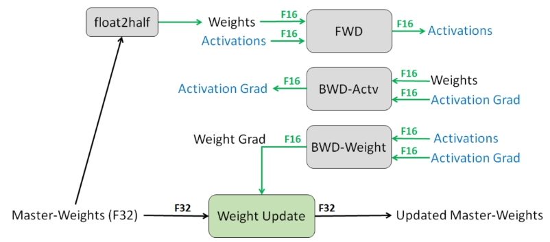
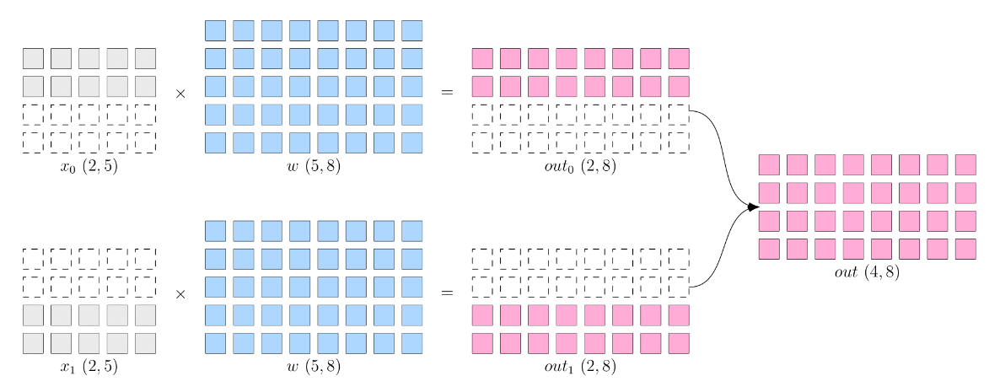
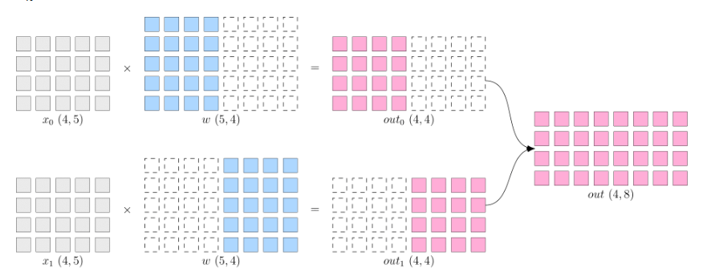
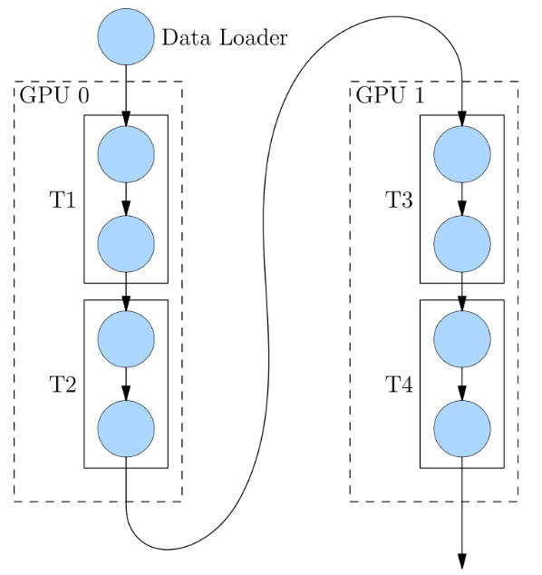

<h1 id="目录">目录</h1>

- [1.LLM中token指的是什么？](#1.LLM中token指的是什么？)
- [2.哪些因素会导致LLM中的偏见？](#2.哪些因素会导致LLM中的偏见？)
- [3.如何减轻LLM中的“幻觉”现象？](3.如何减轻LLM中的“幻觉”现象？)
- [4.解释一下大模型的涌现能力？](#4.解释一下大模型的涌现能力？)
- [5.解释一下MOE，它的作用主要是什么？](#5.解释一下MOE，它的作用主要是什么？)
- [6.如何缓解大语言模型inference时候重复的问题？](#6.如何缓解大语言模型inference时候重复的问题？)
- [7.什么是大模型智能体？](#7.什么是大模型智能体？)
- [8.LLM有哪些类型？](#8.LLM有哪些类型？)
- [9.什么是基础模型？什么是开源模型，和闭源模型？](9.什么是基础模型？什么是开源模型，和闭源模型？)
- [10.什么是语言模型？](#10.什么是语言模型？)
- [11.什么是自回归语言模型？](#11.什么是自回归语言模型？)
- [12.什么是信息理论？](#12.什么是信息理论？)
- [13.什么是n-gram模型？](#13.什么是n-gram模型？)
- [14.大语言模型的应用风险有哪些？](#14.大语言模型的应用风险有哪些？)
- [15.什么是大语言模型的适应性？](#15.什么是大语言模型的适应性？)
- [16.语言模型有哪些分类？](#16.语言模型有哪些分类？)
- [17.什么是注意力机制？](#17.什么是注意力机制？)
- [18.什么是语言模型的“两类错误”及其影响?](#18.什么是语言模型的“两类错误”及其影响?)
- [19.有哪些常见的语言任务?](#19.有哪些常见的语言任务?)
- [20.什么是分词?](#20.什么是分词?)
- [21.什么是最大匹配算法?](#21.什么是最大匹配算法?)
- [22.如何解决模型规模过大导致的难以扩展问题？](#22.如何解决模型规模过大导致的难以扩展问题？)
- [23.什么是混合专家模型？](#23.什么是混合专家模型？)
- [24.怎么构建大模型领域的数据集？](#24.怎么构建大模型领域的数据集？)
- [25.Decoder-only模型训练的目标函数是什么？](#25.Decoder-only模型训练的目标函数是什么？)
- [26.Encoder-only模型训练的目标函数是什么？](#26.Encoder-only模型训练的目标函数是什么？)
- [27.Encoder-decoder模型训练的目标函数是什么？](#27.Encoder-decoder模型训练的目标函数是什么？)
- [28.优化算法怎么应用在大模型的训练中？](#28.优化算法怎么应用在大模型的训练中？)
- [29.什么是大模型的混合精度训练？](#29.什么是大模型的混合精度训练？)
- [30.Probing方法怎么用于下游任务的迁移？](#30.Probing方法怎么用于下游任务的迁移？)
- [31.Prompt Tuning方法怎么用于下游任务的迁移？](#31.PromptTuning方法怎么用于下游任务的迁移？)
- [32.PrefixDecoder/CausalDecoder/Encoder-Decoder的区别有哪些?](#32.PrefixDecoder/CausalDecoder/Encoder-Decoder的区别有哪些?)
- [33.当前优化模型最主要技术手段有哪些?](#33.当前优化模型最主要技术手段有哪些?)
- [34.大模型推理加速框架有哪一些?都有什么特点?](#34.大模型推理加速框架有哪一些?都有什么特点?)
- [35.大语言模型命名中7B、13B、540B是什么意思？](#35.大语言模型命名中7B、13B、540B是什么意思？)
- [36.为什么现在的大模型结构大部分是Decoder only结构?](#36.为什么现在的大模型结构大部分是Decoderonly结构?)
- [37.目前各LLMs 都使用哪种激活函数?](#37.目前各LLMs都使用哪种激活函数?)
- [38.介绍一下FFN块计算公式](#38.介绍一下FFN块计算公式)
- [39.进行SFT操作的时候，基座模型选用Chat还是Base?](#39.进行SFT操作的时候，基座模型选用Chat还是Base?)
- [40.如果想要在某个模型基础上做全参数微调，需要多少显存?如何计算？](#40.如果想要在某个模型基础上做全参数微调，需要多少显存?如何计算？)
- [41.为什么SFT之后感觉LLM傻了?](#41.为什么SFT之后感觉LLM傻了?)
- [42.领域模型Continue PreTrain 数据选取?](#42.大语言模型命名中7B、13B、540B是什么意思？)
- [43.领域数据训练后，通用能力往往会有所下降，如何缓解模型遗忘通用能力?](#43.领域数据训练后，通用能力往往会有所下降，如何缓解模型遗忘通用能力?)
- [44.什么是分布式训练？](#44.什么是分布式训练？)
- [45.大模型为什么需要分布式训练？](#45.大模型为什么需要分布式训练？)
- [46.什么是数据并行策略？](#46.什么是数据并行策略？)
- [47.什么是数据并行策略中的AllReduce操作？](#47.什么是数据并行策略中的AllReduce操作？)
- [48.什么是模型并行策略？](#48.什么是模型并行策略？)
- [49.什么是流水并行策略？](#49.什么是流水并行策略？)
- [50.什么是混合并行策略？](#50.什么是混合并行策略？)
- [51.什么是大模型的有害性（危害）？](#51.什么是大模型的有害性（危害）？)

<h3 id='1.LLM中token指的是什么？'>1.LLM中token指的是什么？</h3>

在大语言模型中，Token是模型进行语言处理的基本信息单元，它可以是一个字，一个词甚至是一个短语句子。Token并不是一成不变的，在不同的上下文中，他会有不同的划分粒度。

<h3 id='2.哪些因素会导致LLM中的偏见？'>2.哪些因素会导致 LLM 中的偏见？</h3>

在大型语言模型（LLM）中，偏见可能来源于多个因素，包括以下几个方面：

1. **训练数据的偏差**：LLM 的性能依赖于所使用的训练数据。如果训练数据中包含偏见（例如，种族、性别、年龄、宗教等方面的偏见），模型可能会在生成文本时反映出这些偏见。

2. **数据选择与采样方法**：如果训练数据在选择和采样过程中不够多样化或不够平衡，可能导致模型对某些群体或观点的偏见。某些少数群体或观点可能在训练数据中被低估或忽视，从而导致模型表现出偏见。

3. **模型架构和训练方法**：虽然模型架构本身并不直接产生偏见，但特定的设计选择和训练方法可能会放大训练数据中的偏见。例如，过度优化某些性能指标（如精度）可能会忽视公平性和多样性。

4. **人类标注者的偏见**：在训练监督学习模型时，标注数据的过程通常涉及人类标注者。如果这些标注者带有偏见，他们的偏见可能会传递到训练数据中，从而影响模型的输出。

5. **模型部署和使用环境**：即使模型在训练过程中没有明显偏见，在实际部署和使用过程中，用户交互和反馈也可能引入新的偏见。例如，某些用户输入可能会导致模型生成偏见性回答。

6. **社会和文化背景**：语言和文化是动态变化的，不同社会和文化背景下的语言使用方式不同。如果模型训练数据主要来自特定文化或语言环境，可能会对其他文化或语言产生偏见。

为了减少这些偏见，研究人员和开发者可以采取以下措施：

- **多样化训练数据**：确保训练数据在性别、种族、文化、社会经济背景等方面具有多样性。

- **偏见检测和消除**：使用技术手段检测和消除模型中的偏见，例如通过去偏算法和公平性评估工具。

- **透明度和解释性**：增加模型的透明度，使用户能够理解模型的决策过程，并及时识别和纠正偏见。

- **持续监控和改进**：在模型部署后持续监控其表现，收集用户反馈，并定期更新和改进模型。
这些方法可以帮助减少 LLM 中的偏见，提高其公平性和可靠性。

<h3 id='3.如何减轻LLM中的“幻觉”现象？'>3.如何减轻 LLM 中的“幻觉”现象？</h3>

大模型幻觉问题主要指：指的是模型生成的内容看似合理但实际上是错误或虚构的信息。
减轻大型语言模型（LLM）中的“幻觉”现象可以通过多种方法实现。改进训练数据质量和训练方法，包括数据清洗、监督学习和强化学习，确保数据的准确性和多样性；采用后处理技术，如事实验证和编辑校对，确保生成内容的真实性；改进模型架构，结合外部知识库和多任务学习增强模型对事实的理解；提高模型透明度和可解释性，使用户能够理解和检查模型的输出；建立用户教育和反馈机制，鼓励用户验证生成内容并报告错误；以及定期更新和维护模型和数据。通过这些方法，可以显著减少模型生成错误信息的可能性，提高内容的准确性和可靠性。

<h3 id='4.解释一下大模型的涌现能力？'>4.解释一下大模型的涌现能力？</h3>

大模型的涌现能力指的是，当模型的规模和复杂度达到一定程度时，出现了一些在较小模型中未曾观察到的新特性或能力，如语言理解与生成、推理、多语言处理和少样本学习等。这些能力并非通过直接编程实现，而是在大量数据和复杂训练过程中自然涌现的。

<h3 id='5.解释一下MOE，它的作用主要是什么？'>5.解释一下MOE，它的作用主要是什么？</h3>

混合专家模型（Mixture of Experts：MoE）是一种稀疏门控制的深度学习模型，它主要由一组专家模型和一个门控模型组成。MoE的基本理念是将输入数据根据任务类型分割成多个区域，并将每个区域的数据分配一个或多个专家模型。每个专家模型可以专注于处理输入这部分数据，从而提高模型的整体性能。

MoE架构的基本原理非常简单明了，它主要包括两个核心组件：GateNet和Experts。GateNet的作用在于判定输入样本应该由哪个专家模型接管处理。而Experts则构成了一组相对独立的专家模型，每个专家负责处理特定的输入子空间。

微软研究报告，参考链接：
https://www.microsoft.com/en-us/research/blog/deepspeed-advancing-moe-inference-and-training-to-power-next-generation-ai-scale/

<h3 id='6.如何缓解大语言模型inference时候重复的问题？'>6.如何缓解大语言模型inference时候重复的问题？</h3>

缓解大语言模型推理时重复问题的方法包括引入重复惩罚机制、多样性采样技术（如温度采样、Top-k采样、Top-p采样）、N-gram去重、改进模型架构和训练方法（如长程记忆机制、训练数据去重）以及生成后的后处理技术。这些策略可以有效减少生成文本中的重复现象，提高生成内容的多样性和连贯性。

<h3 id='7.什么是大模型智能体？'>7.什么是大模型智能体？</h3>

**智能体**是具有自主性、反应性、积极性和社交能力特征的智能实体，由三个部分组成：**控制端（Brain）**，**感知端（Perception**）和**行动端（Action）**。

- **控制端**：主要由大型语言模型（LLMs）组成，负责存储记忆和知识，处理信息，并制定决策。它能够规划任务、理解上下文和知识库，并作为主控激活其他功能。

-  **感知端**：智能体通过这一部分接收外部信息，包括使用自然语言处理技术来理解文本信息，以及利用计算机视觉技术来分析图像和视频数据等。

-  **行动端**：智能体通过这一组件与外部环境互动并产生影响。这包括生成文本和图像、机器人的具身交互能力，以及调用各种工具来完成特定任务。

<h3 id='8.LLM有哪些类型？'>8.LLM有哪些类型？</h3>

LLM大模型根据应用领域的不同，分为文本、音频、视频、图像生成等类型。

- **音频和语音**：大模型直接分析给定的音频，并自动生成所需的音频数据，涵盖多语言语音识别，感情辨识，自然语音生成，多语言翻译等等问题，例如：FunAudioLLM。

- **图像和视频**：根据给定的文本、图像、视频等单模态数据，自动生成符合描述的、高保真的图像和视频内容，涵盖图像和视频的生成，理解，修复以及压缩等问题，例如：DALL-E。

- **文本类型**：  指利用自然语言处理技术，通过对大量文本数据的学习和理解，以及对语言规律的掌握，自动生成符合语法和语义要求的文本内容，涵盖文本和代码的生成，理解，翻译和改写等问题，例如：GPT-4。

- **多模态**： 将自然语言处理与视觉理解，音频处理等其他模态相结合，并通过多模态界面实现交互，实现在输入和输出中处理多种类型的数据，例如：GPT-4o。

<h3 id='9.什么是基础模型？什么是开源模型，和闭源模型？'>9.什么是基础模型？什么是开源模型，和闭源模型？</h3>

**1. 基础模型**：

Foundation model 出自论文[《On the Opportunities and Risks of Foundation Models》](https://arxiv.org/abs/2108.07258?WT.mc_id=academic-105485-koreyst)，其定义标准包括：
	
	（1）使用无监督学习或者自监督学习，仅接受未标记数据的预训练，而没有人工注释或标记数据的参与；
	（2）模型规模很大， 通常超过数十亿的参数；
	（3）作为基座模型，仅需要通过微调即可转变为特定应用模型。

**2.开源模型与闭源模型**

- **开源模型**： 开源模型是对公众开放，任何人都可以使用的模型，允许任何针对LLM的修改和定制，例如：LLaMA模型。

- **闭源模型**： 闭源模型为公司专有仅对公众开放接口的模型，例如：GPT-4o。

<h3 id='10.什么是语言模型？'>10.什么是语言模型？</h3>

语言模型是一种概率模型，用于预测词元（token）序列的概率分布。假设我们有一个词元集 $V$ ，语言模型则是为每个词元序列 $w_{1},...,w_{n} ∈ V$ 预测一个联合概率 $p(w_1, w_2 ... w_n)$ 。通过比较不同词元序列的联合概率，我们可以确定哪个序列在给定上下文中是最可能的，即最佳词元序列。

假设我们有以下三个词元序列，需要确定哪个是最佳序列：

$$
p(\text{你家的, 猫, 吃了, 那只, 老鼠}) = 0.02,
$$

$$
p(\text{那只, 老鼠,吃了, 你家的, 猫}) = 0.01,
$$

$$
p(\text{猫, 你家的, 那只, 老鼠, 吃了}) = 0.0001,
$$

根据语言模型，每个序列都会被赋予一个联合概率。我们来分析这些序列：

1. “你家的猫吃了那只老鼠” - 这个序列既符合语法规则，也符合我们对世界的常识。因此，语言模型会赋予它最高的联合概率。

2. “那只老鼠吃了你家的猫” - 尽管这个序列在语法上是正确的，但它违背了我们对世界的基本常识，因为老鼠通常不会吃猫。因此，语言模型也会赋予它很低的概率。

3. “猫你家的那只老鼠吃了” - 这个序列的语法不正确，主语和谓语的位置混乱，因此语言模型会赋予它很低的概率。

进一步分析，语言模型的任务不仅仅是学习如何为正确的词元序列赋予最高的联合概率，它还需要学习语法规则和世界知识。例如，语言模型应当识别出“猫你家的那只老鼠吃了”这样的序列具有很低的概率，因为该句子的语法结构混乱；同样，模型也应该对“那只老鼠吃了你家的猫”这样的句子赋予较低的概率，因为这违反了我们对世界的基本常识。因此，一个优秀的语言模型应当具备出色的语法理解和世界知识，这样才能更准确地预测词元序列的概率。

语言模型也可以做生成任务。最纯粹的方法是从基于概率的采样，其过程是：从第一个词语或字符开始，根据语言模型给出的概率分布，选择下一个词语或字符，然后基于新的序列，再次使用模型进行预测，选择下一个词语或字符，如此循环，直到生成一个完整的文本序列。

<h3 id='11.什么是自回归语言模型？'>11.什么是自回归语言模型？</h3>

自回归语言模型是一种使用先前的文字来预测下一个文字的模型。其通过逐词地生成文本，每一步都基于之前生成的内容，是通过逐步预测每个位置的单词来生成一句话或一段话的模型。

假设将序列 $𝑥_{1:𝐿}$ 的联合分布为$ 𝑝(𝑥_{1:𝐿})$ ，其常见写法是使用概率的链式法则：
$$
p(x_{1:L})=p(x_1)p(x_2|x_1)...p(x_L|x_{1:L-1})=\prod^L_{i=1}p(x_i|x_{1:i-1})
$$
自回归语言模型的特点是它可以利用前馈神经网络等方法有效计算出每个条件概率分布 $𝑝(𝑥_𝑖∣𝑥_{1:𝑖−1}) $。在自回归语言模型 $𝑝$ 中生成整个序列$ 𝑥_{1:𝐿}$ ，需要一次生成一个token，该token则是基于之前以生成的toke进行计算获得。

例如，要生成一句话“猫吃老鼠”：

1. 模型首先预测第一个词（例如：“猫”）。
2. 然后它使用“猫”来预测下一个词（例如：“吃”）。
3. 接着使用“猫吃”来预测下一个词（例如：“老鼠”）。
4. 迭代这个过程，直到生成完整的句子。

<h3 id='12.什么是信息理论？'>12.什么是信息理论？</h3>

信息理论是研究语言模型的重要理论，其是一门研究信息的度量、传递、存储和处理的学科。它由克劳德·香农（Claude Shannon）在20世纪40年代创立，主要应用于通信、数据压缩、加密、以及编码等领域。信息理论提供了一个框架，用于理解和优化信息系统的性能。

信息理论中最重要的一个概念是信息量（Entropy），也叫信息熵，它是用来度量信息不确定性的一个指标，其公式表达为：
$$
H(X)=-\sum_iP(x_i)\log P(x_i)
$$
其中，$H(X)$为离散随机变量$X$的信息熵，$P(x_i)$是$X$取值$x_i$的概率。

熵的实际上是一个衡量将样本$x\sim p$ 编码成比特串所需要的预期比特数的度量。熵的值越小，表明序列的结构性越强，编码的长度就越短。直观地讲， $-\log⁡ p(𝑥)$ 可以视为用于表示出现概率为$ 𝑝(𝑥)$ 的元素$ 𝑥$ 的编码的长度。

<h3 id='13.什么是n-gram模型？'>13.什么是n-gram模型？</h3>

n-gram模型是一种用于自然语言处理和概率语言建模的基本方法。它通过统计文本中$n$个连续单词出现的频率来预测下一个单词的概率，从而生成或分析文本。n-gram模型广泛应用于文本生成、拼写校正、语音识别和机器翻译等任务。

根据$n$的取值，n-gram可以是单词（$n=1$）、二元组（$n=2$）、三元组（$n=3$）等。例如，对于语句“猫吃老鼠”：

- 当$n=1$时，n-gram为“猫”、“吃”、“老”、“鼠”

- 当$n=2$时，n-gram为“猫吃”、“吃老”、“老鼠”

- 当$n=3$时，n-gram为“猫吃老”、“吃老鼠”

在一个n-gram模型中，关于$x_{i}$的预测只依赖于最后的 $𝑛−1$ 个字符$ 𝑥_{𝑖−(𝑛−1):𝑖−1}$ ，而不是整个历史：
$$
𝑝(𝑥_𝑖∣𝑥_{1:𝑖−1})=𝑝(𝑥_𝑖∣𝑥_{𝑖−(𝑛−1):𝑖−1}).
$$
如果$n$太小，那么模型将难以捕获长距离的依赖关系，下一个词将无法依赖于靠前的单词。然而，如果$n$太大，则统计上将无法得到概率的好估计。

<h3 id='14.大语言模型的应用风险有哪些？'>14.大语言模型的应用风险有哪些？</h3>

- **社会偏见**：大语言模型在处理不同群体的数据时，其表现并不一致，存在一定的偏差。具体来说包含**性能差异**和**刻板印象**两个方面。比如：由于GPT等大模型中亚洲人数据占比较小，所以可能导致在有关亚洲人的问题上性能欠佳或者生成具有刻板印象的答案。
- **有害性**：由于大语言模型是基于大量的互联网数据进行训练，所以可能导致大模型在生成文本时产生有害内容的倾向。
- **虚假信息**：由于大语言模型具备高度的语言生成能力，恶意行为者得以更加便捷地制造语法正确、风格一致且看似可信的虚假新闻，从而加剧了虚假信息宣传的泛滥和危害。
- **安全性**：由于大语言模型是通过抓取和利用网络数据进行训练的，因此任何人都有可能通过篡改或创建有毒数据来影响这些模型的训练过程，进而潜在地攻击和操纵大型模型的行为和输出。
- **法律效应**：如果训练数据中包含了受版权保护的作品，而使用这些作品未经版权持有者的许可，是否造成侵权？如果大语言模型生成的文本与受版权保护的原创作品相似到足以构成实质性相似，是否造成抄袭？
- **成本**：大语言模型的训练和推理过程需要巨大的算力支持，这带来了显著的成本问题：包括训练成本，推理成本和访问成本。

<h3 id='15.什么是大语言模型的适应性？'>15.什么是大语言模型的适应性？</h3>

大语言模型的核心是表示token序列的概率分布，不仅可以用来**评估**一个句子在自然语言中出现的可能性，还可以在给定部分序列（prompt）的情况下，**生成**与之匹配的后续序列，从而创建完整的句子或文本。因此，语言模型可以完成大量的自然语言任务，比如Language Modeling，Question Answering，Arithmetic，news Article Generation, translation, Novel Tasks等。我们使用**“适应”**一词来描述将**通用语言模型**转换为专门针对**特定自然语言任务模型**的过程。

常见的适应技巧包括**监督学习**和**提示学习**。**监督学习**：重新训练或者微调大语言模型。**提示学习**：通过设计并输入特定任务的提示或上下文信息，指导语言模型生成满足这些任务需求的输出。**监督学习**可能因数据问题导致模型过拟合或欠拟合，而**提示学习**则可能因输入提示长度限制而影响生成效果的质量。

<h3 id='16.语言模型有哪些分类？'>16.语言模型有哪些分类？</h3>

根据语言模型的架构，总体可分为编码器（Encoder-only）、解码器（Decoder-only）以及编码器-解码器（Encoder-Decoder）三种架构。

- 编码器架构：这类模型主要专注于理解输入文本的上下文语义信息。模型能够根据输入的文本生成向量表征，表征可用于文本分类等下游任务。该类型的模型典型代表是BERT、RoBERTa等。

- 解码器架构：该模型主要用于生成任务，相较于编码器架构，其能更进一步生成文本，有简单的训练目标。该类型的模型代表有GPT。

- 编码器-解码器架构：该类模型同时包含编码器和解码器，其中编码器负责理解文本输入，解码器负责生成文本。典型的代表是Transformer、BART以及T5模型等。

<h3 id='17.什么是注意力机制？'>17.什么是注意力机制？</h3>

注意力机制（Attention Mechanism）是一种处理序列数据的重要技术，被广泛应用于各种自然语言处理和计算机视觉任务。注意力机制的核心思想是允许模型在处理每个输入或输出元素时，动态地选择和关注输入序列的不同部分，从而更好地捕捉和利用相关信息。

以Transformer模型为例，其编码器和解码器结构中均存在注意力机制。Transformer使用多头注意力机制（Multi-head Attention），即通过多个并行的注意力层来捕捉序列中不同位置的重要关系，从而在处理长距离任务的同时，能够有效地关注最相关的信息。

<h3 id='18.什么是语言模型的“两类错误”及其影响?'>18.什么是语言模型的“两类错误”及其影响?</h3>

- **召回错误**：在自然语言处理中，语言模型在尝试预测文本中的下一个词（token）时，没有准确地估计出该词出现的概率。例如，如果实际文本中的下一个词是“苹果”，但模型预测这个词出现的概率非常低，那么就认为模型未能正确地为“苹果”这个词分配概率。

- **精确度错误**：在预测文本序列时，错误地高估了某些不合适或不符合实际语境的序列出现的概率。例如，在一个关于天气的对话中，如果模型预测出“今天天气很好，我去游泳，然后吃了一块月亮”，这里的“吃了一块月亮”就是一个错误的词序列。

当出现**召回错误**时，**困惑度**会非常高，因为模型未能预测到实际出现的词，这相当于模型给实际词分配了**接近于零的概率**。在几何平均的计算中，任何接近零的概率都会极大地增加整个序列的困惑度，因为几何平均对极端低概率非常敏感。但对于**精确度错误**，困惑度只会进行适度惩罚。 因为实际词的概率降低不大，导致其增量大概和错误序列占总文本的比例相当。

<h3 id='19.有哪些常见的语言任务?'>19.有哪些常见的语言任务?</h3>

**语言建模 任务**是预测文本序列中下一个token的任务。该任务基于给定的部分序列，预测下一个最可能的token，旨在捕捉自然语言的统计特性。该任务的概率可以通过链式规则表示为： $p(x_{1:l})=\prod_{i=1}^l{p(x_i|x_{1:i-1}})$。相关数据集有 Penn Tree Bank，LAMBADA，HellaSwag 等

**问答任务**是解决闭卷问答题的任务，其中输入是一个问题，输出是一个答案。语言模型必须以某种方式“知道”答案，而无需在数据库或一组文档中查找信息。相关数据集有：TriviaQA，WebQuestions

**翻译任务**涉及将源语言（如德语）的句子转换为目标语言（如英语）的句子。这一过程经历了从统计机器翻译到神经机器翻译的发展，再到利用大型模型进行翻译的演变。

**算术任务**：做算术题（2-5位数的加法，减法，乘法）。

**文章生成任务**：给定标题和副标题，生成新闻文章。

**其他任务**：包括使用新词，纠正语法，词汇替换，多选题等等

<h3 id='20.什么是分词?'>20.什么是分词?</h3>

**分词**是将连续的文本字符串分割成有意义的词元（token）序列的过程，这可以被视为自然语言与机器语言之间的一种隐式映射或对齐方式。通过分词，文本数据被转换成机器可以理解和处理的形式。常见的分词方法有：**基于空格的分词**，**字节对编码**，**Unigram 模型** 。

**基于空格的分词**：对于英文文本来说，由于其结构特点（单词之间通常由空格分隔），使用 text.split(' ') 方法进行分词是一种简单且直接的手段。

**字节对编码**：字节对编码（BPE）算法通过训练数据学习分词器，初始将每个字符作为单独的词元，然后合并频繁共现的词元对以构建词汇表，直至达到所需的大小。

**Unigram 模型**：Unigram模型是一种基于目标函数的分词方法，它通过统计每个词汇在训练数据中的出现次数来估计其概率，并通过计算整个训练数据的似然值来评估分词结果的质量。

<h3 id='21.常见的分词原则有哪些?'>21.常见的分词原则有哪些?</h3>

**分词原则**：
- ** 颗粒度越大越好**。词组的字数越多，所表示的含义越具体，语义分析的结果越精准。
- **分词结果中非词典词和单字词越少越好**。**非词典词**通常意味着文本中存在一些不在词典中的新词或专有名词。因为模型没有足够的训练数据来正确预测这些词，过多的非词典词可能会导致分词错误。单字词是指由单个汉字组成的词。单字词通常不是完整的词组，它们可能只是词的一部分，或者是停用词（如“的”、“了”、“是”等）。因为它们不能表达完整的语义信息，单字词的出现可能会导致分词结果的不准确。
- **总体词数越少越好**。在相同字数的情况下，总词数越少，通常意味着每个词组包含的语义信息越多，这有助于提高分词的准确性。但这并不意味着极端的少也是好的，因为过分的切分可能会导致语义信息的丢失。

<h3 id='21.什么是最大匹配算法?'>21.什么是最大匹配算法?</h3>

**最大匹配算法**是一种基于词典的分词技术，其核心任务是将以连续字符形式存在的文本拆解成一系列有意义的词语。该算法的工作原理是从文本中提取尽可能长的词语，并与预先设定的词库进行匹配。若提取的词语在词库中存在，则将其从文本中分离出来；若不存在，则缩短一个字符后再次尝试匹配，如此循环，直至文本中的每个字符都被成功分词。根据匹配的方向不同，最大匹配算法可以分为**正向最大匹配法**、**逆向最大匹配法**以及**双向最大匹配法**。

- **正向最大匹配算法**：像吃蛋糕一样，从蛋糕的一头开始，尽可能大口地吃（匹配最长的词语）。如果这一大口（词语）在词典中能找到，就确认吃下（记录这个词语），然后继续从剩下的蛋糕（文本）开始新的一口。如果这一大口（词语）在词典中找不到，就少吃一点（减少一个字），再尝尝看。重复这个过程，直到整个蛋糕（文本）被吃完（分词完成）。

- **逆向最大匹配法**：与正向最大匹配算法相反，这次是从蛋糕的另一头开始吃（从文本的末尾开始匹配）。同样地，尽可能大口地吃，如果词典中有这个词，就确认吃下，否则少吃一点再尝。直到蛋糕被吃完为止。

- **双向最大匹配法**：这个方法就像是同时从蛋糕的两头开始吃。分别用正向和逆向的方法吃蛋糕，然后比较哪种吃法更好（哪种分词结果更合理）。最后选择一种最好的吃法（分词结果）。

<h3 id='22.如何解决模型规模过大导致的难以扩展问题？'>22.如何解决模型规模过大导致的难以扩展问题？</h3>

常见的语言模型开发主要依赖于**稠密的Transformer模型架构**，其中GPT-3等模型通过堆叠多达96层的Transformer实现了强大的语言处理能力。然而，随着模型规模的不断增大，其对计算资源的需求也在急剧上升。这种增长导致模型训练和部署必须依赖于分布式系统，将模型分布在多个GPU上。但是，这种方法已经接近了技术和硬件上的**极限**，因此，探索新的模型架构以实现更好的稀疏性成为了解决扩展难题的关键。**混合专家模型（MoE）**和**基于检索的模型**提供了有效的解决方案。

**MoE模型**：
- 由多个专家网络构成，每个网络专门负责处理输入数据的一个特定子集。通过一个门控网络来决定哪些专家网络应该被激活以处理当前的输入，这样不仅实现了模型的稀疏化，还提高了计算效率。

- 这个过程可以类比为一个由多个领域专家组成的咨询委员会，每个专家都有其独特的技能和知识。面对一个特定问题时，只有那些具备相关领域知识的专家会被选中提供意见，他们的综合观点最终形成决策。

**基于检索的模型**：

- 这种模型依赖于一个庞大的原始数据存储库。当接收到一个新的输入时，模型会在存储库中检索与之相关的信息，并基于这些检索到的信息来预测输出。

- 这个过程与我们在日常生活中遇到问题时使用搜索引擎查找相关信息，然后基于这些信息作出判断非常相似。

<h3 id='23.什么是混合专家模型？'>23.什么是混合专家模型？</h3>

**基本思想**：将输入数据通过一个门控机制分配给不同的专家，然后根据这些专家的预测以及它们各自的重要性（或权重）来生成最终的输出。

**详解**：定义 $n$ 个专家，每个专家 $(1,2,...,i)$ 都有自己的嵌入矩阵 $w_i$。每个专家有自己的权重参数 $\theta_{i}$，并基于专家特性定义每个专家函数 $h_{\theta_i}(x)$。将门控函数定义为 $n$ 个专家的概率分布 $g_i(x) = \frac {e^{(w_ix)}} {\sum_{j=1}^{n}{w_jx}}$，根据输入数据动态地选择或组合多个专家的输出。那么最终模型为 $f(x) = \sum_{1}^i \underbrace{g_i(x)}*\text{gating} \underbrace{h_{\theta_i}(x)}_\text{expert}$ 。

**注意事项**：（1）专家的混合不会节省任何计算，因为前向传播仍然需要评估每个专家，而反向传播也必须接触每个专家。因此，可以选择值排名靠前的专家更新，并将其他专家规范化为0，以节约成本。（2）只有所有专家都参与进来，混合专家才有意义，因此也需要避免只有一个专家活跃的情况。

**如何应用在语言模型**：**Sparsely-gated mixture of experts**（门控函数应用于序列，混合专家应用于每个token和隔层的Transformer block，并且只在顶层进行专家的结合），**Switch Transformer** （简化的门控函数，只激活一个专家）

<h3 id='24.怎么构建大模型领域的数据集？'>24.怎么构建大模型领域的数据集？</h3>

大语言模型的训练依赖于大量涵盖广泛领域的文本数据，如WebText数据集用于GPT-2的训练，C4语料库用于T5的训练，以及CommonCrawl用于GPT-3的训练。然而，网络数据的品质参差不齐，因此提出了数据文档的概念，其要点如下：

（1）数据集创建背景：（创建动机）了解数据集为何而建； （创建者）明确数据集的作者是谁；（资金来源）知晓数据集创建的资助情况。（2）数据集组成：（实例代表性）了解数据集中的实例代表什么；（信息完整性）检查是否存在缺失信息；（机密性）确认是否包含敏感或机密数据。（3）数据收集过程：（数据获取方式）了解实例数据的收集方法；（参与人员）明确参与数据收集的人员；（报酬情况）掌握数据收集人员的报酬方式；（道德审查）确认是否进行了道德审查。（4）预处理、清理和标记：（完成情况）了解这些工作是否已实施；（软件工具）确认是否有相应的软件支持。（5）数据集使用情况：（应用任务）了解数据集已用于哪些任务；（限制性任务）明确不适合使用该数据集的任务。（6）数据分发：（分发方式）了解数据集的分发途径；（知识产权限制）确认是否存在第三方对数据的知识产权或其他限制。（7）数据集维护：（负责人）明确谁负责维护数据集；（更新情况）了解数据集是否会进行更新。
        

<h3 id='25.Decoder-only模型训练的目标函数是什么？'>25.Decoder-only模型训练的目标函数是什么？</h3>

**Decoder-only模型**通过一个上下文嵌入函数 $\phi$ 来将序列的前 $i−1$ 个词 $x_{1:i−1}$ 映射到一个嵌入向量 $\phi(x_{1:i−1})$ ；随后应用嵌入矩阵 $E$ 和 $softmax$ 函数来得到第 $i$ 个词 $x_i$ 的概率分布 $p(x_{i}|x_{1:i})$ 。那么，Decoder-only模型训练的条件分布可以表示为 $p(x_{i}|x_{1:i})=softmax(E\phi(x_{1:i-1})_{i-1})$。

为了最大化模型在数据集上的概率，我们采用**最大似然估计**来估计此模型的参数。在这一过程中，我们计算对数似然的梯度，并根据梯度方向调整参数。设 $\theta$ 是大模型的所有参数， $D$ 是所有的训练数据， $L$ 是单个语言序列的长度， 则最终的目标函数为： $f(θ) = ∑_{x ∈ D} -\log p_θ(x) = ∑_{x ∈ D} ∑_{i=1}^{L} -\log p_θ(x_i | x_{1:i-1})$。

<h3 id='26.Encoder-only模型训练的目标函数是什么？'>26.Encoder-only模型训练的目标函数是什么？</h3>

**BERT**是一种典型的encoder-only模型，其设计目标是通过对大量文本的双向编码来获得深层次的上下文理解。其目标函数包括两个部分：（1）掩码语言模型和（2）下一句预测。

**掩码语言模型**的基本思想是通过加噪然后预测来进行训练，比如：[猫，[MASK]， 老鼠] → [猫，吃，老鼠]。该模型通过输入有噪声的序列 $x_{1:L}^{noise}$ 及其上下文嵌入，预测每个token，即 $p(x_i|x_{1:L}^{noise})=softmax(E\phi(x_{1:L}^{noise})_i)$。

**下一句预测**的目的是预测第二局是否跟随第一句，比如：[[CLS]，猫，吃，老鼠，[SEP]，[它]，[吃]，[饱了]] → 1，而 [[CLS]，猫，吃，老鼠，[SEP]，[苹果]，[红了]] → 0。注：[CLS]是驱动分别任务的起始嵌入，[SEP]用于区别两个语言序列。

BERT训练的目标函数最终为下式（RoBERTa删除了下一句预测）。其中 $D$ 是训练集， $A$ 是随机噪声函数， $I$ 表示从 $1$ 到 $L$ 的随机位置， $C$ 表示是否为跟随的下一句。

$$\sum_{x_{1:L} \in D}E_{I,x_{1:L}^{noise} \sim A(x_{1:L},I)}[\sum_{i \in I} -\log p_θ(x_i^{noise}|x_{1:i-1})]+ (-logp(c|\phi(x_{1:L})_1))$$

<h3 id='27.Encoder-decoder模型训练的目标函数是什么？'>27.Encoder-decoder模型训练的目标函数是什么？</h3>

**BART**和**T5**是典型的Encoder-decoder模型，可以实现像BERT一样对输入进行双向编码或者像GPT一样进行自回归编码。**BART**采用RoBERTa相同的编码器架构和相同的目标函数进行训练。通过掩码，乱序，删除等手段，实现了分类和生成任务。

**T5**采用denoising objective作为目标函数。该目标函数的功能是：在输入样本中，用一些唯一的特殊符号<X>, <Y>来表示原始样本中被随机masked的token，而目标样本则为被masked的token序列，用输入样本中对应位置的特殊符号<X>, <Y>分隔，最后加上一个特殊符号<Z>表示序列结束。例如：原始样本 [我，在院子里，听说，猫，吃，老鼠]，输入样本 [我，<X>，听说，<Y>，吃，老鼠]，输出样本 [是的，小明，<X>，这件事，<Z>]

<h3 id='28.优化算法怎么应用在大模型的训练中？'>28.优化算法怎么应用在大模型的训练中？</h3>

常见的优化算法：随机梯度下降算法通过初始化参数后，不断随机抽取小批量数据计算梯度并更新参数；Adam算法引入了动量和自适应步长，通过初始化参数和动量，不断随机抽取小批量数据计算梯度并更新一阶，二阶动量和参数。优化算法的优化关键在于平衡参数快速收敛与处理大模型参数量带来的高内存占用的矛盾。由于稳定性问题，学习率和一些直觉（例如，二阶方法）仍然有用，但要使大语言模型有效训练，还需要克服许多其他独特的挑战。

<h3 id='29.什么是大模型的混合精度训练？'>29.什么是大模型的混合精度训练？</h3>

在处理大规模语言模型训练时，FP16（16位浮点数）格式虽然能够显著减少内存消耗，但它限制了数值的精度，特别是对于非常小的数值，比如小于2^-24的值会直接归零。因此，为了保证训练的精度和稳定性，我们通常采用FP32（32位浮点数）来进行训练。

然而，为了平衡存储和计算效率，实践中会将**模型的权重以FP32格式存储，而在计算过程中使用FP16进行前向和反向传播**。这种方法虽然可能引入一些数值上的放大误差，但能够有效减少内存使用，同时避免了梯度消失的问题，使得内存需求大约减少了一半。这样的策略在保持模型性能的同时，优化了资源的使用。

<h3 id='30.Probing方法怎么用于下游任务的迁移？'>30.Probing方法怎么用于下游任务的迁移？</h3>

**Probing技术**是一种用于**分析和理解预训练语言模型内部表示**的有效手段。它通过在预训练语言模型的**最后一层**之后附加**参数较少的线性或浅层前馈网络**，即Probing预测头，有效地分析和理解模型内部表示，以评估模型对特定任务（如输出标签）的处理能力。为了将一个包含 $L$ 个token的序列合理地映射为单个/少量的token的表示，Probing技术采用了以下两种策略：**CLS token策略**和**平均化策略**来优化预测头的映射能力。

**CLS token策略**表示在序列的开始处插入一个特殊的分类token（CLS），这个token的目的是聚合整个序列的信息。在模型的输出中，CLS token对应的表示被用作整个序列的表示。**平均化策略**假设序列中的每个token都为整个序列的语义贡献了等量的信息。因此，取序列中所有token的表示的平均值，以此来创建一个单一的、全局的序列表示。Probing方法在训练过程中保持预训练模型的权重不变，仅对新增的预测头进行训练，大幅度降低了训练成本。

<h3 id='31.PromptTuning方法怎么用于下游任务的迁移？'>31.Prompt tuning方法怎么用于下游任务的迁移？</h3>

**Prompt tuning方法**专注于优化**输入提示**，而不涉及修改语言模型的内部参数。该方法通过在原始输入前添 $k$ 个可学习的连续tokens，使得新的输入长度变为 $L= L + K$ 。这些额外的tokens的嵌入是通过在带标签的任务数据上进行训练来学习的。在整个微调过程中，**预训练的语言模型保持冻结状态**，即模型的主体参数不会发生变化。随着预训练模型规模的增大，prompt tuning的性能表现越来越出色，有时甚至能够与全面微调的效果相匹配。其中，该方法的初始化策略包括： **随机词汇嵌入**（选择随机的词嵌入），**类标签词嵌入**（选择和分类标签相关的词嵌入）和**随机初始化**（随机分配值）。

P-Tuning v2是提示调整（Prompt tuning）方法的一个改进版本，不仅仅是在输入层添加可学习的提示（prompt），而是在模型的多个层级上进行了优化。

<h3 id='32.PrefixDecoder/CausalDecoder/Encoder-Decoder的区别有哪些?'>32.PrefixDecoder/CausalDecoder/Encoder-Decoder的区别有哪些?</h3>

### Prefix Decoder：
Prefix Decoder，又被称作非因果解码器，属于Decoder only的结构体系。其输入环节采用双向注意力机制，而输出部分则运用单向注意力机制。在生成新的输出内容时，会把此前所有生成的输出都纳入考虑范围。
Prefix Decoder在对输入序列进行处理时，模型能够同时顾及序列里的全部词语。在生成输出的时候，会考量整个输入序列，而非仅仅局限于之前的输出内容。正因如此，它在应对那些需要全局上下文信息的任务时，有着更为出色的表现。在训练阶段，通常以自回归的方式展开训练，也就是说，在生成当前词语的时候，会借助之前生成的所有词语。Encoder和Decoder共同使用同一个Transformer结构，并且共享参数。
代表模型有 GLM、ChatGLM、ChatGLM2、U-PaLM 等。其适用范围是那些需要理解全文上下文，并在此基础上生成下文的任务。该结构在输入部分运用双向注意力，输出部分采用单向注意力。

### Causal Decoder：
Causal Decoder，即因果解码器，属于Decoder only的结构类型。其输入和输出均为单向注意力机制。在生成新的输出时，仅仅会考虑之前的输出，而不会涉及未来的输出。
与Prefix Decoder相比，Causal Decoder更加注重序列的时间先后关系，所以在处理时间序列数据方面具有优势。不过，在应对需要全局上下文的任务时，它的表现可能不如Prefix Decoder出色。在训练阶段，通常以自回归的方式进行训练。prefix Decoder与causal Decoder主要的差异在于注意力掩码不同。
代表模型有 GPT 系列、LLaMA-7B、BLOOM 以及 LLaMa 的衍生模型等。其适用范围是那些需要生成文本且要确保生成顺序符合因果关系的任务，比如撰写故事或者文章。不管是输入还是输出环节，都采用单向注意力机制。

### Encoder-Decoder：
Encoder-Decoder由一个编码器和一个解码器组成。编码器运用双向注意力，使得每个输入元素都能够关注到序列中的其他所有元素。解码器则采用单向注意力，保证生成的每个词仅能依赖于此前生成的词。编码器的职责是将输入数据转化为一个连续的向量，而解码器负责把这个向量转化为最终的输出结果。
Encoder-Decoder结构可以将输入数据编码为一个固定维度的向量，接着通过解码器把这个向量解码成目标输出。该结构能够有效处理长度可变的序列转换问题，并且具备较强的通用性与灵活性。在训练的时候，解码器的输入包含真实的前一个输出（遵循 teacher forcing 策略）。与 Prefix decoder 不同，这里的编码器和解码器参数是相互独立的。
代表模型有 Transformer、Flan-T5、BART 等。适用范围是那些需要理解完整输入序列并生成一个结构化输出的任务。编码器使用双向注意力，解码器使用单向注意力。

<h3 id='33.当前优化模型最主要技术手段有哪些?'>33.当前优化模型最主要技术手段有哪些?</h3>

以下是对当前优化大语言模型的主要技术手段从不同层面进行的分析：

**一、算法层面**

1. **蒸馏**：
   - **原理**：知识蒸馏是一种模型压缩技术，通过将一个复杂的、性能较好的教师模型的知识转移到一个较小的学生模型中。在大语言模型中，通常使用大型的预训练模型作为教师模型，然后训练一个较小的模型来模仿教师模型的输出。
   - **优势**：可以显著减小模型的大小和计算量，同时在一定程度上保持较高的性能。这使得大语言模型能够在资源有限的设备上运行，或者提高推理速度。例如，在移动设备上部署语言模型时，蒸馏后的小模型可以更快地响应用户请求，同时减少内存占用。
   - **应用场景**：适用于对模型大小和性能有严格要求的场景，如移动端应用、嵌入式设备等。

2. **量化**：
   - **原理**：量化是将模型的权重和激活值从高精度的数值表示（如浮点数）转换为低精度的数值表示（如整数）。通过减少数值的精度，可以降低模型的存储需求和计算量。
   - **优势**：可以大大提高模型的推理速度，减少内存占用，并且在一些情况下对模型性能的影响较小。例如，将模型从 32 位浮点数量化到 8 位整数，可以显著减少模型的大小和计算时间，同时在一些任务上可能只损失少量的准确性。
   - **应用场景**：适用于需要快速推理和低内存占用的场景，如实时应用、大规模部署等。

**二、软件层面**

1. **计算图优化**：
   - **原理**：计算图是深度学习模型在计算过程中的一种抽象表示。通过对计算图进行优化，可以减少不必要的计算、提高内存使用效率和并行性。例如，可以合并一些连续的操作，减少中间结果的存储；或者对计算图进行重排，以更好地利用硬件的并行计算能力。
   - **优势**：可以提高模型的训练和推理速度，减少资源消耗。优化后的计算图可以更高效地在各种硬件平台上运行，充分发挥硬件的性能。
   - **应用场景**：适用于各种深度学习任务，尤其是在大规模数据和复杂模型的情况下，可以显著提高训练和推理效率。

2. **模型编译**：
   - **原理**：模型编译是将深度学习模型转换为特定硬件平台上的高效执行代码。通过使用专门的编译器，可以针对不同的硬件架构进行优化，生成高效的底层代码。例如，针对 GPU 进行编译可以利用 GPU 的并行计算能力，提高模型的执行速度。
   - **优势**：可以充分发挥硬件的性能，提高模型的推理速度和效率。编译后的模型通常具有更好的内存管理和并行性，能够更好地适应不同的硬件环境。
   - **应用场景**：适用于需要在特定硬件平台上进行高效部署的场景，如数据中心、云端服务等。

**三、硬件层面**

1. **FP8（NVIDIA H 系列 GPU 开始支持 FP8，兼有 fp16 的稳定性和 int8 的速度）**：
   - **原理**：FP8 是一种低精度浮点格式，介于 FP16 和 INT8 之间。NVIDIA H 系列 GPU 对 FP8 的支持使得在进行大语言模型的计算时，可以利用 FP8 的低精度和高速度，同时保持一定的数值稳定性。
   - **优势**：相比 FP16，FP8 可以提供更高的计算速度和更低的内存占用；而与 INT8 相比，FP8 具有更好的数值稳定性，减少了精度损失的风险。这使得在大语言模型的训练和推理中，可以在不显著降低性能的情况下提高计算效率。
   - **应用场景**：适用于需要高性能计算和大规模数据处理的大语言模型任务，尤其是在使用 NVIDIA H 系列 GPU 的环境中。

综上所述，从算法、软件和硬件三个层面都有多种技术手段可以优化大语言模型。这些技术手段可以单独使用，也可以结合起来，以实现更好的性能和效率。在实际应用中，需要根据具体的任务需求、硬件资源和性能要求来选择合适的优化方法。

<h3 id='34.大模型推理加速框架有哪一些?都有什么特点?'>34.大模型推理加速框架有哪一些?都有什么特点?</h3>

1、FasterTransformer:英伟达推出的FasterTransformer不修改模型架构而是在计算加速层面优化Transformer的 encoder 和 decoder模块。具体包括如下:
a.尽可能多地融合除了GEMM 以外的操作·支持 FP16、INT8、FP8
b.移除 encoder 输入中无用的padding来减少计算开销

2、TurboTransformers:腾讯推出的TurboTransformers 由computation runtime 及 serving framework组成。加速推理框架适用于 CPU和GPU，最重要的是，它可以无需预处理便可处理变长的输入序列。具体包括如下:
a.与FasterTransformer类似，它融合了除GEMM之外的操作以减少计算量
smart batching，对于一个batch内不同长度的序列，它也最小化了zero-padding 开销·对LayerNorm和Softmax进行批处理，使它们更适合并行计算
b.引入了模型感知分配器，以确保在可变长度请求服务期间内存占用较小

<h3 id='35.大语言模型命名中7B、13B、540B是什么意思？'>35.大语言模型命名中7B、13B、540B是什么意思？</h3>
在大语言模型命名中，7B、13B、540B 通常指的是模型的参数量。

“B”是指“billion”（十亿）。

例如：
- 7B 表示该模型具有 70 亿个参数。
- 13B 即表示有 130 亿个参数。
- 540B 则意味着模型含有 5400 亿个参数。

一般来说，参数量越大的模型，通常具有更强的语言理解和生成能力，但同时也需要更多的计算资源和时间来进行训练和推理。不同规模的模型适用于不同的应用场景，开发者会根据具体需求选择合适规模的大语言模型。

<h3 id='36.为什么现在的大模型结构大部分是Decoderonly结构?'>36.为什么现在的大模型结构大部分是Decoder only结构?</h3>
现在的大语言模型结构很多采用Decoder only结构，主要有以下原因：

**一、语言生成任务适应性强**

1. 专注于生成任务：
   - Decoder only结构天然地适合语言生成任务。在这类任务中，模型的目标是根据给定的提示或上下文生成连贯的文本。例如，在文本生成、对话系统、故事续写等场景中，模型需要不断地生成新的单词或句子来回应输入。Decoder only结构能够直接从左到右依次生成输出，与人类的语言生成过程相似，更容易学习语言的模式和规律。
   - 相比之下，Encoder-Decoder结构虽然也能用于生成任务，但在一些情况下可能会因为编码器和解码器之间的交互不够直接而影响生成效果。例如，在机器翻译任务中，编码器需要将源语言句子编码成一个中间表示，然后解码器再根据这个中间表示生成目标语言句子。这种两步走的方式在处理一些复杂的语言生成任务时可能会引入额外的复杂性。

2. 自回归特性：
   - Decoder only结构通常采用自回归的方式进行训练和生成。这意味着在生成每个单词时，模型会基于之前生成的单词进行预测。这种方式能够充分利用语言的序列性和上下文信息，使得生成的文本更加连贯和自然。例如，在生成一个句子时，模型可以根据前面已经生成的单词来预测下一个最有可能出现的单词，从而逐步构建出完整的句子。
   - 自回归特性也使得Decoder only结构在处理长序列数据时具有一定的优势。由于模型是依次生成每个单词，因此可以更好地处理长文本中的长期依赖关系，避免信息的丢失。而在一些其他结构中，可能会因为处理长序列数据的困难而导致性能下降。

**二、训练效率高**

1. 并行计算：
   - 在训练过程中，Decoder only结构可以利用并行计算来提高训练效率。由于模型是从左到右依次生成输出，因此可以同时计算多个位置的输出，而不需要像Encoder-Decoder结构那样等待编码器的结果。例如，在使用大规模数据集进行训练时，可以将数据分成多个批次，每个批次中的句子可以同时进行计算，从而大大加快训练速度。
   - 此外，一些先进的训练技术，如混合精度训练、分布式训练等，也可以更容易地应用于Decoder only结构，进一步提高训练效率。

2. 数据效率：
   - Decoder only结构通常在数据效率方面表现出色。由于模型专注于生成任务，因此可以从大规模的无标注文本数据中学习语言知识。这些无标注数据通常比较容易获取，而且数量巨大，可以为模型提供丰富的语言模式和上下文信息。相比之下，Encoder-Decoder结构可能需要更多的有标注数据来进行训练，而有标注数据的获取通常比较困难和昂贵。
   - 另外，Decoder only结构还可以通过自监督学习的方式进行训练，例如使用语言建模任务（预测下一个单词）作为训练目标。这种自监督学习方式可以充分利用大量的无标注数据，提高模型的泛化能力和性能。

**三、模型灵活性和可扩展性高**

1. 易于调整和优化：
   - Decoder only结构相对简单，更容易进行调整和优化。开发者可以根据具体的任务需求和性能要求，对模型的结构、参数、训练策略等进行灵活的调整。例如，可以增加或减少模型的层数、调整注意力机制的参数、使用不同的激活函数等，以提高模型的性能和效率。
   - 此外，由于Decoder only结构的生成过程是直接从左到右依次进行的，因此可以更容易地进行在线学习和增量学习。这意味着可以在模型已经训练好的基础上，继续使用新的数据进行训练和优化，而不需要重新训练整个模型。

2. 可扩展性强：
   - Decoder only结构可以很容易地扩展到更大的规模。随着计算资源的不断增加和技术的不断进步，现在已经可以训练出具有数十亿甚至数百亿参数的大语言模型。这些大规模的模型通常采用Decoder only结构，因为它们可以更好地利用大规模数据和计算资源，提高模型的性能和泛化能力。
   - 同时，Decoder only结构也可以通过集成多个模型或使用模型并行化等技术来进一步提高性能和可扩展性。例如，可以将多个不同的Decoder only模型进行集成，或者将一个大模型分成多个小模型进行并行计算，以满足不同的应用需求。

<h3 id='37.目前各LLMs都使用哪种激活函数?'>37.目前各LLMs都使用哪种激活函数?</h3>
目前不同的大语言模型（LLMs）可能会使用以下几种常见的激活函数：
	
**一、ReLU（Rectified Linear Unit，修正线性单元）**

1. 特点：
   - 计算简单高效，只需要进行简单的比较和乘法运算。
   - 对于正输入，输出等于输入，对于负输入，输出为零，这使得它具有一定的稀疏性激活特性，有助于缓解过拟合问题。
   - 在训练过程中能够加快收敛速度，因为它不会像一些传统激活函数那样在负区间产生饱和现象。

2. 应用场景：
   - 在许多大语言模型的早期版本中广泛使用。例如在一些基础的神经网络层中，ReLU 可以有效地传递信息，促进模型的学习。
   - 对于大规模的语言模型，由于其计算效率高，能够在大规模数据和复杂模型结构下快速处理信息。

**二、GELU（Gaussian Error Linear Unit，高斯误差线性单元）**

1. 特点：
   - 是一种平滑的激活函数，它的输出在输入值较小时会有一定的平滑过渡，而不是像 ReLU 那样突然截断。
   - 基于输入的高斯分布进行计算，具有一定的随机性和不确定性，这有助于模型更好地捕捉数据的多样性和复杂性。
   - 在训练过程中表现出较好的稳定性和收敛性，能够提高模型的性能和泛化能力。

2. 应用场景：
   - 在一些先进的大语言模型中得到广泛应用。例如在 Transformer 架构的语言模型中，GELU 可以为注意力机制和前馈神经网络层提供更平滑的激活效果，从而提高模型对语言的理解和生成能力。
   - 对于需要处理复杂语义和上下文信息的任务，GELU 能够更好地适应不同的输入情况，生成更准确和自然的语言输出。

**三、Swish**

1. 特点：
   - 具有非线性和光滑的特性，能够在不同的输入范围内提供连续的激活输出。
   - 类似于 ReLU 和 Sigmoid 函数的组合，在正区间具有类似于 ReLU 的线性增长特性，在负区间又有一定的平滑过渡，避免了 ReLU 的硬截断问题。
   - 在训练过程中能够自适应地调整激活强度，根据输入的大小动态地调整输出的幅度，有助于提高模型的表达能力。

2. 应用场景：
   - 在一些追求高性能的大语言模型中可能会被使用。例如在对语言的细微差别和复杂关系要求较高的任务中，Swish 可以为模型提供更丰富的非线性表达能力，从而提高模型的准确性和灵活性。
   - 对于需要快速适应不同数据分布和任务要求的模型，Swish 的自适应特性可以使其在不同的场景下都能发挥较好的作用。

**四、SwiGLU**

SwiGLU（SwiGLU activation function）是一种在大语言模型中可能会被使用的激活函数。

1. 特点：
（1）结合了 Swish 和 Gated Linear Unit（GLU）的特性：
   - Swish 函数具有平滑的非线性特性，能够在不同的输入范围内提供连续的激活输出，有助于模型更好地捕捉复杂的非线性关系。
   - GLU 通过门控机制对输入进行筛选和控制，能够增强模型的表现力和对重要信息的关注。SwiGLU 将两者结合起来，综合了它们的优点。
（2）自适应和动态性：
   - 可以根据输入的变化自适应地调整激活强度和门控状态，动态地适应不同的任务和数据分布。这使得模型能够更加灵活地处理各种输入情况，提高性能和泛化能力。
（3）高效计算：
   - 通常在计算上相对高效，不会引入过多的计算复杂度。这对于大规模的语言模型来说非常重要，可以在保持高性能的同时，减少训练和推理的时间成本。

2. 应用场景：

（1）大语言模型中的中间层和输出层：
   - 在语言模型的神经网络结构中，可以应用于中间隐藏层，帮助模型更好地学习语言的特征和模式。同时，在输出层也可以使用 SwiGLU 来生成更准确和自然的语言输出。
（2）复杂语言任务：
   - 对于需要处理复杂语义、上下文理解和生成高质量文本的任务，如文本生成、机器翻译、问答系统等，SwiGLU 激活函数可以提供更强大的非线性表达能力和适应性，提高模型的性能。
（3）大规模训练和微调：
   - 在大规模数据上进行训练时，SwiGLU 可以帮助模型更好地收敛和泛化。同时，在对预训练模型进行微调时，也可以根据具体任务的需求调整 SwiGLU 的参数，以获得更好的效果。

<h3 id='38.介绍一下FFN块计算公式'>38.介绍一下 FFN 块 计算公式</h3>

前馈神经网络FFN: 用于处理自注意力机制中编码的信息，是非线性层。由两个线性转换层组成，中间有一个非线性激活函数。

1. 输入层到隐藏层： Z = W1 · x + b1
   
2. Z是隐藏层的线性变换输出, W是权重矩阵, x是输入变量, b是偏置项
   
3. 激活函数:  f(Z) = f(W1 · X + b1)     f()表示激活函数

4. 隐藏层到输出层：  FFN(x) = W2 · f(Z) + b2 = W2 · f(W1x+b1) + b2
   

其中W2 是输出层的权重矩阵, b2 是输出层的偏置项。

<h3 id='39.进行SFT操作的时候，基座模型选用Chat还是Base?'>39.进行SFT操作的时候，基座模型选用Chat还是Base?</h3>

在进行监督微调（SFT）时，选择基座模型是一个重要的决策。一般来说，应该根据你的具体应用需求和数据类型来选择“Chat”还是“Base”模型：

1. **选择 Base 模型的情况**：
   - 如果你的 SFT 数据是通用的、广泛的，且不需要任何对话特定的能力，例如一些开放领域的问答或内容生成任务，那么使用 “Base” 模型通常是更合适的。
   - Base 模型未经过特定的对话式微调，因此适合用作一个通用的预训练模型，可以更容易地迁移到特定领域上，而不需要担心已有的对话式结构影响。

2. **选择 Chat 模型的情况**：
   - 如果你的 SFT 数据涉及对话任务，或者需要支持交互式的用户体验，那么 Chat 模型可能是更好的选择。
   - Chat 模型通常已经接受过对话式的预训练，具备一定的上下文记忆能力、对话结构，以及一些通用的礼貌和格式化规则。如果你的SFT任务是为了进一步优化这些对话能力或者是定制化一些特定的对话风格，基于Chat模型会让你少做很多低层的微调工作。

**简而言之**：
- **Base 模型**适合领域特定的数据或内容生成任务，适合构建从头开始的应用。
- **Chat 模型**适合对话、交互式任务或以对话为核心的应用。

希望这能帮助你更好地选择适合的基座模型！

<h3 id='40.如果想要在某个模型基础上做全参数微调，需要多少显存?如何计算？'>40.如果想要在某个模型基础上做全参数微调，需要多少显存?如何计算？</h3>

在做全参数微调时，所需的显存量取决于多个因素，包括模型的大小、批量大小、优化器类型、显存优化技术（如梯度检查点和混合精度）等。以下是具体的计算方法和示例，以帮助估算显存需求。

### 1. 显存需求的基本组成
显存的主要消耗来自以下几个部分：
   - **模型参数**：存储模型的权重。
   - **优化器状态**：包括梯度和动量等。不同的优化器需要的显存量不同。
   - **前向传播激活值**：用于反向传播计算梯度。
   - **微调过程的临时存储**：如梯度缓存、梯度检查点等。

### 2. 参数显存估算公式
假设模型的参数数量为 \( P \)，我们可以通过以下公式估算显存消耗：

- **模型参数**：需要 \( 4 \times P \) 字节（32位浮点数）。
- **优化器状态**：通常是参数大小的 2 倍（Adam 优化器较常见，存储动量和二阶动量），即 \( 8 \times P \) 字节。
- **激活值存储**：根据批量大小（batch size, B）和输入长度（例如序列长度，L）来估计，每层大约存储一个前向激活值。通常我们假设每个激活值占用与参数类似的内存。

因此，显存需求大致为：
\[
\text{显存需求} \approx 4 \times P + 8 \times P + \text{激活值所需显存}
\]

### 3. 示例：不同规模模型的显存需求
假设我们有以下模型，使用单精度（32位浮点数）：

- **GPT-2 Small**（1.5亿参数）：约 600 MB（模型参数） + 1.2 GB（优化器） + 激活值
- **GPT-3 Small**（1.75亿参数）：约 700 MB（模型参数） + 1.4 GB（优化器） + 激活值
- **GPT-3 Large**（13亿参数）：约 5.2 GB（模型参数） + 10.4 GB（优化器） + 激活值
- **GPT-3 175B**：约 700 GB（模型参数） + 1.4 TB（优化器） + 激活值

### 4. 计算激活值显存
激活值的显存需求主要取决于批量大小和序列长度。假设每个激活值占用与参数相当的内存，每层都会存储激活值。如果模型有 \( L \) 层、批量大小为 \( B \)，序列长度为 \( T \)，每个激活值大约占 \( 4 \times T \times B \) 字节。

对于较大的模型（如 175B 参数的 GPT-3），激活值消耗甚至可能超过模型参数本身。为了控制显存使用，可以使用 **梯度检查点** 和 **混合精度训练** 等技术。

### 5. 如何降低显存需求
以下是一些减少显存占用的技巧：
- **混合精度训练**：将模型参数从 32 位浮点数改为 16 位浮点数，节省约一半显存。
- **梯度检查点**：在前向传播中保存较少的激活值，减少反向传播所需的显存。
- **分布式训练**：使用多 GPU 来分担显存压力，例如通过模型并行和数据并行。

### 6. 实际估算显存需求
举个简单例子，如果要全参数微调一个 10 亿参数（1B）的模型，使用 Adam 优化器和批量大小 4，序列长度为 1024：
- **模型参数显存**：约 4 GB
- **优化器状态**：约 8 GB
- **激活值（假设 24 层 Transformer）**：约 4 GB

总计大约需要 16 GB 显存，可能还需要额外的缓存。

<h3 id='41.为什么SFT之后感觉LLM傻了?'>41.为什么SFT之后感觉LLM傻了?</h3>

在对大语言模型（LLM）进行监督微调（SFT）后，模型可能出现“变傻”的现象，这是一些常见问题引起的。以下是可能的原因和相应的解释：

### 1. **训练数据的单一性或质量问题**
   - **数据过于单一**：如果用于微调的数据太局限，模型会在微调过程中“忘记”一些预训练期间学到的通用知识，变得更加“狭隘”。例如，如果只用特定格式的问答数据进行微调，模型的回答可能会受限于这种格式。
   - **数据质量差**：如果 SFT 数据中包含错误、不连贯或不准确的信息，模型会在微调时吸收这些低质量信息，从而导致“变傻”。确保数据准确、符合实际应用场景非常重要。

### 2. **过度拟合或灾难性遗忘**
   - **过度拟合**：如果训练次数过多或学习率过高，模型可能会过度拟合到微调数据上，从而损失了泛化能力。模型会变得“偏执”，只会回答和微调数据非常类似的问题。
   - **灾难性遗忘**：模型可能会在微调过程中丧失之前学到的一些知识，尤其是当微调数据相对较少时。这导致模型在回答通用问题时表现变差。

### 3. **监督信号过强，损失灵活性**
   - SFT通常使用强监督信号来让模型学会特定格式或风格，导致模型生成的回答更加固定化、缺乏灵活性。例如，模型在生成回答时会倾向于采用模板化的回答方式，而忽略多样化表达。
   - 为了达到符合特定格式的目标，SFT过程可能会抑制模型原有的推理能力，使其变得“死板”。

### 4. **对话模式的影响**
   - 如果 SFT 数据包含大量特定对话模式或礼貌用语，模型可能会变得更加“迎合”用户，而不是做出准确的回答。模型可能会过度强调顺从性、礼貌性，忽略原有的逻辑性和准确性。

### 5. **优化目标的局限**
   - 在 SFT 中，模型的训练目标可能过于关注特定的指标（如准确率、格式化等），忽略了实际对话和理解中的灵活性和创造性。例如，如果优化目标过于关注简洁回答，模型可能会忽略额外信息，变得“简短而浅显”。
   - 损失函数的选择不当也可能导致模型在某些回答场景中表现变差。例如，如果损失函数过于简单或缺乏多样性，模型会对某些问题给出单调的回答。

### 6. **微调时未使用足够的正则化**
   - 缺乏正则化（如Dropout、权重惩罚等）可能会导致模型在微调过程中迅速适应特定的 SFT 数据，但失去泛化能力，使模型更容易出现灾难性遗忘或过度拟合。

### 7. **参数调整不当**
   - 超参数（如学习率、批量大小、优化器等）的选择对微调效果影响很大。较高的学习率可能导致模型忘掉原有知识，而太低的学习率可能会使 SFT 效果不明显，达不到期望目标。

### 如何改进 SFT 过程以避免“变傻”
1. **使用多样化和高质量的数据**：确保 SFT 数据覆盖丰富的场景，避免过度局限于某种特定格式或领域。
2. **加入原始数据进行正则化训练**：在微调过程中，可以加入部分预训练数据或通用对话数据，以帮助模型保留其原有知识。
3. **调整超参数和正则化策略**：使用适当的学习率和训练轮数，避免模型过度拟合到 SFT 数据。
4. **使用适当的损失函数**：选择合适的损失函数，避免对特定格式或风格过度优化。
5. **使用增量训练或混合精度训练**：可以在不同的数据集上逐步微调，使模型保留更多的原始知识。

通过以上改进措施，可以在 SFT 的过程中更好地平衡模型的“专精”与“通用”能力，避免模型“变傻”。

<h3 id='42.领域模型Continue PreTrain 数据如何选取?'>42.领域模型Continue PreTrain 数据如何选取?</h3>

在构建领域模型并继续预训练（Continue Pretrain）时，数据的选择和质量对最终效果至关重要。领域数据应该能够有效地丰富模型在该领域的知识和语言特征，同时避免信息噪声。以下是选取领域数据的一些关键原则和方法：

### 1. **确保领域相关性**
   - 选择与目标领域高度相关的文本，确保数据覆盖目标领域的关键术语、概念和语言风格。例如：
     - 医疗领域的模型：应使用医学文献、临床报告、健康网站的内容。
     - 金融领域的模型：应包含金融新闻、财经报告、行业研究、市场分析。
     - 法律领域的模型：需要法律条文、判决书、合同范本等内容。
   - **来源选择**：可以从专业文献、行业报告、领域相关的论坛和讨论网站、官方文件等来源收集数据，以保证数据的专业性和准确性。

### 2. **确保数据质量**
   - **去除非结构化和低质量文本**：剔除拼写错误、语法混乱、不完整的句子和冗余内容。可以使用自动化清洗工具，或者手动筛选一些样本，确保质量。
   - **去除重复数据**：大量重复的数据可能会导致模型的过拟合，因此需要去重。
   - **数据标注**：在某些领域中，经过标注的数据更有帮助。例如在法律领域，标注不同类型的法律文件或术语；在医学领域，标注不同的病症、药物等信息。这可以帮助模型更好地理解数据结构。

### 3. **数据覆盖广度**
   - 选择包含多种类型的领域文本，以确保模型具有良好的泛化能力。例如，在金融领域，可以选择涵盖股票、银行、宏观经济、政策分析等内容的数据集。
   - **时效性**：一些领域（如科技、金融）可能对时效性有要求，选择较新的数据有助于模型掌握最新的术语和趋势。

### 4. **控制数据分布和比重**
   - **控制领域数据与通用数据的比例**：领域数据在整体数据中的占比需要合适，以达到细化模型知识的效果。如果只使用单一领域数据，模型可能丧失其通用性。可以通过逐步增加领域数据的比例来控制知识的迁移速度。
   - **分布平衡**：在领域数据内部，也需要确保不同类型数据的均衡。例如，在医学领域，可以均衡医学文献、病历记录、药物说明等的数量。

### 5. **关注领域中的特定语言特征**
   - **术语和习惯用语**：确保数据集中包含领域内常见的术语、缩写和习惯用语，例如在金融领域的“IPO”、“流动性”、在医学领域的“抗体”、“高血压”等。
   - **风格和语气**：某些领域（如法律、学术）通常有特定的写作风格和语气，选择数据时应尽量保持一致，这有助于模型生成符合领域特征的文本。

### 6. **数据来源建议**
   - **公开数据集**：可以优先考虑一些经过整理的领域数据集（如 PubMed 医学数据集、法律判例集等），这些数据集通常质量较高、结构较清晰。
   - **行业文档**：从相关领域的专业报告、白皮书、技术手册、行业期刊等提取内容。
   - **领域内的社区和论坛**：在一些专业领域中，论坛和问答社区（如Stack Overflow、医学论坛）是获取实用领域数据的好来源。
   - **网络爬取**：可以从专业网站、领域相关博客等爬取数据，需注意数据版权和清洗。

### 7. **混合预训练策略**
   - 为了保留模型的通用能力，可以采用混合预训练的策略。比如将通用数据与领域数据交替进行训练，或分阶段进行训练：
     - **阶段式训练**：首先在通用数据上训练一段时间，然后逐步切换到领域数据上。
     - **交替训练**：在每个训练 epoch 中交替使用领域数据和通用数据，以防止模型“遗忘”通用知识。

### 8. **引入数据增强和多样化**
   - **数据增强**：通过同义词替换、句式变换等方法增加数据的多样性，有助于模型更好地泛化。
   - **合成数据**：在某些稀缺领域（如特定医学病历），可以生成一些合成数据或使用其他类似的领域数据以增强数据集。

### 总结
在选取领域数据进行继续预训练时，核心是找到高质量、广泛覆盖且适当平衡的数据。领域数据要具备专业性和时效性，同时需要考虑与通用数据的比重，以确保模型在特定领域内知识更丰富的同时，仍然保持一定的通用能力。

<h3 id='43.领域数据训练后，通用能力往往会有所下降，如何缓解模型遗忘通用能力?'>43.领域数据训练后，通用能力往往会有所下降，如何缓解模型遗忘通用能力?</h3>

在领域数据上训练模型后，常会出现“灾难性遗忘”的现象，即模型在特定领域表现提升的同时，通用能力有所下降。这种问题在自然语言处理模型中尤为显著，因为领域数据会覆盖一些常用的通用数据，导致模型过度专注于该领域。要缓解模型遗忘通用能力，可以采取以下几种策略：

### 1. **混合数据训练**
   - **通用数据与领域数据混合训练**：在继续预训练（Continue Pretrain）时，将通用数据和领域数据按比例混合。例如，可以设置领域数据占 70%，通用数据占 30%，以平衡模型的领域知识和通用能力。
   - **动态数据比例调整**：在训练的初期可以多用领域数据，逐渐增加通用数据的比例。这种做法可以帮助模型先掌握领域知识，再逐步恢复和加强通用能力。

### 2. **交替训练（Interleaved Training）**
   - 在每个 epoch 或训练循环中交替使用领域数据和通用数据进行训练。例如，一个 epoch 使用领域数据，接下来一个 epoch 使用通用数据。这样可以让模型在每次接触领域数据后“复习”通用数据，减少遗忘。
   - **多任务训练**：通过多任务训练的方式，可以同时训练模型的通用任务和领域任务，让模型学习在不同任务中保持平衡。这种方式尤其适合有特定任务需求的模型，如问答、文本生成等。

### 3. **少量微调（Lightweight Fine-Tuning）**
   - **冻结部分通用层**：在微调过程中，冻结模型的前几层或部分网络层，使其保持原有的通用知识。这样可以只更新模型的高层次表示层或最后几层，以增强模型对领域数据的适应性，同时尽量减少对通用能力的影响。
   - **适当降低学习率**：使用较小的学习率进行微调，可以减少模型在通用数据上的遗忘速度。这有助于平衡模型对通用知识和领域知识的掌握。

### 4. **知识蒸馏（Knowledge Distillation）**
   - 使用蒸馏技术，将通用模型的知识“蒸馏”到新模型中。例如，在训练领域模型时，以预训练模型（教师模型）为参考，让微调后的模型（学生模型）模仿教师模型的输出。这种方法可以在微调过程中保持模型的通用能力。
   - 蒸馏过程中，可以设置损失函数，使学生模型在学习领域知识的同时，仍然尽量保持与教师模型的输出一致性，从而保留通用知识。

### 5. **正则化策略**
   - **Elastic Weight Consolidation (EWC)**：EWC是一种常见的防遗忘策略，通过在训练时对模型参数施加正则化约束，确保模型不会过度偏离原来的通用知识。它根据参数对模型性能的影响程度来设置不同的约束权重，保护重要的参数。
   - **L2正则化**：通过引入 L2 正则化，可以在训练过程中限制模型的参数更新幅度，保持与预训练模型的权重距离，减少对通用知识的遗忘。

### 6. **知识回放（Replay）**
   - 定期将通用数据作为“回放”数据引入模型训练过程。例如，训练一段时间领域数据后，再使用通用数据对模型进行短暂训练。这类似于让模型“复习”之前的知识，可以缓解遗忘问题。
   - 在使用回放策略时，可以随机选择通用数据中的一小部分，以降低训练成本，同时在模型内保持通用知识的活性。

### 7. **层次式微调（Layer-Wise Tuning）**
   - 通过逐层微调的方式，让模型逐步适应领域数据。例如，先微调高层（接近输出端）的几层，然后逐步向低层（接近输入端）微调。这样可以使模型在保留通用知识的前提下，逐步调整到领域需求上。
   - 这种方法的优点在于，模型的低层通常包含更多通用信息，而高层则倾向于捕捉特定任务的特征。逐层微调可以帮助模型在训练过程中逐渐适应领域知识。

### 8. **基于参数高效的适配（Parameter-Efficient Adaptation）**
   - 使用参数高效的适配方法，如 **Adapter Layer** 或 **LoRA（Low-Rank Adaptation）**，在模型的特定层插入适配模块，专门用于学习领域数据，而不对模型的主要参数进行大幅调整。
   - 这种方法通过在不改变模型核心参数的情况下引入新的知识，从而保留原有的通用能力，同时实现对领域的适应性。

### 9. **保持评估与调试**
   - 在训练过程中，定期评估模型的通用任务性能，例如在常用的通用数据集（如Wiki数据、通用问答集）上进行测试。如果发现模型在通用任务上的性能下降过快，可以采取调整策略，如增加通用数据训练或降低学习率。
   - 通过评估模型在领域和通用任务上的平衡情况，及时调整训练策略，以确保模型在微调后不会完全偏向特定领域。

### 总结
为减缓模型遗忘通用能力，可以通过混合数据、交替训练、正则化、知识蒸馏等多种方法，使模型在学习领域知识的同时保留通用知识。不同方法适合不同的场景，可以根据具体需求结合使用，从而在领域知识与通用能力之间找到平衡。

<h3 id='44.什么是分布式训练？'>44.什么是分布式训练？</h3>

**定义**：分布式训练是指将机器学习或者深度学习模型训练任务分解为多个子任务，并在多个计算设备上并行训练的过程。该过程需要多个设备进行计算，还涉及设备之间的数据传输。

**优势**：可以加速模型的训练。

**常见策略**：数据并行，模型并行。

假设神经网络中某一层是做矩阵乘法，输入为 4×5 的矩阵 $x$ ，模型参数为 5×8的矩阵 $w$ ，那么该层的输出为4×8的矩阵 $out$。

单机单卡的训练，该层先计算得到 $out$，并将 $out$ 传递给下一层，最终得到 $loss$然后再反向传播过程中，通过 $\frac {\partial {loss}} {\partial w}$ 更新 $w$。而分布式训练则是通过切分 $x$ 或者 $w$ 进行训练加速。其中，根据切分的是 $x$ 还是 $w$ ，分为”数据并行“和”模型并行“。

<h3 id='45.大模型为什么需要分布式训练？'>45.大模型为什么需要分布式训练？</h3>

由于内存墙的存在，单一设备的算力及容量，受限于物理定律（电磁学，光学，量子力学等），导致持续提高芯片的集成越来越困难，难以满足大模型的训练需求。

**内存墙**：计算机处理器和内存之间速度差异的瓶颈问题。即CPU的处理速度远远超过了内存的访问速度，导致CPU在处理任务时常常需要等待内存的响应，从而限制了计算机整体性能的提升。

<h3 id='46.什么是数据并行策略？'>46.什么是数据并行策略？</h3>

**定义**：数据并行就是将数据 $x$ 进行切分，而每个设备上的模型参数 $w$ 相同。

**并行流程**：

在分布式训练中，当我们把输入数据 $x$ 沿第0维度平均分配到两个计算设备上时，每个设备上得到的输出将只是最终逻辑输出的一半。这意味着，要获得完整的逻辑输出，我们需要将两个设备上的输出结果进行拼接。

然而，由于数据被分配到不同的设备上，在反向传播计算损失函数对权重 $w$ 的梯度时，每个设备上计算得到的 $\frac {\partial {loss}} {\partial w}$ 是不同的。这种差异会导致各设备上的模型训练状态不一致，进而影响模型的收敛性和性能。

为了解决这个问题，在反向传播过程中，我们必须对所有设备上的梯度进行**AllReduce**操作。AllReduce操作能够确保各个设备上的梯度信息进行汇总和平均，使得每个设备上的模型权重更新保持一致，从而保证整个分布式训练过程中模型的一致性和准确性。

**适用范围**：当数据集较大，模型较小时，由于反向过程中为同步梯度产生的通信代价较小，此时选择数据并行一般比较有优势。

<h3 id='47.什么是数据并行策略中的AllReduce操作？'>47.什么是数据并行策略中的AllReduce操作？</h3>

**简介**：Allreduce操作是分布式训练中用于节点间同步参数的高效通信方法，确保深度学习训练的一致性并降低通信成本。

**基本原理**：先将所有节点的参数相加，然后再将结果广播到所有节点。

**实现流程**：

（1）在每个训练迭代中，每个节点使用自己的数据子集对模型进行训练。

（2）在每次迭代或一定数量的迭代后，每个节点将对自己模型参数的更新量（梯度）进行求和。

（3）每个节点将它的局部总和发送给一个指定的根节点。

（4）根节点收到所有其他节点的局部总和后，会将这些总和相加，得到一个全局的总和.

（5）根节点会将计算出的全局总和发送给所有其他节点。

（6）每个节点用接收到的全局总和减去自己原来的局部总和，得到新的参数值。

<h3 id='48.什么是模型并行策略？'>48.什么是模型并行策略？</h3>

当神经网络规模极为庞大时，数据并行方式下同步梯度的开销将显著增加，甚至可能出现网络规模超出了单个节点的存储能力。针对这一挑战，采用模型并行策略。

**定义**：模型并行一般指层内并行，就是将模型参数$x$ 进行切分，而每个设备上的数据 $w$ 相同。

**层内并行**：在同一个网络层内，参数可以被分割到不同的设备上，每个设备计算该层的一部分输出。在这种情况下，各设备上的计算通常是并行进行的，，然后汇总结果。

**并行流程**：

在分布式训练中，沿着第1维度将单层内的模型参数 $w$ 平均分配到两个计算设备上，每个设备仅负责存储和处理模型参数的一个子集。只有当所有计算设备上的这些子集模型参数拼接在一起时，才能构成完整的模型。

由于每个设备在执行前向传播和反向传播时都需要对整个数据集进行操作，因此在实施模型并行策略的过程中，输入数据必须在所有计算设备之间进行广播，确保每个设备都能获得完整的输入数据集以独立处理其分配到的模型部分。

<h3 id='49.什么是流水并行策略？'>49.什么是流水并行策略？</h3>

当神经网络过于巨大，无法在单个设备上存放时，还可以采用流水并行的方式。

**定义**：流水并行一般指层间并行，就是将模型的所有网络层分块并被放置在不同的设备上。每一个设备的输出将成为下一个设备的输入。各个设备之见采用“接力”的方式完成训练。

**并行流程**：

在分布式训练中，将模型分为4个模块（ $T1$ ~ $T4$ ）, 然后均分在两个设备（GPU0和GPU1）上进行运算。GPU0上完成前两层的计算后，它的输出被当作GPU1的输入，继续进行后两层的计算。

<h3 id='50.什么是混合并行策略？'>50.什么是混合并行策略？</h3>

在网络的训练过程中，可以综合运用数据并行、模型并行以及流水并行等策略。以GPT-3为例：

（1）将整个模型被划分为64个阶段，实现整体模型的流水并行策略；

（2）在每个阶段，采用6台DGX-A100主机，实现单阶段的数据并行策略；

（3）在每台主机上，采用8张GPU显卡实现单台机的模型并行策略。

<h3 id='51.什么是大模型的有害性（危害）？'>51.什么是大模型的有害性（危害）？</h3>

大模型的有害性包括：**性能差异**，**社会偏见**，**有害信息和虚假信息**

**性能差异**：性能差异意味着大模型对于特定任务，在某些群体中表现更好，在其他群体中表现更差。例如，自动语音识别模型对黑人说话者的识别性能要差于白人说话者。

**社会偏见**：社会偏见是将某个概念与某些群体相对其他群体进行系统关联。例如，图片生成模型生成的黑人形象相比白人更多地被描绘成贫穷和胆怯。

**有毒信息和虚假信息**：大型语言模型可能产生攻击性的、有害的内容，或者产生误导性的内容。例如：仇恨言论、骚扰、色情、暴力、欺诈、假信息和侵犯版权等。