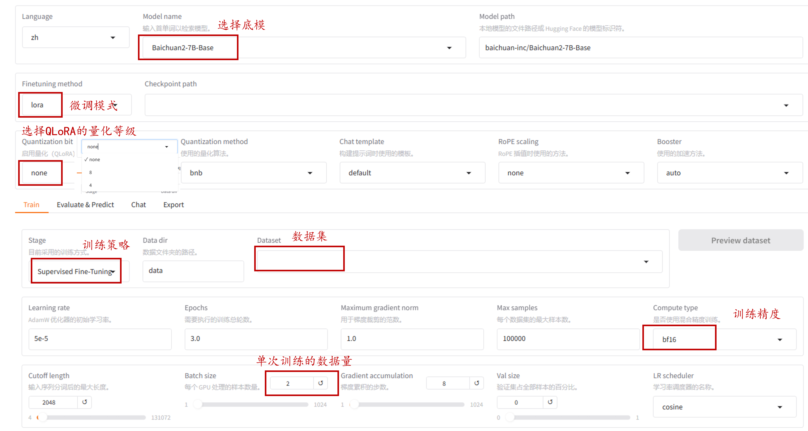
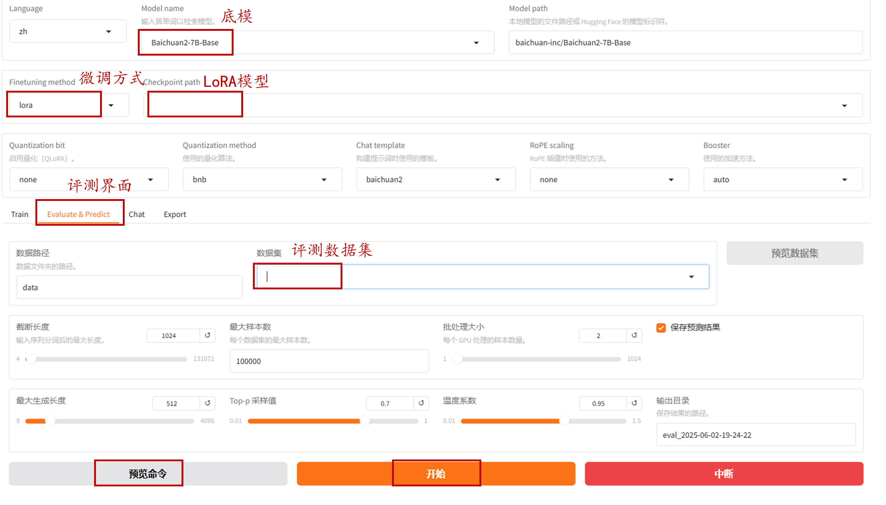
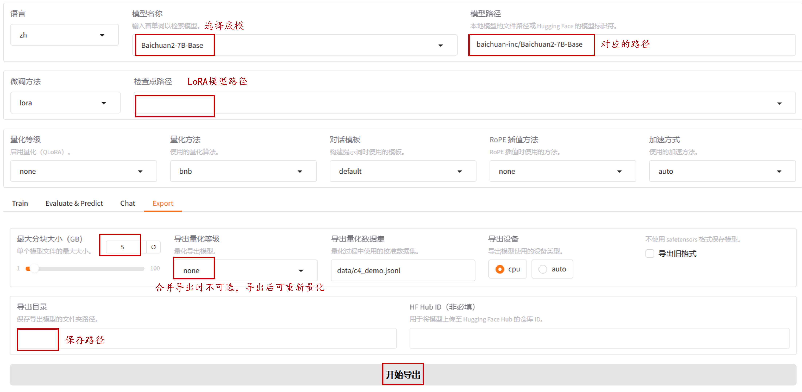

# 目录

## 第一章 Llama Factory 微调

- [1.什么是llama-factory？](#1.什么是llama-factory？)
- [2.怎么下载模型文件？](#2.怎么下载模型文件？)
- [3.怎么准备训练数据集？](#3.怎么准备训练数据集？)
- [4.怎么使用llama-factory进行LoRA和QLoRA微调？](#4.怎么使用llama-factory进行LoRA和QLoRA微调？)
- [5.怎么使用训练后的模型进行推理？](#5.怎么使用训练后的模型进行推理？)
- [6.模型评测中常见的报错处理手段？](#6.模型评测中常见的报错处理手段？)
- [7.怎么合并LoRA模型并导出？](#7.怎么合并LoRA模型并导出？)
- [8.怎么量化模型并导出？](#8.怎么量化模型并导出？)
- [9.怎么把safetensors格式转化为GGUF格式？](#9.怎么把safetensors格式转化为GGUF格式？)
- [10.怎么安装Ollama框架？](#10.怎么安装Ollama框架？)
- [11.怎么启动ollama框架？](#11.怎么启动ollama框架？)
---

## 第一章 Langraph基础知识

<h2 id="1.什么是llama-factory？">1.什么是llama-factory？</h2>

#### 1.基础定义与核心功能：

**（1） 基础定义**

[**LLaMA Factory**](https://llamafactory.readthedocs.io/zh-cn/latest/index.html) 是一个专为大型语言模型（LLM）设计的高效、易用的**训练与微调平台**。其核心目标是通过简化的流程，让用户无需编写代码即可在本地完成多种模型的微调与训练任务，支持丰富的模型类型、训练方法和优化技术。

**（2）核心功能**

- **模型种类**：LLaMA、LLaVA、Mistral、Mixtral-MoE、Qwen、Yi、Gemma、Baichuan、ChatGLM、Phi 等等。

- **训练算法**：（增量）预训练、（多模态）指令监督微调、奖励模型训练、PPO 训练、DPO 训练、KTO 训练、ORPO 训练等等。

- **运算精度**：16 比特全参数微调、冻结微调、LoRA 微调和基于 AQLM/AWQ/GPTQ/LLM.int8/HQQ/EETQ 的 2/3/4/5/6/8 比特 QLoRA 微调。

- **优化算法**：GaLore、BAdam、DoRA、LongLoRA、LLaMA Pro、Mixture-of-Depths、LoRA+、LoftQ 和 PiSSA。

- **加速算子**：FlashAttention-2 和 Unsloth。

- **推理引擎**：Transformers 和 vLLM。

- **实验监控**：LlamaBoard、TensorBoard、Wandb、MLflow、SwanLab 等等。

**（3）LLaMA Factory安装**

- **硬件环境校验**：

安装[显卡驱动](https://www.nvidia.cn/Download/index.aspx?lang=c)和[CUDA](https://developer.nvidia.com/cuda-12-2-0-download-archive/)，并使用**nvidia-smi**命令检验。

- **软件环境准备**：

安装[conda](https://www.anaconda.com/download)或者[miniconda](https://www.anaconda.com/docs/getting-started/miniconda/main)，并创建虚拟环境。

```bash
# 创建名为 llama_factory 的 Python 3.10 虚拟环境
conda create -n llama_factory python=3.10

# 激活虚拟环境
conda activate llama_factory

# 安装 PyTorch 2.3.1 + CUDA 12.1 版本（确保显卡驱动支持 CUDA 12.1）
conda install pytorch==2.3.1 torchvision==0.18.1 torchaudio==2.3.1 pytorch cuda=12.1 -c pytorch -c nvidia
```

拉取[LLaMA Factory代码](https://github.com/hiyouga/LLaMA-Factory.git)并安装。

```bash
git clone --depth 1 https://github.com/hiyouga/LLaMA-Factory.git
cd LLaMA-Factorypip install -e ".[torch,metrics]"
```

安装[模型量化](https://llamafactory.readthedocs.io/zh-cn/latest/getting_started/installation.html)的所需资源。

```bash
# QLoRA
pip install https://github.com/jllllll/bitsandbytes-windows-webui/releases/download/wheels/bitsandbytes-0.41.2.post2-py3-none-win_amd64.whl

# awq量化
pip install autoawq
```

**启动LLaMA Factory**：

```bash
# 命令行目录查看
llamafactory-cli train -h

# Web唤醒 or CUDA_VISIBLE_DEVICES=0 llamafactory-cli web
llamafactory-cli webui
```


<h2 id="2.怎么下载模型文件？">2.怎么下载模型文件？</h2>

#### 1.手动下载模型：

通过[Hugging Face](https://huggingface.co/models)下载或者魔搭社区[ModelScope](https://modelscope.cn/?from=baidu_sem)下载。以Meta-Llama3-8B-Instruct为例。

```bash
# Hugging Face
git clone https://huggingface.co/meta-llama/Meta-Llama-3-8B-Instruct

# Model Scope
git clone https://www.modelscope.cn/LLM-Research/Meta-Llama-3-8B-Instruct.git
```

#### 2.代码下载模型：

（1）Hugging Face更多的[下载方式](https://huggingface.co/meta-llama/Meta-Llama-3-8B-Instruct)

```bash
# Hugging Face下载
from transformers import AutoTokenizer, AutoModelForCausalLM
import torch

model_id = "meta-llama/Meta-Llama-3-8B-Instruct"

tokenizer = AutoTokenizer.from_pretrained(model_id)
model = AutoModelForCausalLM.from_pretrained(
    model_id,
    torch_dtype=torch.bfloat16,
    device_map="auto",
)
```

（2）魔搭社区更多的[下载方式](https://www.modelscope.cn/docs/models/download)

```bash
# 魔搭社区下载
from modelscope import snapshot_download
local_dir = ""
model_dir = snapshot_download('LLM-Research/Meta-Llama-3-8B-Instruct',local_dir=local_dir)
```

#### 3.模型验证：

（1）更多的模型推理方式：[魔搭社区](https://www.modelscope.cn/models/LLM-Research/Meta-Llama-3-8B-Instruct)，[Hugging Face](https://huggingface.co/meta-llama/Meta-Llama-3-8B-Instruct)

```bash
import transformers
import torch

model_id = "LLM-Research/Meta-Llama-3-8B-Instruct"

# 通过模型是否能正常推理验证模型是否下载成功。
pipeline = transformers.pipeline(
    "text-generation",
    model=model_id,
    model_kwargs={"torch_dtype": torch.bfloat16},
    device_map="auto",
)

messages = [
    {"role": "system", "content": "You are a pirate chatbot who always responds in pirate speak!"},
    {"role": "user", "content": "Who are you?"},
]

terminators = [
    pipeline.tokenizer.eos_token_id,
    pipeline.tokenizer.convert_tokens_to_ids("<|eot_id|>")
]

outputs = pipeline(
    messages,
    max_new_tokens=256,
    eos_token_id=terminators,
    do_sample=True,
    temperature=0.6,
    top_p=0.9,
)
print(outputs[0]["generated_text"][-1])
```


<h2 id="3.怎么准备训练数据集？">3.怎么准备训练数据集？</h2>

#### 1.训练数据集的格式：

（1）（增量）预训练数据集

```bash
# Alpaca格式
[
  {"text": "预训练文本"},
  {"text": "预训练文本"}
]
```

（2）监督微调数据集

- **Alpaca格式**：在模型微调时，instruction对应的内容会与input对应的内容拼接后作为人类指令，而output对应的内容作为模型回答。如有，system对应的内容为系统提示词，而history分别代表历史消息中每轮对话的指令和回答。

```bash
# Alpaca格式
[
  {"instruction": "人类指令（必填）"，
  "input": "人类输入（必填）"，
  "output": "模型回答（必填）"，
  "system": "系统提示词（选填）"，
  "history": [
  	["第一轮指令（选填）", "第一轮回答（选填）"],
  	["第二轮指令（选填）", "第二轮回答（选填）"]]
  }
]
```

- **sharegpt格式**：sharegpt格式支持更多的角色种类，比如human，gpt，observation，function等。其中human和observation必须出现在奇数位置，gpt和function必须出现在偶数位置。

```bash
[
	{
	"conversations":[
		{
		"from": "human",
		"value": "人类指令"，
		}，
		{
		"from": "function_call",
		"value": "工具参数"，
		}，
        {
		"from": "observation",
		"value": "工具结果"，
		}，
		{
		"from": "gpt",
		"value": "模型回答"，
		}，
	],
	"system": "系统提示词（选填）",
	"tools": "工具描述（选填）"
	}
]
```

（3）偏好数据

- **Alpaca格式**：

```bash
[
  {
    "instruction": "人类指令（必填）",
    "input": "人类输入（选填）",
    "chosen": "优质回答（必填）",
    "rejected": "劣质回答（必填）"
  }
]
```

- **sharegpt格式**

```bash
{
  "conversations": [
    {
      "from": "human",
      "value": "人类指令"
    }
  ],
  "chosen": {
    "from": "gpt",
    "value": "模型回答！"
  },
  "rejected": {
    "from": "gpt",
    "value": "模型回答"
  }
}
```

#### 2.训练数据集的配置文件：

LLaMA Factory中的文件中包含了所有可用的数据集。如果使用自定义数据集，需要在**dataset_info.json**文件中添加数据集的描述。 dataset_info.json文件位于LLaMA Factory根目录的data文件下，即**LLaMA-Factory\data**。


（1）（增量）预训练数据集

```bash
"数据集名称": {
  "file_name": "data.json",
  "columns": {
    "prompt": "text"
  }
}
```

（2）监督微调数据集

- **Alpaca格式**：

```bash
"数据集名称": {
  "file_name": "data.json",
  "columns": {
    "prompt": "instruction",
    "query": "input",
    "response": "output",
    "system": "system",
    "history": "history"
  }
}
```

- **sharegpt格式**

```bash
"数据集名称": {
  "file_name": "data.json",
  "formatting": "sharegpt",
  "columns": {
    "messages": "conversations",
    "system": "system",
    "tools": "tools"
  }
}
```

（3）偏好微调

- **Alpaca格式**：

```bash
"数据集名称": {
  "file_name": "data.json",
  "ranking": true,
  "columns": {
    "prompt": "instruction",
    "query": "input",
    "chosen": "chosen",
    "rejected": "rejected"
  }
}
```

- **sharegpt格式**

```bash
"数据集名称": {
  "file_name": "data.json",
  "formatting": "sharegpt",
  "ranking": true,
  "columns": {
    "messages": "conversations",
    "chosen": "chosen",
    "rejected": "rejected"
  }
}
```

一般只需要修改**数据集名称**和**file_name**，其他参数为默认，可以写明。更多的[训练数据格式和配置文件](https://llamafactory.readthedocs.io/zh-cn/latest/getting_started/data_preparation.html#id4)


<h2 id="4.怎么使用llama-factory进行LoRA和QLoRA微调？">4.怎么使用llama-factory进行LoRA和QLoRA微调？</h2>

#### 1.简单介绍：

LoRA：训练参数大约占完全参数的1%，非破坏性微调，可以任意切换或者组合。

QLoRA：相较于LoRA节省30%的训练内存，但多约30%的训练时长。

#### 2.Web版示例和修改事项：



#### 3.命令流示例和修改事项：

```bash
llamafactory-cli train \
--stage sft \  # 训练阶段/策略，可选：rm，pt，sft，PPO，DPO，KTO...
--do_train True \  # True用于训练，False用于评测
--model_name_or_path baichuan-inc/<model_name> \  # 模型名称/路径
--preprocessing_num_workers 16 \  # 用于数据预处理的工作线程数
--finetuning_type lora \  # 微调方法，可选：freeze，LoRA，full
--template <model_name> \  # 数据集模板，与模型一一对应
--flash_attn auto \  
--dataset_dir llama-factory/data/<dataset_folder> \  # 数据集所在目录 
--dataset <dataset_name> \  # 数据集名称，多个数据集用","隔开
--cutoff_len 1024 \  # 截断长度，表示输入序列的最大长度
--learning_rate 5e-05 \  # 学习率
--num_train_epochs 3.0 \  # 训练周期数
--max_samples 100000 \  # 用于训练的最大样本数
--per_device_train_batch_size 2 \  # 每个设备上训练的批次大小
--gradient_accumulation_steps 8 \  # 梯度累计步数
--lr_scheduler_type cosine \  # 学习率调度曲线，可选“linear”，“consince”...
--max_grad_norm 1.0 \ 
--logging_steps 5 \  # 日志保存步数
--save_steps 100 \ 
--warmup_steps 0 \
--optim adamw_torch \  # 优化器
--packing False \  # 是否启动数据打包
--report_to none \
--output_dir saves/<model_name>/lora/train \  # 保存路径
--fp16 True \  # True使用fp16
--plot_loss True \  # 是否绘制损失图
--ddp_timeout 180000000 \ 
--include_num_input_tokens_seen True \
--lora_rank 8 \   # LoRA的秩
--lora_alpha 16 \  # LoRA的alpha值，值越大，新数据对权重的影响越大。
--lora_dropout 0 \  # LoRA的dropout率，防止模型过拟合。
--lora_target all \  # 采用LoRA的目标模块，一般为all
--deepspeed cache/ds_z3_config.json   # 使用deepspeed加速训练
```

#### 4.中断后继续训练：

**只有命令行格式**

```bash
# 如果通过命令行控制，则模型为继续训练，训练集为从头训练（一般适配新数据叠加训练）
--resume_from_checkpoint /workspace/checkpoint/<model_name>/checkpoint-4000  # 不设置，脚本会自动到workspace里面寻找最新的checkpoint
--output_dir new_dir  # 不设置，默认原来的output_dir
# 其他参数同训练
```

#### 5.训练后的结果：

训练结束后，在output_dir下，

（1）adaptor开头的就是LoRA保存的结果（**主要结果**）。

（2）training_loss和training_log等记录了训练的过程。

（3）其他是训练的其他备份。


<h2 id="5.怎么使用训练后的模型进行推理？">5.怎么使用训练后的模型进行推理？</h2>

#### 1.常见推理模板：

（1）**0-shot评测**是指在没有任何针对特定任务的训练或者实例的情况下，直接评估模型在任务上的表现。

（2）**5-shot评测**是指在prompt中为模型提供几个示例，以增强模型的泛化能力。

#### 2.聊天/单次推理模式：


#### 2.批量推理模式：

（1）主流benchmark测评

llama-factory可以通过**yaml文件**和**命令流**两种方式进行测评

- [**yaml**文件](https://github.com/hiyouga/LLaMA-Factory/blob/main/examples/train_lora/llama3_lora_eval.yaml)

```bash
### model
model_name_or_path: meta-llama/Meta-Llama-3-8B-Instruct
adapter_name_or_path: saves/llama3-8b/lora/sft
trust_remote_code: true

### method
finetuning_type: lora

### dataset
task: mmlu_test  # choices: [mmlu_test, ceval_validation, cmmlu_test]
template: fewshot
lang: en
n_shot: 5

### output
save_dir: saves/llama3-8b/lora/eval

### eval
batch_size: 4
```

```bash
# YAML命令流
llamafactory-cli evalexamples/train_lora/llama3_lora_eval.yaml
```

- **命令流**

```bash
# chat模型
llamafactory-cli eval \  # eval表示评测  CUDA_VISIBLE_DEVICES=0 
--model_name_or_path /llama3/Meta-Llama-3-8B-Instruct \  # 基础模型路径
--template llama3 \  # 提示词模版
--task mmlu_test \  # 评测任务集
--lang en \  # 语言
--n_shot 5 \  # 0shot，5shot等
--batch_size 1  # 评测是的batch size

# base模型
llamafactory-cli eval \  # eval表示评测  CUDA_VISIBLE_DEVICES=0 
--model_name_or_path /llama3/Meta-Llama-3-8B-Instruct \  # 基础模型路径
--template fewshot \  # 提示词模版
--task mmlu_test \  # 评测任务集
--split validation \
--lang en \  # 语言
--n_shot 5 \  # 0shot，5shot等
--batch_size 1  # 评测是的batch size
```

- 其他更多的**开源评测项目**：[opencompass](https://github.com/open-compass/opencompass)，[EleutherAI](https://github.com/EleutherAI/lm-evaluation-harness/tree/main)

（2）垂直数据集测评

- **环境安装**
- 
``` bash
pip install jieba #中文文本分词库
pip install rouge-chinesepip install nltk #自然语言处理工具包（Natural Language Toolkit）
```

- **批量推理**

``` bash
llamafactory-cli train \  # CUDA_VISIBLE_DEVICES=0 
--stage sft \  # 监督微调
--do_predict \  # 现在是预测模式
--model_name_or_path /llama3/Meta-Llama-3-8B-Instruct \  # 底模路径
--adapter_name_or_path ./saves/LLaMA3-8B/lora/sft \  # lora路径
--eval_dataset alpaca_gpt4_zh,identity,adgen_local \  # 评测数据集
--dataset_dir ./data \  # 数据集路径
--template llama3 \  # 提示词模版，比如llama3 ,qwen 和训练微调一样
--finetuning_type lora \ #  微调方式 lora
--output_dir ./saves/LLaMA3-8B/lora/predict \  # 评估预测输出文件夹
--overwrite_cache \
--overwrite_output_dir \
--cutoff_len 1024 \  # 提示词截断长度
--preprocessing_num_workers 16 \  # 预处理数据的线程数量
--per_device_eval_batch_size 1 \  # 每个设备评估时的batch size
--max_samples 20 \  # 每个数据集采样多少用于预测对比
--predict_with_generate True  # 现在用于生成文本
```

- **批量评测**

``` bash
# 采用blue和rouge分数进行评测
llamafactory-cli train \
--stage sft \
--model_name_or_path Qwen/Qwen2-7B-Instruct-AWQ \
--preprocessing_num_workers 16 \
--finetuning_type lora \
--quantization_method bitsandbytes \  # 量化
--template qwen \
--flash_attn auto \
--dataset_dir data \
--eval_dataset huanhuan_chat,ruozhiba_gpt4 \
--cutoff_len 1024 \  # 提示词截断长度
--max_samples 100000 \
--per_device_eval_batch_size 2 \
--predict_with_generate True \
--max_new_tokens 512 \
--top_p 0.7 \
--temperature 0.95 \
--output_dir saves\Qwen2-7B-int4-Chat\lora\eval_2024-08-24-10-42-52 \
--do_predict True \
--adapter_name_or_path saves\Qwen2-7B-int4-Chat\lora\train_2024-08-18-14-43-59 \
--quantization_bit 4
```



- **测评后结果**

在output_dir下，存在：

``` bash
all_results.json # 评测结果
generated_predictions.jsonl  # 输入-输出
llamaboard_config.yaml  # 评测的参数配置
trainer_log.jsonl  # 训练日志
training_args.yaml  # 训练的参数配置
```


<h2 id="6.模型评测中常见的报错处理手段？">6.模型评测中常见的报错处理手段？</h2>

#### 1.OOM？

设置--eval_accumulation_steps=1（累计梯度）以及--per_device_eval_batch_size=1（批量大小）

#### 2.自定义评价指标？

比如F1score，recall，precision。需要在llama-factory根目录下，修改**src\llamafactory\train\sft\metric.py**和**src\llamafactory\train\sft\workflow.py**文件。

#### 3.如何得到各个评测样本单独的blue和rouge？

每个样本分开评测，一起评测得到的是平均分数。

#### 4. 模型对话/测评的时候对话不停止？

检查提示词模板是否是对应的模板，如果仍然有问题选择default模板再次尝试。


<h2 id="7.怎么合并LoRA模型并导出？">7.怎么合并LoRA模型并导出？</h2>

如果想把训练的LoRA和原始大模型进行融合并输出一个完整的模型文件，可以使用以下命令。

#### 1.命令行：

```bash
llamafactory-cli export \  # CUDA_VISIBLE_DEVICES=0是一个环境变量，设定使用第一张GPU卡
--model_name_or_path /llama3/Meta-Llama-3-8B-Instruct \  # 底模路径
--adapter_name_or_path ./saves/LLaMA3-8B/lora/sft \  # lora路径
--template llama3 \  # 提示词模版
--finetuning_type lora \  # 微调方式lora
--export_dir megred-model-path \  # 导出路径
--export_size 2 \  # 导出每个分文件大小，2表示2G，比如一个4B权重的float16的模型，模型权重8G，就会分成4个文件保存
--export_device cpu \  # 使用cpu导出模型，而非模型后面是用cpu还是gpu运行
--export_legacy_format False  # 是否使用旧格式导出，新格式默认是safetensors，旧格式就是pt，bin等格式
```

- 其他可选参数

```bash
--export_quantization_bit: 量化位数，全精度导出时，不用填写
--export_quantization_dataset: 量化校准数据集
```

#### 2.Web界面：




<h2 id="8.怎么量化模型并导出？">8.怎么量化模型并导出？</h2>

#### 1.全精度导出：

（参见Q7）“模型路径”，“检查点路径”，“最大分块大小”，“导出目录”设置成功后开始导出。注意：**”导出量化等级“**设置为None，否则无法导出。

#### 2.量化导出：

”模型路径“：改成合并后的模型路径；

”检查点路径“：取消选择；

”导出量化等级“：设置成需要的量化等级；

”导出路径“：新的保存路径。


<h2 id="9.怎么把safetensors格式转化为GGUF格式？">9.怎么把safetensors格式转化为GGUF格式？</h2>

Ollama框架可以帮助用户快速地使用本地的大语言模型，但只支持GGUF文件格式。其中，GGUF是llama cpp设计的大模型储存格式，可以对模型进行高效的压缩。

#### 1.安装GGUF库：

直接 pip 安装GGUF不是最新的版本，可能导致和最新的转换脚本会不兼容。建议直接从源码安装llama.cpp

```bash
# conda创建python=3.10版本的虚拟环境
conda create -n llama_cpp python=3.10

# 激活llama_cpp虚拟环境
conda activate llama_cpp

# torch和cuda安装等等（注意版本问题）
conda install pytorch==2.3.1 torchvision==0.18.1 torchaudio==2.3.1 pytorch-cuda=12.1 -c pytorch -c nvidia

# 拉取代码
git clone https://github.com/ggerganov/llama.cpp.git
cd llama.cpppip install --editable .
```

#### 2.格式转换：

返回llama.cpp项目根目录，会有一个官方提供的convert-hf-to-gguf.py脚本，用于完成huggingface格式（safetensors）到gguf格式的转换。

```bash
python convert_hf_to_gguf.py <需要转换的模型所在的路径> # 需要转换的模型路径
# 转化后的模型保存在同一路径下。
```

<h2 id="10.怎么安装Ollama框架？">10.怎么安装Ollama框架？</h2>

我们以ollama为例，下载地址：https://ollama.com/

ollama是go语言开发的开源项目，github地址：https://github.com/ollama/ollama

ollama文档参考：https://github.com/ollama/ollama/tree/main/docs

ollama支持的是GGUF文件格式，如果是其他文件格式需要转换成GGUF文件格式

#### 1.Linux安装：
```bash
# 注意驱动程序已经安装完成！

# 方法1：使用官方安装脚本（推荐）
curl -fsSL https://ollama.com/install.sh | sh
# curl -fsSL：安全下载脚本（-f 失败时静默，-s 静默模式，-S 显示错误，-L 跟随重定向）；管道 | sh：直接执行下载的安装脚本

# 方法2：手动安装
sudo curl -L https://ollama.com/download/ollama-linux-amd64 -o /usr/bin/ollama
sudo chmod +x /usr/bin/ollama
#下载二进制文件到系统路径 /usr/bin/ollama
# 添加可执行权限

# 创建专用系统用户
sudo useradd -r -s /bin/false -m -d /usr/share/ollama ollama

# 创建 systemd 服务文件
cat > /etc/systemd/system/ollama.service <<EOF
[Unit]
Description=Ollama Service
After=network-online.target  # 确保网络就绪后启动

[Service]
ExecStart=/usr/bin/ollama serve  # 启动命令
User=ollama  # 指定运行用户
Group=ollama  # 指定用户组
Restart=always  # 崩溃时自动重启
RestartSec=3  # 重启等待时间

[Install]
WantedBy=default.target  # 关联到默认启动组
EOF

# 启动服务
sudo systemctl daemon-reload  # 重新加载服务配置
sudo systemctl enable ollama  # 设置开机自启
sudo systemctl start ollama   # 立即启动服务

# 移除 ollama 服务
sudo systemctl stop ollama     # 停止服务
sudo systemctl disable ollama  # 禁用开机启动
sudo rm /etc/systemd/system/ollama.service  # 删除服务文件
```

#### 2.Windows安装：

不再需要Windows Subsystem for Linux！Ollama可以直接通过[下载地址](https://ollama.com/download)进行安装。

推荐系统的配置应包括windows 10及其以上版本，[NVIDIA](https://www.nvidia.cn/Download/index.aspx?lang=cn)/[AMD Radeon](https://www.amd.com/en/support)驱动程序。

```bash
# 下载好的ollama文件目录
# 程序文件目录
C:\Users\Administrator\AppData\Local\Programs\Ollama

#日志文件夹
C:\Users\Administrator\AppData\Local\Ollama

# 模型和数据文件夹，可以通过设置OLLAMA_MODELS环境变量更改
C:\Users\Administrator\.ollama
```


<h2 id="11.怎么启动ollama框架？">11.怎么启动ollama框架？</h2>

安装 Ollama Windows 预览版后，Ollama 将在后台运行， ollama 命令行可以在 cmd/powershell 等终端中使用。

```bash
# 可以设置的环境变量：模型目录和ollama api服务的url
OLLAMA_MODELS <model folder>  # 可以自定义模型目录
OLLAMA_BASE_URL http://127.0.0.1:11434  # 可以自定义端口，方便api调用
```

```bash
# 启动ollama服务
./ollama serve

# 指定模型的版本。如果模型没有下载，会自动下OLLAMA_MODELS目录中。
./ollama run gemma2:2b
```


