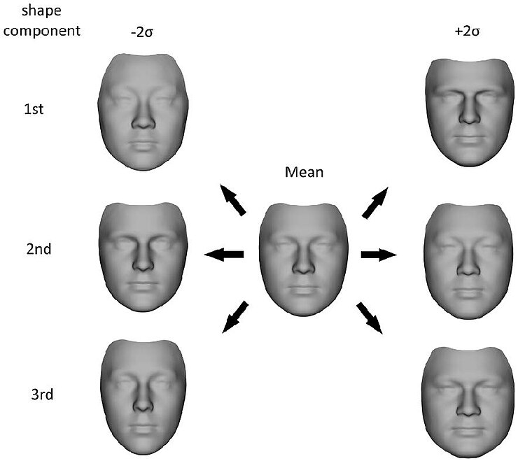

# 目录

## 第一章 3D数字人生成
- [1.3DMM (3D Morphable Model)是什么?](#1.3DMM)
- [2.3DMM有什么实际应用?](#2.3DMM有什么实际应用?)
- [3.目前有哪些开源的3D人脸重建方案?](#3.目前有哪些开源的3D人脸重建方案?)
- [4.3D人脸重建的技术难点有哪些?](#4.3D人脸重建的技术难点有哪些?)
- [5.FLAME和BFM的区别](#5.FLAME和BFM的区别)
- [6.什么是SMPL模型](#6.什么是SMPL模型)
- [7.SMPL模型的关键技术有哪些](#7.SMPL模型的关键技术有哪些)
- [8.SMPL相比传统人体模型有何优势？](#8.SMPL相比传统人体模型有何优势？)
- [9.SMPL-X对比SMPL做了什么改进](#9.SMPL-X对比SMPL做了什么改进)
- [10.单目RGB图像重建3D人体时如何处理遮挡场景](#10.单目RGB图像重建3D人体时如何处理遮挡场景)
- [11.当前参数化模型在宽松衣物模拟上的主要瓶颈是什么，如何改进](#11.当前参数化模型在宽松衣物模拟上的主要瓶颈是什么，如何改进)

<h2 id="1.3DMM">1. 3DMM (3D Morphable Model)是什么?</h2>
3DMM是一种基于统计模型的三维人脸重建方法，最早由Blanz等人在1999年提出。该方法通过扫描大量人脸数据，构建出一个包含形状和纹理信息的三维人脸模型库。通过线性组合这些模型库中的基础模型，可以生成任意新的人脸模型。

  
1. 优点：

- 模型精度高：能够重建出较为精细的人脸细节。
- 灵活性强：可以通过调整模型参数来适应不同角度和表情的人脸。
- 易于实现：算法相对简单，易于在移动端实现实时重建。
2. 缺点：

- 数据依赖性强：需要大量的人脸数据来训练模型。
- 模型细节受限：由于模型特点所致，可能无法生成非常细微的皱纹等特征。

<h2 id="2.3DMM有什么实际应用?">2. 3DMM有什么实际应用?</h2>

- 三维人脸重建：通过输入一张二维人脸图像，利用3DMM方法可以快速重建出该人脸的三维模型。这一技术在虚拟现实、增强现实等领域有着广泛的应用。

- 表情驱动动画：结合blendshape技术，可以将重建出的人脸模型与表情参数相结合，实现表情驱动动画。

- 人脸美化与特效：基于三维人脸模型，可以方便地添加各种人脸特效，如胡子、彩绘、面具等。同时，还可以根据用户的脸型特征进行个性化美化。

<h2 id="3.目前有哪些开源的3D人脸重建方案?">3. 目前有哪些开源的3D人脸重建方案?</h2>

|Rank|Method|Median(mm)    | Mean(mm) | Std(mm) |
|:----:|:-----------:|:-----------:|:-----------:|:-----------:|
| 1. | [DECA\[Feng et al., SIGGRAPH 2021\]](https://github.com/YadiraF/DECA)|1.09|1.38|1.18|
| 2. | [Deep3DFace PyTorch](https://github.com/sicxu/Deep3DFaceRecon_pytorch)|1.11|1.41|1.21|
| 3. | 	[RingNet [Sanyal et al., CVPR 2019]](https://github.com/soubhiksanyal/RingNet) | 1.21 | 1.53 | 1.31 |
| 4. | [Deep3DFace [Deng et al., CVPRW 2019]](https://github.com/microsoft/Deep3DFaceReconstruction) | 1.23 | 1.54 | 1.29 |
| 5. | [3DDFA-V2 [Guo et al., ECCV 2020]](https://github.com/cleardusk/3DDFA_V2) | 1.23 | 1.57 | 1.39 |
| 6. | [MGCNet [Shang et al., ECCV 2020]](https://github.com/jiaxiangshang/MGCNet) | 1.31 | 1.87 | 2.63 |
| 7. | [PRNet [Feng et al., ECCV 2018]](https://github.com/YadiraF/PRNet) | 1.50 | 1.98 | 1.88 |
| 8. | [3DMM-CNN [Tran et al., CVPR 2017]](https://github.com/anhttran/3dmm_cnn) | 1.84 | 2.33 | 2.05 |

<h2 id="4.目前有哪些开源的3D人脸重建方案?">4. 目前有哪些开源的3D人脸重建方案?</h2>

3D人脸重建是一个复杂且具有挑战性的领域，它涉及到从二维图像或视频中提取并重建出人脸的三维模型，其中面临着一些问题：

1. 遮挡和光照问题
在不同的光照条件下和部分遮挡的情况下准确重建人脸是一个挑战。例如，眼镜、头发或手部遮挡面部时，如何准确重建被遮挡区域是一个难题。
2. 表情和姿态变化
人脸在不同表情和姿态下的变化复杂多变，捕捉和重建这些变化需要高度精确的算法。表情和姿态的变化会影响人脸的形状和纹理，这增加了重建的复杂性。
3. 纹理和细节的捕捉
高精度地重建人脸的纹理和细节，如皮肤的毛孔和皱纹，需要非常精细的技术。这些细节对于实现逼真的3D人脸模型至关重要。

<h2 id="5.FLAME和BFM的区别">5. FLAME和BFM的区别?</h2>

FLAME是一个人头模型，BFM是一个人脸模型，直观来看FLAME的输出是一整个三维的人头结构，包括了后脑勺以及脖子，这是BFM模型没有的地方；
1. FLAME模型通过LBS显式地建模了脖子的旋转、眼球的旋转，也是BFM所不具备的；
2. FLAME模型能够表示的表情要比BFM模型更加丰富，最原始的BFM模型只在200个人数据上拟合而成，而FLAME模型是在33000个人头数据上拟合出来的结果；
3. FLAME模型没有纹理，BFM模型有纹理，但有工作将这两者的mesh对齐，从而使得在FLAME上可以使用BFM的纹理空间；
最近效果比较突出的三个工作：DECA、EMOCA、MICA.

<h2 id="6. 什么是SMPL模型">6. 什么是SMPL模型</h2>
SMPL（Skinned Multi-Person Linear Model）是一种参数化的3D人体模型，由马普所于2015年提出。其核心目标是通过低维参数（形状参数β和姿态参数θ）高效生成不同体型、姿态的裸体或紧身衣人体网格，且与图形学引擎兼容
- 输入：形状参数β（10维控制高矮胖瘦）、姿态参数θ（72维，23个关节的旋转+根节点朝向）
- 输出：包含6890个顶点和13776个面片的3D网格，以及24个关节点坐标。

<h2 id="7.SMPL模型的关键技术有哪些">7. SMPL模型的关键技术有哪些</h2>

1. 混合变形（Blend Shapes）

- 形状混合变形：由β驱动，通过PCA基学习体型差异（如身高、肩宽），使顶点从标准模板偏移。

- 姿态混合变形：由θ驱动，解决关节旋转导致的皮肤变形问题，如肘部收缩，避免传统线性蒙皮的伪影。

2. 线性混合蒙皮（Linear Blend Skinning, LBS）

基于关节点旋转和蒙皮权重矩阵，将变形后的顶点驱动到目标姿态。每个顶点受多个关节加权影响，实现平滑变形。

- 公式：$V = \sum_{i=1}^{N} W_i \cdot (R_i \cdot P_i + T_i)$
- 其中，$V$ 是顶点坐标，$W_i$ 是权重，$R_i$ 是旋转矩阵，$P_i$ 是关节位置，$T_i$ 是平移向量。

<h2 id="8.SMPL相比传统人体模型有何优势？">8. SMPL相比传统人体模型有何优势？</h2
>

1. 统一建模：单个模型适应多人体型/姿态，无需为每人单独建模。

2. 计算高效：仅需85维参数（β+θ+相机参数）即可生成网格，实时性强。

3. 兼容性强：支持导出为.obj格式，直接用于Unity、Maya等引擎。

<h2 id="9.SMPL-X对比SMPL做了什么改进">9. SMPL-X对比SMPL做了什么改进</h2>
SMPL-X是SMPL模型的扩展升级版，核心改进在于统一建模身体、手部与面部表情。具体差异包括：

1. 参数维度扩展：

- SMPL仅使用姿态参数θ（72维）和形状参数β（10维）；
- SMPL-X新增面部表情参数ψ（10维）和手部姿态参数，总参数维度提升至119维

2. 顶点与关节数：

- SMPL输出6890个顶点、24个关节点；
- SMPL-X顶点增至10475个，关节点扩展至54个（含手指、眼球等细节关节）。

3. 表达能力：

- SMPL-X可生成带表情、手势的全身动作（如微笑、握拳），而SMPL仅支持裸体躯干动作

<h2 id="10.单目RGB图像重建3D人体时如何处理遮挡场景">10.单目RGB图像重建3D人体时如何处理遮挡场景</h2>
在单目RGB图像进行3D人体重建的过程中，由于一些2D关键点信息缺失，遮挡场景极易导致几何不完整、关节位置模糊、衣物/肢体错判等问题。

1. 多模态融合：融合其他传感器数据补偿遮挡部位，如IMU传感器数据等；

2. 隐式编码：HMR2.0等端到端模型直接从像素回归参数，绕过2D关键点检测；

3. 时序约束：视频输入下使用运动平滑损失，使用多帧信息来预测当前帧的参数。

<h2 id="11.当前参数化模型在宽松衣物模拟上的主要瓶颈是什么，如何改进">11.当前参数化模型在宽松衣物模拟上的主要瓶颈是什么，如何改进</h2>

主要瓶颈有三点：

1. 拓扑限制：参数化模型多基于光滑的单一人体网格，无法自然表示宽松衣物与人体之间的分离（如裙摆飘动、袖子空隙）或布料自交。
2. 动态细节缺失：参数化模型一般通过线性blend skinning或基于pose-corrective blendshapes进行形变，难以捕捉布料的高频动态变化（褶皱、摆动）。
3. 物理一致性不足：参数化模型主要是几何拟合，缺乏物理驱动约束，因此在快速运动、重力作用或风场下无法保持真实的动力学效果。

参数化模型通常假设人体表面形状和姿态可以通过有限的低维参数（pose + shape）描述，但宽松衣物具有复杂的非刚性运动、皱褶与空气动力学效应，难以用相同框架表达，可以用以下方案进行改进：

1. 显式衣物建模

- 将衣物作为独立于人体的几何层，建立“body–cloth”分层表示。
- 可以采用 cloth mesh / garment templates 或隐式表征（如SDF/Neural Field）来允许拓扑自由度，解决衣物与人体的分离与自交问题。

2. 物理驱动与学习融合

- 在参数化模型基础上，加入轻量级布料物理模拟, 或者通过物理约束的神经网络来增强动态细节。

3. 高频细节的学习增强

- 类似Corase-to-fine的思路，先学习低频的参数化模型，再学习高频的细节，在第一阶段使用低频参数化模型，在第二阶段使用生成模型来学习高频细节（GAN, Diffusion, Implicit Neural Fields）。
