# 目录

- [1.ONNX的相关知识](#user-content-1.onnx的相关知识)
- [2.TensorRT的相关知识](#user-content-2.tensorrt的相关知识)
- [3.Nvidia 相关容器镜像使用](#user-content-3.Nvidia相关容器镜像使用)
- [4.常见推理框架介绍](#user-content-4.常见推理框架介绍)
- [5.大模型推理框架介绍](#user-content-5.大模型推理框架介绍)
- [6.TensorRT之trtexec的简单使用介绍](#user-content-6.TensorRT之trtexec的简单使用介绍)
- [7.TensorRT-llm简单介绍](#user-content-7.TensorRT-llm简单介绍)
- [8.PytorchJIT和TorchScript介绍](#user-content-8.PytorchJIT和TorchScript介绍)
- [9.ONNX模型转换及优化](#user-content-9.ONNX模型转换及优化)
- [10.onnxsim的介绍](#user-content-10.onnxsim的介绍)
- [11.TensorRT模型转换](#user-content-11.TensorRT模型转换)
- [12.现有的一些移动端开源框架？](#user-content-12.现有的一些移动端开源框架？)
- [13.介绍一下torch、torchvision、CUDA、cuDNN之间的关系](#user-content-13.介绍一下torch、torchvision、CUDA、cuDNN之间的关系)
- [14.如何将ONNX模型从GPU切换到CPU中进行缓存？](#user-content-14.如何将ONNX模型从GPU切换到CPU中进行缓存？)
- [15.有哪些常见的AI模型分布式训练方式？](#user-content-15.有哪些常见的AI模型分布式训练方式？)
- [16.有哪些常见的AI模型分布式推理方式？](#user-content-16.有哪些常见的AI模型分布式推理方式？)
- [17.LightLLm简单介绍](#user-content-17.LightLLm简单介绍)
- [18.LightLLm之TokenAttention简单介绍](#user-content-18.TokenAttention简单介绍)
- [19.LightLLm之Efficient Router简单介绍](#user-content-19.LightLLm简单介绍)
- [20.如何构建TensorRT模型的缓存机制？](#user-content-20.如何构建TensorRT模型的缓存机制？)
- [21.vLLm架构介绍？](#user-content-21.vLLm架构介绍？)
- [22.vLLm的推理服务与引擎介绍？](#user-content-22.vLLm的推理服务与引擎介绍？)
- [23.vLLm的调度器与block分配？](#user-content-23.vLLm的调度器与block分配？)
- [24.介绍一下Ollama的相关知识](#user-content-24.介绍一下Ollama的相关知识)
- [25.介绍一下Open WebUI的相关知识](#user-content-25.介绍一下Open-WebUI的相关知识)
- [26.介绍一下SGLang的相关知识](#user-content-26.介绍一下SGLang的相关知识)
- [27.SGLang前端技术介绍](#user-content-27.SGLang前端技术介绍)
- [28.SGLang后端启动阶段技术分析](#user-content-28.SGLang后端启动阶段技术分析)
- [29.SGLang后端generate阶段技术分析](#user-content-29.SGLang后端generate阶段技术分析)
- [30.SGLang之RadixAttention技术介绍](#user-content-30.SGLang之RadixAttention技术介绍)
- [31.SGLang之fast-constrained-decoding技术介绍](#user-content-31.SGLang之fast-constrained-decoding技术介绍)
- [32.KTransformers简单介绍](#user-content-32.KTransformers简单介绍)
- [33.LMDeploy简单介绍](#user-content-33.LMDeploy简单介绍)
- [34.LMDeploy之TurboMind技术介绍](#user-content-34.LMDeploy之TurboMind技术介绍)
- [35.MACE框架和NCNN框架之间有什么区别？MACE和NCNN各自的加速原理是什么样的？](#user-content-35.MACE框架和NCNN框架之间有什么区别？MACE和NCNN各自的加速原理是什么样的？)

<h2 id="1.onnx的相关知识">1.ONNX的相关知识</h2>

ONNX是一种神经网络模型的框架，其最经典的作用是作为不同框架之间的中间件，成为模型表达的一个通用架构，来增加不同框架之间的交互性。
  
<font color=DeepSkyBlue>ONNX的优势</font>：
1. ONNX的模型格式有极佳的细粒度。
2. ONNX是模型表达的一个通用架构，主流框架都可以兼容。
3. ONNX可以实现不同框架之间的互相转化。


<h2 id="2.tensorrt的相关知识">2.TensorRT的相关知识</h2>
  
TensorRT是一个高性能的深度学习前向Inference的优化器和运行的引擎。
  
<font color=DeepSkyBlue>TensorRT的核心</font>：将现有的模型编译成一个engine，类似于C++的编译过程。在编译engine过程中，会为每一层的计算操作找寻最优的算子方法，将模型结构和参数以及相应kernel计算方法都编译成一个二进制engine，因此在部署之后大大加快了推理速度。

我们需要给TensorRT填充模型结构和参数，也就是解析我们自己的模型结构和参数文件，获取数据放到其中。官方给了三种主流框架模型格式的解析器（parser），分别是：ONNX，Caffe以及TensorFlow。
  
<font color=DeepSkyBlue>TensorRT的优势</font>：

1. 把一些网络层进行了合并。具体🌰如下图所示。
2. 取消一些不必要的操作。比如不用专门做concat的操作等。
3. TensorRT会针对不同的硬件都相应的优化，得到优化后的engine。
4. TensorRT支持INT8和FP16的计算，通过在减少计算量和保持精度之间达到一个理想的trade-off。
  


<h2 id="3.Nvidia相关容器镜像使用">3.Nvidia相关容器镜像使用</h2>

通过拉取镜像创建容器，可以免去繁琐的繁琐的环境安装步骤，只需要宿主机上安装Nvidia驱动即可，拉取的镜像中已经配置好cuda，tensorrt，tritonserver等相关需要的环境。以tritonserver为例介绍如何使用镜像，以及介绍triton框架的使用
## 环境搭建
1) 镜像拉取
```sh
docker pull nvcr.io/nvidia/tritonserver:23.01-py3
```
在拉取镜像的时候，需要检查镜像版本和NVIDIA驱动是否匹配，镜像的版本号和驱动版本存在对应关系,参考文档：<https://docs.nvidia.com/deeplearning/triton-inference-server/release-notes/index.html>

2) 启动镜像
```sh
docker run -dt --gpus=all -p 1237:22 --name triton -v /home/xxiao/code:/workspace/code nvcr.io/nvidia/tritonserver:23.01-py3
```
--gpus该参数在下文config中详细讲解
报错解决：

运行docker的时候添加参数：
```sh
--cap-add=SYS_ADMIN --security-opt seccomp=unconfined
```

3) 进去docker镜像后，执行
```sh
tritonserver --model-repository=./model_repository
```
--model-repository：该参数指定模型路径，必须要有
--help：查看其他参数
日志相关：--log-verbose=1 --log-info=true
目录结构如下

triton server会加载该目录下的所有模型，在资源足够的情况下，可以通过一个triton server启动所有的推理服务
config.pbtxt内容如下
```
name: "sam_embedding_onnx"
platform: "onnxruntime_onnx"
max_batch_size : 0
input [
  {
    name: "images"
    data_type: TYPE_FP32
    dims: [ 1, 3, 1024, 1024 ]
  }
]
output [
  {
    name: "image_embeddings"
    data_type: TYPE_FP32
    dims: [ 1, 256, 64, 64 ]
  },
  {
    name: "interm_embeddings"
    data_type: TYPE_FP32
    dims: [ 1, 32, 256, 256 ]
  }
]
instance_group [
    {
      count: 1
      kind: KIND_GPU
      gpus: [1]
    }
  ]
```
各个字段含义
```txt
name：model-repository目录下的模型名称，需要保持一致
platform：推理框架选择，实例选择的是onnx模型，对应的为onnxruntime_onnx
常见平台有以下：
    1、tensorflow_savedmodel: TensorFlow SavedModel 格式。
    2、tensorflow_graphdef: TensorFlow GraphDef 格式。
    3、tensorflow_cc: TensorFlow C++ 库。
    4、pytorch_libtorch: PyTorch 的 LibTorch C++ 库。
    5、onnxruntime_onnx: ONNX 运行时（ONNX Runtime）。
    6、tensorrt_plan: NVIDIA TensorRT 的计划模型（plan file）。
    7、custom: 自定义平台，允许用户自行实现推理后端。
max_batch_size：当定义为0时，动态输入
input：定义模型的输入节点，（目前看来必须满足NCHW和NHWC格式），
    name：输入节点名称
    data_type：根据实际数据精度填写
    dims：输入shape
output：模型输出节点，同输入信息定义
instance_group：设备信息定义
    count：启动实例个数
    kind：设备类型（CPU、GPU，可能NPU）
    gpus：模型运行在那个GPU上。
triton server服务是以多进程的方式运行，--gpus指定了多少块GPU就会启动多少个进程，模型会运行在instance_group/gpus指定的gpu上，若不指定gpu，则在所有的gpu上运行
```
启动triton server服务成功后，会开启三个端口供访问，

8000：HTTPService
8001：GRPCInferenceService
8002：Metrics Service

客户端访问实例：
```python
import numpy as np
import tritonclient.http as httpclient
triton_client = httpclient.InferenceServerClient(url="localhost:8000", verbose=False)
model_name = "sam_embedding_onnx"
inputs = []
inputs.append(httpclient.InferInput('images',[1, 3, 1024, 1024], "FP32"))
inputs[0].set_data_from_numpy(np.random.randn(1, 3, 1024, 1024).astype(np.float32),binary_data=False)

outputs = []
outputs.append(httpclient.InferRequestedOutput('image_embeddings'))
outputs.append(httpclient.InferRequestedOutput('interm_embeddings'))
results = triton_client.infer(model_name,inputs, outputs=outputs)
print(results.as_numpy('interm_embeddings').shape)
print(results.as_numpy('image_embeddings').shape)
```
triton server只负责模型加载和推理，有关具体模型的前后处理，需要在客户端代码中实现
### 参考项目
https://github.com/yuxiaoranyu/stable_diffusion_trt_triton
该项目使用tensorrt和triton部署stable_diffusion 图生图模块


<h2 id="4.常见推理框架介绍">4.常见推理框架介绍</h2>

### onnxruntime
onnxruntime是微软推出的一款推理框架，用户可以非常便利的用其运行一个onnx模型。onnxruntime支持多种运行后端，包括CPU、GPU、TensorRT、DML等。
### TensorRT
TensorRT是一个高性能的深度学习推理优化器，可以为深度学习应用提供低延迟、高吞吐率的模型部署。TensorRT可用于对超大规模数据中心、嵌入式平台或自动驾驶平台进行推理加速。TensorRT现在已经能支持TensorFlow、caffe、mxnet、pytorch等几乎所有的深度学习框架，将TensorRT和Nvidia的GPU结合起来，能在几乎所有的框架中进行快速和高效的部署推理。
### OpenVino
OpenVino是英特尔针对自家硬件平台开发的一套深度学习工具库，包含推理库、模型优化等一些列与深度学习模型部署相关的功能。OpenVino是一个比较成熟且仍在快速发展的推理库，提供的demo和sample都很充足，上手比较容易，可以用来快速部署开发，尤其是Intel的硬件平台上性能超过了大部分的开源库。
### Tengine
Tengine是OPEN AI LAB（开放智能）推理的AI推理框架，致力于解决AIoT应用场景下多厂家多种类的边缘AI芯片与多样的训练框架、算法模型之间的相互兼容适配，同时提升算法在芯片上的运行性能，将从云端完成训练后的算法高效迁移到异构的边缘智能芯片上执行，缩短AI应用开发与部署周期，助力加速AI产业化落地。
### NCNN
NCNN是一个为手机端极致优化的高性能神经网络前向计算框架。NCNN从设计之初深刻考虑手机端的部署和应用。无第三方依赖、跨平台，手机端cpu的速度快于目前所有已知的开源框架。目前已在腾讯多款应用中使用，如QQ、Qzone、微信等。
### MNN
MNN是一个高效、轻量的深度学习框架。它支持深度模型推理与训练，尤其在端侧的推理与训练性能在业界处于领先地位。目前MNN已经在阿里巴巴的手机淘宝、天猫、优酷、钉钉、闲鱼等20多个app中使用，覆盖直播、短视频、搜多推荐、商品图像搜索、互动营销、券已发放、安全风控等70多个场景。
### TFLite
TensorFlowLite是Google在2017年5月推出的轻量级机器学习解决方案，主要针对移动端设备和嵌入式设备。针对移动端设备特点，TensorFlow Lite是用来诸多技术对内核进行了定制优化，预熔激活，量子化内核。


<h2 id="5.大模型推理框架介绍">5.大模型推理框架介绍</h2>

### vLLM

vLLM全称Virtual Large Language Model，由Nvidia开源，旨在降低大模型推理的显存占用。其核心思想是将模型的一部分保存在CPU内存或硬盘上，只将当前计算所需的部分加载到GPU显存中，从而打破GPU显存限制。

vLLM支持PyTorch和FasterTransformer后端，可无缝适配现有模型。使用vLLM，在配备96GB内存+440GB A100的服务器上可运行1750亿参数模型，在配备1.5TB内存+880GB A100的服务器上可运行6万亿参数模型。

### TensorRT-LLM

Tensorrt-LLM是Nvidia在TensorRT推理引擎基础上，针对Transformer类大模型推理优化的框架。主要特性包括：
1) 支持多种优化技术，如kernel融合、矩阵乘优化、量化感知训练等，可提升推理性能
2) 支持多GPU多节点部署，可扩展到万亿规模参数
3) 提供Python和C++ API，易于集成和部署
在Nvidia测试中，基于OPT-30B在A100上的推理，Tensorrt-LLM可实现最高32倍加速。

### DeepSpeed

DeepSpeed是微软开源的大模型训练加速库，最新的DeepSpeed-Inference也提供了推理加速能力，主要特点包括：
1) 通过内存优化、计算优化、通信优化，降低推理延迟和提升吞吐
2) 支持多GPU横向扩展，单卡可推理数百亿参数模型
3) 提供Transformer、GPT、BERT等模型的推理示例
4) 集成Hugging Face transformers库，使用简单

在GPT-NeoX测试中，基于DeepSpeed的推理相比原生PyTorch可实现7.7倍加速。

### Text Generation Inference

Text Generation Inference(简称TextGen)是Hugging Face主导的开源推理框架，旨在为自然语言生成模型如GPT、OPT等提供高性能推理。主要特点包括：
1) 高度优化的核心代码，支持FP16、int8等多种精度
2) 支持多GPU多节点扩展，可推理万亿规模参数
3) 良好的用户体验，提供Python高层API，简化开发
4) 支持Hugging Face生态中的模型，如GPT2、GPT-Neo、BLOOM等

在OPT-175B基准测试中，TextGen可实现最高17倍推理加速。

### Torch Dynamo

Torch Dynamo是PyTorch官方开发的一种动态图优化工具，旨在提高PyTorch模型的执行效率。它通过在运行时捕获和跟踪Python代码的执行，动态地将PyTorch的eager模式（即时模式）代码转换为更高效的图模式代码。这一转换使得 PyTorch模型在执行时能够更加接近静态图框架的性能，同时仍然保持PyTorch动态计算图的灵活性。

Torch Dynamo的核心思想是：

1. **捕获 Python 函数的执行**：在 Python 代码执行时，Torch Dynamo 会捕获函数的执行，分析其逻辑和计算图结构。
2. **动态转换**：它将捕获的代码转换为一个静态的、高效的中间表示（IR）。这种表示更容易进行进一步的优化，例如内存管理、算子融合等。
3. **执行优化的代码**：在转换完成后，优化后的代码会被重新执行，以获得更高的执行性能。

这个过程是透明的，对于用户来说，不需要修改现有的 PyTorch 代码。

### FullyShardedDataParallel (FSDP)

**FullyShardedDataParallel (FSDP)** 是 PyTorch 提供的一种分布式数据并行训练技术，专门设计用于大规模模型的高效训练。它通过将模型的参数、梯度和优化器状态全面分片（sharding），并分布在多个 GPU 上，以优化内存使用，提升训练效率。FSDP 尤其适用于处理超大模型，这些模型通常无法在单个 GPU 内存中完全容纳。

FSDP 的工作原理：

1. **全分片**：
   - 在传统的数据并行方法中，每个 GPU 上通常保存一份完整的模型副本，这样在处理超大模型时，会导致显存的巨大浪费。FSDP 的核心思想是将模型的参数、梯度和优化器状态按需分片，并分布在不同的 GPU 上。
   - 在每次前向和后向传播时，FSDP 会动态地将所需的分片参数加载到 GPU 上，并在计算完梯度后重新分片。

2. **高效的内存管理**：
   - 通过分片技术，FSDP 可以极大地减少每个 GPU 所需的显存，从而能够处理更大的模型或在同一显存中容纳更多的模型参数。
   - 这种内存优化的机制使得即便是在显存资源受限的环境下，也能进行超大规模模型的训练。

3. **与 ZeRO 的关系**：
   - FSDP 是一种全分片的数据并行方法，与 DeepSpeed 的 ZeRO 优化策略有一些相似之处。ZeRO 也通过将模型参数、梯度和优化器状态分散到多个设备上来减少显存使用。FSDP 可以被视为 ZeRO 的一种 PyTorch 原生实现，它与 PyTorch 的其他分布式训练功能高度集成。

### Megatron-LM

**Megatron-LM** 是由 NVIDIA 开发的一种用于训练超大规模语言模型的深度学习框架。随着语言模型规模的不断扩大，训练这些模型变得越来越具有挑战性，特别是在处理数十亿到数万亿参数的模型时。Megatron-LM 专门设计来解决这些挑战，它通过多种并行化技术（如模型并行、数据并行和流水线并行）实现了高效的大规模模型训练。

Megatron-LM 的工作原理：

1. **模型并行（Model Parallelism）**：
   - 在模型并行中，Megatron-LM 将一个巨大的模型分割成多个部分，每个部分分配给不同的 GPU。这种方法允许单个模型跨多个 GPU 进行训练，从而突破单个 GPU 显存的限制。
   - 具体实现包括将神经网络层或层内的参数矩阵划分到不同的设备上，并行计算。

2. **数据并行（Data Parallelism）**：
   - Megatron-LM 也使用了数据并行技术，即将输入数据批次拆分为多个子批次，每个子批次在不同的 GPU 上独立计算梯度。然后，梯度在所有 GPU 之间进行同步，以确保模型参数的一致更新。
   - 数据并行是深度学习中常见的并行化方法，特别是在处理大型数据集时非常有效。

3. **流水线并行（Pipeline Parallelism）**：
   - 为了进一步提高并行计算效率，Megatron-LM 引入了流水线并行。这种方法将模型的前向和后向传播过程划分为多个阶段，每个阶段在不同的 GPU 上执行。通过流水线并行，不同阶段可以同时进行，从而减少计算的等待时间，提高 GPU 利用率。
   - 流水线并行类似于工厂的流水线作业，不同的计算任务在不同的时刻完成，但最终达成整体的并行加速效果。

4. **张量并行（Tensor Parallelism）**：
   - Megatron-LM 还支持张量并行，它进一步将模型的张量操作分解为更小的计算单元，这些单元分布在多个 GPU 上。这种方法特别适合处理超大规模的矩阵乘法等操作。

<h2 id="6.TensorRT之trtexec的简单使用介绍">6.TensorRT之trtexec的简单使用介绍</h2>

### 简介
trtexec是一种无需开发自己的应用程序即可快速使用 TensorRT 的工具。trtexec工具有三个主要用途：
1) 它对于在随机或用户提供的输入数据上对网络进行基准测试很有用。
2) 它对于从模型生成序列化引擎很有用。
3) 它对于从构建器生成序列化时序缓存很有用。
### 转换模型（onnx为例）
1) 将ONNX模型转换为静态batchsize的TensorRT模型，启动所有精度以达到最佳性能，工作区大小设置为1024M
```
trtexec --onnx=mnist.onnx --explicitBatch --saveEngine=mnist.trt --workspace=1024 --best
```
2) 将ONNX模型转换为动态batchsize的TensorRT模型，启动所有精度以达到最佳性能，工作区大小设置为1024M
```
trtexec --onnx=mnist.onnx --minShapes=input:<shape_of_min_batch> --optShapes=input:<shape_of_opt_batch> --maxShapes=input:<shape_of_max_batch> --saveEngine=mnist.trt --best --workspace=1024 --best
```
–minShapes，–optShapes ，–maxShapes必须全部设置，设置的形式为：NCHW

### 运行模型
1) 在具有静态输入形状的全维模式下运行 ONNX 模型
```
trtexec --onnx=model.onnx --shapes=input:32x3x224x224
```
2) 使用给定的输入形状在全维模式下运行 ONNX 模型
```
trtexec --onnx=model.onnx --shapes=input:32x3x224x224
```
3) 使用一系列可能的输入形状对 ONNX 模型进行基准测试
```
trtexec --onnx=model.onnx --minShapes=input:1x3x224x224 --optShapes=input:16x3x224x224 --maxShapes=input:32x3x224x224 --shapes=input:5x3x224x224
```
### 网络性能测试
1) 加载转换后的TensorRT模型进行性能测试，指定batch大小
```
trtexec --loadEngine=mnist16.trt --batch=1
```
2) 收集和打印时序跟踪信息
```
trtexec --deploy=data/AlexNet/AlexNet_N2.prototxt --output=prob --exportTimes=trace.json
```
3) 使用多流调整吞吐量<br>调整吞吐量可能需要运行多个并发执行流。例如，当实现的延迟完全在所需阈值内时，我们可以增加吞吐量，即使以一些延迟为代价。例如，为批量大小 1 和 2 保存引擎并假设两者都在 2ms 内执行，延迟阈值：
```
trtexec --deploy=GoogleNet_N2.prototxt --output=prob --batch=1 --saveEngine=g1.trt --int8 --buildOnly
trtexec --deploy=GoogleNet_N2.prototxt --output=prob --batch=2 --saveEngine=g2.trt --int8 --buildOnly
```
保存的引擎可以尝试找到低于 2 ms 的组合批次/流，以最大化吞吐量：
```
trtexec --loadEngine=g1.trt --batch=1 --streams=2
trtexec --loadEngine=g1.trt --batch=1 --streams=3
trtexec --loadEngine=g1.trt --batch=1 --streams=4
trtexec --loadEngine=g2.trt --batch=2 --streams=2
```
### 参考文档
<https://github.com/NVIDIA/TensorRT/tree/main/samples/trtexec>


<h2 id="7.TensorRT-llm简单介绍">7.TensorRT-llm简单介绍</h2>

### 简介
TensorRT-LLM（NVIDIA官方支持）用于在NVIDIA GPU平台做大模型推理部署工作。<br>
TRT-LLM基于TensorRT来将LLM构建为engine模型

TRT-LLM目前支持多种大模型，可以直接使用，在example中，而且还在以非常快的速度支持新的模型

TRT-LLM支持单机单卡、单机多卡（NCCL）、多机多卡，支持量化（8/4bit）

TRT-LLM的runtime支持chat和stream两种模式

TRT-LLM当前支持python和cpp（可以直接使用cpp，也可以使用cpp的bybind接口）两种模式的runtime

通过example下的各个模型的build.py来构建离线模型，通过example下的run.py（不同的业务适配一下run.py中的逻辑即可）来运行模型

TRT-LLM默认支持kv-cache，支持PagedAttention，支持flashattention，支持MHA/MQA/GQA等

### 安装使用
docker编译安装
```
// docker方式编译
step1: 安装操作系统匹配的docker，参考docker安装方式即可
step2: 下载 tensorrt-llm代码

# TensorRT-LLM uses git-lfs, which needs to be installed in advance.
apt-get update && apt-get -y install git git-lfs

git clone https://github.com/NVIDIA/TensorRT-LLM.git
cd TensorRT-LLM
git submodule update --init --recursive
git lfs install
git lfs pull
// 上述每步都需要执行成功，由于网络问题，可能会失败，失败后重复执行，直到成功位置
// git lfs 这两步会将 tensorrt-llm/cpp/tensort-llm/batch_manager 下面的静态库 下载下来，后来编译会用到
batch_manager/
├── aarch64-linux-gnu
│   ├── libtensorrt_llm_batch_manager_static.a
│   ├── libtensorrt_llm_batch_manager_static.pre_cxx11.a
│   └── version.txt
├── x86_64-linux-gnu
│   ├── libtensorrt_llm_batch_manager_static.a
│   └── libtensorrt_llm_batch_manager_static.pre_cxx11.a
└── x86_64-windows-msvc
    └── tensorrt_llm_batch_manager_static.lib

step3：编译llm，提供了两种方式
方式一：一步到位的编译方式，推荐这种
make -C docker release_build  // 编译，此处cuda/tensorrt/cudnn/nccl等版本都是采用编译脚本中默认设置的
                              // 编译成功后，为一个docker镜像，大概有20多G，另外，docker方式编译对磁盘空间大小有要求
                              // 目前估计需要50G左右，如果docker的根目录空间不够，编译也会失败，可以通过给docker根目
                              //  扩容或者修改根目录来实现，保证编译空间的足够

make -C docker release_run // 运行编译成功的镜像, 此处需要有gpu办卡，如果在没有gpu的环境上，可以编译成功，但是执行会失败

方式二：逐步进行编译，编译结果和上述一致
```
编译有2种包，一种是仅包含cpp的代码包，一种是cpp+python的wheel包
```
//  仅cpp的代码包 ： 仅编译 TensorRT-LLM/cpp 下面的c++和cuda代码
// cpp + python的包： 编译 TensorRT-LLM/cpp 和 TensorRT-LLM/tensortrt-llm 下面的c++ cuda python代码
```
### 参考文档
<https://github.com/NVIDIA/TensorRT-LLM/blob/release/0.5.0/docs/source/installation.md>


<h2 id="8.PytorchJIT和TorchScript介绍">8.PytorchJIT和TorchScript介绍</h2>

### 简介
PyTorch支持两种模式：eager模式和script模式。eager模式主要用于模型的编写、训练和调试，script模式主要是针对部署的，其包含PytorchJIT和TorchScript  <br>
script模式使用torch.jit.trace和torch.jit.script创建一个PyTorch eager module的中间表示（intermediate representation, IR），IR 经过内部优化，并在运行时使用 PyTorch JIT 编译。PyTorch JIT 编译器使用运行时信息来优化 IR。该 IR 与 Python 运行时是解耦的。
PyTorch JIT（Just-In-Time Compilation）是 PyTorch 中的即时编译器。

它允许你将模型转化为 TorchScript 格式，从而提高模型的性能和部署效率。
JIT 允许你在动态图和静态图之间无缝切换。你可以在 Python 中以动态图的方式构建和调试模型，然后将模型编译为 TorchScript 以进行优化和部署。
JIT 允许你在不同的深度学习框架之间进行模型转换，例如将 PyTorch 模型转换为 ONNX 格式，从而可以在其他框架中运行。
TorchScript 是 PyTorch 提供的一种将模型序列化以便在其他环境中运行的机制。它将 PyTorch 模型编译成一种中间表示形式，可以在没有 Python 解释器的环境中运行。这使得模型可以在 C++ 等其他语言中运行，也可以在嵌入式设备等资源受限的环境中实现高效的推理。


TorchScript 的特性和用途：
1) 静态图表示形式：TorchScript 是一种静态图表示形式，它在模型构建阶段对计算图进行编译和优化，而不是在运行时动态构建。这可以提高模型的执行效率。
2) 模型导出：TorchScript 允许将 PyTorch 模型导出到一个独立的文件中，然后可以在没有 Python 环境的设备上运行。
3) 跨平台部署：TorchScript 允许在不同的深度学习框架之间进行模型转换，例如将 PyTorch 模型转换为 ONNX 格式，从而可以在其他框架中运行。
4) 模型优化和量化：通过 TorchScript，你可以使用各种技术（如量化）对模型进行优化，从而减小模型的内存占用和计算资源消耗。
5) 融合和集成：TorchScript 可以帮助你将多个模型整合到一个整体流程中，从而提高系统的整体性能。
6) 嵌入式设备：对于资源受限的嵌入式设备，TorchScript 可以帮助你优化模型以适应这些环境。

为什么要用script模式呢？

1) 可以脱离python GIL以及python runtime的限制来运行模型，比如通过LibTorch通过C++来运行模型。这样方便了模型部署，例如可以在IoT等平台上运行。例如这个tutorial，使用C++来运行pytorch的model。
2) PyTorch JIT是用于pytorch的优化的JIT编译器，它使用运行时信息来优化 TorchScript modules，可以自动进行层融合、量化、稀疏化等优化。因此，相比pytorch model，TorchScript的性能会更高。
### 使用
```
import torch

# 假设已经存在模型model
# 创建模型输入tensor
input_tensor = torch.rand(1, 3, 640, 640)
jit_model = torch.jit.trace(model, input_tensor)
torch.jit.save(jit_model, "model.pt")
```


<h2 id="9.ONNX模型转换及优化">9.ONNX模型转换及优化</h2>

### 转换
```
import torch

# 假设已经存在模型model
# 创建模型输入tensor
input_tensor = torch.rand(1, 3, 640, 640)
input_names = ["input"]
output_names = ["output"]
# 设置动态shape
dynamic_axes = {'input': {0: 'batch_size'}, 
                'output': {0: 'batch_size'}}
onnx_model = "model.onnx"
torch.onnx.export(model, input_tensor, 'model.onnx', input_names=input_names, output_names=output_names, dynamic_axes=dynamic_axes, opset_version=13)
```
当模型较大时，需要进行一定优化，如stable diffusers中的unet模型
### 优化
```
import onnx
import onnx_graphsurgeon as gs
import torch
from onnx import shape_inference
from polygraphy.backend.onnx.loader import fold_constants
from torch.onnx import export

class Optimizer:
    def __init__(self, onnx_graph, verbose=False):
        self.graph = gs.import_onnx(onnx_graph)
        self.verbose = verbose

    def info(self, prefix):
        if self.verbose:
            print(
                f"{prefix} .. {len(self.graph.nodes)} nodes, {len(self.graph.tensors().keys())} tensors, {len(self.graph.inputs)} inputs, {len(self.graph.outputs)} outputs"
            )

    def cleanup(self, return_onnx=False):
        self.graph.cleanup().toposort()
        if return_onnx:
            return gs.export_onnx(self.graph)

    def select_outputs(self, keep, names=None):
        self.graph.outputs = [self.graph.outputs[o] for o in keep]
        if names:
            for i, name in enumerate(names):
                self.graph.outputs[i].name = name

    def fold_constants(self, return_onnx=False):
        onnx_graph = fold_constants(gs.export_onnx(self.graph), allow_onnxruntime_shape_inference=True)
        self.graph = gs.import_onnx(onnx_graph)
        if return_onnx:
            return onnx_graph

    def infer_shapes(self, return_onnx=False):
        onnx_graph = gs.export_onnx(self.graph)
        if onnx_graph.ByteSize() > 2147483648:
            raise TypeError("ERROR: model size exceeds supported 2GB limit")
        else:
            onnx_graph = shape_inference.infer_shapes(onnx_graph)

        self.graph = gs.import_onnx(onnx_graph)
        if return_onnx:
            return onnx_graph

def optimize(onnx_graph, name, verbose):
    opt = Optimizer(onnx_graph, verbose=verbose)
    opt.info(name + ": original")
    opt.cleanup()
    opt.info(name + ": cleanup")
    opt.fold_constants()
    opt.info(name + ": fold constants")
    opt.infer_shapes()
    opt.info(name + ': shape inference')
    onnx_opt_graph = opt.cleanup(return_onnx=True)
    opt.info(name + ": finished")
    return onnx_opt_graph

model_path = "model.onnx"
shape_inference.infer_shapes_path(model_path, model_path)
model_opt_graph = optimize(onnx.load(model_path), name="model", verbose=True)
```


<h2 id="10.onnxsim的介绍">10.onnxsim的介绍</h2>

### 简介
ONNX-Simplifier（简称onnxsim）是一个开源工具，用于简化ONNX（Open Neural Network Exchange）模型。它通过合并模型中的冗余节点和优化操作来减少模型的大小和复杂性，从而提高模型的执行效率。这个工具是由华为诺亚方舟实验室开发的，并且是作为Python包发布的。

onnxsim的主要功能包括：

1) 节点融合：将多个操作融合为一个操作，减少节点数量，从而减少模型的大小和提高推理速度。
2) 冗余操作消除：移除模型中的冗余操作，如恒等操作或对结果没有影响的操作。
3) 常数折叠：在模型中直接计算可导出为常数的表达式，减少推理时的计算量。
4) 优化形状和类型：优化模型中的张量形状和类型，以减少内存使用和提高效率。
### 使用
```
import onnx
from onnxsim import simplify

# 加载ONNX模型
model_path = 'model.onnx'
onnx_model = onnx.load(model_path)
# 简化模型
model_simplified, check = simplify(onnx_model)
# 检查简化是否成功
assert check, "Simplified ONNX model could not be validated"
# 保存简化后的模型
onnx.save(model_simplified, 'path/to/simplified/model.onnx')
```
命令行使用
```
python -m onnxsim model.onnx model_sim.onnx

```


<h2 id="11.TensorRT模型转换">11.TensorRT模型转换</h2>

假设已经存在onnx模型
```
import sys
import tensorrt as trt

def convert_models(onnx_path: str, output_path: str, fp16: bool = False):

    # 初始化配置
    TRT_LOGGER = trt.Logger(trt.Logger.VERBOSE)
    TRT_BUILDER = trt.Builder(TRT_LOGGER)
    TRT_RUNTIME = trt.Runtime(TRT_LOGGER)
    # 创建一个网络定义，并设置EXPLICIT_BATCH标志以支持批处理大小。
    network = TRT_BUILDER.create_network(
        1 << int(trt.NetworkDefinitionCreationFlag.EXPLICIT_BATCH))
    onnx_parser = trt.OnnxParser(network, TRT_LOGGER)
    print("onnx_path: ", onnx_path)
    parse_success = onnx_parser.parse_from_file(onnx_path)
    for idx in range(onnx_parser.num_errors):
        print(onnx_parser.get_error(idx))
    if not parse_success:
        sys.exit("ONNX model parsing failed")
    print("Load Onnx model done")

    # 获取网络的输入和输出信息
    inputs = [network.get_input(i) for i in range(network.num_inputs)]
    outputs = [network.get_output(i) for i in range(network.num_outputs)]
    for inp in inputs:
        print(f'input "{inp.name}" with shape{inp.shape} {inp.dtype}')
    for out in outputs:
        print(f'output "{out.name}" with shape{out.shape} {out.dtype}')
    # 创建一个优化配置文件profile，并设置输入节点的动态形状范围。
    profile = TRT_BUILDER.create_optimization_profile()

    profile.set_shape("input", (1, 3, 224, 224), (1, 3, 640, 640), (1, 3, 640, 640))
    
    # 创建一个构建器配置config，并将优化配置文件添加到其中。如果需要，还可以设置FP16精度模式。
    config = TRT_BUILDER.create_builder_config()
    config.add_optimization_profile(profile)
    config.set_preview_feature(trt.PreviewFeature.DISABLE_EXTERNAL_TACTIC_SOURCES_FOR_CORE_0805, True)
    if fp16:
        config.set_flag(trt.BuilderFlag.FP16)

    # 构建TensorRT engine，并将其序列化
    plan = TRT_BUILDER.build_serialized_network(network, config)
    if plan is None:
        sys.exit("Failed building engine")
    print("Succeeded building engine")
    # 反序列化engine，并保存
    engine = TRT_RUNTIME.deserialize_cuda_engine(plan)

    # save TRT engine
    with open(output_path, "wb") as f:
        f.write(engine.serialize())

if __name__ == "__main__":
    onnx_path = "model.onnx"
    output_path = "model.plan"
    fp16 = True
    convert_models(onnx_path, output_path, fp16)

```

<h2 id="12.现有的一些移动端开源框架？">12.现有的一些移动端开源框架？</h2>

1. NCNN，其GitHub地址：https://github.com/Tencent/ncnn
2. Paddle Lite，其GitHub地址：https://github.com/PaddlePaddle/paddle-mobile
3. MACE（ Mobile AI Compute Engine），其GitHub地址：https://github.com/XiaoMi/mace
4. TensorFlow Lite，其官网地址：https://www.tensorflow.org/lite?hl=zh-cn
5. PocketFlow，其GitHub地址：https://github.com/Tencent/PocketFlow
6. 等等。。。


<h2 id="13.介绍一下torch、torchvision、CUDA、cuDNN之间的关系">13.介绍一下torch、torchvision、CUDA、cuDNN之间的关系</h2>

**Torch**、**Torchvision**、**CUDA** 和 **cuDNN** 是在AI领域研发中紧密相关的组件。它们共同作用，尤其是在 **PyTorch** 生态系统中，用于加速神经网络模型的开发与训练。下面是它们之间的详细关系解释：

### 1. **PyTorch（Torch）**
   - **PyTorch** 是一个开源的深度学习框架，简化了神经网络的构建、训练和推理过程。**Torch** 是 PyTorch 的核心模块，它提供了张量操作（类似于 NumPy，但支持 GPU 加速）、自动微分和神经网络模块。
   - PyTorch 支持自动梯度计算，允许在 GPU 上快速进行张量操作和模型训练，这正是通过 CUDA 和 cuDNN 的支持来实现 GPU 加速。

### 2. **Torchvision**
   - **Torchvision** 是 PyTorch 的官方扩展库，专门用于计算机视觉领域。它包含：
     - **数据集加载器**：如 CIFAR-10、ImageNet 等常见的数据集。
     - **预训练模型**：如 ResNet、VGG 等常用的卷积神经网络（CNN），可以直接加载并使用，适合迁移学习。
     - **图像处理工具**：包括图像的增广（如裁剪、翻转、旋转等），便于在训练过程中进行数据增强。
   - **Torchvision** 和 PyTorch 一起使用时，数据加载、图像处理和模型定义的操作可以无缝结合。而 GPU 加速依赖于 PyTorch 内部的 CUDA 调用。

### 3. **CUDA**
   - **CUDA**（Compute Unified Device Architecture）是由 NVIDIA 提供的并行计算平台和 API，它使得开发者可以通过编程，利用 **NVIDIA GPU** 来加速计算密集型任务，特别是在神经网络训练中。
   - 在 **PyTorch** 中，CUDA 提供了 GPU 运算的基础支持。通过 CUDA，PyTorch 可以在 GPU 上进行张量操作、反向传播和其他矩阵运算，从而大大加快神经网络的训练速度。
   - PyTorch 中通过 `tensor.cuda()` 或 `.to('cuda')` 的方式，可以将模型或者张量转移到 GPU 上执行。所有张量运算将利用 CUDA 实现，显著提高性能。

### 4. **cuDNN**
   - **cuDNN**（CUDA Deep Neural Network Library）是 NVIDIA 提供的一个用于加速深度神经网络的 GPU 加速库。它专为神经网络中的常见操作进行了高度优化，特别是卷积运算、池化、归一化和激活函数。
   - **cuDNN 的作用**：在训练深度学习模型时，卷积神经网络的核心操作是卷积，这些操作需要大量的矩阵运算，而 cuDNN 可以大幅优化这些运算的效率。PyTorch 使用 cuDNN 来加速这些关键操作，使得卷积层等计算密集的部分可以快速运行。
   - **cuDNN 与 CUDA 的区别**：CUDA 是一个更通用的 GPU 编程框架，而 cuDNN 是专门为深度学习设计的高效库，依赖 CUDA 进行低级 GPU 操作。CUDA 提供了基本的并行计算支持，cuDNN 则在这个基础上进一步优化了深度学习相关的运算。

### 四者之间的关系：
1. **PyTorch（Torch）**：是深度学习框架，负责张量计算、自动微分和神经网络构建。它是最顶层的框架，使用 CUDA 和 cuDNN 来加速深度学习任务。
2. **Torchvision**：是 PyTorch 的扩展库，专注于计算机视觉，提供了预处理工具、预训练模型和常见数据集。它与 PyTorch 紧密集成，所有操作可以在 PyTorch 的基础上执行，并且同样可以通过 CUDA 和 cuDNN 加速。
3. **CUDA**：用于 GPU 加速，提供了并行计算的能力。PyTorch 通过 CUDA 来实现 GPU 上的张量运算、反向传播等操作。
4. **cuDNN**：专为深度学习设计的高效加速库，针对卷积、池化等操作进行高度优化。PyTorch 使用 cuDNN 来优化卷积网络中的计算。

### 形象理解：
- **PyTorch** 就像是汽车的发动机，负责处理所有的操作（如张量运算、自动微分等），它为深度学习提供了基础的功能。
- **Torchvision** 是给汽车加上的额外组件，如汽车的 GPS、音响系统，它专门用于计算机视觉任务，提供了常用的图像处理工具和模型。
- **CUDA** 是汽车的动力系统（类似汽车的燃油系统），它给 PyTorch 提供了加速的能力，使得计算可以在 GPU 上高效运行。
- **cuDNN** 是汽车的涡轮增压器，特别针对深度学习任务进行优化，进一步提升了计算速度。

### 实际应用中的协同工作：
假设你正在训练一个图像分类的卷积神经网络（CNN）模型，你的典型流程可能如下：
1. 使用 **Torchvision** 从 `CIFAR-10` 数据集中加载训练数据，并对图像进行预处理。
2. 构建一个卷积神经网络模型（例如 ResNet），使用 **PyTorch** 来定义模型结构。
3. 使用 **CUDA** 将模型和训练数据转移到 GPU 上，通过并行计算加速训练。
4. 在训练过程中，模型中的卷积操作由 **cuDNN** 提供优化，使得卷积层的前向传播和反向传播都能快速进行。

### 示例代码

```python
import torch
import torchvision
import torchvision.transforms as transforms
import torch.nn as nn
import torch.optim as optim

# 使用 Torchvision 加载 CIFAR-10 数据集
transform = transforms.Compose([transforms.ToTensor(), transforms.Normalize((0.5,), (0.5,))])
trainset = torchvision.datasets.CIFAR10(root='./data', train=True, download=True, transform=transform)
trainloader = torch.utils.data.DataLoader(trainset, batch_size=64, shuffle=True)

# 构建一个简单的卷积神经网络
class SimpleCNN(nn.Module):
    def __init__(self):
        super(SimpleCNN, self).__init__()
        self.conv1 = nn.Conv2d(3, 16, 3)  # 卷积层
        self.pool = nn.MaxPool2d(2, 2)    # 池化层
        self.fc1 = nn.Linear(16 * 6 * 6, 10)  # 全连接层

    def forward(self, x):
        x = self.pool(torch.relu(self.conv1(x)))
        x = x.view(-1, 16 * 6 * 6)
        x = self.fc1(x)
        return x

# 使用 CUDA 将模型移到 GPU
device = torch.device("cuda" if torch.cuda.is_available() else "cpu")
net = SimpleCNN().to(device)

# 定义损失函数和优化器
criterion = nn.CrossEntropyLoss()
optimizer = optim.SGD(net.parameters(), lr=0.001, momentum=0.9)

# 训练模型
for epoch in range(2):  # 多次循环遍历数据集
    running_loss = 0.0
    for inputs, labels in trainloader:
        inputs, labels = inputs.to(device), labels.to(device)  # 将数据转移到 GPU

        optimizer.zero_grad()
        outputs = net(inputs)
        loss = criterion(outputs, labels)
        loss.backward()  # 反向传播
        optimizer.step()  # 优化

        running_loss += loss.item()
    print(f"Epoch {epoch + 1}, Loss: {running_loss / len(trainloader)}")
```


<h2 id="14.如何将ONNX模型从GPU切换到CPU中进行缓存？">14.如何将ONNX模型从GPU切换到CPU中进行缓存？</h2>

在AI行业中，在算法服务推理运行结束后，将ONNX模型从GPU切换到CPU中进行缓存，是经典的高性能算法服务的一环。 **ONNX Runtime** 中，可以很方便地将模型从 **GPU** 切换到 **CPU** 上。通过 ONNX Runtime 提供的 `providers` 参数或 `set_providers` 方法，可以方便地在 GPU 和 CPU 之间切换模型的运行设备。只需指定 `"CPUExecutionProvider"` 就可以让模型在 CPU 上进行缓存。

### 方法一：在创建 `InferenceSession` 时指定 `CPUExecutionProvider`

ONNX Runtime 的 `InferenceSession` 支持多个计算提供者（Execution Providers），可以通过指定提供者将模型从 GPU 切换到 CPU。只需要在创建 `InferenceSession` 时将 `providers` 参数设置为 `["CPUExecutionProvider"]`，就会强制模型在 CPU 上运行。

```python
import onnxruntime as ort

# 指定使用 CPU 运行
session = ort.InferenceSession("model.onnx", providers=["CPUExecutionProvider"])
```

如果之前在使用 GPU（如 `"CUDAExecutionProvider"`）运行模型，将 `providers` 参数改为 `"CPUExecutionProvider"` 就可以切换到 CPU 上。

### 方法二：通过 `set_providers` 方法动态切换到 CPU

如果已经创建了使用 GPU 的 `InferenceSession`，可以通过 `set_providers` 方法动态切换到 CPU 而不重新加载模型。

```python
# 假设已有一个使用 GPU 的 session
session.set_providers(["CPUExecutionProvider"])
```

这样可以在同一个 `InferenceSession` 上切换到 CPU。

### 方法三：通过 `providers` 属性检查当前的计算提供者

可以使用 `session.get_providers()` 来查看当前可用的计算提供者，并确认是否成功切换到 CPU。

```python
print(session.get_providers())  # 输出当前会话使用的提供者
```

如果输出包含 `"CPUExecutionProvider"`，则表示会话已经在 CPU 上运行。

### 示例：完整流程

```python
import onnxruntime as ort

# 创建一个使用 GPU 的 session
session = ort.InferenceSession("model.onnx", providers=["CUDAExecutionProvider"])

# 进行推理
outputs = session.run(None, {"input_name": input_data})

# 切换到 CPU
session.set_providers(["CPUExecutionProvider"])

# 确认提供者已切换到 CPU
print("Current providers:", session.get_providers())

```


<h2 id="15.有哪些常见的AI模型分布式训练方式？">15.有哪些常见的AI模型分布式训练方式？</h2>

在AI行业中，不管是AIGC、传统深度学习还是自动驾驶领域，分布式训练都是非常有价值的一种将模型训练任务分配到多个计算节点上，以加速训练过程的方法。分布式训练的主要方式包括 **数据并行（Data Parallelism）**、**模型并行（Model Parallelism）**、**混合并行（Hybrid Parallelism）** 和 **流水线并行（Pipeline Parallelism）** 等。

### 1. 数据并行（Data Parallelism）

**数据并行** 是分布式训练中最常用的方法。数据并行的核心思想是将训练数据分成多个部分，分别交给多个计算设备（如 GPU）进行训练。每个设备独立计算梯度，最后在所有设备之间汇总梯度并更新模型参数。

#### 工作流程
- **数据划分**：训练数据被划分成若干批次，每个设备（如 GPU）负责一个数据子集。
- **并行计算**：每个设备使用相同的模型副本对其分配的数据进行前向和后向传播，独立计算梯度。
- **梯度汇总与更新**：每轮训练后，所有设备上的梯度通过同步或异步方式汇总，并将平均后的梯度应用于全局模型参数的更新。

#### 优点
- **高效**：适合具有大量数据的任务，可以充分利用硬件资源。
- **易实现**：大多数深度学习框架（如 TensorFlow、PyTorch）都提供了数据并行的自动支持。

#### 缺点
- **通信开销**：在每次更新模型参数时，设备间需要交换梯度信息，导致通信开销较大，尤其是在多个设备间传输数据时。
- **GPU显存限制**：模型副本需要在每个设备上加载一份，如果模型非常大，会占用大量显存资源。

### 2. 模型并行（Model Parallelism）

**模型并行** 的核心思想是将模型切分成多个部分，并将这些部分分布在不同设备上训练。模型并行适合处理那些单个 GPU 显存不足以容纳的超大模型。

#### 工作流程
- **模型切分**：将模型分割成不同的模块或层次，比如将前一部分放在一个设备上，后一部分放在另一个设备上。
- **逐层处理**：每个设备只负责计算其所分配的模型部分的前向和后向传播。前向传播的输出会被传递到下一个设备。
- **梯度计算**：在反向传播时，梯度从模型的最后一层往前传播，各设备负责其分配到的模型层梯度计算。

#### 优点
- **适合超大模型**：对于无法在单个设备上加载的模型，可以通过模型分割跨多个设备。
- **减少内存开销**：每个设备仅需存储模型的一个部分，内存占用更少。

#### 缺点
- **同步开销**：设备之间需要频繁交换前向和后向传播的中间结果，这增加了通信成本。
- **较难实现**：需要根据模型结构手动切分，且同步管理复杂。

### 3. 混合并行（Hybrid Parallelism）

**混合并行** 结合了数据并行和模型并行的优点，适合超大规模模型或特别复杂的模型训练。

#### 工作流程
- **模型切分**：先通过模型并行将模型切分成不同的模块，分配到多个设备上。
- **数据并行**：然后在每个模型部分上再应用数据并行，每个设备处理不同的数据批次。
- **同步与更新**：每个模型部分的计算结果进行汇总，汇总后再更新模型参数。

#### 优点
- **适合超大模型和数据集**：可以处理数据量和模型参数量都很大的任务。
- **最大化资源利用率**：同时利用数据并行的效率和模型并行的内存优势。

#### 缺点
- **复杂性**：混合并行的实现难度较高，特别是需要在数据并行和模型并行之间合理协调。
- **通信开销较大**：通信需求复杂，可能导致延迟。

### 4. 流水线并行（Pipeline Parallelism）

**流水线并行** 是一种将模型的不同部分分配到不同设备上并分阶段执行的策略。流水线并行通常结合模型并行，将模型按层或模块切分为不同的“段”，并依次执行不同阶段的前向和后向传播。

#### 工作流程
- **模型分段**：将模型按顺序分成不同的段（如多个层或模块），每个段放在不同的设备上。
- **流水执行**：每个设备按照流水线的方式接收上一个设备的输出并进行前向计算，完成计算后传给下一个设备。
- **梯度回传**：在反向传播时同样分段依次回传梯度，直到最初的设备。

#### 优点
- **适合超大模型**：流水线分段可降低单设备的计算压力。
- **高效利用计算资源**：可减少设备的空闲时间，实现更高效的训练。

#### 缺点
- **复杂性**：模型切分和流水线管理较为复杂。
- **延迟**：由于模型切分和数据依次传递，可能导致训练延迟，尤其是批处理数据较小时效果不佳。

### 5. 参数服务器（Parameter Server）架构

**参数服务器架构** 是一种较为传统的分布式训练架构，通常与数据并行结合使用。参数服务器在分布式系统中充当中央节点，负责存储和更新模型参数，而其他计算节点（工作节点）进行前向和后向传播，并在训练中定期与参数服务器同步参数。

#### 工作流程
- **参数存储**：模型参数存储在参数服务器中，各计算节点从参数服务器获取参数。
- **梯度更新**：每个计算节点计算本地梯度，将结果发送到参数服务器。
- **参数同步**：参数服务器将接收的梯度进行平均或聚合后，更新模型参数并广播给各计算节点。

#### 优点
- **灵活性**：参数服务器架构便于扩展，适合大规模分布式训练。
- **支持异步更新**：可以实现参数异步更新，减少同步时间，提高吞吐量。

#### 缺点
- **服务器压力大**：参数服务器需要承载大量数据同步，容易成为性能瓶颈。
- **参数一致性问题**：异步更新可能导致不同计算节点参数不一致，影响模型的收敛。

### 6. 异步分布式训练（Asynchronous Distributed Training）

在异步分布式训练中，各节点不必等待其他节点完成训练，而是独立进行计算并更新参数。这种方法通常与参数服务器结合使用，减少同步等待时间，提高计算效率。

#### 工作流程
- **独立训练**：各计算节点独立执行前向和后向传播，不等待其他节点完成。
- **异步更新**：各节点在完成训练后，将其梯度发送到参数服务器，服务器根据不同节点传回的梯度异步更新参数。

#### 优点
- **高效**：不需要同步等待，可以提高训练速度。
- **适合异构环境**：适合计算能力不同的设备。

#### 缺点
- **不一致性**：异步更新容易造成参数不一致，可能导致收敛变慢或不稳定。


<h2 id="16.有哪些常见的AI模型分布式推理方式？">16.有哪些常见的AI模型分布式推理方式？</h2>

在AI行业中，不管是AIGC、传统深度学习还是自动驾驶领域，都可以进行**分布式推理**，将模型的推理过程分散到多个计算节点，以满足对处理速度、吞吐量和资源使用效率的需求。

### 1. 数据并行推理（Data Parallel Inference）

**数据并行推理** 是一种将输入数据分批分配到不同的设备上，每个设备独立加载模型并对其分配的数据进行推理的方式。这种方法在批量推理中非常高效，可以显著提高吞吐量。

#### 工作流程
- **数据分批**：将推理数据划分成若干批次，每个设备处理一个数据子集。
- **独立推理**：每个设备都加载完整的模型，并对其分配的数据子集进行推理。
- **结果汇总**：所有设备完成推理后，将结果汇总为完整的输出。

#### 优点
- **高吞吐量**：可以同时处理多个输入数据，适合批量推理。
- **易实现**：每个设备加载相同的模型副本，不需要复杂的模型切分。

#### 缺点
- **资源重复**：每个设备都需要加载整个模型，会占用更多内存资源，尤其对于大型模型。
- **通信开销**：在多机推理时，设备之间的结果汇总会带来一定的通信延迟。

### 2. 模型并行推理（Model Parallel Inference）

**模型并行推理** 适用于单个设备内存不足以加载整个模型的情况。通过将模型切分成多个部分，分布到多个设备上，推理时各设备协同工作完成推理任务。

#### 工作流程
- **模型切分**：将模型按层或模块划分到不同的设备上，每个设备负责模型的一部分。
- **逐层推理**：输入数据通过各设备依次进行前向传播，逐层完成推理。
- **结果收集**：最后一部分的设备得到最终输出结果。

#### 优点
- **适合超大模型**：可以处理单个设备无法容纳的大模型，适合复杂的深度学习模型。
- **减少内存使用**：每个设备只需存储模型的一部分，降低了单个设备的内存负担。

#### 缺点
- **同步延迟**：设备之间需要频繁传递中间结果，导致通信开销。
- **实现复杂**：需要根据模型结构手动划分和同步，管理复杂。

### 3. 混合并行推理（Hybrid Parallel Inference）

**混合并行推理** 是结合数据并行和模型并行的方式，以处理既有大数据量输入、又需要大模型计算的推理任务。通常用于超大规模推理任务。

#### 工作流程
- **模型划分**：使用模型并行将模型分成不同的部分，分布到多个设备上。
- **数据并行**：然后在模型每个部分上应用数据并行，以便不同设备可以处理数据批次。
- **结果同步**：设备之间通过数据并行和模型并行组合计算出结果，并汇总所有设备输出。

#### 优点
- **高扩展性**：适合大规模数据和大模型的场景，结合了数据和模型并行的优点。
- **资源利用率高**：同时利用了数据并行的吞吐量和模型并行的内存节省。

#### 缺点
- **实现难度高**：需要管理数据和模型的多重并行，结构较为复杂。
- **通信开销大**：由于需要设备之间的多次同步和中间结果传递，延迟较高。

### 4. 流水线并行推理（Pipeline Parallel Inference）

**流水线并行推理** 是一种将模型切分为多个阶段，按流水线方式依次处理输入数据的推理方法，适合长时间推理任务或层级非常深的模型（如 Transformer）。

#### 工作流程
- **模型分段**：将模型按层分成多个阶段，每个阶段放在不同的设备上。
- **分段推理**：输入数据从第一阶段开始依次通过每个阶段的推理过程，最终得到输出结果。
- **批量处理**：不同输入数据可以依次进入流水线，使每个设备持续工作，减少等待时间。

#### 优点
- **适合长推理任务**：对于层级较深的模型，流水线并行可以显著减少推理延迟。
- **高效利用资源**：各设备不断处理输入数据，空闲时间少，资源利用率高。

#### 缺点
- **同步延迟**：流水线方式在层与层之间需要同步传递数据，批量较小时效果有限。
- **管理复杂**：需要精细设计流水线结构，确保各设备处理时间接近，避免瓶颈。

### 5. 异构推理（Heterogeneous Inference）

**异构推理** 是利用不同种类的计算资源（如 CPU、GPU、TPU 等）同时执行模型的不同部分或任务。异构推理可最大化利用不同硬件的特点。

#### 工作流程
- **任务划分**：根据计算任务的特点，将模型的不同部分分配给合适的计算资源。例如，将计算密集的部分放在 GPU 上，逻辑控制部分放在 CPU 上。
- **并行执行**：各计算资源并行执行其分配的任务，并通过通信同步数据。
- **结果汇总**：最终汇总各设备的计算结果，得到完整推理输出。

#### 优点
- **硬件高效利用**：充分发挥不同设备的特点，提高整体推理速度。
- **灵活性高**：可以根据任务的不同特点优化资源分配，提高效率。

#### 缺点
- **通信开销**：不同硬件设备之间的通信延迟较高。
- **实现复杂性**：需要考虑不同硬件设备的特性，分配和同步复杂。

### 6. 参数服务器推理（Parameter Server Inference）

**参数服务器推理** 模式适用于需要共享和同步模型参数的场景，尤其在分布式推理系统中较为常用。参数服务器充当中央节点，存储和管理模型参数，多个计算节点同时使用这些参数进行推理。

#### 工作流程
- **参数存储**：模型参数存储在参数服务器上，各计算节点从参数服务器获取参数。
- **分布式推理**：计算节点独立执行推理任务，使用参数服务器提供的共享参数。
- **结果汇总**：各节点计算完成后，将结果返回并汇总，获得完整推理结果。

#### 优点
- **高效共享参数**：对于共享参数的推理任务，参数服务器提供了一个高效的解决方案。
- **适合大规模推理**：支持多个计算节点并行推理，适合大规模推理任务。

#### 缺点
- **通信瓶颈**：参数服务器需要处理多个计算节点的同步请求，可能成为性能瓶颈。
- **实现复杂性**：需要协调各计算节点与参数服务器之间的同步和通信。

    <h2 id="17.LightLLm简单介绍">17.LightLLm简单介绍</h2>

### 简单介绍

LightLLM 是一种轻量级 LLM 推理服务框架，LightLLM 引入了一种更细粒度的kvCache管理算法，称为TokenAttention， 并设计了一个与TokenAttention高效配合的Efficient Router调度算法。通过 TokenAttention 和 Efficient Router 的配合，LightLLM在大多数场景下实现了比vLLM和Text Generation Inference更高的吞吐量，甚至在某些情况下性能提升了4倍左右。

### 特点

- 三进程异步协作：分词、模型推理、去分词异步进行，GPU利用率大幅提升。

- TokenAttention：实现token-wise的KV缓存内存管理机制，实现推理时内存零浪费。

- Efficient Router：与Token Attention合作，精心管理每个Token的GPU内存，从而优化系统吞吐量。

凭借基于OpenAI Triton开发的高度协调的高效内核和服务调度，LightLLM实现了优异的吞吐性能。


### 组成
lightllm 的设计核心是多进程协作，每个进程负责一个模块，通过zmq和rpc的方式进行多进程协同工作。 lightllm中包括以下的模块：

**Http Server** ： 负责接收请求
- 接收API请求

- 对于系统查询请求，跟 Metric Server 和 Health Server 协作获取相关信息

- 针对于纯文本请求，将文本 tokenized，包装成纯文本请求发送给 Router

- 针对于多模态请求，获取图片数据的md5码，使用md5码跟 Cache Manager Server 申请缓存，并将图片数据存到缓存上，将文本 tokenized，和多模态信息一起包装成多模态请求发送给 Visual Server

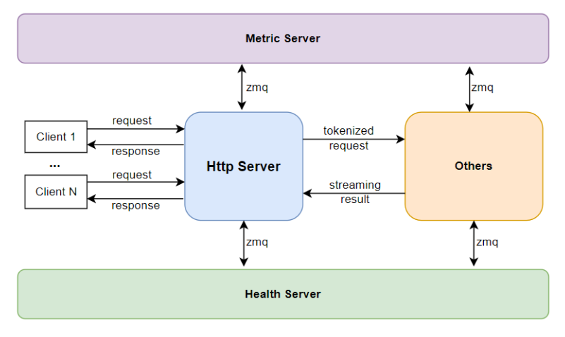

**Router** : 从 HttpServer 接收请求以后，主要负责保存请求，并且进行 请求调度

- 接收 HttpServer 或者 Visual Server 发来的请求，并放到请求队列中。

- 决定当前轮次应该 prefill 还是 decode。

- 如果是 prefill 轮次， prefill 哪些请求。

- 如果是 decode 轮次， decode 哪些请求。


**Model Backend** ：当 Router 决定好了使用哪些请求进行 prefill 或者 decode 以后， ModelBackend 决定如何处理这些请求。 lightllm\server\router\model_infer\mode_backend\base_backend.py 目录下的 ModeBackend 是所有 backend 的基类，通过了解其中的重要函数

- init_model : 通过模型文件解析使用 lightllm-new-docs\lightllm\models 的哪个模型类。

- prefill_batch : 对一个批次数据进行 prefill。

- decode_batch : 对一个批次数据进行 decode。
每个backend都有一个 model``代表一个独立的模型类, 以及一个 ``tp_rank 代表一个设备，可以有若干个 backend。 其中的 model 类负责模型在设备中真正地计算， lightllm\common\basemodel\basemodel.py 中的 TpPartBaseModel 是所有模型类的基类，该类支持张量并行。
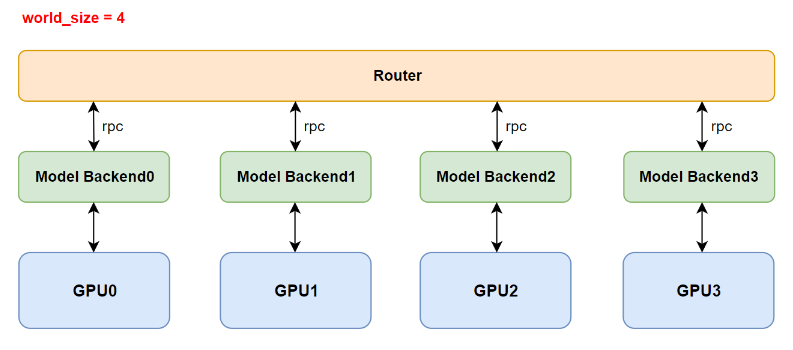

**Visual Server** : 负责处理多模态请求
**Cache Manager Server** ：负责管理多模态信息的推理结果的缓存

Visual Server 和 Cache Manager Server 都是专门为了支持多模态模型的推理而设计的。其中 Visual Server 负责 encode 多模态模型中的图片信息， 而 Cache Manager Server 负责缓存图片原始数据和图片 encode 后的特征数据， 该缓存存放在主机的共享内存上，意在减少多进程的重复内存读取以及避免图片数据重复 encode。

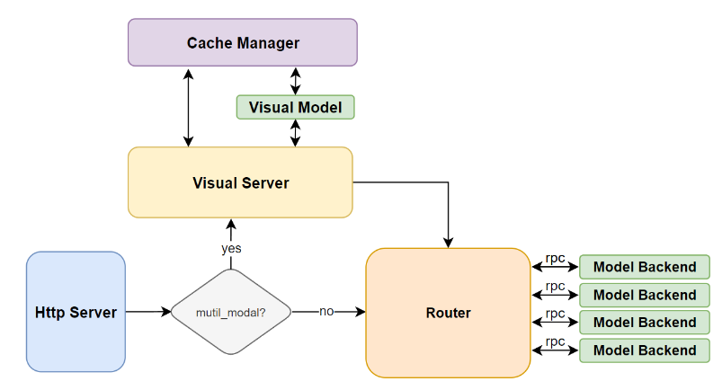

**Metric Server** ：负责记录系统运行的性能指标

**Health Server** ：负责监控系统运行的健康情况

<h2 id="18.LightLLm之TokenAttention简单介绍">18.LightLLm之TokenAttention简单介绍</h2>

### 运行机制：

模型初始化时，根据用户设置的 max_total_token_num 预先分配 KV 缓存，并创建 Token Table 来记录输入 token 的实际存储位置。

当处理新请求时，系统首先检查预分配的Token缓存中是否有可用的连续空间用于存储键值（KV）缓存。 TokenAttention 倾向于为请求分配连续的图形内存空间，以最大限度地减少推理过程中的内存访问。仅当连续空间不足时，才会为请求分配非连续显存。由于内存管理是逐个令牌进行的，因此 TokenAttention 几乎实现了零浪费，与 vllm 相比，产生了更高的吞吐量。

我们使用 OpenAI Triton 实现了一个高效的 TokenAttention 运算符。当提供查询向量时，该算子可以根据Token Table高效地检索相应的KV缓存并进行注意力计算。

请求完成后，可以通过删除令牌表上的记录来快速释放相应的显存，从而为调度新的请求让路。由于 TokenAttention 在模型初始化时预先分配了所有 KV 缓存空间，因此可以为已完成的请求高效释放内存，并在动态调度时合并不同批次的请求，从而有效最大化 GPU 利用率。

### 具体步骤：

1) 模型初始化时，系统根据用户设置的 max_total_token_num 预先申请 KV 缓存显存，并创建 Token Table 来记录输入 token 的实际存储位置。
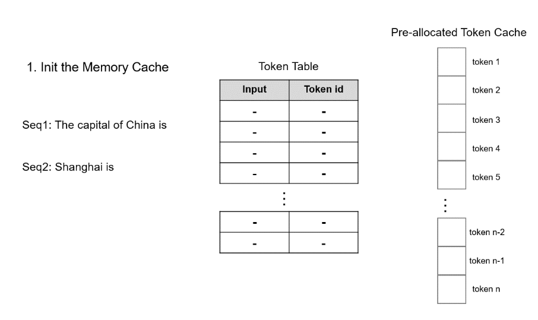

2) 当处理新请求时，系统首先检查预分配的Token缓存中是否有可用的连续空间用于存储KV Cache。 TokenAttention 倾向于为请求分配连续的内存，以最大限度地减少推理过程中的内存访问。仅当连续空间不足时，才会为请求分配非连续的内存。分配的空间记录在Token Table中，用于后续的注意力计算。
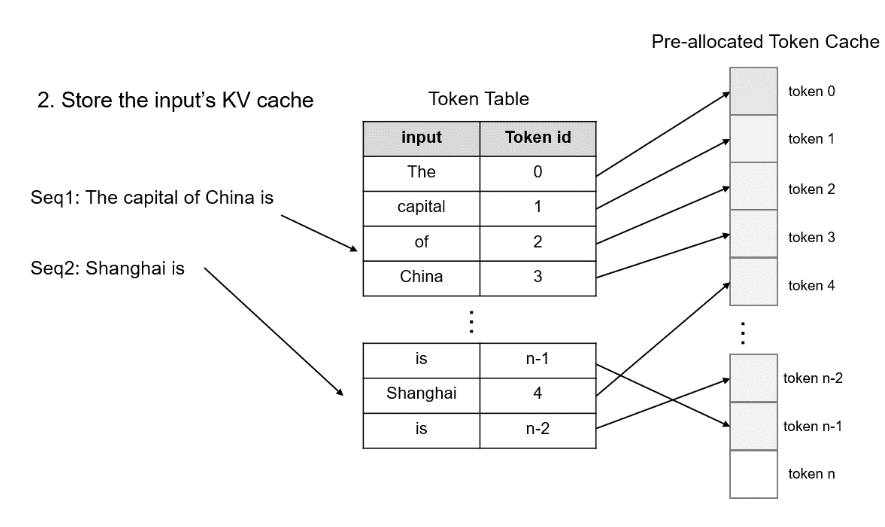

3) 对于新生成的Token的缓存，只需从预先分配的Token缓存中找到未使用的空间并将相应的条目添加到Token表中即可。此外，为了有效地分配和释放Cache，我们利用Torch Tensor在GPU上的并行计算能力来管理预分配Token Cache的状态。首先，我们定义状态如下:

```python
self.mem_state = torch.ones((size,), dtype=torch.bool, device="cuda")
self._mem_cum_sum = torch.empty((size,), dtype=torch.int32, device="cuda")
self.indexes = torch.arange(0, size, dtype=torch.long, device="cuda")
self.can_use_mem_size = size
```

mem_state 记录了缓存的使用状态，其中1代表未使用，0代表已使用。 _mem_cum_sum 用于 mem_state 的累积和，用于有效地识别和选择未使用的空间进行缓存分配。分配过程如下：
```python
torch.cumsum(self.mem_state, dim=0, dtype=torch.int32, out=self._mem_cum_sum)
#
select_index = torch.logical_and(self._mem_cum_sum <= need_size, self.mem_state == 1)
select_index = self.indexes[select_index]
self.mem_state[select_index] = 0
self.can_use_mem_size -= len(select_index)
```
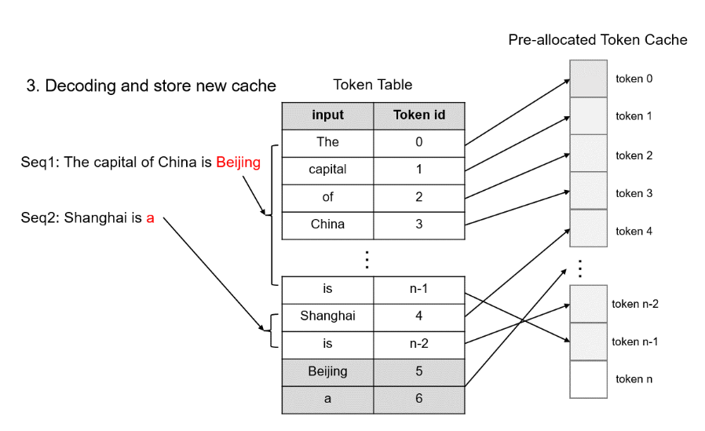

4) 请求完成后，可以通过删除 Token Table 上的记录来快速释放相应的显存，从而为调度新的请求让路。

```python
self.can_use_mem_size += free_index.shape[0]
self.mem_state[free_index] = 1
```
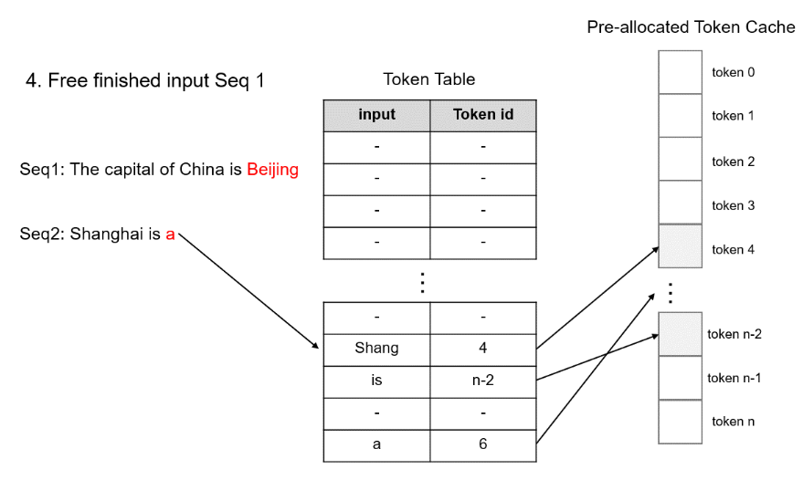

5) 由于Token级别的 GPU 内存管理，TokenAttention 可以实现 GPU 内存的零浪费。它可以准确地计算出系统可以容纳多少新Token进行计算。因此，当结合 Efficient Router 来管理请求时，它可以在推理过程中不断添加新的请求，充分利用每一块GPU内存，最大化GPU利用率。


<h2 id="19.LightLLm之Efficient Router简单介绍">19.LightLLm之Efficient Router简单介绍</h2>

### Efficient Router

引入高效路由器来管理传入请求，并动态确定该请求是否可以与已运行的推理批次融合。 合并标准是估计合并推理过程中最大Token占用量是否小于硬件可容纳的最大容量。 这里，我们将这个最大容量设置为 max_total_token_num。在 Token Attention 的支持下，我们可以准确地管理Token的使用情况，并且可以确保永远不会出现内存不足（out-of-memory）的情况。

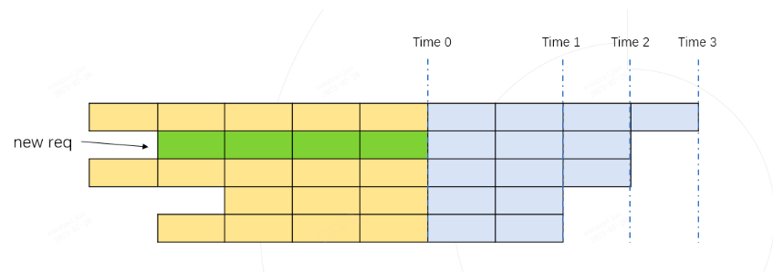

如上图所示，每一行代表一个请求当前的运行状态，黄色代表已经运行过的历史kv缓存token，每个格子代表一个token，灰色代表要生成的token。 生成的Token数量由每个请求设置的最大输出长度和已生成的Token数量决定。 上图中，绿色网格的第二行表示新到达的请求，图中按照要生成的输出的长度升序列出了所有请求。

如果我们假设新的请求融合成一个Batch进行推理，那么最大的token使用量必然会出现在时间点1、时间2、时间3中的一个时间点，我们只需要计算这些时间点的token使用量是否达到最大值即可。三个时间点都没有超过max_total_token_num，说明新的请求可以加入到Batch中进行融合推理。

时间1的总使用代币等于黄色单元格数量加上绿色单元格数量（见下图）
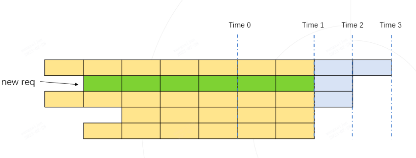

时间2的总使用代币等于黄色方块的数量加上绿色方块的数量（见下图）


时间3的总使用代币等于黄色方块的数量（见下图）


实际最大令牌使用量始终为时间 1、时间 2 或时间 3 之一。

只要动态推理过程中token的最大使用量低于max_total_token_num，就说明可以批量进行新的请求进行推理。
为了快速计算批次中所有请求所需的最大令牌使用量，我们使用 numpy 实现了一个高效的示例。
```python
import numpy as np

def demo():
    max_total_token_num = 100
    req_list = [(5, 4), (4, 3), (5, 3), (3, 2), (4, 2)]  # (run_len, left_output_len)
    req_list.sort(key=lambda x: -x[1])

    left_out_len_array = np.array([e[1] for e in req_list])
    has_run_len_array = np.array([e[0] for e in req_list])
    cum_run_len_array = np.cumsum(has_run_len_array)
    size_array = np.arange(1, len(req_list) + 1, 1)
    need_max_token_num = (left_out_len_array * size_array + cum_run_len_array).max()

    if need_max_token_num <= max_total_token_num:
        print("ok")
    else:
        print("oom")
```


<h2 id="20.如何构建TensorRT模型的缓存机制？">20.如何构建TensorRT模型的缓存机制？</h2>

在TensorRT架构中，模型运行主要依赖GPU，因此直接支持将整个TensorRT引擎从GPU移动到CPU并非直接内置的功能。但是我们可以通过一些技巧，将TensorRT引擎对象序列化到CPU（或者磁盘），并在需要时反序列化加载到GPU，可以有效管理显存，特别是在多模型推理或资源有限的场景下。这种方法实现了类似“缓存”的机制，能够动态加载模型到GPU，同时释放未使用的GPU资源，从而提高硬件资源的利用效率。

### **1. 基本思路**

TensorRT模型（即引擎）在推理时需要加载到GPU中运行。如果需要将模型“缓存”到CPU，可以通过以下方法：
1. **序列化引擎**：
   - 在推理完成后，将引擎序列化为二进制数据并存储在CPU内存中（甚至可以存储到磁盘）。
2. **反序列化引擎**：
   - 在需要推理时，将二进制数据反序列化为TensorRT引擎，并加载到GPU中执行推理。

这种方法模拟了将模型缓存到CPU的过程，因为TensorRT本身无法直接在CPU上运行。

### **2. 实现步骤**

#### **1. 加载模型并创建TensorRT引擎**
- 首先我们加载ONNX模型或已有的TensorRT引擎，并创建可用于推理的引擎。
  
```python
import tensorrt as trt

# 加载 TensorRT Logger
logger = trt.Logger(trt.Logger.WARNING)

# 创建 TensorRT Builder 和 Network
builder = trt.Builder(logger)
network = builder.create_network(flags=1 << int(trt.NetworkDefinitionCreationFlag.EXPLICIT_BATCH))

# 加载 ONNX 文件
onnx_file = "model.onnx"
with trt.OnnxParser(network, logger) as parser:
    with open(onnx_file, 'rb') as f:
        parser.parse(f.read())

# 构建引擎
config = builder.create_builder_config()
config.max_workspace_size = 1 << 30  # 设置最大工作空间
engine = builder.build_engine(network, config)
```

#### **2. 将引擎序列化到CPU**
- 使用 TensorRT 的序列化功能，将引擎对象保存为二进制数据。

```python
# 序列化引擎
serialized_engine = engine.serialize()

# 将序列化后的引擎保存到 CPU 内存（或者存储到文件）
cached_engine_on_cpu = serialized_engine  # 模拟缓存到 CPU
```

#### **3. 在需要时重新加载引擎到 GPU**
- 使用 TensorRT 的反序列化功能，将缓存的引擎加载回 GPU。

```python
# 反序列化引擎
runtime = trt.Runtime(logger)
engine_from_cpu = runtime.deserialize_cuda_engine(cached_engine_on_cpu)

# 创建执行上下文
context = engine_from_cpu.create_execution_context()
```

#### **4. 推理流程**
- 构造输入和输出张量，并执行推理。

```python
import numpy as np
import pycuda.driver as cuda
import pycuda.autoinit  # 初始化 CUDA 上下文

# 创建输入和输出缓冲区
input_shape = (1, 3, 224, 224)  # 示例输入维度
output_shape = (1, 1000)  # 示例输出维度

# 在 GPU 上分配内存
d_input = cuda.mem_alloc(np.prod(input_shape) * np.float32().nbytes)
d_output = cuda.mem_alloc(np.prod(output_shape) * np.float32().nbytes)

# 创建主机上的输入数据
input_data = np.random.rand(*input_shape).astype(np.float32)
cuda.memcpy_htod(d_input, input_data)

# 执行推理
bindings = [int(d_input), int(d_output)]
context.execute_v2(bindings)

# 从 GPU 拷贝结果到主机
output_data = np.empty(output_shape, dtype=np.float32)
cuda.memcpy_dtoh(output_data, d_output)

print("Inference result:", output_data)
```

### **3. 注意事项**

#### **1. 数据传输开销**
- 序列化和反序列化是额外的开销，因此在高频推理任务中可能导致性能下降。
- 如果模型较大，序列化和反序列化的时间会显著增加。

#### **2. GPU 资源管理**
- 每次加载引擎到 GPU 时，需要确保 GPU 上有足够的显存。
- 在释放 GPU 资源后，可以通过 `cuda.Context.synchronize()` 确保设备状态一致。

#### **3. 磁盘与内存存储选择**
- 如果缓存到 CPU 的模型较大，可以选择将其保存到磁盘（如 `.plan` 文件），并在需要时从磁盘加载。

#### **4. TensorRT 的版本兼容性**
- 序列化的引擎仅在相同的 TensorRT 版本、CUDA 版本和 GPU 硬件架构上兼容。如果环境变化，需要重新生成引擎。


<h2 id="21.vLLm架构介绍？">21.vLLm架构介绍？</h2>

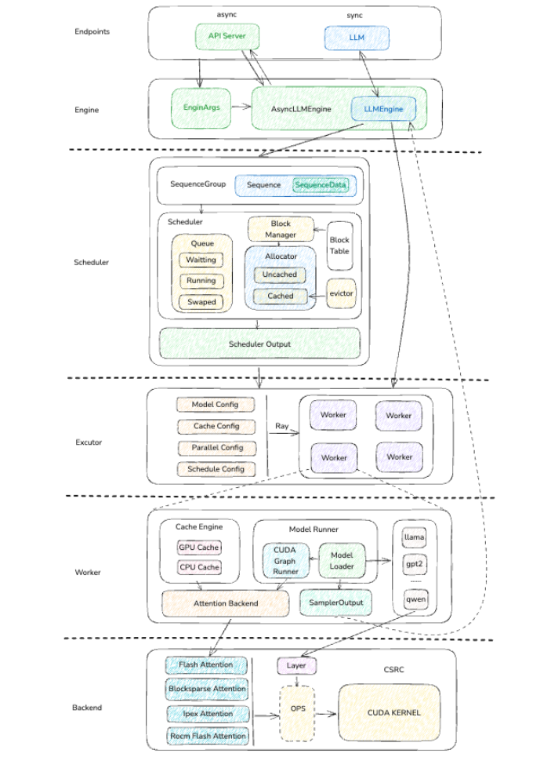

### 架构组成

1) Endpoints/Engine
- Endpoints层是整个推理服务的入口，用于传入模型类型、推理参数、对于没一个request返回其output结果合集。
API Server是一个异步服务端，它会为每一个request关联一个output stream，用来返回推理生成的结果。
LLM多数用在同步代码和测试代码当中，他是对下层引擎的封装，并将引用层传入的参数组成engine_arges, 提供给引擎。
- Engine层推理服务的核心控制层，一方面他会创建Scheduler，并传入request规划好需要使用的KVCache，另一方面初始化模型执行器，并将KVCache和request灌入执行器，最后得到模型的执行器返回给用户。

2) Scheduler
- 作为PageAttention的核心调度层，首先会把request转换为SequenceGroup，这样当我们使用例如Bean Search这些并行token生成策略的时，这一个requst就会变成一组相关token序列，我们为每个序列生成目标token，并选取其中最符合当前策略的token作为下一轮输入和结果输出。

- Scheduler维护了3个队列，其中waitting队列主要是用户刚刚输入到scheuler中的token序列；running队列是正在进行推理的token序列；swaped队列是当显存不足或者推理优先级降低时，从GPU中换出的token序列

- BlockManager下属两个KVCache分配器: UncachedAllocator、CachedAllocator. UncachedAllocator是正常token的KVCache分配器, 通过block_table维护分配状态，CachedAllocator略有差别，主要添加了token前缀hash计算，会将相同前缀的KVCache直接复用起来，并引入了evcitor等概念，被清除的KVCache会先暂时根据LRU原则转移到evcitor中，如果短时间内又出现相同前缀的token，可以恢复他的前缀KVCache使用。

- 在Scheduler Output封装中，我们会将调度的KVCache和相关的sequence id传入给模型，这样就可以直接使用进行推理了。

3) Excutor
执行器主要是通过worker的一种封装，其中既有单卡单worker的封装形式，同时也有分布式集群的worker形式。

4) Worker
对应的每个Worker，不仅需要负责加载实际的模型，同时对需要对不同模型的推理逻辑进行捕获，使用CUDA Graph加速推理效率。
上文提到BlockManager会通过block_table规划好哪些物理Block需要使用，到了worker这一层就是对具体的物理内存进行操作。
以上动作都会直接和GPU或者其他计算平台打交道，因此还会封装一层Attention Backend, 屏蔽这些不同平台的差异细节。
最终我们可以获得模型的logits输出，通过我们的sample策略后，得出最终的Output, 返回给上一层。

5) Backend
Backend这层主要关注于推理和模型层计算过程中需要用到的各种加速算法和技巧,最后通过OPS的粘结剂层将最终的数据GPU中，执行相关的kernel函数进行并行计算。


<h2 id="22.vLLm的推理服务与引擎介绍？">22.vLLm的推理服务与引擎介绍？</h2>

引擎部分主要分为两部分:

入口: 主要分为同步和异步接口，会对输入的配置和数据进行转换成引擎args对引擎进行初始化。
引擎: 这个是顶层调度的核心模块，衔接scheduler和executor等下游核心模块。

)


API-Server是用来对网络服务暴露的入口，主要使用了asyncio库进行了协程封装，提高了服务的并发处理能力。

1) 服务端的启动args使用create_engine_config方法转换为EngineConfig，然后通过AsyncLLMEngine.from_engine_args方法创建出带有异步接口的引擎类AsyncLLMEngine(LLMEngine)。EngineConfig包含DeviceConfig、ModelConfig、CacheConfig、ParallelConfig、SchdulerConfig
2) 调用generate方法将传入的prompt传输上一步创建的AsyncEngine引擎
3) add_request这里会做两件事情:
- start_background_loop: 开启协程主循环，监听新request事件并处理, 对应线条4。
- 将request_tracker作为当前request的response stream追踪, 并将request放入到追踪队列，对应线条3
4) engine_step是异步服务中较为核心的方法，主要会调用成员变量中的实际engine引擎，这个是个_AsyncLLEnginel类，对LLMEngine添加了一些异步封装方法。
- 首先会主动通过get_new_and_aborted_requests去tracker拿到相应的request(线条5)
- 然后调用add_request_async传入request请求(线条6、7), 这个不会调用模型中的tokenlizer做预处理和数据转换操作
- 随后获得token_ids后, 将token按照block分组，组成sequence，这个工程主要发生在内部函数_add_processed_request中，最后再讲sequence转换成seq_group数据结构，在prefill阶段，这里只有一条sequence。
- 最后会调用step_async，对request和此时生成的KVCache scheduler计划数据传给model(线条10、11)
- 模型的输出，会直接传入process_request_outputs中, 主要是把output放入到tracker中，最终关联上这个request的stream，返回给用户(线条13、14)

LLM类是用于测试和同步调用时的封装，首先通过engine_args初始化LLMEgine，然后调用add_request接口，将prompt信息传入engine，此时engine会通过(路径8、9)来进行scheduler调度，最后12驱动模型，给出output。
- 引擎是从from_engine_args方法入口创建的
- add_request: 获取到的prompt，会经历tokenlize->sequence->sequence_group的数据处理操作，然后会作为参数传入add_seq_group
- step/step_async方法是进行推理的核心方法，会首先通过scheduler对sequence group进行KVCache调度，拿到调度之后的metadata，同各种缓存和队列一起，传入给模型执行器，执行器返回推理结果。


<h2 id="23.vLLm的调度器与block分配？">23.vLLm的调度器与block分配？</h2>

调度器（Scheduler）决定哪些请求可以参与推理，并为这些请求做好逻辑块->物理块的映射。这个过程只是根据目前step(prefill+decode)收集到的所有信息，对目前GPU的显存进行新的内存分配规划，而未实际操作GPU内存。在模型执行器中，这些规划metadata会最终执行，正式分配相应的内存。

1) 调度器图解
调度分为两步进行:

添加引擎提供的sequence group数据，存储至waitting队列。
对目前调度队列中的任务进行遍历和重新分配，需要修改成running状态的，需要对应分配物理block，同时根据资源情况进行swap int/out。整体图解如下

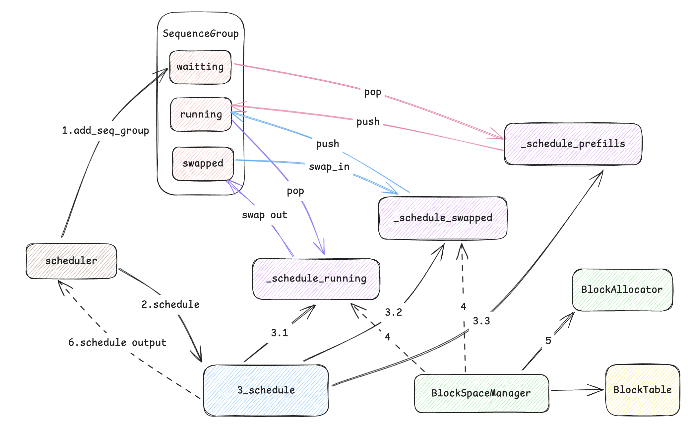

从上图图解可以看出，首先通过add_seq_group添加到waitting队列后，引擎对调用schedule方法通知调度器进行调度，调度后，scheduler还会对调度的输出进行简单的后处理，缓存相关的结果为下一步迭代做准备。

注：chunked prefill是在prefill阶段不会一次性的处理完所有prefill, 根据prefill的大小规划后面的budget，从而后面每次迭代(prefill+decode)都会带上这个prefill request id的处理，针对长prompt可以显著提高TTFT指标

- 调度器首先从规划running队列的数据，将已完成的数据状态标记为finished，然后评估资源情况，对无法调度的sg放入swapped队列，对于sg size只有1的请求，直接放入watting队列，作为全新的request处理
- 处理完running队列后，会再处理swap队列，处理需要swap in/out的sg。swap out时，针对prefill对放入prefill group中。针对无调度空间的sg，放弃调度，标记为finished状态。
- 最后再观察waitting队列，将可以分配的sg规划好KVCache，标记为running状态，不满足资源的sg继续放在waitting队列里直到条件满足时再进行处理。

2) Block分配

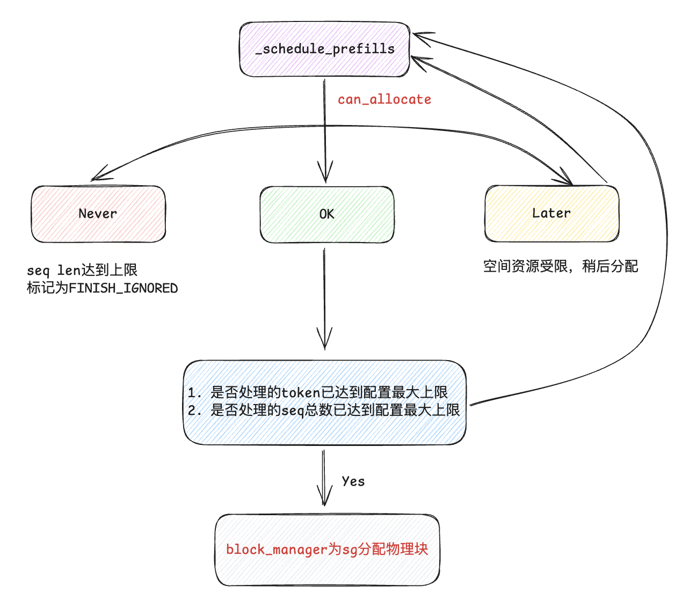

在BlockManager中,利用block_table分配物理block

```
class BlockSpaceManagerV1(BlockSpaceManager):
    def __init__(
        self,
        block_size: int,
        num_gpu_blocks: int,
        num_cpu_blocks: int,
        watermark: float = 0.01,
        sliding_window: Optional[int] = None,
        enable_caching: bool = False,
    ) -> None:
        # 一个block的token个数，默认16
        self.block_size = block_size
        # gpu分配的block个数
        self.num_total_gpu_blocks = num_gpu_blocks
        # cpu分配的block个数
        self.num_total_cpu_blocks = num_cpu_blocks

        if enable_caching and sliding_window is not None:
            raise NotImplementedError(
                "Sliding window is not allowed with prefix caching enabled!")

        self.block_sliding_window = None
        if sliding_window is not None:
            # 滑动窗口的中的block大小
            self.block_sliding_window = math.ceil(sliding_window / block_size)

        # 水位90%
        self.watermark = watermark
        assert watermark >= 0.0
        self.enable_caching = enable_caching
        self.watermark_blocks = int(watermark * num_gpu_blocks)

        if self.enable_caching:
            # 开启前缀缓存的Block分配器
            self.gpu_allocator: BlockAllocatorBase = CachedBlockAllocator(
                Device.GPU, block_size, num_gpu_blocks)
            self.cpu_allocator: BlockAllocatorBase = CachedBlockAllocator(
                Device.CPU, block_size, num_cpu_blocks)
        else:
            self.gpu_allocator = UncachedBlockAllocator(
                Device.GPU, block_size, num_gpu_blocks)
            self.cpu_allocator = UncachedBlockAllocator(
                Device.CPU, block_size, num_cpu_blocks)

        # 每一个sequence对应一个BT
        # Mapping: seq_id -> BlockTable.
        self.block_tables: Dict[int, BlockTable] = {}

        # 对encode-decode模型，存在cross-attention层，我们为这个层需要引入单独的KVCache表
        # Mapping: req_id -> BlockTable
        # Note that each SequenceGroup has a unique
        # request ID
        self.cross_block_tables: Dict[str, BlockTable] = {}
```

#### UncachedBlockAllocator

在UncachedBlockAllocator中，是不带prefix缓存的块分配器，在不同调度队列流程中的图解，对running队列，这里的can_allocate只是通过目前剩余的block数量是否满足

```
def can_allocate(self, seq_group: SequenceGroup) -> AllocStatus:

    check_no_caching_or_swa_for_blockmgr_encdec(self, seq_group)
    self_num_required_blocks = self._get_seq_num_required_blocks(
        seq_group.get_seqs(status=SequenceStatus.WAITING)[0])
    cross_num_required_blocks = self._get_seq_num_required_blocks(
        seq_group.get_encoder_seq())
    num_required_blocks = self_num_required_blocks + \
                            cross_num_required_blocks

    if self.block_sliding_window is not None:
        num_required_blocks = min(num_required_blocks,
                                    self.block_sliding_window)
    num_free_gpu_blocks = self.gpu_allocator.get_num_free_blocks()

    # 所有block都不满足需求.
    if (self.num_total_gpu_blocks - num_required_blocks <
            self.watermark_blocks):
        return AllocStatus.NEVER
    # 剩余free满足，进行分配
    if num_free_gpu_blocks - num_required_blocks >= self.watermark_blocks:
        return AllocStatus.OK
    else:
    # 再等等
        return AllocStatus.LATER
```

- 真正的分配物理块号

```
def _allocate_sequence(self, seq: Optional[Sequence], ref_count: int, \
                       is_encoder_decoder: bool = True) -> BlockTable:
    # 获得这个sequence需要多少个block.
    num_prompt_blocks = self._get_seq_num_required_blocks(seq)

    block_table: BlockTable = BlockTable()
    assert seq is not None
    # 每个逻辑块号从0开始
    for logical_idx in range(num_prompt_blocks):
        if (self.block_sliding_window is not None
                and logical_idx >= self.block_sliding_window):
            # 开启滑动窗口，重新映射逻辑块号id
            block = block_table[logical_idx % self.block_sliding_window]
            # Set the reference counts of the token blocks.
            block.ref_count = ref_count
        elif not is_encoder_decoder and self.enable_caching:
            # 开启了前缀匹配
            # hash值是对所有seq中的token进行整体hash，并将此值与驱逐器中进行比对
            # 最终或者创建新的物理快，或者从驱逐器中回收物理块，返回使用
            block = self.gpu_allocator.allocate(
                seq.hash_of_block(logical_idx),
                seq.num_hashed_tokens_of_block(logical_idx))
        else:
            # 直接从分配池中选取一个分配
            block = self.gpu_allocator.allocate()
            # Set the reference counts of the token blocks.
            block.ref_count = ref_count
        block_table.append(block)

    return block_table
```

- waiting队列中的每个seq_group都还未经历过prefill阶段，因此每个seq_group下只有1个seq，这个seq即为prompt
- 在使用UncachedBlockAllocator为wating队列中的某个seq_group分配物理块时，就是在对初始的这个prompt分配物理块。所以这个prompt有多少个逻辑块，就分配多少个可用的空闲物理块，同时注意更新物理块的ref_count。
- 另外，这里给定一种“物理块的分配方案”，我们只是在制定这个seq_group可以使用哪些物理块，但并没有实际往物理块中添加数据。
- 具体物理块分配，由CacheEngine按照这个方案，往物理块中实际添加KVCache。

以上主要waitting阶段的块分配，主要面向prefill的数据。

下面是running/swaped队列中的分配逻辑，主要面对decode阶段的数据，用到了block_manager中的can_append_slots和append_slots两个方法。

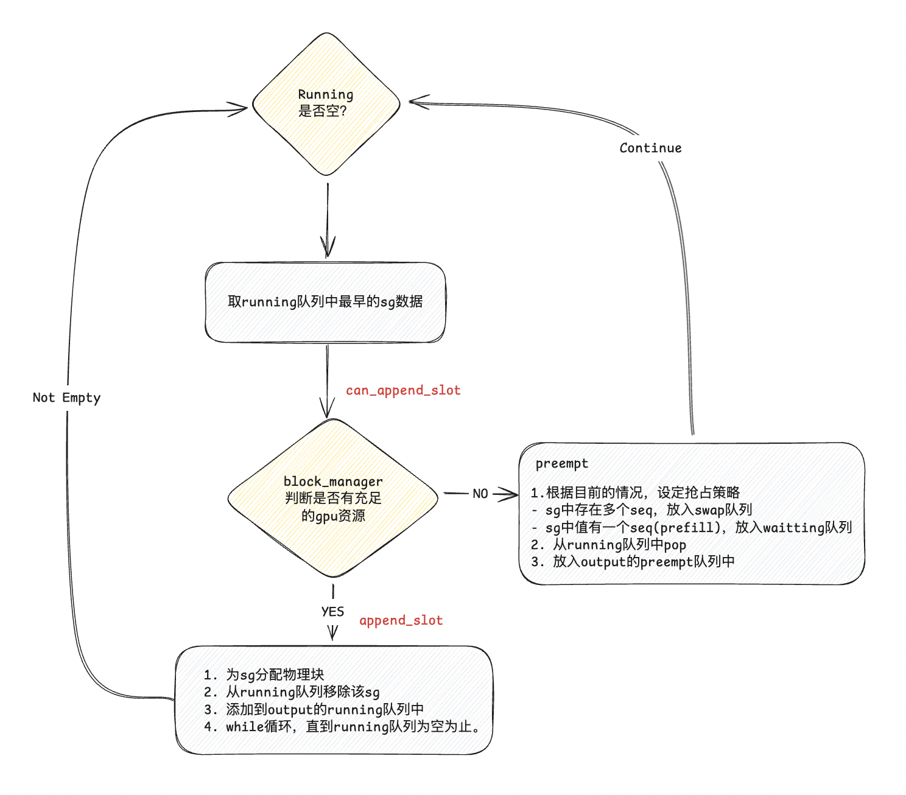

```
def can_append_slots(self, seq_group: SequenceGroup,
                     num_lookahead_slots: int = 0) -> bool:
    assert (num_lookahead_slots == 0), "lookahead allocation not supported in BlockSpaceManagerV1"

    # 就是看目前所有free的块是否满足running队列中需要的空间
    num_free_gpu_blocks = self.gpu_allocator.get_num_free_blocks()
    num_seqs = seq_group.num_seqs(status=SequenceStatus.RUNNING)
    return num_seqs <= num_free_gpu_blocks

def append_slots(
        self,
        seq: Sequence,
        num_lookahead_slots: int = 0,
    ) -> List[Tuple[int, int]]:
        n_blocks = seq.n_blocks
        block_table = self.block_tables[seq.seq_id]
        # 查找block_table的物理块个数，看是否还有能力分配
        # 如果物理块数量 < 逻辑块数量
        if len(block_table) < n_blocks:
            # 需要验证物理块只允许比逻辑块少1块
            assert len(block_table) == n_blocks - 1
            # 使用滑动窗口，做取整处理
            if (self.block_sliding_window
                    and len(block_table) >= self.block_sliding_window):
                # reuse a block
                block_table.append(block_table[len(block_table) %
                                               self.block_sliding_window])
            else:
                # 分配新物理块.
                new_block = self._allocate_last_physical_block(seq)
                block_table.append(new_block)
                return []

        # 如果最后一个物理块的引用数量为1, 也就是当前seq所引用
        last_block = block_table[-1]
        assert last_block.device == Device.GPU
        if last_block.ref_count == 1:
            # 如果开启前缀缓存，那么我们应该考虑物理块缓存问题.
            if self.enable_caching:
                # 当这个block已经填满是，我们需要在这里及时更新token hash，这有可能下次cache命中.
                maybe_new_block = self._maybe_promote_last_block(
                    seq, last_block)
                block_table[-1] = maybe_new_block
            return []
        else:
            # 已经有其他sq使用了这table，我们需要.
            # Copy on Write: Allocate a new block and copy the tokens.
            new_block = self._allocate_last_physical_block(seq)

            block_table[-1] = new_block
            # 从该seq的block_table中释放掉旧的物理块
            # 也即该物理块ref_count-=1，如果-=1后ref_count=0，说明该物理块彻底自由了，
            # 然后可以把它添加进驱逐器的列表中，他将变为可缓存的自由块
            self.gpu_allocator.free(last_block)
            return [(last_block.block_number, new_block.block_number)]

```

#### CachedBlockAllocator
- 在CachedBlockAllocator为有前缀缓存的Block分配器，会引入一个叫驱逐器(evictor)的概念，会将移除的KVCache数据在驱逐器中再保存一段时间，如果出现同样的前缀，再调度到GPU显存中。

以下evictor的实现，它使用access time和num_hashed_tokens确定我们优先需要使用哪个block进行重用
```
class LRUEvictor(Evictor):
    def __init__(self):
        self.free_table: OrderedDict[int, PhysicalTokenBlock] = OrderedDict()

    def __contains__(self, block_hash: int) -> bool:
        return block_hash in self.free_table

    def evict(self) -> PhysicalTokenBlock:
        if len(self.free_table) == 0:
            raise ValueError("No usable cache memory left")

        evicted_block = next(iter(self.free_table.values()))
        # 执行驱逐策略：
        # 找到驱逐器free tables中last accessed time最早的那个物理块，把它驱逐掉，因为它已经很久没用了。
        # 按理来说，free_tables中的物理块都是按时间append的，即已经排序好了，我们第1块即可。
        # 但是若存在多个block的last_accessed一致，我们进行第二层判断
        # 就先移除掉包含用于做hash的tokens最多的那个, 我们因此就挑选它作为GPU复用的块。
        for _, block in self.free_table.items():
            if evicted_block.last_accessed < block.last_accessed:
                break
            if evicted_block.num_hashed_tokens < block.num_hashed_tokens:
                evicted_block = block

        self.free_table.pop(evicted_block.block_hash)
        # 此块的计算状态设为false
        evicted_block.computed = False
        # 返回这个缓存块
        return evicted_block

    def add(self, block: PhysicalTokenBlock):
        self.free_table[block.block_hash] = block

    def remove(self, block_hash: int) -> PhysicalTokenBlock:
        if block_hash not in self.free_table:
            raise ValueError(
                "Attempting to remove block that's not in the evictor")
        block: PhysicalTokenBlock = self.free_table[block_hash]
        self.free_table.pop(block_hash)
        return block

    @property
    def num_blocks(self) -> int:
        return len(self.free_table)
```
- 当一个物理块没有任何逻辑块引用时（例如一个seq刚做完整个推理），这时它理应被释放。但是如果开启了prefix caching，那么这个物理块当前没有用武之地，但可是如果不久之后来了一个新seq，它的prefix和这个物理块指向一致，这个物理块就可以被重复使用，以此减少存储和计算开销。所以，我们设置一个驱逐器（evictor）类，它的free_tables属性将用于存放这些暂时不用的物理块。
- 所以目前，该设备上全部可用的物理块 = 正在被使用/等待被使用的物理块数量 + evictor的free_tables中的物理块数量
- 在prefill阶段，当我们想创建一个物理块时，我们先算出这个物理块的hash值，然后去free_tables中看有没有可以重复利用的物理块，有则直接复用
- 如果没有可以重复利用的hash块，那这时我们先检查下这台设备剩余的空间是否够我们创建一个新物理块。如果可以，就创建新物理块。
- 如果此时没有足够的空间创建新物理块，那么我们只好从free_tables中驱除掉一个物理块，为这个新的物理块腾出空间，驱逐策略如下：
    - 先根据LRU（Least Recently Used）原则，驱逐较老的那个物理块，也就是上节说的access time
    - 如果找到多个最后一次使用时间相同的老物理块，那么则根据max_num_tokens原则，驱逐其hash值计算中涵盖tokens最多的那个物理块。
    - 如果这些老物理块的LRU和max_num_tokens还是一致的话，那就从它们中随机驱逐一个

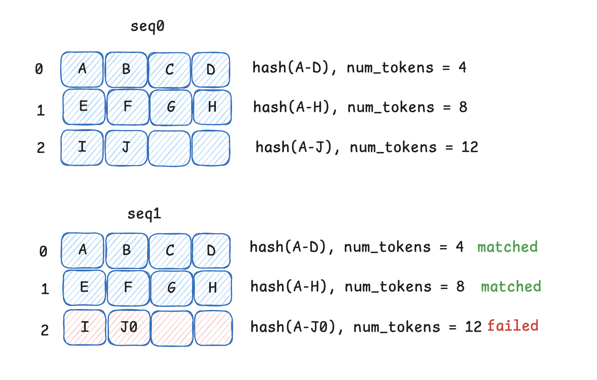
从图中我们可以看出，当已存在seq0时，已经收集了所有的hash结果。当seq1来时，需要在分配block时，会先看驱逐器中是否可以利用的hash, 存在就直接使用，不存在我们会为seq1再开辟一个新的block供其使用，放入对应的block_table中。

<h2 id="24.介绍一下Ollama的相关知识">24.介绍一下Ollama的相关知识</h2>

### 1. 什么是Ollama

**Ollama** 是一个开源框架，专注于在本地环境中快速部署和运行大型语言模型（LLMs），支持多种模型格式（如 GGUF、PyTorch 等），提供轻量化的推理服务。其核心目标是降低用户使用 LLMs 的门槛，尤其适合AI开发者和AI研究者进行本地实验或私有化部署。通过 Ollama，AI开发者能以极低门槛将前沿 AI 能力整合到实际业务中，同时保持对数据和模型的全流程控制。以下是其核心特性：

- **本地优先**：无需依赖云端服务，支持本地 CPU/GPU 推理。
- **多模型支持**：兼容 DeepSeek、Llama、Mistral、Phi 等主流模型。
- **轻量化 API**：提供类似 OpenAI 的 RESTful API，便于集成到现有系统中。
- **多模态扩展**：支持文本、图像生成（如 LLaVA）等多模态任务。
- **资源优化**：通过量化技术（如 4-bit/8-bit）降低显存占用。

### 2. DeepSeek 部署示例

DeepSeek 是由中国深度求索公司开发的高性能开源语言模型，在数学推理、代码生成等任务中表现优异。以下是使用 Ollama 部署 DeepSeek 的步骤：

#### **环境准备**
- **操作系统**：Linux/macOS/Windows（需 Docker 或直接安装）
- **硬件要求**：至少 8GB 内存，推荐 NVIDIA GPU（支持 CUDA）
- **安装 Ollama**：
  ```bash
  # Linux/macOS 一键安装
  curl -fsSL https://ollama.com/install.sh | sh

  # Windows 可通过 Docker 部署
  docker run -d -p 11434:11434 --name ollama ollama/ollama
  ```

#### **下载 DeepSeek 模型**
Ollama 支持直接从其模型库拉取预配置模型：
```bash
# 拉取 DeepSeek 7B 模型（支持中文）
ollama pull deepseek-7b

# 或自定义模型（需手动配置 Modelfile）
ollama create deepseek-custom -f ./Modelfile
```
**Modelfile 示例**：
```text
FROM deepseek-7b
PARAMETER num_gpu 1  # 启用 GPU 推理
```

#### **启动服务**
```bash
# 后台运行模型服务
ollama serve

# 交互式调用
ollama run deepseek-7b "如何用 Python 实现快速排序？"
```

#### **API 调用**
通过 RESTful API 集成到应用：
```python
import requests

response = requests.post(
    "http://localhost:11434/api/generate",
    json={
        "model": "deepseek-7b",
        "prompt": "解释量子计算的 Shor 算法",
        "stream": False
    }
)
print(response.json()["response"])
```

### 3. Ollama 的经典应用案例

#### **3.1 AIGC（生成式人工智能）**
- **案例：内容创作自动化**
  - **场景**：营销团队使用 DeepSeek 生成广告文案和社交媒体内容。
  - **实现**：通过 Ollama 部署模型，结合 LangChain 构建自动化流水线：
    ```python
    from langchain_community.llms import Ollama
    llm = Ollama(model="deepseek-7b")
    print(llm("生成一篇关于环保的微博文案，要求包含#碳中和#标签。"))
    ```
  - **优势**：本地部署保障数据隐私，避免云端 API 调用成本。

#### **3.2 传统深度学习**
- **案例：图像描述生成（多模态扩展）**
  - **场景**：将 LLaVA 模型与 Ollama 结合，为医学影像生成文本描述。
  - **部署**：
    ```bash
    # 拉取多模态模型
    ollama pull llava
    # 上传图像并获取描述
    ollama run llava "描述这张图片的内容" -i ./x-ray.jpg
    ```
  - **技术栈**：结合 CLIP 视觉编码器与语言模型，实现端到端推理。

#### **3.3 自动驾驶**
- **案例：场景理解与决策推理**
  - **场景**：在车载边缘设备部署小型语言模型，解析传感器数据并生成驾驶决策。
  - **实现**：
    1. 使用 Ollama 量化部署 Phi-3 等轻量模型（<4GB 显存占用）。
    2. 输入激光雷达点云数据文本化描述：
       ```text
       "前方 50 米处有行人正在横穿马路，当前车速 60km/h，请建议刹车力度。"
       ```
    3. 模型输出结构化指令：
       ```json
       {"action": "brake", "intensity": 0.7, "confidence": 0.92}
       ```
  - **优势**：低延迟本地推理避免网络不稳定问题，符合车规级安全要求。


<h2 id="25.介绍一下Open-WebUI的相关知识">25.介绍一下Open WebUI的相关知识</h2>

### 一、Open WebUI 简介  
**Open WebUI** 是一款开源、可扩展的 Web 界面工具，专为本地部署的大型语言模型（LLM）和深度学习模型提供可视化交互支持。其核心优势在于完全离线运行、用户友好的图形界面，以及无缝集成多种模型服务（如 Ollama、OpenAI API 等）的能力。以下是其核心特性：  
1. **本地化与隐私保护**：所有数据在本地处理，避免云端传输风险，适合医疗、金融等敏感场景。  
2. **多模态支持**：支持文本、图像、文件上传与解析（如 PDF、知识库构建），内置 RAG（检索增强生成）引擎。  
3. **轻量化与跨平台**：通过 Docker 容器化部署，支持 Windows、Linux、macOS 等操作系统，适配不同硬件配置。  
4. **生态兼容性**：与 Ollama 等工具深度集成，可自动识别本地模型并提供统一管理界面。  

### 二、DeepSeek 部署示例（基于 Ollama + Open WebUI）  
以 **DeepSeek-R1**（7B 版本）为例，展示本地部署流程：  

#### **1. 环境准备**  
- **硬件要求**：至少 16GB 内存，NVIDIA GPU（显存 ≥4GB）。  
- **软件依赖**：安装 Ollama、Docker，并配置 NVIDIA 容器工具包（Linux/Windows）。  

#### **2. 部署步骤**  
1. **安装 Ollama**  
   ```bash
   # Linux/macOS 一键安装
   curl -fsSL https://ollama.com/install.sh | sh
   # Windows 通过 Docker 部署
   docker run -d -p 11434:11434 --name ollama ollama/ollama
   ```  
2. **下载 DeepSeek-R1 模型**  
   ```bash
   ollama pull deepseek-r1:7b  # 自动下载模型权重
   ```  
3. **启动 Open WebUI**（Docker 方式）  
   ```bash
   docker run -d -p 3000:8080 --gpus all -v open-webui:/app/backend/data --name open-webui ghcr.io/open-webui/open-webui:main
   ```  
4. **配置与使用**  
   - 访问 `http://localhost:3000`，注册管理员账号。  
   - 在 Open WebUI 中自动识别本地 DeepSeek 模型，支持对话、文件上传、知识库管理。  

#### **3. 调试与优化**  
- **常见问题**：若出现连接错误，需确保 Ollama 服务已启动（`ollama serve`）。  
- **性能调优**：通过调整 GPU 资源分配和模型量化参数（如 `num_gpu`）提升推理速度。  

### 三、Open WebUI 的经典应用案例  

#### **1. AIGC（生成式人工智能）**  
- **案例 1：智能内容生成**  
  用户通过 Open WebUI 上传行业报告，调用 DeepSeek 生成定制化营销文案，并结合知识库自动引用企业数据，提升内容准确性。  
- **案例 2：代码助手**  
  开发者使用 DeepSeek-Coder 模型生成代码片段，通过 Open WebUI 实时调试并导出结果，集成到 VS Code 等开发工具中。  

#### **2. 传统深度学习**  
- **案例：医学影像分析**  
  结合多模态模型（如 LLaVA），上传 X 光片图像，模型生成诊断描述，并通过 Open WebUI 展示热力图辅助医生决策。  
- **案例：工业质检**  
  部署 YOLO 目标检测模型，实时识别生产线缺陷，结果通过 Web 界面可视化并触发自动化分拣系统。  

#### **3. 自动驾驶**  
- **案例：实时场景理解**  
  车载边缘设备部署轻量级模型（如 Phi-3），通过 Open WebUI 解析激光雷达数据文本化描述，生成驾驶决策（如刹车力度）并可视化边界框。  


<h2 id="26.介绍一下SGLang的相关知识">26.介绍一下SGLang的相关知识</h2>

### SGLang 简介  
SGLang 是一个用于大型语言模型和视觉语言模型的快速服务框架。它通过共同设计后端运行时和前端语言，使你与模型的交互更快、更可控。其核心功能包括：

- **快速后端运行时**: 提供高效的服务，包括 RadixAttention 用于前缀缓存、跳跃式约束解码、连续批处理、令牌注意力（分页注意力）、张量并行、- - FlashInfer 内核、分块预填充和量化（INT4/FP8/AWQ/GPTQ）。

- **灵活的前端语言**: 提供直观的界面用于编程 LLM 应用程序，包括链式生成调用、高级提示、控制流、多模态输入、并行性和外部交互。

- **广泛的模型支持**: 支持各种生成模型（Llama 3、Gemma 2、Mistral、QWen、DeepSeek、LLaVA 等）和嵌入模型（e5-mistral），并易于扩展以集成新模型。

SGLang的整体架构上分为前端和后端，整体功能上有4个大的功能分别为前端SGLang语言、RadixAttention、fast constrained decoding和API Speculative Execution。

<h2 id="27.SGLang前端技术介绍">27.SGLang前端技术介绍</h2>

DSL即领域特定语言，是特定领域内提供的一些变成语言和脚本，用于在该领域更高效或者高性能的完成代码编写工作，我们平时使用的shell算是一个。DSL本质上也是一个编译技术。在大模型训练推理领域，比较流行的是triton。triton可以认为是CUDA算子领域特定语言（也可以其他语言了）。SGLang可以认为是大模型应用开发的领域特定语言。

SGLang的前端部分提供一个LLM应用程序编写的DSL语言；
使用方式如下：
```
from sglang import function, system, user, assistant, gen, set_default_backend, RuntimeEndpoint

@function
def multi_turn_question(s, question_1, question_2):
    s += system("You are a helpful assistant.")
    s += user(question_1)
    s += assistant(gen("answer_1", max_tokens=256))
    s += user(question_2)
    s += assistant(gen("answer_2", max_tokens=256))

set_default_backend(RuntimeEndpoint("http://localhost:30000"))

state = multi_turn_question.run(
    question_1="What is the capital of the United States?",
    question_2="List two local attractions.",
)

for m in state.messages():
    print(m["role"], ":", m["content"])

print(state["answer_1"])
```

在SGLang中，提供了以下原语：

- gen用于调用LLM生成；
- select用于让LLM从列表中选择概率最高的选项；
- +=或extend用于扩展当前的提示；
- fork用于分叉当前的提示状态；
- join用于重新连接分叉的提示状态。
- 用户可以将这些原语与任意的Python控制流和库交叉使用。
前端来说，提供了自己的DSL，目标是替代LangChain这种框架。利用解释执行DSL的方式进行性能优化。


<h2 id="28.SGLang后端启动阶段技术分析">28.SGLang后端启动阶段技术分析</h2>

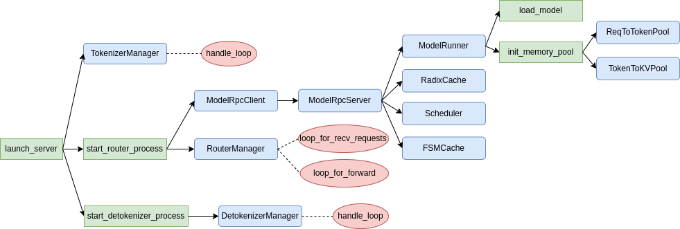

图中有三个组件 TokenizerManager、RouterManager 和 DetokenizerManager 有持续运行的函数，它们之间使用 zmq 库的 PULL 和 PUSH 模式来实现信息的发送和接收。
generate 时信息流转的过程如下：
1. 客户端调用 generate API，将 GenerateReqInput 发送给 TokenzierManager，等待回复。
2. TokenizerManager 将输入 encode 成 TokenizedGenerateReqInput，发送给 RouterManager；并且将监听这个 Request 的状态，一旦 DetokenizerManager 通知其已完成一次 Forward & Decode，TokenizerManager 就会触发一个事件，来更新 Request 的输出，直到完全 generate 结束就会返回一个 JSON 格式的输出给客户端。
3. RouterManager 接收到 TokenizerManager 传来的输入会不断调用 forward 函数来生成，每一步的结果都将被包装成 BatchTokenIDOut 发送给 DetokenizerManager。每一步处理并发送之后会 sleep 0.0006s，并且如果有request 推理结束了那么将多 sleep extend_dependency_time（为了减少 cache miss）
4. Detokenizer 接收到 RouterManager 的输入会开始 Decode 然后将结果包装成 BatchStrOut 返回给 TokenizerManager。

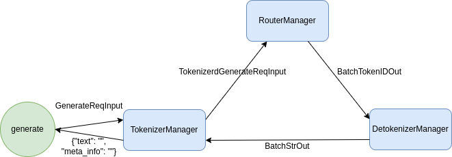

1) launch_server: 启动后端使用的命令是 python -m sglang.launch_server --model-path meta-llama/Llama-2-7b-chat-hf --port 30000，所以将执行 sglang/launch_server.py 这个文件

2) TokenizerManager: 全局变量，负责管理 tokenizer，在用户 Prompt 请求到了之后 encode 好交给 RouterManager 做后续处理。在启动的时候主要负责：
    1. 绑定端口
    2. 初始化 Tokenizer（不考虑多模态模型）
    3. 另外在初次调用 Generate 的时候会将 handle_loop 函数放入事件循环，其中将接收 DetokenizerManager 传来的 decode 之后的输出。

3) ModelRpcClient & ModelRpcServer
RPC 即 Remote Procedure Call，表示客户端发送请求到服务端让服务端来执行功能，RPyC 是 Python 实现的 RPC 库。
ModelRpcClient 实现了客户端，在启动阶段它负责：
    1. 启动 ModelRpcServer
        - ModelRpcServer 实现了服务端，继承了 rpyc.Service。它的特别之处在于一旦方法以 exposed_ 开头那么这个方法是客户端可以远程调用的，否则只能被本地调用
    2. 远程调用 Server 的 exposed_init_model 函数来做初始化并拉起后续组件
        - Server 在 exposed_init_model 函数中主要负责启动图中 ModelRunner / RadixCache / Scheduler / FSMCache四个类
    3. 使用包装函数将 Server 的 exposed_step 函数包装成 async 函数（简化版的 rpyc.async_）
        - Server 的这个函数负责核心的 generate 逻辑

4) ModelRunner & ReqToTokenPool & TokenToKVPool
ModelRunner 启动阶段主要负责：
    1. 设置多卡推理相关的配置
    2. 执行 load_model来加载模型
    3. 计算目前剩余 GPU 显存，然后计算能够存储 KVCache 的最多 Token 数量 max_num_token，并执行 init_memory_pool 来初始化 ReqToTokenPool 和 TokenToKVPool。
        - TokenToKVPool 主要是用来预先分配 max_num_token 个 Token （每个token的空间称为 slot）的 KVCache 空间（一个 Tensor，我们称为 KVCache Tensor，其中每个 slot 的大小是 2*head_num*head_dim*layer_num）。其中比较重要的函数是 alloc 和 alloc_contigous，前者将获得当前空闲的 need_size 个 slot，后者将得到连续的 need_size 个 slot。前者返回这些 slots在 KVCache Tensor 的 index 列表（out_cache_loc），这些位置将放在 RadixCache 维护的字典树的 value 值里；后者除了上述 index 列表，还会返回分配的起始位置和结束位置（end_loc = start_loc + need_size）
        - ReqToTokenPool 主要分配了 (size, max_context_len) 长度的空间，用来存储当前正在执行的所有 Request 的每个 token 对应的 KVCache Tensor index。这里的 size 设定了 BatchSize 的最大数量：max_num_token / context_len * 256。


5) RadixCache: 维护了一个字典树 Trie Tree，主要用来实现 prefix 的匹配以此实现 
RadixAttention。
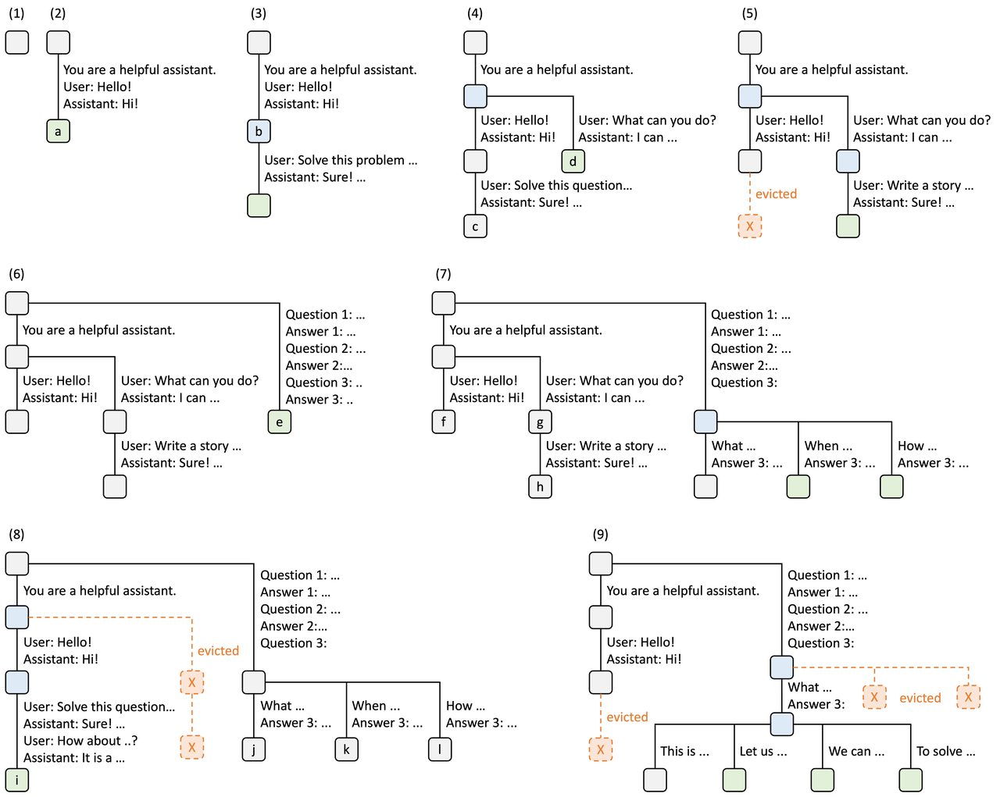
字典树的节点 TreeNode 记录了用来前缀索引的 key（token_id sequence）、节点上的值 value（key 值所表示的 token_id sequence 对应的 KVCache Tensor 的 index）、引用计数 ref_counter（标记该前缀目前被多少正在推理的 request 占用）、最后访问时间 last_access_time（该树使用 LRU 策略删除节点，会将最早访问的叶节点依次删除）。
RadixCache 另外维护了一个变量 evictable_size_，记录了所有未被推理占用的 token 数量，之后可以 evict。
RadixCache主要有如下函数：
    1. insert：插入一个 key，自动匹配前缀，如果完全能匹配上就止于叶节点或者派生出子节点，否则就会 split 节点成两个
    2. match_prefix：找到完全匹配 key 前缀的节点，如果能半匹配上就 split 节点，如果能完全匹配上就找子节点
    3. evict：统计所有的叶节点，然后将最早的 num_tokens 个节点删除（这里使用到了最小堆算法）
    4. inc_ref_counter：将节点到根节点路径上所有的引用计数都加一，如果原来没有
    5. dec_ref_counter：类似上面 inc 函数。


6) Scheduler 处理 Request 的顺序，有如下四种情况：1、lpm：默认值，Longest Prefix Match，更多 common prefix 的 Request 有更高的优先级；2. random：随机排序；3. fcfs：按照先来先处理的顺序；4. weight。

7)  FSMCache 主要是管理所有正则表达式当前的状态机，主要是配合前端

8) RouterManager 在启动阶段主要负责：
    1. 绑定端口
    2. 在事件循环中执行 loop_for_recv_request ，不断获取 TokenizerManager 处来的信息放在 recv_reqs 中
    3. 在事件循环中执行 loop_for_forward，将上述 recv_reqs 交给 ModelRpcClient 的 step 函数执行，然后将结果交给 DetokenizerManager。

9) DetokenizerManager 在启动阶段主要负责：
    1. 绑定端口
    2. 在事件循环中执行 handle_loop，不断获取 RouterManager 处得到的信息，Decode 之后发送给 TokenizerManager

<h2 id="29.SGLang后端generate阶段技术分析">29.SGLang后端generate阶段技术分析</h2>

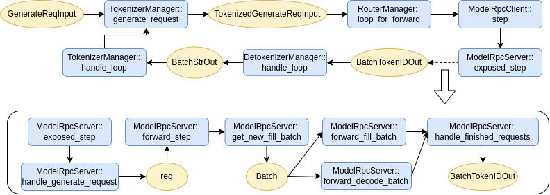
ModelRpcServer 得到 TokenizedGenerateReqInput 之后将通过 handle_generate_request 函数将其变成 Req 的数据结构，然后顺序放入 forward_queue 中用于之后的 forward。Req 的数据结构特别在于：如果 request 中包含正则表达式 regex，那么就会给其绑定一个 FSM，这块主要是和前端有关暂不展开。
接下来就会执行 forward_step进行正式的推理。

forward_step 函数中有如下逻辑：
1. 调用 get_new_fill_batch 来将当前新的 request 动态组成 new batch。首先计算所有 request 在 RadixCache 中的共享 prefix（由此也就拿到对应的 kv cache），然后 Scheduler 重新安排所有 request 的优先级（默认是 LPM，即最长的共享 prefix 最先处理），接下来按照优先级依次放入 can_run_list 中并估计占用的显存空间，当可能会占满空间的时候就停止放入，最后将其组成一个 Batch 称为 new_batch。
2. 如果 new batch 不为空，那么进入 Fill 阶段（forward_fill_batch），即分配新的显存给所有的 Request 的 token（init_extend_batch，注意此时已经分配好了 Extend 部分的 KV Cache 空间）、forward 计算所有的 logits（ModelRunner::forward）、采样得到 next_token（sample）、检查是否推理结束（check_finished），若结束进入 handle_finished_requests 函数。最后如果这些 new batch 没有推理完就放到 running_batch中，以后再调用的时候就会走 Decode 阶段。
3. 如果 new batch 为空，那么就查看当前的 running_batch ，如果有 running_batch 就进入 Decode 阶段（forward_decode_batch），即给每条 request 即将生成的 1 个 token 分配连续空间（update_for_decode）、forward 计算所有的 logits（ModelRunner::forward）、采样得到 next_token（sample）、检查是否推理结束（check_finished），若结束进入 handle_finished_requests 函数。此处为了减少 Overhead，直接重复 Decode 阶段 10 次。
4. Logging 相关：每经过 Decode 阶段 20 次就会打印一下当前的状态。

handle_finished_requests会将推理结束的 Req 包装成 BatchTokenIDOut，之后会发送给 DetokenizerManager，然后会：
1. 更新 RadixCache（将推理结束的 request insert 到 RadixCache 中形成 common prefix，其中 key 是 token ids，value 是在 TokenToKVPool 的 indices）
2. 将这条 request 的前缀在 TokenToKVPool 的引用计数减一（为什么是前缀部分？因为在 get_new_fill_batch 的时候就给 prefix 增加了引用计数）
3. 将这条 Request 在 ReqToTokenPool 中去掉（ReqToTokenPool 只保存当前正在处理的 Request）
4. RadixCache 将一路引用计数都减一，当引用计数为0的时候就可以被 evict（为什么要减引用计算，因为在 get_new_fill_batch 的时候有增加过引用计数来确保不被 evict）
5. 将当前 batch 中去除推理结束的 Request

Generate 逻辑中最主要的是 ModelRunner::forward，首先它会将输入的各种信息包装成 InputMetadata（调用 InputMetadata.create），具体包括如下输入信息：
1. forward_mode：分成 EXTEND（Fill 阶段调用）、DECODE（Decode 阶段调用）、PREFILL（暂时没有地方调用）
2.  tp_size：TensorParllel 的 size，分布式推理使用
3. req_pool_indices：当前所有 request 占ReqToTokenPool的 index 列表
4.  seq_lens：当前所有 request 的长度列表
5. prefix_lens：当前所有 request 的共享 prefix 的长度列表
6. position_ids_offsets：一直都是 0，暂时可以忽略
7. out_cache_loc：KVCache Tensor 中分配的显存 slot 的索引列表
8. out_cache_loc_start：KVCache Tensor 中分配的显存 slot 的起始 index
9. out_cache_loc_end：KVCache Tensor 中分配的显存 slot 的结束 index
10. return_normalized_logprob：布尔值，返回是否要将输出 logits 做 normalize
然后会计算一些其他变量，例如 positions记录 token 的 position id：对于 EXTEND，因为需要推理从 prefix_len 到 seq_len 的所有 token 的 kv，所以positions 为 prefix_len 到 seq_len 的 id，input_ids 也只包含需要 extend 的部分；对于 DECODE，只需要推理一个 token，所以 positions 只包含新的一个 seq_len 的 id。 
最后用 InputMetadata 和 input_ids 等调用具体模型的 forward

<h2 id="30.SGLang之RadixAttention技术介绍">30.SGLang之RadixAttention技术介绍</h2>

RadixAttention，一种用于在运行时自动重用KV缓存的新技术。作者的方法不是在完成生成请求后丢弃KV缓存，而是将提示和生成结果的KV缓存保留在基数树中。这种结构可以实现高效的前缀搜索、重用、插入和淘汰。作者实现了最近最少使用（LRU）的淘汰策略，并辅以缓存感知的调度策略，以提高缓存命中率。此外，RadixAttention与现有的技术（如连续批处理和Paged Attention等）兼容。

基数树是一种数据结构，可替代前缀树。与典型的树不同，基数树的边不仅可以标记单个元素，而且还可以标记不同长度的元素序列。该特性显著提高了基数树的效率。在SGLang系统统中，作者使用基数树来管理一个映射。这个映射是在作为键的token序列和作为值的相应KV缓存张量之间的映射。这些KV缓存张量以非连续的分页布局进行存储，每个页的大小等于一个令牌的大小。

考虑到GPU内存的有限容量，因此无法重新训练无限的KV缓存张量，这就需要一个淘汰策略。为了解决这个问题，作者采用了递归淘汰叶节点的LRU淘汰策略。在连续批处理设置中，不能淘汰正在被当前运行的批处理使用的节点。因此，每个节点都维护一个引用计数器，显示有多少正在运行的请求正在使用该节点。如果一个节点的引用计数器为零，那么它就可以被淘汰。

前端始终将完整的提示发送到运行时，运行时将自动进行前缀匹配、重用和缓存。树结构存储在CPU上，维护开销很小。

树的结构维护历史的kv cache，从而减少prefix kv cache的计算，达到减少prefill计算的效果


<h2 id="31.SGLang之fast-constrained-decoding技术介绍">31.SGLang之fast-constrained-decoding技术介绍</h2>

Constrained Decoding（受限解码）是一种通过操控 LLM 的 token 生成过程，将模型的下一个 token 预测限制为仅生成那些不违反所需输出结构的 token。一般步骤如下：

1) 定义约束规则：首先，我们需要定义约束规则。这些规则可以是正则表达式、上下文无关文法（CFG）等形式化的语法规则，或者是一些自定义的逻辑规则。
2) LLM 生成候选 Token：基于当前上下文（即已经生成的 Token 序列），LLM 会生成一个候选 Token 列表，并为每个 Token 赋予一个概率值。
3) 约束检查（Mask Gen）：根据预定义的约束规则，检查候选 Token 列表中的每个 Token，确保它们符合设定的规则。
4) 过滤（Apply Mask）：将不符合规则的 Token 的概率值设置为 0（或极小值），从而排除这些 Token。
5) 采样：根据过滤后的概率分布，从剩余的候选 Token 中随机采样一个 Token，作为下一个生成的 Token。
6) 重复步骤 2-5，直到生成完整的文本序列。

现有系统一次只解码一个 token，导致解码速度不理想。它支持对结构化输出来进行更快的约束解码。现有系统仅通过掩盖不允许的令牌的概率来对下一个令牌遵循约束，使它们一次只能解码一个令牌。相反，SGLang的系统分析约束并构建一个压缩有限状态机来表示该约束。此方法在任何可能的情况下将多令牌路径压缩成单步路径，允许一次解码多个令牌以实现更快的解码速度。

在 LM 程序中，用户常常想制约模型的输出以遵循特定的格式，例如 JSON 概览。这可以改善控制能力和健壮性，以及让输出更易于解析。SGLang 提供了一个正则参数以使用正则表达式强制此类制约，而这些正则表达式对许多实际案例来讲都足够具有表达性。

SGLang 通过在压缩 FSM 中创建一个快速受限解码运行时环境，克服了这一限制。此运行时环境会分析 FSM，并将 FSM 中相邻的单一过渡边压缩为单个边，这样它便能够识别何时可以同时解码多个标记。压缩过渡边中的多个标记可以在一次前向传递中解码，这极大地加速了解码过程。

针对更快速受约束解码而配置的有限状态机的背景和实现细节。SGLang的目标是让 LLM 跟随正则表达式（regex），它提供更高的表达性，并可用于表示 JSON 架构等常见格式。为了达成这一目标，我们将正则表达式转化为一个有限状态机（FSM），以便在解码期间指导生成过程。FSM 本质上是一个带有节点（状态）和边（带有字符串/字符的转换）的图表。从一个初始状态开始，每个转换会附加边上的字符串以根据一组最终状态移动到下一个状态，从而完成该过程。这种机制会指导 LLM 的解码，根据 FSM 的当前状态转换来过滤无效标记，该解码过程可能包含在 FSM 中执行多次转换，直至达到一个最终状态。

<h2 id="32.KTransformers简单介绍">32.KTransformers简单介绍</h2>

### 简介
KTransformers 是由清华大学 KVCache.AI 团队联合趋境科技推出的开源项目，旨在优化大语言模型的推理性能，降低硬件门槛。它基于 GPU/CPU 异构计算策略，利用 MoE 架构的稀疏性，支持在仅 24GB 显存的单张显卡上运行 DeepSeek-R1、V3 等 671B 参数的满血版大模型，预处理速度最高可达 286 tokens/s，推理生成速度最高能达到 14 tokens/s。

项目通过基于计算强度的 offload 策略、高性能算子和 CUDA Graph 优化等技术，显著提升了推理速度，使得普通用户和中小团队能够在消费级硬件上运行千亿级参数模型，实现“家庭化”部署。

### 主要功能
- **支持超大模型的本地推理**：支持在仅 24GB 显存的单张显卡上运行 DeepSeek-R1 等 671B 参数的满血版大模型，打破传统硬件限制。
- **提升推理速度**：预处理速度最高可达 286 tokens/s，推理生成速度达 14 tokens/s。
- **兼容多种模型和算子**：支持 DeepSeek 系列及其他 MoE 架构模型，提供灵活的模板注入框架，支持用户切换量化策略和内核替换，适应不同优化需求。
- **降低硬件门槛**：将大模型的显存需求大幅降低，让普通用户和中小团队能在消费级硬件上运行千亿级参数模型，实现“家庭化”部署。
- **支持长序列任务**：整合 Intel AMX 指令集，CPU 预填充速度可达 286 tokens/s，相比传统方案快 28 倍，将长序列任务的处理时间从“分钟级”缩短到“秒级”。

### 技术原理
- **MoE架构**：将稀疏的 MoE 矩阵卸载到 CPU/DRAM 上处理，稠密部分保留在 GPU 上，大幅降低显存需求。
- **offload策略**：根据计算强度将任务分配到 GPU 和 CPU：计算强度高的任务（如 MLA 算子）优先分配到 GPU，计算强度低的任务分配到 CPU。
- **高性能算子优化**：
    - **CPU端**：用 llamafile 作为 CPU 内核，结合多线程、任务调度、负载均衡等优化，提升 CPU 推理效率。
    - **GPU端**：引入 Marlin 算子，专门优化量化矩阵计算，相比传统库（如 Torch）实现 3.87 倍的加速效果。
- **CUDA Graph 优化**：基于 CUDA Graph 减少 Python 调用开销，降低 CPU/GPU 通信的断点，实现高效的异构计算协同。每次 decode 仅需一个完整的 CUDA Graph 调用，显著提升推理性能。
- **量化与存储优化**：采用 4bit 量化技术，进一步压缩模型存储需求，仅需 24GB 显存即可运行 671B 参数模型。同时优化 KV 缓存大小，减少存储开销。
- **模板注入框架**：提供基于 YAML 的模板注入框架，支持用户灵活切换量化策略、内核替换等优化方式，适应不同场景的需求。

源码链接：https://github.com/kvcache-ai/ktransformers.git

<h2 id="33.LMDeploy简单介绍">33.LMDeploy简单介绍</h2>

### 简介
LMDeploy 是一个专为大语言模型（LLMs）和视觉-语言模型（VLMs）设计的高效且友好的部署工具箱，由 MMDeploy 和 MMRazor 团队联合开发。它提供了从模型量化到推理服务的全套解决方案，具有以下核心功能：支持多种模型格式和量化策略，支持多种硬件平台，支持多种推理引擎，支持多种部署方式。

LMDeploy 提供以下核心功能：

- **高效的推理**： LMDeploy 开发了 Persistent Batch(即 Continuous Batch)，Blocked K/V Cache，动态拆分和融合，张量并行，高效的计算 kernel等重要特性。推理性能是 vLLM 的 1.8 倍
- **可靠的量化**： LMDeploy 支持权重量化和 k/v 量化。4bit 模型推理效率是 FP16 下的 2.4 倍。量化模型的可靠性已通过 OpenCompass 评测得到充分验证。
- **便捷的服务**： 通过请求分发服务，LMDeploy 支持多模型在多机、多卡上的推理服务。
- **有状态推理**： 通过缓存多轮对话过程中 attention 的 k/v，记住对话历史，从而避免重复处理历史会话。显著提升长文本多轮对话场景中的效率。
- **卓越的兼容性**: LMDeploy 支持 KV Cache 量化, AWQ 和 Automatic Prefix Caching 同时使用。

### 使用
- 离线推理
```
import lmdeploy
pipe = lmdeploy.pipeline("internlm/internlm2_5-7b-chat")
response = pipe(["Hi, pls intro yourself", "Shanghai is"])
print(response)
```
在构造 pipeline 时，如果没有指定使用 TurboMind 引擎或 PyTorch 引擎进行推理，LMDeploy 将根据它们各自的能力自动分配一个，默认优先使用 TurboMind 引擎。

手动引擎选择
```
from lmdeploy import pipeline, TurbomindEngineConfig, PytorchEngineConfig
pipe = pipeline('internlm/internlm2_5-7b-chat',
                backend_config=TurbomindEngineConfig(
                    max_batch_size=32,
                    enable_prefix_caching=True,
                    cache_max_entry_count=0.8,
                    session_len=8192,
                ))

pipe = pipeline('internlm/internlm2_5-7b-chat',
                backend_config=PytorchEngineConfig(
                    max_batch_size=32,
                    enable_prefix_caching=True,
                    cache_max_entry_count=0.8,
                    session_len=8192,
                ))
```
注：参数 “cache_max_entry_count” 显著影响 GPU 内存占用。它表示加载模型权重后 K/V 缓存占用的空闲 GPU 内存的比例。 默认值是 0.8。K/V 缓存分配方式是一次性申请，重复性使用，这就是为什么 pipeline 以及下文中的 api_server 在启动后会消耗大量 GPU 内存。 如果遇到内存不足(OOM)错误的错误，可能需要考虑降低 cache_max_entry_count 的值。

当使用 pipe() 生成提示词的 token 时，可以通过 GenerationConfig 设置采样参数
```
from lmdeploy import GenerationConfig, pipeline

pipe = pipeline('internlm/internlm2_5-7b-chat')
prompts = ['Hi, pls intro yourself', 'Shanghai is']
response = pipe(prompts,
                gen_config=GenerationConfig(
                    max_new_tokens=1024,
                    top_p=0.8,
                    top_k=40,
                    temperature=0.6
                ))
```
在 GenerationConfig 中，top_k=1 或 temperature=0.0 表示贪心搜索。

<h2 id="34.LMDeploy之TurboMind技术介绍">34.LMDeploy之TurboMind技术介绍</h2>

LMDeploy的TurboMind技术是其核心推理引擎，专为高效处理大型语言模型（LLM）和多模态模型设计

1. 核心架构
- 持久化批处理（Persistent Batch）
支持多轮对话中缓存注意力机制的键值（KV）数据，避免重复计算历史会话，显著提升长文本对话效率。这一机制通过动态管理KV缓存，实现连续批处理请求的即时加入和完成请求的自动退出。

- 可扩展的KV缓存管理器
采用分块管理策略（Blocked KV Cache），支持按需分配显存。例如，通过参数cache_max_entry_count调整KV缓存占显存的比例（如默认0.8调整为0.2以解决OOM问题），并支持缓存命中时的快速检索与缓存未命中时的自动解码恢复。

- 动态拆分融合与张量并行
通过动态拆分计算图、融合算子及张量并行技术，优化GPU资源利用率。例如，在单卡部署时，异步采样耗时仅为同步采样的2/3，训练速度提升约16%。

- 高性能CUDA内核
基于FasterTransformer实现的高效CUDA算子，支持Flash Attention 2和Split-K decoding，优化推理速度。

2. 量化与性能优化       
- 量化支持

    TurboMind支持4bit权重（W4A16）和8bit KV Cache量化。例如，4bit模型推理效率是FP16的2.4倍，且通过OpenCompass验证可靠性。量化过程自动完成（如将HuggingFace模型在线转为TurboMind格式），无需用户干预。

- 吞吐量优势

    在BatchSize=64时，吞吐量超过2000 token/s，比DeepSpeed提升5%-15%。对比vLLM，真实数据吞吐量效率高30%，多轮对话场景下训练速度提升至基础实现的70%

3. 多场景适配与部署
- 多模态支持
    - 扩展至视觉语言模型（如InternVL2-26B），支持图像与文本联合推理，结合动态批处理优化多模态任务性能。

- 灵活部署模式

    - API服务：通过RESTful API提供类OpenAI接口，支持多模型多机多卡推理，兼容Swagger UI交互测试。 

    - 本地与云端集成：支持Python代码直接调用（如pipeline接口），并可通过调整TurbomindEngineConfig参数实现量化推理和显存优化。 

    - 演示工具：与Gradio快速集成，构建交互式Demo。


<h2 id="35.MACE框架和NCNN框架之间有什么区别？MACE和NCNN各自的加速原理是什么样的？">35.MACE框架和NCNN框架之间有什么区别？MACE和NCNN各自的加速原理是什么样的？</h2>

### **一、核心差异总结**
| **维度**         | **MACE**                                  | **NCNN**                              |
|------------------|---------------------------------------------|-----------------------------------------|
| **设计目标**       | 移动端异构计算（CPU/GPU/DSP协同）               | 移动端CPU高效推理（轻量级+极致优化）           |
| **硬件支持**       | 高通/联发科/松果芯片的CPU/GPU/DSP               | 主攻ARM CPU，支持Vulkan GPU扩展              |
| **模型格式**       | 支持Caffe/TensorFlow/ONNX转换                | 支持Caffe/PyTorch/ONNX转换（需PNNX工具链）    |
| **性能优化**       | Winograd卷积+NEON/OpenCL/HVX指令优化          | 汇编级NEON优化+内存复用+多线程并行             |
| **系统响应**       | 自动拆分OpenCL任务保证UI流畅                   | 无特殊设计，依赖开发者控制任务调度              |
| **模型保护**       | 支持模型转C++代码+常量混淆                     | 无内置加密功能                              |
| **社区生态**       | 小米主导，应用集中在手机端                      | 开源社区活跃，腾讯系App广泛使用                |

### **二、加速原理对比**

#### **1. MACE的加速原理** 
- **异构计算融合**：  
  - **CPU**：ARM NEON指令加速卷积/池化，支持big.LITTLE调度优化能效。  
  - **GPU**：通过OpenCL实现并行计算，针对Adreno/Mali GPU优化内核。  
  - **DSP**：集成高通Hexagon HVX库，加速矩阵运算（如语音识别中的MFCC特征提取）。  
- **算法优化**：  
  - **Winograd卷积**：减少乘法运算量，提升卷积速度30%以上。  
  - **内存依赖分析**：动态复用中间结果内存，降低峰值内存占用50%。  
- **系统级优化**：  
  - **任务分片**：将长时GPU计算拆分为子任务，避免阻塞UI渲染。  

**案例**：在小米手机的人像模式中，MACE同时调用CPU（人脸检测）+ GPU（背景虚化渲染）+ DSP（景深计算），整体延迟降低40%。

#### **2. NCNN的加速原理** 
- **指令级优化**：  
  - **ARM NEON汇编**：手动编写汇编代码优化卷积/全连接层，相比C++实现提速2-3倍。  
  - **内存池技术**：预分配内存并复用，减少动态内存分配开销。  
- **计算图优化**：  
  - **算子融合**：将Conv+BN+ReLU合并为单一算子，减少中间数据传递。  
  - **量化支持**：8-bit整数量化模型，体积缩小4倍，推理速度提升1.5倍。  
- **多线程并行**：  
  - **分块计算**：将大矩阵拆分为子块，利用多核CPU并行处理。  

**案例**：在微信的视频通话背景虚化功能中，NCNN通过NEON优化实时处理1080P视频流，单帧处理时间从15ms降至6ms。

### **三、实际应用场景对比**

#### **1. AIGC领域**
- **MACE应用**：  
  - **移动端Stable Diffusion轻量化**：将图像生成模型部署到手机端，利用DSP加速潜在空间解码，生成512x512图像仅需3秒。  
- **NCNN应用**：  
  - **实时AI滤镜**：在天天P图中，通过量化后的StyleGAN模型实现实时风格迁移，支持10种滤镜并行计算。

#### **2. 传统深度学习**
- **MACE应用**：  
  - **工业质检**：在工厂边缘设备部署ResNet-18，通过Hexagon DSP加速缺陷检测，吞吐量达200帧/秒。  
- **NCNN应用**：  
  - **移动端OCR**：在QQ扫描功能中，使用CRNN+CTC模型识别文字，NEON优化使识别速度提升至30ms/行。

#### **3. 自动驾驶**
- **MACE应用**：  
  - **多传感器融合**：在车载平台中，CPU处理激光雷达点云，GPU渲染BEV地图，延迟控制在50ms内。  
- **NCNN应用**：  
  - **车载障碍物检测**：通过YOLOv9模型+Vulkan加速，在车机端实现60FPS的实时检测。

### **四、选择建议**
- **选MACE**：需跨CPU/GPU/DSP协同、强调功耗控制（如手机端复杂AI任务）。  
- **选NCNN**：追求极致CPU性能、快速部署轻量模型（如移动App嵌入式AI）。    

通过框架特性与场景需求的精准匹配，可最大化AI算法在移动端的落地效率。
