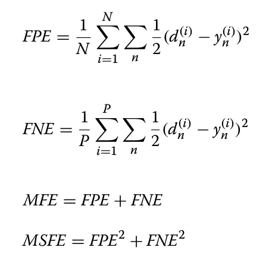

- [1.什么是图像分类？](#user-content-1.什么是图像分类？)
- [2.常用的图像分类模型有哪些？](#user-content-2.常用的图像分类模型有哪些？)
- [3.CNN如何进行图像分类？](#user-content-3.CNN如何进行图像分类？)
- [4.介绍一下图像分类的挑战和未来发展方向？](#user-content-4.介绍一下图像分类的挑战和未来发展方向？)
- [5.图像分类任务中类别不平衡怎么解决？](#user-content-5.图像分类任务中类别不平衡怎么解决？)
- [6.介绍一下分类任务中的标签噪声？](#user-content-6.介绍一下分类任务中的标签噪声？)

<h1 id='1.什么是图像分类？'>1.什么是图像分类？</h1>

图像分类是一种计算机视觉技术，它指的是使用算法对图像中的内容进行识别和分类，将图像分配到预定义的类别中。简而言之，图像分类的任务是给定一个图像，判断这个图像属于哪一个类别。
以下是图像分类的几个关键点：
1. **输入**：图像分类算法的输入通常是一个或多个图像，这些图像以数字格式表示，如RGB（红绿蓝）颜色通道。
2. **输出**：算法的输出是图像所属类别的标签或概率分布。例如，如果有一个动物分类的任务，输出可能是“猫”、“狗”、“鸟”等类别中的一个。
3. **训练过程**：图像分类模型通常需要通过监督学习的方式进行训练。这意味着需要有一个包含成千上万甚至更多带有标签的图像的训练集。模型通过学习这些图像的特征与其标签之间的关系来提高分类的准确性。
4. **特征提取**：在训练过程中，模型会学习如何从图像中提取有助于分类的特征。在深度学习出现之前，这些特征通常需要手动设计。而现代的深度学习模型，尤其是卷积神经网络（CNNs），能够自动学习图像的层次化特征。
5. **应用领域**：图像分类技术在许多领域都有应用，包括但不限于医疗影像分析、交通监控、内容审核、卫星图像解析、农业监测和日常生活中的智能手机应用。
6. **挑战**：图像分类面临的挑战包括但不限于光照变化、图像的视角变化、类内差异（同一类别的不同外观）和类间差异（不同类别的相似外观）。
图像分类技术的发展极大地推动了机器视觉领域，使得计算机能够以接近甚至超过人类的表现来完成图像识别任务。随着深度学习技术的进步，图像分类的准确性和效率都得到了显著提升。

<h1 id='2.常用的图像分类模型有哪些？'>2.常用的图像分类模型有哪些？</h1>

图像分类是计算机视觉中的一个基本任务，旨在将图像分配到预定义的类别中。以下是一些常用的图像分类网络，它们在学术界和工业界都有广泛的应用：
1. **LeNet**：
   - 创始人：Yann LeCun
   - 特点：是较早的卷积神经网络之一，主要用于手写数字识别。
2. **AlexNet**：
   - 创始人：Alex Krizhevsky, Ilya Sutskever, Geoffrey Hinton
   - 特点：2012年ImageNet竞赛的获胜者，引入了ReLU激活函数和Dropout防止过拟合。
3. **VGGNet**：
   - 创始人：Karen Simonyan 和 Andrew Zisserman
   - 特点：使用了一系列重复的卷积层，证明了通过增加网络深度可以提升性能。
4. **GoogLeNet/Inception**：
   - 创始人：Google Research
   - 特点：引入了Inception模块，通过不同尺寸的卷积和池化层并行捕获信息。
5. **ResNet**（残差网络）：
   - 创始人：Kaiming He, Xiangyu Zhang, Shaoqing Ren, Jian Sun
   - 特点：引入了残差学习，允许网络学习恒等映射，可以训练非常深的网络（超过100层）。
6. **DenseNet**：
   - 创始人：Gao Huang, Zhang Liu, Laurens van der Maaten, Kilian Q. Weinberger
   - 特点：每个层都与前面所有层连接，实现了特征复用，减少了参数数量。
7. **MobileNets**：
   - 创始人：Google Research
   - 特点：专为移动和边缘设备设计，使用深度可分离卷积来减少计算量和模型大小。
8. **EfficientNet**：
   - 创始人：Mingxing Tan 和 Quoc V. Le
   - 特点：通过复合缩放方法（同时调整网络的宽度、深度和分辨率）来优化效率和准确性。
9. **RegNet**：
   - 创始人：Facebook AI Research
   - 特点：提出了一种网络设计搜索方法，旨在找到在计算资源限制下最优化的网络架构。
10. **Vision Transformer (ViT)**：
    - 创始人：Google Research
    - 特点：将Transformer架构应用于图像分类任务，不需要卷积层，使用自注意力机制处理图像块。
这些网络代表了从传统的卷积神经网络到最近的基于Transformer的架构的演变。每个网络都有其独特的优势，适应不同的应用场景和计算资源限制。随着研究的进展，还有更多的网络被提出来，旨在提高分类性能、减少参数数量、加快推理速度或适应特定的任务需求。

<h1 id='3.CNN如何进行图像分类？'>3.CNN如何进行图像分类？</h1>

卷积神经网络（CNN）是进行图像分类任务的一种非常有效的深度学习模型。以下是CNN进行图像分类的基本步骤：
### 1. 数据预处理
在将图像输入到CNN之前，通常需要进行以下预处理步骤：
- **归一化**：将图像像素值缩放到一个小的区间（如0到1）。
- **裁剪/缩放**：调整图像大小，使其符合网络输入层的尺寸要求。
- **数据增强**：通过旋转、翻转、缩放、裁剪等操作增加数据的多样性，提高模型的泛化能力。
### 2. 构建CNN模型
一个典型的CNN模型包含以下几种类型的层：
- **卷积层（Convolutional Layer）**：
  - 使用一组可学习的过滤器（或称为内核）来提取图像中的特征。
  - 每个过滤器都负责检测图像中的某种特定的特征，如边缘、角点或纹理。
- **激活函数**：
  - 常用的激活函数如ReLU（Rectified Linear Unit），用于引入非线性因素，使得网络能够学习和模拟更复杂的函数。
- **池化层（Pooling Layer）**：
  - 通常在卷积层之后，用于降低特征的空间维度，同时保留重要信息。
  - 最常用的是最大池化（Max Pooling），它选择每个局部区域内的最大值作为该区域的代表。
- **全连接层（Fully Connected Layer）**：
  - 在网络的最后几层，将前一层的所有激活值连接到每一个神经元。
  - 这些层负责基于卷积层和池化层提取的特征进行分类。
- **归一化层和Dropout层**：
  - 归一化层有助于加速训练过程。
  - Dropout层用于减少过拟合，通过在训练过程中随机“丢弃”一部分神经元的输出来实现。
### 3. 训练过程
- **前向传播**：输入图像通过网络，各层计算并传递激活值。
- **损失函数**：计算网络输出与真实标签之间的差异，常用的损失函数有交叉熵损失。
- **反向传播**：根据损失函数的梯度，更新网络的权重。
- **优化算法**：如SGD（随机梯度下降）、Adam等，用于在网络训练过程中调整权重。
### 4. 评估和优化
- **评估**：使用验证集评估模型的性能。
- **超参数调优**：调整学习率、批次大小、层数、过滤器数量等，以优化模型性能。
- **防止过拟合**：使用正则化技术、数据增强或提前停止训练等方法。
### 5. 预测
- 使用训练好的模型对新的图像进行分类。
- 对于一张新图像，通过前向传播得到输出层的结果，这个结果通常是一个概率分布，表示图像属于每个类别的概率。
- 根据概率分布选择最可能的类别作为预测结果。
通过上述步骤，CNN能够有效地从图像中提取特征并进行分类。随着深度学习框架的发展，如TensorFlow和PyTorch，构建和训练CNN变得更加容易和高效。

<h1 id='4.介绍一下图像分类的挑战和未来发展方向？'>4.介绍一下图像分类的挑战和未来发展方向？</h1>

图像分类是计算机视觉领域的一个基本任务，尽管已经取得了显著的进展，但仍然面临多种挑战，并且有着广阔的未来发展方向。以下是一些主要的挑战和潜在的发展方向：
### 挑战：
1. **数据集偏差**：
   - 现实世界的数据集可能包含各种偏差，如类不平衡、样本偏差等，这会影响模型的泛化能力。
2. **标注问题**：
   - 大规模准确标注的数据集获取成本高昂，且标注质量难以保证。
3. **多标签和多任务学习**：
   - 图像可能包含多个标签或需要同时解决多个任务，这对模型的设计和训练提出了更高的要求。
4. **小样本学习**：
   - 在某些领域，获取大量标注样本是不现实的，因此如何从少量样本中学习是一个挑战。
5. **开放集分类**：
   - 在开放集分类中，模型需要识别出未见过的类别，这是一个极具挑战性的任务。
6. **域自适应**：
   - 模型需要在源域训练后，直接在具有不同分布的目标域上表现良好。
7. **对抗性攻击**：
   - 对抗性样本可以轻易地欺骗图像分类模型，这要求模型具有更强的鲁棒性。
8. **可解释性和透明度**：
   - 模型的决策过程往往缺乏透明度，这对于需要解释性的应用来说是一个问题。
### 未来发展方向：
1. **无监督和自监督学习**：
   - 开发无需标注数据的训练方法，利用未标注数据或伪标签进行学习。
2. **元学习和迁移学习**：
   - 通过元学习快速适应新任务，以及通过迁移学习将知识从源域转移到目标域。
3. **增强现实和小样本学习**：
   - 结合增强现实技术，开发能够从少量样本中快速学习的算法。
4. **对抗性鲁棒性**：
   - 设计能够抵抗对抗性攻击的模型和训练策略。
5. **可解释性AI**：
   - 提高模型的解释能力，使其决策过程更加透明和可理解。
6. **多模态学习**：
   - 结合图像与其他模态（如文本、音频）的数据，进行更丰富的信息融合。
7. **持续学习和终身学习**：
   - 模型能够持续学习新知识，而不会忘记之前学到的信息。
8. **数据隐私和安全性**：
   - 在保护用户隐私的同时进行图像分类，例如通过联邦学习或差分隐私技术。
9. **自动化机器学习（AutoML）**：
   - 自动化模型设计、超参数优化和数据处理流程，减少人工干预。
10. **跨域和多任务学习**：
    - 同时在多个域或任务上进行学习，提高模型的泛化和适应性。
随着技术的进步和研究的深入，图像分类领域有望克服这些挑战，并朝着更加高效、鲁棒和可解释的方向发展。

<h1 id='5.图像分类任务中类别不平衡怎么解决？'>5.图像分类任务中类别不平衡怎么解决？</h1>

类别不平衡是指分类任务中不同类别的训练样本数目相差较大的情况，通常是由于样本较难采集或样本示例较少而引起的，经常出现在疾病类别诊断、欺诈类型判别等任务中。
类别不平衡的问题可以从数据层面、算法层面、数据和算法混合层面三个方面进行解决。

1、基于数据层面的方法
基于数据层面的方法主要对参与训练的数据集进行相应的处理，以减少类别不平衡带来的影响。

Hensman等[2]提出了提升样本（over sampling）的方法，即对于类别数目较少的类别，从中随机选择一些图片进行复制并添加至该类别包含的图像内，直到这个类别的图片数目和最大数目类的个数相等为止。通过实验发现，这一方法对最终的分类结果有了非常大的提升。

Lee等[3]提出了一种两阶段（two-phase）训练法。首先根据数据集分布情况设置一个阈值N，通常为最少类别所包含样例个数。随后对样例个数大于阈值的类别进行随机抽取，直到达到阈值。此时根据阈值抽取的数据集作为第一阶段的训练样本进行训练，并保存模型参数。最后采用第一阶段的模型作为预训练数据，再在整个数据集上进行训练，对最终的分类结果有了一定的提升.

Pouyanfar等[4]则提出了一种动态采样（dynamic sampling）的方法。该方法借鉴了提升样本的思想，将根据训练结果对数据集进行动态调整，对结果较好的类别进行随机删除样本操作，对结果较差的类别进行随机复制操作，以保证分类模型每次学习都能学到相关的信息。

论文名称：
[2] Hensman P, Masko D. The impact of imbalanced training data for convolutional neural networks. 2015.
[3] Lee H, Park M, Kim J. Plankton classification on imbalanced large scale database via convolutional neural networks with transfer learning. In: 2016 IEEE international conference on image processing (ICIP). 2016. p. 3713–7.
[4] Pouyanfar S, Tao Y, Mohan A, Tian H, Kaseb AS, Gauen K, Dailey R, Aghajanzadeh S, Lu Y, Chen S, Shyu M. Dynamic sampling in convolutional neural networks for imbalanced data classification. In: 2018 IEEE conference on multimedia information processing and retrieval (MIPR). 2018. p. 112–7.

2、基于算法层面的方法

基于算法层面的方法主要对现有的深度学习算法进行改进，通过修改损失函数或学习方式的方法来消除类别不平衡带来的影响。
Wang等[5]提出mean squared false error (MSFE) loss。这一新的损失函数是在mean false error (MFE) loss的基础上进行改进，具体公式如下图所示：

MSFE loss能够很好地平衡正反例之间的关系，从而实现更好的优化结果。
Buda等[6]提出输出阈值（output thresholding）的方法，通过调整网络结果的输出阈值来改善类别不平衡的问题。模型设计者根据数据集的构成和输出的概率值，人工设计一个合理的阈值，以降低样本数目较少的类别的输出要求，使得其预测结果更加合理。

论文名称：
[6] Buda M, Maki A, Mazurowski MA. A systematic study of the class imbalance problem in convolutional neural
networks. Neural Netw. 2018;106:249–59.

3、基于数据和算法的混合方法

Huang等[7]提出Large Margin Local Embedding (LMLE)的方法，采用五倍抽样法（quintuplet sampling ）和tripleheader hinge loss函数，可以更好地提取样本特征，随后将特征送入改进的K-NN分类模型，能够实现更好的聚类效果。除此之外，Dong等[8]则融合了难例挖掘和类别修正损失函数的思想，同样是在数据和损失函数进行改进。

论文名称：
[7] Huang C, Li Y, Loy CC, Tang X. Learning deep representation for imbalanced classification. In: 2016 IEEE conference on computer vision and pattern recognition (CVPR). 2016. p. 5375–84.
[8] Dong Q, Gong S, Zhu X. Imbalanced deep learning by minority class incremental rectification. In: IEEE transactions on pattern analysis and machine intelligence. 2018. p. 1–1

<h1 id='6.介绍一下分类任务中的标签噪声？'>6.介绍一下分类任务中的标签噪声？</h1>

在构建数据集时，主客观因素可能导致标签错误，这些错误会影响模型的性能。因此，对数据集进行净化，以减轻标签错误的影响，是必要的步骤。
标签错误通常分为两类：跨类别错误和随机错误。跨类别错误指的是图像被错误地归类到数据集中的另一个类别。而随机错误则是指一些图像虽然被标记为某一类别，但实际上与该类别不相关，且不属于任何已知类别。

