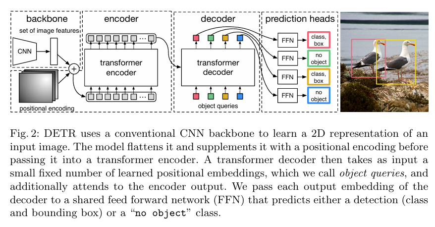
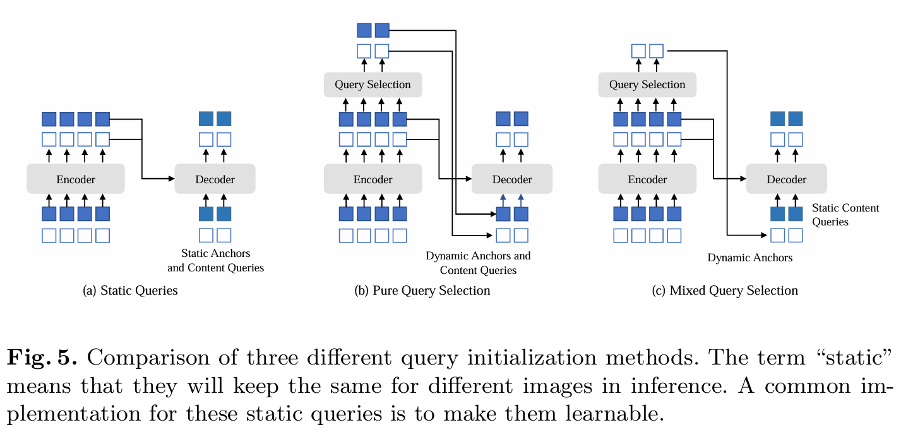
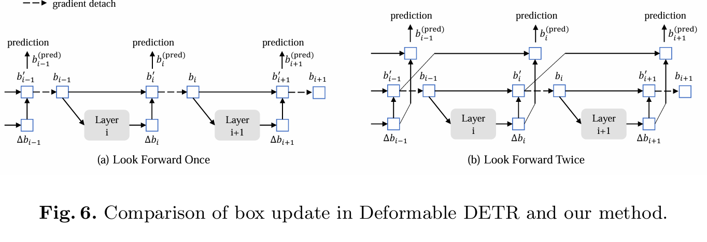
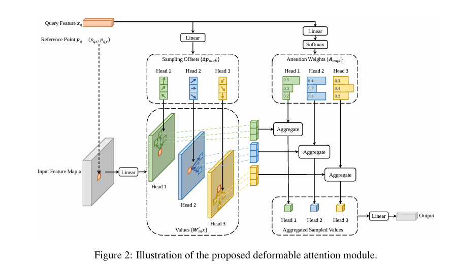
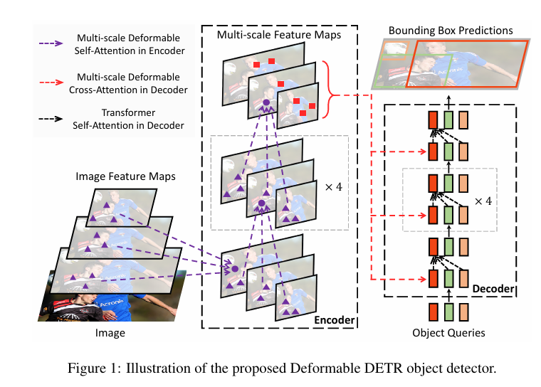
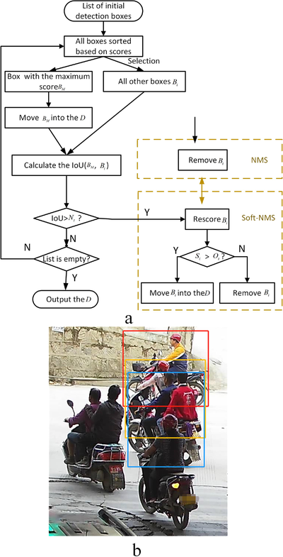

# 目录

- [1.目标检测中IOU的相关概念与计算](#user-content-1.目标检测中iou的相关概念与计算)
- [2.目标检测中NMS的相关概念与计算](#user-content-2.目标检测中nms的相关概念与计算)
- [3.One-stage目标检测与Two-stage目标检测的区别？](#user-content-3.one-stage目标检测与two-stage目标检测的区别？)
- [4.哪些方法可以提升小目标检测的效果？](#user-content-4.哪些方法可以提升小目标检测的效果？)
- [5.Focal Loss的作用？](#user-content-5.focal-loss的作用？)
- [6.YOLO系列的面试问题](#user-content-6.yolo系列的面试问题)
- [7.有哪些经典的轻量型人脸检测模型？](#user-content-7.有哪些经典的轻量型人脸检测模型？)
- [8.LFFD人脸检测模型的结构和特点？](#user-content-8.lffd人脸检测模型的结构和特点？)
- [9.目标检测中AP，AP50，AP75，mAP等指标的含义](#user-content-9.目标检测中ap，ap50，ap75，map等指标的含义)
- [10.YOLOv2中的anchor如何生成？](#user-content-10.yolov2中的anchor如何生成？)
- [11.介绍下YOLOv5中的CSP结构？](#11.介绍下YOLOv5中的CSP结构？)
- [12.介绍下YOLOv5中的SPP结构?](#12.介绍下YOLOv5中的SPP结构?)
- [13.FPN(Feature Pyramid Network)的相关知识](#user-content-13.fpnfeature-pyramid-network的相关知识)
- [14.SPP(Spatial Pyramid Pooling)的相关知识](#user-content-14.sppspatial-pyramid-pooling的相关知识)
- [15.FPN网络的主要作用是什么？](#15.FPN网络的主要作用是什么？)
- [16.请介绍下YOLOv5中的Focus操作？](#16.请介绍下YOLOv5中的Focus操作？)
- [17.请介绍下目标检测算法中基于Anchor based和Anchor free方法的区别？](#17.请介绍下目标检测算法中基于Anchor-based和Anchor-free方法的区别？)
- [18.请介绍ROIPooling？](#18.请介绍ROIPooling？)
- [19.请介绍ROIAlign？](#19.请介绍ROIAlign？)
- [20.请介绍一下DETR？](#20.请介绍一下DETR？)
- [21.请介绍一下DINO？](#21.请介绍一下DINO？)
- [22.请介绍一下Deformable_DETR？](#22.请介绍一下Deformable_DETR？)
- [23.什么是 Soft-NMS，它与传统 NMS 的区别是什么？](#23.什么是 Soft-NMS，它与传统 NMS 的区别是什么？)
- [24.什么是 GIoU / DIoU / CIoU Loss，它们为什么比 IoU Loss 更好？](#24.什么是 GIoU / DIoU / CIoU Loss，它们为什么比 IoU Loss 更好？)
- [25.什么是 PANet（Path Aggregation Network），它如何增强特征融合？](#25.什么是 PANet（Path Aggregation Network），它如何增强特征融合？)
- [26.什么是 Cascade R-CNN，它解决了什么问题？](#26.什么是 Cascade R-CNN，它解决了什么问题？)
- [27.目标检测中的 Test Time Augmentation (TTA) 是什么？](#27.目标检测中的 Test Time Augmentation (TTA) 是什么？)
- [28.目标检测中常用的多尺度训练（Multi-scale Training）策略是什么？](#28.目标检测中常用的多尺度训练（Multi-scale Training）策略是什么？)
- [29.自适应训练样本分配（ATSS）是什么？](#29.自适应训练样本分配（ATSS）是什么？)
- [30.介绍一下CenterNet的原理，它与传统的目标检测有什么不同点？](#30.介绍一下CenterNet的原理，它与传统的目标检测有什么不同点？)
- [31.介绍一下解耦头（Decoupled Head）是什么？](#31.介绍一下解耦头（Decoupled Head）是什么？)
- [32.你知道哪些边缘端部署的方案？](#32.你知道哪些边缘端部署的方案？)
- [33.CenterNet中heatmap（热力图）如何生成？](#33.CenterNet中heatmap（热力图）如何生成？)
- [34.介绍一下SSD算法？](#34.介绍一下SSD算法？)


<h2 id="1.目标检测中iou的相关概念与计算">1.目标检测中IOU的相关概念与计算</h2>

IoU（Intersection over Union）即交并比，是目标检测任务中一个重要的模块，其是<font color=DeepSkyBlue>GT bbox与pred bbox交集的面积 / 二者并集的面积</font>。


下面我们用坐标（top，left，bottom，right），即左上角坐标，右下角坐标。从而可以在给定的两个矩形中计算IOU值。

```
def compute_iou(rect1,rect2):
  # (y0,x0,y1,x1) = (top,left,bottom,right)
  S_rect1 = (rect1[2] - rect1[0]) * (rect1[3] - rect1[1])
  S_rect2 = (rect2[2] - rect2[0]) * (rect2[3] - rect1[1])

  sum_all = S_rect1 + S_rect2
  left_line = max(rect1[1],rect2[1])
  right_line = min(rect1[3],rect2[3])
  top_line = max(rect1[0],rect2[0])
  bottom_line = min(rect1[2],rect2[2])

  if left_line >= right_line or top_line >= bottom_line:
    return 0
  else:
    intersect = (right_line - left_line) * (bottom_line - top_line)
    return (intersect / (sum_area - intersect)) * 1.0
```


<h2 id="2.目标检测中nms的相关概念与计算">2.目标检测中NMS的相关概念与计算</h2>

在目标检测中，我们可以利用非极大值抑制（NMS）对生成的大量候选框进行后处理，去除冗余的候选框，得到最具代表性的结果，以加快目标检测的效率。

如下图所示，消除多余的候选框，找到最佳的bbox：


<font color=DeepSkyBlue>非极大值抑制（NMS）流程：</font>

1. 首先我们需要设置两个值：一个Score的阈值，一个IOU的阈值。

2. 对于每类对象，遍历该类的所有候选框，过滤掉Score值低于Score阈值的候选框，并根据候选框的类别分类概率进行排序：$A < B < C < D < E < F$。

3. 先标记最大概率矩形框F是我们要保留下来的候选框。

4. 从最大概率矩形框F开始，分别判断A～E与F的交并比（IOU）是否大于IOU的阈值，假设B、D与F的重叠度超过IOU阈值，那么就去除B、D。

5. 从剩下的矩形框A、C、E中，选择概率最大的E，标记为要保留下来的候选框，然后判断E与A、C的重叠度，去除重叠度超过设定阈值的矩形框。

6. 就这样重复下去，直到剩下的矩形框没有了，并标记所有要保留下来的矩形框。

7. 每一类处理完毕后，返回步骤二重新处理下一类对象。

```
import numpy as np

def py_cpu_nms(dets, thresh):
  #x1、y1（左下角坐标）、x2、y2（右上角坐标）以及score的值
  x1 = dets[:, 0]
  y1 = dets[:, 1]
  x2 = dets[:, 2]
  y2 = dets[:, 3]
  scores = dets[:, 4]

  #每一个候选框的面积
  areas = (x2 - x1 + 1) * (y2 - y1 + 1)
  #按照score降序排序（保存的是索引）
  order = scores.argsort()[::-1]

  keep = []
  while order.size > 0:
    i = order[0]
    keep.append(i)
    #计算当前概率最大矩形框与其他矩形框的相交框的坐标，会用到numpy的broadcast机制，得到向量
    xx1 = np.maximum(x1[i], x1[order[1:]])
    yy1 = np.maximum(y1[i], y1[order[1:]])
    xx2 = np.minimum(x2[i], x2[order[1:]])
    yy2 = np.minimum(y2[i], y2[order[1:]])

    #计算相交框的面积，注意矩形框不相交时w或h算出来会是负数，用0代替
    w = np.maximum(0.0, xx2 - xx1 + 1)
    h = np.maximum(0.0, yy2 - yy1 + 1)
    inter = w * h
    #计算重叠度IOU：重叠面积 / （面积1 + 面积2 - 重叠面积）
    ovr = inter / (areas[i] + areas[order[1:]] - inter)

    #找到重叠度不高于阈值的矩形框索引
    inds = np.where(ovr < thresh)[0]
    # 将order序列更新，由于前面得到的矩形框索引要比矩形框在原order序列中的索引小1，所以要加1操作
    order = order[inds + 1]

  return keep
```


<h2 id="3.one-stage目标检测与two-stage目标检测的区别？">3.One-stage目标检测与Two-stage目标检测的区别？</h2>

<font color=DeepSkyBlue>Two-stage目标检测算法</font>：先进行区域生成（region proposal，RP）（一个有可能包含待检物体的预选框），再通过卷积神经网络进行样本分类。其精度较高，速度较慢。

主要逻辑：特征提取—>生成RP—>分类/定位回归。

常见的Two-stage目标检测算法有：Faster R-CNN系列和R-FCN等。

<font color=DeepSkyBlue>One-stage目标检测算法</font>：不用RP，直接在网络中提取特征来预测物体分类和位置。其速度较快，精度比起Two-stage算法稍低。

主要逻辑：特征提取—>分类/定位回归。

常见的One-stage目标检测算法有：YOLO系列、SSD和RetinaNet等。


<h2 id="4.哪些方法可以提升小目标检测的效果？">4.哪些方法可以提升小目标检测的效果？</h2>

1. 提高图像分辨率。小目标在边界框中可能只包含几个像素，那么能通过提高图像的分辨率以增加小目标的特征的丰富度。
  
2. 提高模型的输入分辨率。这是一个效果较好的通用方法，但是会带来模型inference速度变慢的问题。
  
3. 平铺图像。


4. 数据增强。小目标检测增强包括随机裁剪、随机旋转和镶嵌增强等。
  
5. 自动学习anchor。
  
6. 类别优化。


<h2 id="5.focal-loss的作用？">5.Focal Loss的作用？</h2>

<font color=DeepSkyBlue>Focal Loss是解决了分类问题中类别不均衡、分类难度差异的一个损失函数，使得模型在训练过程中更加聚焦在困难样本上。</font>

Focal Loss是从二分类问题出发，同样的思想可以迁移到多分类问题上。

我们知道二分类问题的标准loss是**交叉熵**：


对于二分类问题我们也几乎适用sigmoid激活函数$\hat{y} = \sigma(x)$，所以上面的式子可以转化成：


这里有$1 - \sigma(x) = \sigma(-x)$。

Focal Loss论文中给出的式子如下：


其中$y\in \{ 1,-1\}$是真实标签，$p\in[0,1]$是预测概率。

我们再定义$p_{t}:$


那么，上面的交叉熵的式子可以转换成：


有了上面的铺垫，最初Focal Loss论文中接着引入了**均衡交叉熵函数**：


针对类别不均衡问题，在Loss里加入一个控制权重，对于属于少数类别的样本，增大$\alpha_{t}$即可。<font color=DeepSkyBlue>但这样有一个问题，它仅仅解决了正负样本之间的平衡问题，并没有区分易分/难分样本</font>。

**为什么上述公式只解决正负样本不均衡问题呢？**

因为增加了一个系数$\alpha_{t}$，跟$p_{t}$的定义类似，当$label=1$的时候$\alpha_{t}=\alpha$ ;当$label=-1$的时候，$\alpha_{t}= 1 - \alpha$，$\alpha$的范围也是$[0,1]$。因此可以通过设定$\alpha$的值（如果$1$这个类别的样本数比$-1$这个类别的样本数少很多，那么$\alpha$可以取$0.5$到$1$来增加$1$这个类的样本的权重）来控制正负样本对整体Loss的贡献。

<h3 id="focal-loss">Focal Loss</h3>

为了可以区分难/易样本，Focal Loss雏形就出现了：


$(1 - p_{t})^{\gamma}$用于平衡难易样本的比例不均，$\gamma >0$起到了对$(1 - p_{t})$的放大作用。$\gamma >0$减少易分样本的损失，使模型更关注于困难易错分的样本。例如当$\gamma =2$时，模型对于某正样本预测置信度$p_{t}$为$0.9$，这时$(1 - 0.9)^{\gamma} = 0.01$，也就是FL值变得很小；而当模型对于某正样本预测置信度$p_{t}$为0.3时，$(1 - 0.3)^{\gamma} = 0.49$，此时它对Loss的贡献就变大了。当$\gamma = 0$时变成交叉熵损失。

为了应对正负样本不均衡的问题，在上面的式子中再加入平衡交叉熵的$\alpha_{t}$因子，用来平衡正负样本的比例不均，最终得到Focal Loss：


Focal Loss论文中给出的实验最佳取值为$a_{t}= 0.25$，$\gamma = 2$。


<h2 id="6.yolo系列的面试问题">6.YOLO系列的面试问题</h2>

Rocky之前总结了YOLOv1-v7全系列的解析文章，帮助大家应对可能出现的与YOLO相关的面试问题，大家可按需取用：

[【Make YOLO Great Again】YOLOv1-v7全系列大解析（汇总篇）](https://mp.weixin.qq.com/s?__biz=Mzg4NDYwOTUwNA==&mid=2247486017&idx=1&sn=ff028fa235f384fe74576ef346849600&chksm=cfb4d2cef8c35bd8726cdd3bc9664f2bc5edd1eaf3876e6ff60e523277461b43a57389621bc8&token=1199271157&lang=zh_CN#rd)


<h2 id="7.有哪些经典的轻量型人脸检测模型？">7.有哪些经典的轻量型人脸检测模型？</h2>

人脸检测相对于通用目标检测来说，算是一个子任务。比起通用目标检测任务动辄检测1000个类别，人脸检测任务主要聚焦于人脸的单类目标检测，<font color=DeepSkyBlue>使用通用目标检测模型太过奢侈，有点“杀鸡用牛刀”的感觉，并且大量的参数冗余，会影响部署侧的实用性</font>，故针对人脸检测任务，学术界提出了很多轻量型的人脸检测模型，Rocky在这里给大家介绍一些比较有代表性的：

1. libfacedetection
2. Ultra-Light-Fast-Generic-Face-Detector-1MB
3. A-Light-and-Fast-Face-Detector-for-Edge-Devices
4. CenterFace
5. DBFace
6. RetinaFace
7. MTCNN


<h2 id="8.lffd人脸检测模型的结构和特点？">8.LFFD人脸检测模型的结构和特点？</h2>

<font color=DeepSkyBlue>Rocky在实习/校招面试中被多次问到LFFD模型以及面试官想套取LFFD相关算法方案的情况，说明LFFD模型在工业界还是比较有价值的</font>，下面Rocky就带着大家学习一下LFFD模型的知识：

LFFD（A-Light-and-Fast-Face-Detector-for-Edge-Devices）适用于人脸、行人、车辆等单目标检测任务，具有速度快，模型小，效果好的特点。<font color=DeepSkyBlue>LFFD是Anchor-free的方法，使用感受野替代Anchors，并在主干结构上抽取8路特征图对从小到大的人脸进行检测，检测模块分为类别二分类与边界框回归</font>。

**LFFD模型结构**


我们可以看到，LFFD模型主要由四部分组成：tiny part、small part、medium part、large part。

模型中并没有采用BN层，因为BN层会减慢17%的推理速度。其主要采用尽可能快的下采样来保持100%的人脸覆盖。

**LFFD主要特点：**

1. 结构简单直接，易于在主流AI端侧设备中进行部署。

2. 检测小目标能力突出，在极高分辨率（比如8K或更大）画面，可以检测其间10个像素大小的目标；

**LFFD损失函数**

LFFD损失函数是由regression loss和classification loss的加权和。

分类损失使用了交叉熵损失。

回归损失使用了L2损失函数。

LFFD论文地址：[LFFD: A Light and Fast Face Detector for Edge Devices论文地址](https://arxiv.org/pdf/1904.10633.pdf)


<h2 id="9.目标检测中ap，ap50，ap75，map等指标的含义">9.目标检测中AP，AP50，AP75，mAP等指标的含义</h2>

AP：PR曲线下的面积。


AP50: 固定IoU为50%时的AP值。

AP75:固定IoU为75%时的AP值。

AP@[0.5:0.95]:把IoU的值从50%到95%每隔5%进行了一次划分，并对这10组AP值取平均。

mAP：对所有的类别进行AP的计算，然后取均值。

mAP@[.5:.95]（即mAP@[.5,.95]）：表示在不同IoU阈值（从0.5到0.95，步长0.05）（0.5、0.55、0.6、0.65、0.7、0.75、0.8、0.85、0.9、0.95）上的平均mAP。


<h2 id="10.yolov2中的anchor如何生成？">10.YOLOv2中的anchor如何生成？</h2>

YOLOv2中<font color=DeepSkyBlue>引入K-means算法进行anchor的生成</font>，可以自动找到更好的anchor宽高的值用于模型训练的初始化。

但如果使用经典K-means中的欧氏距离作为度量，意味着较大的Anchor会比较小的Anchor产生更大的误差，聚类结果可能会偏离。

由于目标检测中主要关心anchor与ground true box（gt box）的IOU，不关心两者的大小。因此，使用IOU作为度量更加合适，即提高IOU值。因此YOLOv2采用IOU值为评判标准：

$$d(gt box,anchor) = 1 - IOU(gt box,anchor)$$

具体anchor生成步骤与经典K-means大致相同，在下一个章节中会详细介绍。主要的不同是使用的度量是$d(gt box,anchor)$，并将anchor作为簇的中心。


<h2 id="11.介绍下YOLOv5中的CSP结构？">11.介绍下YOLOv5中的CSP结构？</h2>
CSP(Cross Stage Parial Network)结构是YOLOv5中Backbone网络中用来提高特征识别能力的技术。
它可以提供更高级别的特征，加快特征提取的速度，减少模型参数量，从而使YOLOv5能够更好地进行目标检测。

CSP结构的主要思想是将输入特征图分成两个分支，每个分支都包含一些卷积层和残差连接，然后通过一个跨阶段的连接将两个分支组合起来。

具体来说，CSP结构包含以下几个主要组成部分:
- **块内部残差连接(Residual Connection)**：每个块内部都包含一个残差连接，用于提高信息传递和反向梯度流的效果。
具体来说，每个块内部的第一个卷积层输出的特征图会被直接添加到块的最后一个卷积层输出的特征图上。
- **跨阶段连接(Cross-Stage Connection)**：CSP结构通过一个跨阶段的连接将两个分支组合起来。具体来说，将输入特征图分成两个相等的部分， 
其中一部分作为主干部分，另一部分作为侧分支。然后在侧分支上应用一些卷积层，将其输出与主干部分的输出串联起来，得到最终的特征图输出。
- **块内部的卷积层和批归一化(Convolution and Batch Normalization)**：每个块内部包含一些卷积层和批归一化层，用于提取特征和规范化特征图。
具体来说，每个块内部的第一个卷积层通常是一个3x3的卷积层，其后跟一个批归一化层和ReLU激活函数。
然后是一系列1x1的卷积层和3x3的卷积层，每个卷积层后都跟着批归一化层和ReLU激活函数.
- **块之间的下采样(Downsampling)**：CSP结构中的每个块之间都包含一个下采样步骤，用于将特征图分辨率减半。具体来说，下采
样通常通过一个步长为2的卷积层实现，也可以通过池化层来实现。

>

源码分析:
```python
class BottleneckCSP(nn.Module):
    #CSP结构
    def __init__(self, c1, c2, n=1, shortcut=True, g=1, e=0.5):  # ch_in, ch_out, number, shortcut, groups, expansion
        super().__init__()
        c_ = int(c2 * e)  # hidden channels
        self.cv1 = Conv(c1, c_, 1, 1)#对应上面网络结构图的上面的分支的第一个CBL
        self.cv2 = nn.Conv2d(c1, c_, 1, 1, bias=False)#对应上面网络结构图的下面的分支的conv
        self.cv3 = nn.Conv2d(c_, c_, 1, 1, bias=False)#对应上面网络结构图的上面的分支的conv
        self.cv4 = Conv(2 * c_, c2, 1, 1)#对应最后的CBL
        self.bn = nn.BatchNorm2d(2 * c_)  # applied to cat(cv2, cv3)
        self.act = nn.SiLU()#对应Concat后的Leaky ReLU
        self.m = nn.Sequential(*(Bottleneck(c_, c_, shortcut, g, e=1.0) for _ in range(n)))
        #nn.Sequential--序贯模型是函数式模型的简略版，为最简单的线性、从头到尾的结构顺序，不分叉，是多个网络层的线性堆叠。
        #self.m对应X个Resunit or 2 * X个CBL（对应的切换是通过Bottleneck类中的True 或 False决定，True为X个Resunit，False为2 * X个CBL）
    def forward(self, x):
        y1 = self.cv3(self.m(self.cv1(x)))#对应上面网络结构图的上面的分支
        y2 = self.cv2(x)#对应上面网络结构图的下面的分支
        return self.cv4(self.act(self.bn(torch.cat((y1, y2), dim=1))))
        #torch.cat对应Concat
        #self.bn对应Concat后的BN
```


<h1 id="12.介绍下YOLOv5中的SPP结构?">12.介绍下YOLOv5中的SPP结构?</h1>

### SPP应用的背景：

在卷积神经网络中我们经常看到固定输入的设计，但是如果输入不能是固定尺寸的该怎么办呢？

通常来说，有以下几种方法：

（1）对输入进行resize操作，让他们统统变成你设计的层的输入规格那样。但是这样过于暴力直接，可能会丢失很多信息或者多出很多不该有的信息（图片变形等），影响最终的结果。

（2）替换网络中的全连接层，对最后的卷积层使用global average pooling，全局平均池化只和通道数有关，而与特征图大小没有关系

（3）最后一个当然是我们要讲的SPP结构啦~

### SPP结构分析

SPP结构又被称为空间金字塔池化，能将任意大小的特征图转换成固定大小的特征向量。

**处理流程：**

- 输入层：首先我们现在有一张任意大小的图片，其大小为w * h。

- 输出层：21个神经元 -- 即我们希望提取到21个特征。

分析如下图所示：分别对1 * 1分块，2 * 2分块和4 * 4子图里分别取每一个框内的max值（即取蓝框框内的最大值），
这一步就是作最大池化，这样最后提取出来的特征值（即取出来的最大值）一共有1 * 1 + 2 * 2 + 4 * 4 = 21个。得出的特征再concat在一起。
>

在YOLOv5中SPP的结构图如下图所示：

>


<h2 id="13.fpnfeature-pyramid-network的相关知识">13.FPN(Feature Pyramid Network)的相关知识</h2>

<h3 id="fpn的创新点">FPN的创新点</h3>

1. 设计特征金字塔的结构
2. 提取多层特征（bottom-up，top-down）
3. 多层特征融合（lateral connection）

设计特征金字塔的结构，用于解决目标检测中的多尺度问题，在基本不增加原有模型计算量的情况下，大幅度提升小物体（small object）的检测性能。

原来很多目标检测算法都是只采用高层特征进行预测，高层的特征语义信息比较丰富，但是分辨率较低，目标位置比较粗略。<font color=DeepSkyBlue>假设在深层网络中，最后的高层特征图中一个像素可能对应着输出图像$20 \times 20$的像素区域，那么小于$20 \times 20$像素的小物体的特征大概率已经丢失</font>。与此同时，低层的特征语义信息比较少，但是目标位置准确,这是对小目标检测有帮助的。<font color=DeepSkyBlue>FPN将高层特征与底层特征进行融合，从而同时利用低层特征的高分辨率和高层特征的丰富语义信息，并进行了多尺度特征的独立预测</font>，对小物体的检测效果有明显的提升。


传统解决这个问题的思路包括:

1. 图像金字塔（image pyramid），即多尺度训练和测试。但该方法计算量大，耗时较久。
2. 特征分层，即每层分别输出对应的scale分辨率的检测结果，如SSD算法。但实际上不同深度对应不同层次的语义特征，浅层网络分辨率高，学到更多是细节特征，深层网络分辨率低，学到更多是语义特征，单单只有不同的特征是不够的。


<h3 id="fpn的主要模块">FPN的主要模块</h3>

1. Bottom-up pathway（自底向上线路）
2. Top-down path（自顶向下线路）
3. Lareral connections（横向链路）


**Bottom-up pathway（自底向上线路）**

自底向上线路是卷积网络的前向传播过程。在前向传播过程中，feature map的大小可以在某些层发生改变。

**Top-down path（自顶向下线路）和Lareral connections（横向链路）**

自顶向下线路是上采样的过程，而横向链路是将自顶向下线路的结果和自底向上线路的结构进行融合。

上采样的feature map与相同大小的下采样的feature map进行逐像素相加融合（element-wise addition），其中自底向上的feature先要经过$1\times 1$卷积层，目的是为了减少通道维度。

<h3 id="fpn应用">FPN应用</h3>

论文中FPN直接在Faster R-CNN上进行改进，其backbone是ResNet101，FPN主要应用在Faster R-CNN中的RPN和Fast R-CNN两个模块中。

**FPN+RPN：**

将FPN和RPN结合起来，那RPN的输入就会变成多尺度的feature map，并且在RPN的输出侧接多个RPN head层用于满足对anchors的分类和回归。

**FPN+Fast R-CNN：**

Fast R-CNN的整体结构逻辑不变，在backbone部分引入FPN思想进行改造。


<h2 id="14.sppspatial-pyramid-pooling的相关知识">14.SPP(Spatial Pyramid Pooling)的相关知识</h2>

在目标检测领域，很多检测算法最后使用了全连接层，导致输入尺寸固定。当遇到尺寸不匹配的图像输入时，就需要使用crop或者warp等操作进行图像尺寸和算法输入的匹配。这两种方式可能出现不同的问题：裁剪的区域可能没法包含物体的整体；变形操作造成目标无用的几何失真等。

<font color=DeepSkyBlue>而SPP的做法是在卷积层后增加一个SPP layer，将features map拉成固定长度的feature vector。然后将feature vector输入到全连接层中</font>。以此来解决上述的尴尬问题。


**SPP的优点：**

1. SPP可以忽略输入尺寸并且产生固定长度的输出。
2. SPP使用多种尺度的滑动核，而不是只用一个尺寸的滑动窗口进行pooling。
3. SPP在不同尺寸feature map上提取特征，增大了提取特征的丰富度。


在YOLOv4中，对SPP进行了创新使用，Rocky已在[【Make YOLO Great Again】YOLOv1-v7全系列大解析（Neck篇）](https://mp.weixin.qq.com/s?__biz=Mzg4NDYwOTUwNA==&mid=2247485146&idx=1&sn=f925d3509585c6cbe094e6a19cea35e2&chksm=cfb4de55f8c357439efb86d9930103614bea0c8e0adf41513cbd53d020e32972ea0a902c96c2&token=1308238350&lang=zh_CN#rd)中详细讲解，大家可按需取用～


<h2 id="15.FPN网络的主要作用是什么？">15.FPN网络的主要作用是什么？</h2>

**FPN（Feature Pyramid Network）**，即特征金字塔网络，是一种用于解决目标检测和语义分割中多尺度问题的深度学习网络结构。

FPN网络是在2017年的CVPR会议上提出的，主要目的是**通过特征融合的方式**，在不显著增加计算量的情况下，提升**多尺度目标的检测性能**，
尤其是对**小目标**的检测能力。 它通过构建多尺度特征金字塔，将**高层特征图的语义信息与低层特征图的空间信息**进行融合，生成具有丰富多尺度信息的特征表示。


<h2 id="16.请介绍下YOLOv5中的Focus操作？">16.请介绍下YOLOv5中的Focus操作？</h2>

**Focus模块**是一种用于特征提取的CNN层，用于将输入特征图中的信息进行压缩和组合，从而提取出更高层次的特征表示，它被用作网络中的第一个卷积层，
用于对输入特征图进行下采样，以减少计算量和参数量。

Focus层在YOLOv5中是图片进入Backbone前，对图片进行切片操作，原理与Yolov2的passthrough层类似，采用切片操作把高分辨率的图片（特征图）
拆分成多个低分辨率的图片或特征图，即隔列采样+拼接。


<h2 id="17.请介绍下目标检测算法中基于Anchor based和Anchor free方法的区别？">17.请介绍下目标检测算法中基于Anchor-based和Anchor-free方法的区别？</h2>

**Anchor的定义：**
Anchor也被称为锚框，即预设的目标大概位置，通过k-means等方法从训练集中聚类得出，用于目标分类和边界框回归的调整。

**Anchor Based方法**需要预设的目标位置框；

**Anchor Free方法**通过关键点检测方法：通过目标物体的几个关键点限定搜索空间，预测中心到边界的距离形成检测框，如CornerNet/CornerNet-lite。

**两者之间的区别：**

- **是否使用预定义的候选框**：Anchor Based使用，而Anchor Free不使用。
- **正负样本选择方式**：Anchor Based通过IoU确定，Anchor Free通过特征图上的点是否落入GT框确定。
- **回归方式**：Anchor Based回归anchor box的偏移量，Anchor Free回归中心点到目标框四条边的距离。


<h2 id="18.请介绍ROIPooling？">18.请介绍ROIPooling？</h2>

在计算机视觉的目标检测任务中，ROI Pooling（Region of Interest Pooling）是一种经典的操作，用于从特征图中提取感兴趣区域（ROI）的固定尺寸特征。它最早在 Faster R-CNN 模型中被提出，帮助将不同大小的候选框转换为统一的特征向量，便于后续分类和回归。

### ROI Pooling 的原理

ROI Pooling 的核心是将任意大小的 ROI 映射到固定尺寸的输出特征图（如 7x7），以适应全连接层的输入。它通过池化操作来实现特征的降采样和聚合。具体来说，它假设输入是一个特征图（从骨干网络如 VGG 或 ResNet 提取），以及一组 ROI 框（通常来自 RPN 网络）。

#### 操作步骤

1. **坐标量化**：首先，将 ROI 的浮点坐标映射到特征图的尺度上，并通过取整（floor 或 round）量化成整数坐标。这一步是为了适应离散的像素网格。
2. **网格划分**：将量化后的 ROI 均匀分成固定大小的网格 bin（如 7x7），每个 bin 的边界也通过量化（取整）确定。
3. **池化操作**：在每个 bin 内，对覆盖的特征值进行最大池化（Max Pooling）或平均池化（Average Pooling）。如果 bin 内没有整数像素点，则可能为空或使用最近点。
4. **输出特征**：最终得到一个固定尺寸的特征图，用于下游任务。

### 局限性与缺点

尽管有效，ROI Pooling 存在明显的量化误差：

- **对齐偏差（Misalignment）**：两次量化操作（ROI 坐标和 bin 划分）会导致特征图与原 ROI 不精确对齐，尤其在小目标或边界处，误差会放大。
- **精度损失**：在实例分割或精确边界框回归任务中，这种粗糙处理会降低模型的 mAP（mean Average Precision），特别是在 COCO 等数据集上表现明显。


<h2 id="19.请介绍ROIAlign？">19.请介绍ROIAlign？</h2>

在计算机视觉领域，特别是目标检测任务中，ROI (Region of Interest) 的特征提取是关键步骤。传统的 ROI Pooling 虽然高效，但存在量化误差，导致特征图与原图像对齐不准。

### ROI Pooling 的痛点

ROI Pooling 是 Faster R-CNN 中的核心操作，它将不同大小的 ROI 映射到固定尺寸的特征图上。但问题在于：它通过整数量化（如取整）来划分网格，这会导致边界对齐偏差，尤其在小目标或精确分割任务中，误差会累积放大。

### ROI Align 的原理

ROI Align 巧妙解决了这个问题。它避免了任何形式的量化操作，而是保留浮点坐标，通过双线性插值（Bilinear Interpolation）来采样特征值。具体步骤如下：

1. **划分网格**：将 ROI 均匀分成固定大小的网格（如 2x2 或 7x7），但网格边界保持浮点数。
2. **采样点计算**：在每个网格 bin 内均匀选取采样点（通常 4 个），这些点也是浮点坐标。
3. **双线性插值**：对于每个采样点，使用周围 4 个最近的整数像素点进行插值计算值。
4. **池化**：对 bin 内的采样点值进行平均或最大池化，得到最终特征。

这种方法确保了特征提取的连续性和精确性，避免了 misalignment。


<h2 id="20.请介绍一下DETR？">20.请介绍一下DETR？</h2>

在计算机视觉领域，目标检测任务一直以来都依赖于一套复杂的“祖传手艺”：密密麻麻的**锚点框（Anchor Boxes）**和繁琐的后处理步骤**非极大值抑制（NMS）**。

直到2020年，Facebook AI提出的DETR（DEtection TRansformer）横空出世，它用一种极其优雅的方式告诉我们：目标检测，本不必如此复杂。

#### 核心思想：不是“检测”，而是“直接预测集合”

传统检测器（如YOLO, Faster R-CNN）的工作模式可以理解为“筛选”：先生成成千上万个候选框，然后判断每个框里有没有物体，最后用NMS去掉多余的框。

DETR则完全不同，它的核心思想是**集合预测（Set Prediction）**。它将目标检测视为一个直接的“问答”问题：给定一张图，请直接告诉我图中所有物体的 `(类别, 边界框)` 集合。


#### DETR是如何做到的？三步走架构

DETR的简洁性源于其巧妙的架构，它完美地融合了CNN和Transformer。

1. **CNN特征提取**：首先，和所有检测器一样，DETR使用一个标准的CNN（如ResNet）从输入图像中提取丰富的视觉特征图。
2. **Transformer编码器-解码器**：这是魔法发生的地方。
   - **编码器（Encoder）**负责理解图像的全局内容，让模型知道图中哪些区域是重要的。
   - **对象查询（Object Queries）**是DETR的精髓。你可以把它们想象成N个（比如100个）“空插槽”或“提问者”。
   - **解码器（Decoder）**则让这N个“空插槽”去审视编码器处理过的图像特征，并各自“认领”一个物体。同时，这些“空插槽”之间会互相交流，确保它们不会去认领同一个物体。**正是这种内部交流机制，天然地避免了重复检测，从而彻底抛弃了NMS。**
3. **预测头（Prediction Heads）**：最后，每个被填充了信息的“空插槽”都会通过一个简单的前馈网络，直接输出一个物体的类别和一个边界框坐标。



#### 训练的秘诀：二分图匹配

问题：如果模型输出了100个预测，但图里只有3只猫，怎么计算损失呢？

DETR使用**二分图匹配（Bipartite Matching）**来解决这个问题。在训练的每一步，它会使用匈牙利算法为模型的预测和**真实的标签（Ground Truth）**找到一个“成本”最低的一对一最佳配对。

- 对于配对成功的预测，计算分类和边界框损失。
- 对于没有配对成功的预测，将其目标类别设为“无物体”。

这样一来，模型就被迫学会为每个真实物体只生成一个唯一的、准确的预测。

DETR的原始版本虽然存在训练收敛慢、对小物体检测不佳等问题，但它的思想是革命性的。它不仅将目标检测带入了“端到端”的极简时代，更启发了无数后续工作（如Deformable DETR, DINO等），这些工作已经将性能和效率推向了新的高度。


<h2 id="21.请介绍一下DINO？">21.请介绍一下DINO？</h2>

这里介绍的DINO是2022年提出的**目标检测模型**，请不要与2021年Meta AI提出的**自监督学习框架DINO**（self-**DI**stillation with **NO** labels）混淆。虽然名字相同，但它们是两个不同领域的杰出工作。

DINO的目标非常明确：让DETR类的模型**收敛更快、训练更稳、精度更高**。它通过三项核心创新，精准地解决了前面工作的痛点。

#### DINO的三大“杀手锏”

##### 1. 对比去噪训练 (Contrastive De-Noising Training, CDN)

这是DINO最核心、最巧妙的创新。

在DETR中，模型通过“二分图匹配”来学习，需要从100个随机的“对象查询”中，大海捞针般地找出与真实物体匹配的那几个。这个过程非常低效，导致训练初期收敛极慢。

DINO想：**与其让模型从零开始学，不如我们直接给他“划重点”？**

CDN的做法是：

- **制造“错题”**：在训练时，除了有真实标签（Ground Truth boxes）外，DINO还人为地给这些真实标签加上一些噪声，比如稍微移动一下位置、改变一下大小，生成一批“带噪的框”（Noisy boxes）。
- **布置“改错”任务**：DINO将这些“带噪的框”也作为一种查询输入给模型，并要求模型将它们恢复成原始的、准确的真实标签。

这就像教学生：不仅要让他从白纸开始解题，还要给他一些“错题本”，让他学会如何把错误的答案改正过来。这种“改错”任务是一个更明确、更简单的学习目标，极大地加速了模型对“什么是好的边界框”的理解，从而**显著加快了收敛速度**。


##### 2. 混合查询选择 (Mixed Query Selection)

DETR的“对象查询”是如何初始化的？这是一个头疼的问题。DINO采取了一种“集各家之长”的混合策略：

- 一部分查询，像DAB-DETR一样，是可学习的“锚点”（Anchor-like queries），它们提供一个稳定的初始位置猜测。
- 另一部分查询，则直接利用前一个解码器层输出的结果，进行渐进式的优化。

这种混合模式既保证了初始化的稳定性，又利用了动态更新的灵活性，让训练过程更加稳健。



##### 3. “多看一步”的盒子更新 (Look Forward Twice)

在DETR的解码器中，每一层都会对边界框进行一次优化。DINO在这里也做了一个小而美的改进。

当更新当前层的参数时，DINO不仅会参考当前层的信息，还会“偷看”一眼用下一层参数更新后的结果，再来反过来优化当前层的参数。这种“多看一步”的策略，使得参数的更新更有前瞻性，从而得到更精确的边界框预测。




<h2 id="22.请介绍一下Deformable_DETR？">22.请介绍一下Deformable_DETR？</h2>

如何让Transformer既有全局视野，又能聚焦于关键细节呢？**Deformable DETR**给出了一个堪称绝妙的答案。它通过引入**可变形注意力（Deformable Attention）**，让DETR学会了“指哪打哪”，而不是“全盘扫描”。

#### 核心革新：可变形注意力 (Deformable Attention)

想象一下，当你在寻找一本书时，你不会一字不差地阅读整个图书馆的所有书页（全局注意力），而是会快速扫视书架，只在看到可能是目标书的几个关键位置时，才停下来仔细查看。

Deformable Attention模仿的正是这种高效的视觉搜索机制。

它的核心思想是：**对于一个查询点（Query），不再计算它与特征图上所有其他点（Keys）的注意力，而是只关注一小部分（比如4个或8个）采样点。**

最关键的是，**这些采样点的位置不是固定的，而是由模型自己学习预测出来的！**

具体来说，对于特征图上的一个查询点，模型会额外预测出几个2D**偏移量（Offsets）**。这些偏移量告诉模型应该去哪里采样关键信息。这样一来，注意力模块就变得“可变形”或“可操纵”，能够根据图像内容，动态地将计算资源集中到最相关的区域。



这种设计的优势是巨大的：

- **计算效率飙升**：注意力计算量不再与特征图尺寸相关，而只与采样的点数（一个很小的常数）相关，大大降低了计算和内存开销。
- **性能提升，尤其对小物体**：模型可以学会将采样点精准地“打”在物体的关键部位（如边缘、中心），避免了背景信息的干扰，从而显著提升了对小物体的检测精度。

#### 不止于此：多尺度特征融合

原始DETR只使用了CNN骨干网络输出的最后一层特征图。这对于检测不同尺寸的物体是不利的，因为高层特征图分辨率低，适合检测大物体，但小物体信息可能已经丢失；而低层特征图分辨率高，保留了细节，但语义信息不足。

Deformable DETR借鉴了传统检测器（如FPN）的成功经验，引入了**多尺度特征（Multi-scale Features）**。它将CNN不同阶段输出的高、中、低分辨率特征图都送入Transformer。

更妙的是，可变形注意力机制可以**跨尺度**工作。也就是说，一个在高层特征图上的查询点，可以学会去低层高分辨率特征图上采样信息。这使得模型能够非常自然地融合不同尺度的信息，实现对大、中、小各类物体的稳健检测。



#### Deformable DETR的成就与意义

Deformable DETR是DETR家族演进中的一次重大飞跃，它的贡献主要体现在：

1. **解决了性能瓶颈**：它首次证明了基于Transformer的检测器可以在保持端到端简洁性的同时，实现**高精度**和**高效率**。
2. **显著加快收敛**：聚焦的注意力机制也让模型的学习目标更明确，相比原始DETR，其**收敛速度提升了约10倍**。
3. **小物体检测的突破**：它极大地改善了DETR对小物体的检测能力，使其在这一关键指标上追平甚至超越了许多成熟的传统检测器。
4. **奠定后续工作的基础**：Deformable Attention模块因为其高效和强大的性能，成为了后续许多先进模型（包括DINO）的标准配置。


<h2 id="23.什么是 Soft-NMS，它与传统 NMS 的区别是什么？">23.什么是 Soft-NMS，它与传统 NMS 的区别是什么？</h2>

- 传统 **NMS（Non-Maximum Suppression）** 会删除所有与当前最高分候选框 IoU 超过阈值的其他框，这种硬性抑制容易在目标密集或重叠时漏检。

  而 **Soft‑NMS** 则不同：它不会直接丢弃重叠框，而是根据 IoU 大小 **连续衰减其置信度（score）**，即：
  $$
  \text{new\_score}(B) = \text{score}(B) \times \text{decay}(IoU(B, M))
  $$
  

  - **decay 函数**形式多样，常见的有：
    - 线性衰减：`score *= (1 − IoU)` （当 IoU > 阈值时）
    - 高斯衰减：`score *= exp(− IoU² / σ)`
  - Soft‑NMS 实现方式简单：通常只需在 NMS 代码中替换一行即可。

  **Soft-NMS 的优势：**

  - **精度提升**：在 PASCAL VOC 上平均提升约 1.7%，在 MS-COCO 上提升约 1.1–1.3%。
  - **效率保持不变**：与传统 NMS 的复杂度相同，易于集成到现有检测管线中。
  - **鲁棒性更强**：在目标密集或重叠场景中，保留更多正确框，减少漏检。




<h2 id="24.什么是 GIoU / DIoU / CIoU Loss，它们为什么比 IoU Loss 更好？">24.什么是 GIoU / DIoU / CIoU Loss，它们为什么比 IoU Loss 更好？</h2>

- **IoU Loss**：两个框无交集时梯度为零，无法优化。
- **GIoU**：加入最小外接矩形的面积约束，即使无交集也能产生梯度。
- **DIoU**：在 GIoU 基础上，增加中心点距离约束，加快收敛。
- **CIoU**：在 DIoU 基础上，增加宽高比一致性约束，提升定位精度。


<h2 id="25.什么是 PANet（Path Aggregation Network），它如何增强特征融合？">25.什么是 PANet（Path Aggregation Network），它如何增强特征融合？</h2>

### PANet (Path Aggregation Network) 核心解析

#### 主要创新

##### **1. 自底向上路径增强**

- 在FPN基础上增加P2→P3→P4→P5的增强路径
- 解决浅层特征向深层传递路径过长的问题
- 使用3×3卷积+stride=2实现向上传递

##### **2. 自适应特征池化 (Adaptive Feature Pooling)**

- 每个ROI从多个特征层级提取特征
- 通过element-wise max融合不同层级信息
- 充分利用多尺度特征

### 核心优势

**特征融合增强：**

- **双向信息流**：自顶向下+自底向上
- **短路径连接**：减少信息传递损失
- **多层级融合**：结合浅层定位信息和深层语义信息

**小目标检测友好：**

- 保留浅层细粒度特征
- 避免小目标信息在深层网络中丢失
- 提升小目标召回率和定位精度

### 与FPN对比

- **FPN**：单向特征金字塔，单层特征使用
- **PANet**：双向特征金字塔，多层特征融合，性能显著提升

PANet通过这两个核心机制，在目标检测和实例分割任务中实现了更好的特征利用和性能表现。


<h2 id="26.什么是 Cascade R-CNN，它解决了什么问题？">26.什么是 Cascade R-CNN，它解决了什么问题？</h2>

传统 R-CNN 使用固定 IoU 阈值（如 0.5）训练，导致高 IoU 检测不准。 **Cascade R-CNN** 通过 **多阶段检测**，逐级提高 IoU 阈值（如 0.5 → 0.6 → 0.7），实现更精确的边界框回归和分类。

普通的 R‑CNN 模型通常采用单一 IoU 阈值（如 0.5）决定正负样本，但这存在两项关键问题：

1. *当使用较高 IoU 阈值时，正样本数量剧减，易导致过拟合*；
2. *训练时使用的 IoU 与推理时目标匹配质量不一致*，存在 “质量错配” 问题。

**Cascade R-CNN** 提出了解法：通过 **级联结构**，训练多个阶段的检测器，每一阶段都使用逐渐提升的 IoU 阈值（如 0.5 → 0.6 → 0.7）。训练阶段，后置阶段以前一阶段的输出为训练样本，实现逐级优化；推理阶段，依次处理输入，输出更准确的高质量检测结果。


这种设计带来的效果：

- **减少过拟合风险**：每阶段都能维持足量正样本，训练更稳定。
- **检测精度显著提升**：尤其在高 IoU（高质量定位）上表现优异，在 COCO、VOC、KITTI、WiderFace 等数据集上都取得领先成绩。
- **广泛适用性**：多种检测器架构均可集成 Cascade 结构提升性能

<h2 id="27.目标检测中的 Test Time Augmentation (TTA) 是什么？">27.目标检测中的 Test Time Augmentation (TTA) 是什么？</h2>

**TTA** 指的是在模型推理阶段对输入图像进行多种预定义的增强变换（如翻转、旋转、缩放、多尺度等），并对每个增强后的样本分别进行预测，最后将多个预测结果融合成更稳定和精确的输出。与训练阶段的数据增强类似，但此处变换发生在测试时。

典型流程如下图所示：对原始图像进行多种变换，进入模型预测后再将结果“对齐”融合（例如将翻转后的检测框转换回原图对应位置），最后基于融合策略输出最终结果。


<h2 id="28.目标检测中常用的多尺度训练（Multi-scale Training）策略是什么？">28.目标检测中常用的多尺度训练（Multi-scale Training）策略是什么？</h2>

多尺度训练（Multi-scale Training）是目标检测中一种有效的数据增强策略。其核心是：**在训练过程中动态改变图像的输入分辨率**，通常在一个预设范围内（如 320–640 像素），随机选择训练输入尺寸，使模型学习如何处理不同尺度下的目标图像。这样可以显著提升模型面向不同大小目标的适应性，增强泛化能力。

如 YOLO 系列就是采用了这一策略：训练过程中周期性地将输入图像尺寸从 320×320 切换至 352×352 再切至 608×608，然后继续循环，从而让模型在多种分辨率下训练，提升对小目标的识别能力和整体鲁棒性。

### 多尺度训练的优点一览

- **提升对多尺度目标的适应能力**：模型在不同分辨率下进行训练，能够更好地检测小目标和大目标。
- **增强模型鲁棒性**：应对输入图像在实际应用中尺寸多变的情况。
- **简单高效**：不需改动网络结构，仅通过调整输入尺度即可实现，使用门槛低。


<h2 id="29.自适应训练样本分配（ATSS）是什么？">29.自适应训练样本分配（ATSS）是什么？</h2>

在目标检测中，“正负样本的定义”是 anchor‑based（如 RetinaNet）与 anchor‑free（如 FCOS）的一大本质差异。ATSS（Adaptive Training Sample Selection）提出：不是靠固定 IoU 阈值，而是“自适应”地根据每个 GT（ground truth）在多个尺度的预测框，统计 IoU 分布特征（如均值±方差），动态地选取正样本与负样本。这不仅调和了两类检测器间的差异，还显著提升了性能（提升到 COCO 上约 50.7% AP）。

### 算法要点（逐个 GT 执行）

1. **候选收集**：在每个 FPN 层，取与该 GT **中心距离最近的 k 个锚（默认 k=9）**，所有层合并成候选集（共 *k×L* 个）。
2. **统计阈值**：计算候选与 GT 的 IoU 集合的**均值 m**与**标准差 v**，设阈值 **t = m + v**。
3. **筛正样本**：保留 **IoU ≥ t** 且**锚中心落在 GT 框内**的候选；其余视为负样本（或忽略）。这一套几乎**无超参**（只有 k，且不敏感）。

ATSS 的核心优势在于它：

- 自动化、数据驱动：不需要人为设定阈值或 anchors 数量；
- 跨尺度统一样本质量标准，降低了 anchor 设计的依赖；
- 同时提升 anchor‑based 和 anchor‑free 检测器性能，真正“桥接”二者差距。

总结起来，ATSS 是目标检测样本分配机制的一次质变，让模型更加“懂得”哪些预测值得关注。其思想后来也被多种方法借鉴，如 TOOD 中的任务对齐样本策略（虽有所不同，但同样强调精细样本选择）。


<h2 id="30.介绍一下CenterNet的原理，它与传统的目标检测有什么不同点？">30.介绍一下CenterNet的原理，它与传统的目标检测有什么不同点？</h2>

CenterNet（“Objects as Points”）是一种 anchor‑free 的目标检测方法，它将每个目标视为边界框的中心点，通过网络预测中心热图、框宽和高，以及中心的局部偏移，从而一次性恢复目标检测结果。该方法摒弃了传统检测中对 anchor 的依赖，也不需要 NMS 后处理，因为热图上的局部极大值天然起到了去重作用，这使得 CenterNet 的模型结构更为简洁、推理过程更高效、训练更稳健，同时具备良好的实时性与扩展能力，特别适合一阶段检测和多任务扩展场景


<h2 id="31.介绍一下解耦头（Decoupled Head）是什么？">31.介绍一下解耦头（Decoupled Head）是什么？</h2>

多任务检测模型里，“分类”和“定位”往往共享头部结构，可能导致梯度冲突与任务干扰。解耦头将这两个任务分开，让分类分支和回归分支各司其职，更快收敛、更稳排序。

YOLOX 就采用了这种设计：相对早期 version 用“coupled”头影响性能，解耦后分类与位置独立学习，显著提升表现。解耦思路也体现在 IYOLO‑NL、人脸检测等工作中，如在 IYOLO‑NL 中，通过解耦头避免 misalignment，Small‑object 检测 AP 提升约 15%。

从更广的视角看，早有 Double‑Head R‑CNN 等工作提出不同分支更适合不同子任务；TOOD 的 Task-aligned Head（T‑Head）则更进一步，用任务对齐学习（TAL）显式对齐分类/定位最优 anchors，整体效果更佳。


<h2 id="32.你知道哪些边缘端部署的方案？">32.你知道哪些边缘端部署的方案？</h2>

目前大多数深度学习算法模型要落地对算力要求还是比较高的，如果在服务器上，可以使用GPU进行加速，但是在边缘端或者算力匮乏的开发板子上，不得不对模型进一步的压缩或者改进，也可以针对特定的场景使用市面上现有的推理优化加速框架进行推理。目前来说比较常见的几种部署方案为：

nvidia GPU：pytorch->onnx->[TensorRT](https://zhida.zhihu.com/search?content_id=243452648&content_type=Article&match_order=1&q=TensorRT&zhida_source=entity) 

intel CPU： pytorch->onnx->[openvino](https://zhida.zhihu.com/search?content_id=243452648&content_type=Article&match_order=1&q=openvino&zhida_source=entity) 

移动端（手机、开发板等）：pytorch->onnx->MNN、NCNN、TNN、TF-lite、Paddle-lite、RKNN等


<h2 id="33.CenterNet中heatmap（热力图）如何生成？">33.CenterNet中heatmap（热力图）如何生成？</h2>

在 CenterNet 里，监督信号的核心是一张**按类别分通道的中心点热力图**（shape 约为 `C × H/s × W/s`，`s` 为输出步长）。对每个目标，先把其标注框中心从原图坐标映射到输出特征图坐标（除以步长并取连续值），随后在对应类别通道上“绘制”一个以该中心为峰值的二维高斯凸起；这样生成的热力图峰值代表物体中心，周围像素值随距离衰减。论文明确使用“**渲染的高斯**”作为中心点的 GT 热力图，而不是单个 one-hot 点；这种连续监督能让网络更稳健地学习中心位置。

高斯的**扩散范围（半径 r）\**不是常数，而是由目标在输出平面上的尺寸自适应决定。实现上沿用 CornerNet/CenterNet 的 `gaussian_radius(det_size, min_overlap)` 公式：给定框高宽 `(h, w)` 与最小重叠阈值（常用 `min_overlap=0.7`），解三种几何约束对应的二次方程，取三者中\**最小**的半径作为最终 r（直觉上，大目标半径更大，小目标更小），从而保证如果预测中心落在该半径范围内，预测框与真值有足够重叠。MMDetection 文档与官方 issues 都给出了相同的推导与代码片段，可直接复现。

得到半径后，利用官方实现的 `draw_umich_gaussian` 在热力图上“盖”一个二维高斯核（实现常用 **sigma = diameter/6 ≈ r/3** 的近似），并与原值取逐点最大值以处理同类目标的重叠；多个实例在同一通道内自然“融合”成多个峰。对应代码与等价实现广泛存在于开源库中（含边界裁切、避免越界的细节），直接可用。注意热力图中心像素被设为 1，向外径向衰减到 0；网络训练时再配合 CenterNet 的变体 Focal Loss，把峰值区域作为正样本、非峰值作为负样本，从而学习到清晰的中心响应。


<h2 id="34.介绍一下SSD算法？">34.介绍一下SSD算法？</h2>

**SSD** 是一种单阶段（one-stage）的目标检测方法，它通过一张深度卷积神经网络，在一次前向传递中直接同时完成多个尺度的物体定位和分类。整个网络由一个预训练的骨干网络（如 VGG16）用于提取基本特征，然后再接多个“额外卷积层”（extra convolutional layers），这些层的特征图尺寸逐渐缩小，能够负责检测从小到大的目标，使 SSD 在多尺度上都具备识别能力。每个输出特征图位置会预定义若干个 **默认框（default boxes，也就是 anchor）**，具有不同尺度和长宽比。网络为每个默认框预测类别置信度和调整偏移量，最终通过 NMS（非极大值抑制）去除冗余检测框，得到最终的检测结果。与传统诸如 Faster R-CNN 的两阶段检测相比，SSD 不需要先生成 Region Proposals，再进行分类和回归，因此速度更快，结构更简单；而与 YOLO 等单阶段方法相比，则采用了多尺度特征图与多个形状预定义框的策略，提升了对尺寸和形状差异目标的检测能力。早期实验证明，在 PASCAL VOC 和 COCO 数据集上，300×300 输入条件下 SSD 已能达到 ~72.1% mAP，500×500 条件下甚至达到 ~75.1% mAP，同时维持每秒几十帧的速度，兼顾了速度与精度。


